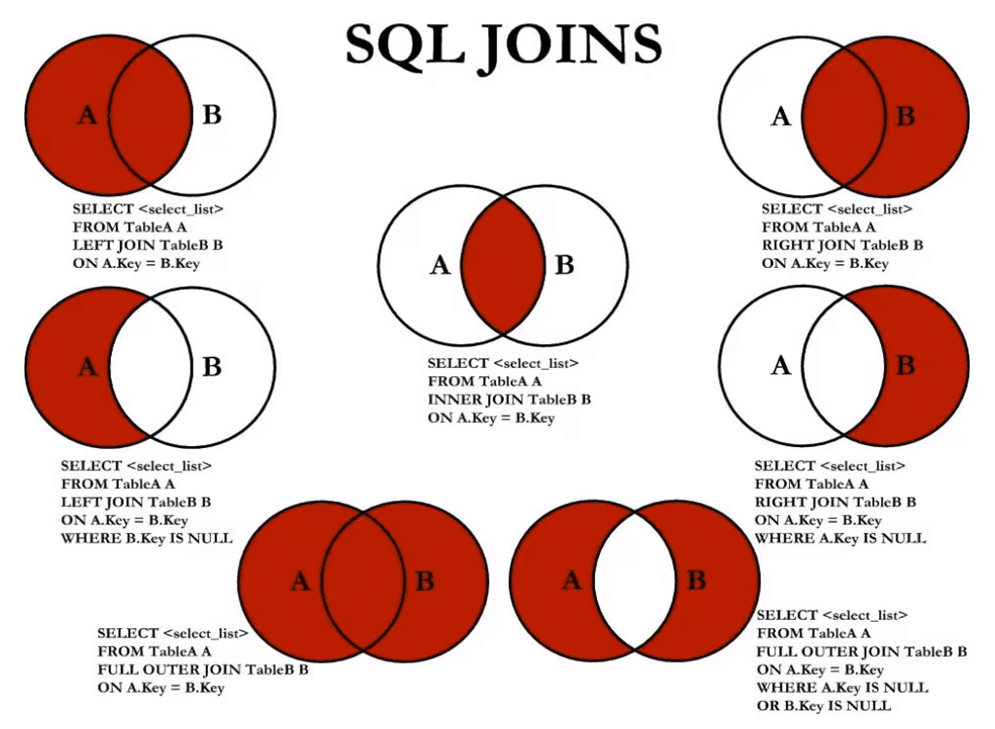

# 导入表的问题

**导入数据时外键约束问题**

通过FOREIGN_KEY_CHECKS解决，用法如下：

```mysql
set FOREIGN_KEY_CHECKS=0;  #在导入前设置为不检查外键约束
set FOREIGN_KEY_CHECKS=1;  #在导入后恢复检查外键约束
```

# 第三章_最基本的SELECT

## 1. 去除重复行

DISTINCT关键字

```mysql
SELECT DISTINCT department_id FROM employees;
```

## 2. 空值参与运算

空值：null ( 不等同于0, ’ ‘, ’null‘ )

实际问题的解决方案：引入IFNULL

```mysql
SELECT employee_id, salary "月工资", salary * (1 + IFNULL(commission_pct, 0)) * 12 "年工资" FROM employees;
```

## 3. 着重号 ``

必须保证你的字段没有和保留字、数据库系统或常见方法冲突。

如果坚持使用，在SQL语句中使用 \` \` 引起来。

```mysql
SELECT * FROM `order`;
```

## 4. 查询常数

```mysql
SELECT '小张科技' as "公司名", employee_id, last_name FROM employees;
```

## 5. 显示表结构

显示表中字段的详细信息

```mysql
DESCRIBE employees;
```

# 第四章_运算符

**DUAL** 伪表

## 1. 算术运算符

```mysql
SELECT 100 + 0, 100 + 50 * 30, 100 - 35.5 FROM DUAL;
```

> + 一个整数类型的值对整数进行加法和减法操作，结果还是一个整数；
> + 一个整数类型的值对浮点数进行加法和减法操作，结果是一个浮点数；
> + 在Java中， + 的左右两边如果有字符串，那么表示字符串的拼接。但是在MySQL中 + 只表示数值相加。如果遇到非数值类型，先尝试转成数值，如果转失败，就按0计算。（注：MySQL 中字符串拼接要使用字符串函数CONCAT()实现）
> + 在数学运算中，0不能用作除数，在MySQL中，一个数除以0为NULL。

## 2. 比较运算符

### 1) 等号运算符

比较运算符用来对表达式左边的操作数和右边的操作数进行比较，比较的结果为真则返回1，比较的结果 为假则返回0，其他情况则返回NULL。 

比较运算符经常被用来作为SELECT查询语句的条件来使用，返回符合条件的结果记录。

如果等号两边的值、字符串或表达式中有一个为NULL，则比较结果为NULL。

```mysql
mysql> SELECT 1 = 1, 1 = '1', 1 = 0, 'a' = 'a', (5 + 3) = (2 + 6), '' = NULL , NULL = NULL;
+-------+---------+-------+-----------+-------------------+-----------+-------------+
| 1 = 1 | 1 = '1' | 1 = 0 | 'a' = 'a' | (5 + 3) = (2 + 6) | '' = NULL | NULL = NULL |
+-------+---------+-------+-----------+-------------------+-----------+-------------+
|   1   |    1    |   0   |     1     |          1        |    NULL   |     NULL    |
+-------+---------+-------+-----------+-------------------+-----------+-------------+
1 row in set (0.00 sec)
```

```mysql
mysql> SELECT 1 = 2, 0 = 'abc', 1 = 'abc' FROM DUAL;
+-------+-----------+-----------+
| 1 = 2 | 0 = 'abc' | 1 = 'abc' |
+-------+-----------+-----------+
|   0   |     1     |     0     |
+-------+-----------+-----------+
1 row in set, 2 warnings (0.00 sec)
```

> + 如果等号两边的值、字符串或表达式都为字符串，则MySQL会按照字符串进行比较，其比较的 是每个字符串中字符的ANSI编码是否相等。 
> + 如果等号两边的值都是整数，则MySQL会按照整数来比较两个值的大小。 
> + 如果等号两边的值一个是整数，另一个是字符串，则MySQL会将字符串转化为数字进行比较。 
> + 如果等号两边的值、字符串或表达式中有一个为NULL，则比较结果为NULL。

```mysql
ysql> SELECT 1 <=> '1', 1 <=> 0, 'a' <=> 'a', (5 + 3) <=> (2 + 6), '' <=> NULL,NULL <=> NULL FROM dual;
+-----------+---------+-------------+---------------------+-------------+---------------+
| 1 <=> '1' | 1 <=> 0 | 'a' <=> 'a' | (5 + 3) <=> (2 + 6) | '' <=> NULL | NULL <=> NULL |
+-----------+---------+-------------+---------------------+-------------+---------------+
|     1     |    0    |      1      |           1         |      0      |       1       |
+-----------+---------+-------------+---------------------+-------------+---------------+
1 row in set (0.00 sec)
```

可以看到，使用安全等于运算符时，两边的操作数的值都为NULL时，返回的结果为1而不是NULL，其他返回结果与等于运算符相同。

### 2) 不等于运算符

不等于运算符（<>和!=）用于判断两边的数字、字符串或者表达式的值是否不相等， 如果不相等则返回1，相等则返回0。不等于运算符不能判断NULL值。如果两边的值有任意一个为NULL， 或两边都为NULL，则结果为NULL。 SQL语句示例如下：

```mysql
mysql> SELECT 1 <> 1, 1 != 2, 'a' != 'b', (3+4) <> (2+6), 'a' != NULL, NULL <> NULL;
+--------+--------+------------+----------------+-------------+--------------+
| 1 <> 1 | 1 != 2 | 'a' != 'b' | (3+4) <> (2+6) | 'a' != NULL | NULL <> NULL |
+--------+--------+------------+----------------+-------------+--------------+
|    0   |    1   |      1     |        1       |     NULL    |      NULL    |
+--------+--------+------------+----------------+-------------+--------------+
1 row in set (0.00 sec)
```

此外，还有非符号类型的运算符：


### 3) 空运算符

空运算符 (IS NULL 或者 ISNULL) 判断一个值是否为NULL，如果为NULL则返回1，否则返回0。

```mysql
mysql> SELECT NULL IS NULL, ISNULL(NULL), ISNULL('a'), 1 IS NULL;
+--------------+--------------+-------------+-----------+
| NULL IS NULL | ISNULL(NULL) | ISNULL('a') | 1 IS NULL |
+--------------+--------------+-------------+-----------+
|      1       |       1      |      0      |     0     |
+--------------+--------------+-------------+-----------+
1 row in set (0.00 sec)
```

### 4) 非空运算符

非空运算符（IS NOT NULL）判断一个值是否不为NULL，如果不为NULL则返回1，否则返回0。

### 5) 最小值运算符

语法格式为：LEAST(值1，值2，...，值n)。其中，“值n”表示参数列表中有n个值。在有 两个或多个参数的情况下，返回最小值。

```mysql
mysql> SELECT LEAST (1,0,2), LEAST('b','a','c'), LEAST(1,NULL,2);
+---------------+--------------------+-----------------+
| LEAST (1,0,2) | LEAST('b','a','c') | LEAST(1,NULL,2) |
+---------------+--------------------+-----------------+
|       0       |          a         |        NULL     |
+---------------+--------------------+-----------------+
1 row in set (0.00 sec)
```

由结果可以看到，当参数是整数或者浮点数时，LEAST将返回其中最小的值；当参数为字符串时，返回字 母表中顺序最靠前的字符；当比较值列表中有NULL时，不能判断大小，返回值为NULL。

### 6) 最大值运算符

语法格式为：GREATEST(值1，值2，...，值n)。其中，n表示参数列表中有n个值。当有 两个或多个参数时，返回值为最大值。假如任意一个自变量为NULL，则GREATEST()的返回值为NULL。

```mysql
mysql> SELECT GREATEST(1,0,2), GREATEST('b','a','c'), GREATEST(1,NULL,2);
+-----------------+-----------------------+--------------------+
| GREATEST(1,0,2) | GREATEST('b','a','c') | GREATEST(1,NULL,2) |
+-----------------+-----------------------+--------------------+
|         2       |             c         |         NULL       |
+-----------------+-----------------------+--------------------+
1 row in set (0.00 sec)
```

由结果可以看到，当参数中是整数或者浮点数时，GREATEST将返回其中最大的值；当参数为字符串时， 返回字母表中顺序最靠后的字符；当比较值列表中有NULL时，不能判断大小，返回值为NULL。

### 7) BETWEEN AND运算符

BETWEEN运算符使用的格式通常为SELECT D FROM TABLE WHERE C BETWEEN A AND B，此时，当C大于或等于A，并且C小于或等于B时，结果为1，否则结果为0。

### 8) IN运算符

IN运算符用于判断给定的值是否是IN列表中的一个值，如果是则返回1，否则返回0。如果给 定的值为NULL，或者IN列表中存在NULL，则结果为NULL。

```mysql
mysql> SELECT 'a' IN ('a','b','c'), 1 IN (2,3), NULL IN ('a','b'), 'a' IN ('a', NULL);
+----------------------+------------+-------------------+--------------------+
| 'a' IN ('a','b','c') | 1 IN (2,3) | NULL IN ('a','b') | 'a' IN ('a', NULL) |
+----------------------+------------+-------------------+--------------------+
|            1         |      0     |         NULL      |          1         |
+----------------------+------------+-------------------+--------------------+
```

### 9) NOT IN运算符

NOT IN运算符用于判断给定的值是否不是IN列表中的一个值，如果不是IN列表中的一 个值，则返回1，否则返回0。

### 10) LIKE运算符

LIKE运算符主要用来匹配字符串，通常用于模糊匹配，如果满足条件则返回1，否则返回 0。如果给定的值或者匹配条件为NULL，则返回结果为NULL。

```mysql
“%”：匹配0个或多个字符。
“_”：只能匹配一个字符。
```

### 11) ESCAPE

回避特殊符号的：使用转义符。例如：将[%]转为[$%]、[]转为[$]，然后再加上[ESCAPE‘$’]即可。

```mysql
SELECT job_id
FROM jobs
WHERE job_id LIKE ‘IT\_%‘;
```

如果使用\表示转义，要省略ESCAPE。如果不是\，则要加上ESCAPE。

```mysql
SELECT job_id
FROM jobs
WHERE job_id LIKE ‘IT$_%‘ escape ‘$‘;
```

### 12) REGEXP运算符

REGEXP运算符用来匹配字符串，语法格式为： expr REGEXP 匹配条件 。

> （1）‘^’匹配以该字符后面的字符开头的字符串。 
>
> （2）‘$’匹配以该字符前面的字符结尾的字符串。 
>
> （3）‘.’匹配任何一个单字符。 
>
> （4）“[...]”匹配在方括号内的任何字符。例如，“[abc]”匹配“a”或“b”或“c”。为了命名字符的范围，使用一 个‘-’。“[a-z]”匹配任何字母，而“[0-9]”匹配任何数字。
>
> （5）‘*’匹配零个或多个在它前面的字符。例如，“x*”匹配任何数量的‘x’字符，“[0-9]*”匹配任何数量的数字， 而“*”匹配任何数量的任何字符。

## 3. 逻辑运算符

逻辑运算符主要用来判断表达式的真假，在MySQL中，逻辑运算符的返回结果为1、0或者NULL。 

MySQL中支持4种逻辑运算符如下：


## 4. 位运算

位运算符是在二进制数上进行计算的运算符。位运算符会先将操作数变成二进制数，然后进行位运算， 最后将计算结果从二进制变回十进制数。 

MySQL支持的位运算符如下：


## 5. 运算符的优先级

数字编号越大，优先级越高，优先级高的运算符先进行计算。


## 扩展：使用正则表达式查询


# 第五章_排序与分页

## 1. 排序规则

* 使用 ORDER BY 子句排序
  * ASC（ascend）: 升序 
  * DESC（descend）:降序

*   ORDER BY 子句在SELECT语句的结尾。

### 1) 单列排序

```mysql
SELECT last_name, job_id, department_id, hire_date
FROM employees
ORDER BY hire_date;
```

### 2) 多列排序

* 可以使用不在SELECT列表中的列排序。 
* 在对多列进行排序的时候，首先排序的第一列必须有相同的列值，才会对第二列进行排序。如果第 一列数据中所有值都是唯一的，将不再对第二列进行排序。

## 2. 分页

* 格式：

```mysql
LIMIT [位置偏移量,] 行数
```

* 举例：

```mysql
--前10条记录：
SELECT * FROM 表名 LIMIT 0,10;
或者
SELECT * FROM 表名 LIMIT 10;
--第11至20条记录：
SELECT * FROM 表名 LIMIT 10,10;
--第21至30条记录：
SELECT * FROM 表名 LIMIT 20,10;
```

> MySQL 8.0中可以使用“LIMIT 3 OFFSET 4”，意思是获取从第5条记录开始后面的3条记录，和“LIMIT 4,3;”返回的结果相同。

* 分页显式公式：（当前页数-1）* 每页条数，每页条数

```mysql
SELECT * FROM table
LIMIT(PageNo - 1) * PageSize, PageSize;
```

* 注意：LIMIT 子句必须放在整个SELECT语句的最后！

* 使用LIMIT的好处

约束返回结果的数量可以 减少数据表的网络传输量 ，也可以 提升查询效率 。如果我们知道返回结果只有 1 条，就可以使用 LIMIT 1 ，告诉 SELECT 语句只需要返回一条记录即可。这样的好处就是 SELECT 不需 要扫描完整的表，只需要检索到一条符合条件的记录即可返回。

# 第六章_多表查询

## 1. 多表查询分类讲解

### 1) 自连接

题目：查询employees表，返回 <员工 works for 老板>

```mysql
SELECT CONCAT(worker.last_name , ' works for ', manager.last_name)
FROM employees worker, employees manager
WHERE worker.manager_id = manager.employee_id;
```

### 2) 内连接与外连接

* 内连接: 合并具有同一列的两个以上的表的行, 结果集中不包含一个表与另一个表不匹配的行 

**SQL92语法**

```mysql
SELECT emp.employee_id, dep.department_name
FROM employee emp, department dep
WHERE emp.`department_id` = dep.`department_id`;
```

**SQL99语法**

```mysql
SELECT emp.employee_id, dep.department_name
FROM employee emp JOIN department dep
ON emp.`department_id` = dep.`department_id`;
```

* 外连接: 两个表在连接过程中除了返回满足连接条件的行以外还返回左（或右）表中不满足条件的 行 ，这种连接称为左（或右） 外连接。没有匹配的行时, 结果表中相应的列为空(NULL)。 
* 如果是左外连接，则连接条件中左边的表也称为 主表 ，右边的表称为 从表 。 

**LEFT OUTER JOIN**

```mysql
SELECT last_name, department_name
FROM employees emp LEFT OUTER JOIN department dep
ON emp.`department_id` = dep.`department_id`;
```

* 如果是右外连接，则连接条件中右边的表也称为 主表 ，左边的表称为 从表 。

**RIGHT OUTER JOIN**

```mysql
SELECT last_name, department_name
FROM employees emp RIGHT OUTER JOIN department dep
ON emp.`department_id` = dep.`department_id`;
```

## 2. UNION的使用

**合并查询结果** 

利用UNION关键字，可以给出多条SELECT语句，并将它们的结果组合成单个结果集。合并 时，两个表对应的列数和数据类型必须相同，并且相互对应。各个SELECT语句之间使用UNION或UNION ALL关键字分隔。

语法格式：

```mysql
SELECT column,... FROM table1
UNION [ALL]
SELECT column,... FROM table2
```

**UNION操作符**

UNION 操作符返回两个查询的结果集的并集，去除重复记录。

**UNION ALL操作符**

UNION ALL操作符返回两个查询的结果集的并集。对于两个结果集的重复部分，不去重。

> 注意：执行UNION ALL语句时所需要的资源比UNION语句少。如果明确知道合并数据后的结果数据不存在重复数据，或者不需要去除重复的数据，则尽量使用UNION ALL语句，以提高数据查询的效率。

举例：查询部门编号>90或邮箱包含a的员工信息

```mysql
#方式1
SELECT * FROM employees WHERE email LIKE '%a%' OR department_id>90;
```

```mysql
#方式2
SELECT * FROM employees WHERE email LIKE '%a%'
UNION
SELECT * FROM employees WHERE department_id>90;
```

举例：查询中国用户中男性的信息以及美国用户中年男性的用户信息

```mysql
SELECT id,cname FROM t_chinamale WHERE csex='男'
UNION ALL
SELECT id,tname FROM t_usmale WHERE tGender='male';
```

## 3.七种SQL JOINS的实现



```mysql
# 中图：内连接
SELECT employee_id,department_name
FROM employees e JOIN departments d
ON e.`department_id` = d.`department_id`;

# 左上图：左外连接
SELECT employee_id,department_name
FROM employees e LEFT JOIN departments d
ON e.`department_id` = d.`department_id`;

# 右上图：右外连接
SELECT employee_id,department_name
FROM employees e RIGHT JOIN departments d
ON e.`department_id` = d.`department_id`;

# 左中图：
SELECT employee_id,department_name
FROM employees e LEFT JOIN departments d
ON e.`department_id` = d.`department_id`
WHERE d.`department_id` IS NULL;

# 右中图：
SELECT employee_id,department_name
FROM employees e RIGHT JOIN departments d
ON e.`department_id` = d.`department_id`
WHERE e.`department_id` IS NULL;


# 左下图：满外连接
# 方式1：左上图 UNION ALL 右中图
SELECT employee_id,department_name
FROM employees e LEFT JOIN departments d
ON e.`department_id` = d.`department_id`
UNION ALL
SELECT employee_id,department_name
FROM employees e RIGHT JOIN departments d
ON e.`department_id` = d.`department_id`
WHERE e.`department_id` IS NULL;


# 方式2：左中图 UNION ALL 右上图
SELECT employee_id,department_name
FROM employees e LEFT JOIN departments d
ON e.`department_id` = d.`department_id`
WHERE d.`department_id` IS NULL
UNION ALL
SELECT employee_id,department_name
FROM employees e RIGHT JOIN departments d
ON e.`department_id` = d.`department_id`;

# 右下图：左中图  UNION ALL 右中图
SELECT employee_id,department_name
FROM employees e LEFT JOIN departments d
ON e.`department_id` = d.`department_id`
WHERE d.`department_id` IS NULL
UNION ALL
SELECT employee_id,department_name
FROM employees e RIGHT JOIN departments d
ON e.`department_id` = d.`department_id`
WHERE e.`department_id` IS NULL;
```

## 4. SQL99语法的新特性

### 1) 自然连接

SQL99 在 SQL92 的基础上提供了一些特殊语法，比如 NATURAL JOIN 用来表示自然连接。我们可以把 自然连接理解为 SQL92 中的等值连接。它会帮你自动查询两张连接表中 所有相同的字段 ，然后进行 等值 连接 。

在SQL92标准中：

```mysql
SELECT employee_id,last_name,department_name
FROM employees e JOIN departments d
ON e.`department_id` = d.`department_id`
AND e.`manager_id` = d.`manager_id`;
```

在 SQL99 中你可以写成：

```mysql
SELECT employee_id,last_name,department_name
FROM employees e NATURAL JOIN departments d;
```

### 2) USING连接

当我们进行连接的时候，SQL99还支持使用 USING 指定数据表里的 同名字段 进行等值连接。但是只能配 合JOIN一起使用。比如：

```mysql
SELECT employee_id,last_name,department_name
FROM employees e JOIN departments d
USING (department_id);
```

你能看出与自然连接 NATURAL JOIN 不同的是，USING 指定了具体的相同的字段名称，你需要在 USING 的括号 () 中填入要指定的同名字段。同时使用 JOIN...USING 可以简化 JOIN ON 的等值连接。它与下 面的 SQL 查询结果是相同的：

```mysql
SELECT employee_id,last_name,department_name
FROM employees e ,departments d
WHERE e.department_id = d.department_id;
```

## 5. 小结

表连接的约束条件可以有三种方式：WHERE, ON, USING 

* WHERE：适用于所有关联查询 
* ON ：只能和JOIN一起使用，只能写关联条件。虽然关联条件可以并到WHERE中和其他条件一起 写，但分开写可读性更好。 
* USING：只能和JOIN一起使用，而且要求两个关联字段在关联表中名称一致，而且只能表示关联字 段值相等

> 我们要控制连接表的数量 。
>
> 多表连接就相当于嵌套 for 循环一样，非常消耗资源，会让 SQL 查询性能下 降得很严重，因此不要连接不必要的表。
>
> 在许多 DBMS 中，也都会有最大连接表的限制。

```mysql
# 习题巩固
# 注意：当两个表外连接之后，组成主表和从表，主表的连接字段是不为空的，从表的连接字段可能为空，因此从表的关键字段用来判断是否为空。

# 1.查询哪些部门没有员工
# 方式一
SELECT d.department_id
FROM departments d LEFT JOIN employees e
ON d.`department_id` = e.`department_id`
WHERE e.`department_id` IS NULL;

# 方式二
SELECT department_id
FROM departments d
WHERE NOT EXISTS (
		SELECT *
    	FROM employees e
    	WHERE e.`department_id` = d.`department_id`
);

# 2.查询哪个城市没有部门
SELECT l.location_id, l.city
FROM locations l LEFT JOIN departments d
ON l.`location_id` = d.`location_id`
WHERE d.`location_id` IS NULL;

# 3.查询部门名为 Sales 或 IT 的员工信息
SELECT e.employee_id, e.last_name, e.department_id
FROM employees e JOIN department d
ON e.`department_id` = d.`department_id`
WHERE d.`department_name` IN ('Sales', 'IT');
```

# 第七章_单行函数

## 1. 数值函数

### 1) 基本函数

| 函数                | 用法                                                         |
| ------------------- | ------------------------------------------------------------ |
| ABS(x)              | 返回x的绝对值                                                |
| SIGN(X)             | 单元格                                                       |
| PI()                | 返回圆周率的值                                               |
| CEIL(x)，CEILING(x) | 返回大于或等于某个值的最小整数                               |
| FLOOR(x)            | 返回小于或等于某个值的最大整数                               |
| LEAST(e1,e2,e3…)    | 返回列表中的最小值                                           |
| GREATEST(e1,e2,e3…) | 返回列表中的最大值                                           |
| MOD(x,y)            | 返回X除以Y后的余数                                           |
| RAND()              | 返回0~1的随机值                                              |
| RAND(x)             | 返回0~1的随机值，其中x的值用作种子值，相同的X值会产生相同的随机 数 |
| ROUND(x)            | 返回一个对x的值进行四舍五入后，最接近于X的整数               |
| ROUND(x,y)          | 返回一个对x的值进行四舍五入后最接近X的值，并保留到小数点后面Y位 |
| TRUNCATE(x,y)       | 返回数字x截断为y位小数的结果                                 |
| SQRT(x)             | 返回x的平方根。当X的值为负数时，返回NULL                     |

### 2) 角度与弧度互换函数

| 函数       | 用法                                  |
| ---------- | ------------------------------------- |
| RADIANS(x) | 将角度转化为弧度，其中，参数x为角度值 |
| DEGREES(x) | 将弧度转化为角度，其中，参数x为弧度值 |

### 3) 三角函数

| 函数       | 用法                                                         |
| ---------- | ------------------------------------------------------------ |
| SIN(x)     | 将角度转化为弧度，其中，参数x为角度值                        |
| ASIN(x)    | 将弧度转化为角度，其中，参数x为弧度值                        |
| COS(x)     | 返回x的余弦值，其中，参数x为弧度值                           |
| ACOS(x)    | 返回x的反余弦值，即获取余弦为x的值。如果x的值不在-1到1之间，则返回NULL |
| TAN(x)     | 返回x的正切值，其中，参数x为弧度值                           |
| ATAN(x)    | 返回x的反正切值，即返回正切值为x的值                         |
| ATAN2(m,n) | 返回两个参数的反正切值                                       |
| COT(x)     | 返回x的余切值，其中，X为弧度值                               |

### 4) 指数与对数函数

| 函数                 | 用法                                                 |
| -------------------- | ---------------------------------------------------- |
| POW(x,y)，POWER(X,Y) | 返回x的y次方                                         |
| EXP(X)               | 返回e的X次方，其中e是一个常数，2.718281828459045     |
| LN(X)，LOG(X)        | 返回以e为底的X的对数，当X <= 0 时，返回的结果为NULL  |
| LOG10(X)             | 返回以10为底的X的对数，当X <= 0 时，返回的结果为NULL |
| LOG2(X)              | 返回以2为底的X的对数，当X <= 0 时，返回NULL          |

### 5) 进制间的转换

| 函数          | 用法                     |
| ------------- | ------------------------ |
| BIN(x)        | 返回x的二进制编码        |
| HEX(x)        | 返回x的十六进制编码      |
| OCT(x)        | 返回x的八进制编码        |
| CONV(x,f1,f2) | 返回f1进制数变成f2进制数 |

## 2. 字符串函数

| 函数                              | 用法                                                         |
| --------------------------------- | ------------------------------------------------------------ |
| ASCII(S)                          | 返回字符串S中的第一个字符的ASCII码值                         |
| CHAR_LENGTH(s)                    | 返回字符串s的字符数。作用与CHARACTER_LENGTH(s)相同           |
| LENGTH(s)                         | 返回字符串s的字节数，和字符集有关                            |
| CONCAT(s1,s2,......,sn)           | 连接s1,s2,......,sn为一个字符串                              |
| CONCAT_WS(x, s1,s2,......,sn)     | 同CONCAT(s1,s2,...)函数，但是每个字符串之间要加上x           |
| INSERT(str, idx, len, replacestr) | 将字符串str从第idx位置开始，len个字符长的子串替换为字符串replacestr |
| REPLACE(str, a, b)                | 用字符串b替换字符串str中所有出现的字符串a                    |
| UPPER(s) 或 UCASE(s)              | 将字符串s的所有字母转成大写字母                              |
| LOWER(s) 或LCASE(s)               | 将字符串s的所有字母转成小写字母                              |
| LEFT(str,n)                       | 返回字符串str最左边的n个字符                                 |
| RIGHT(str,n)                      | 返回字符串str最右边的n个字符                                 |
| LPAD(str, len, pad)               | 用字符串pad对str最左边进行填充，直到str的长度为len个字符     |
| RPAD(str ,len, pad)               | 用字符串pad对str最右边进行填充，直到str的长度为len个字符     |
| LTRIM(s)                          | 去掉字符串s左侧的空格                                        |
| RTRIM(s)                          | 去掉字符串s右侧的空格                                        |
| TRIM(s)                           | 去掉字符串s开始与结尾的空格                                  |
| TRIM(s1 FROM s)                   | 去掉字符串s开始与结尾的s1                                    |
| TRIM(LEADING s1 FROM s)           | 去掉字符串s开始处的s1                                        |
| TRIM(TRAILING s1 FROM s)          | 去掉字符串s结尾处的s1                                        |
| REPEAT(str, n)                    | 返回str重复n次的结果                                         |
| SPACE(n)                          | 返回n个空格                                                  |
| STRCMP(s1,s2)                     | 比较字符串s1,s2的ASCII码值的大小                             |
| SUBSTR(s,index,len)               | 返回从字符串s的index位置其len个字符，作用与SUBSTRING(s,n,len)、 MID(s,n,len)相同 |
| LOCATE(substr,str)                | 返回字符串substr在字符串str中首次出现的位置，作用于POSITION(substr IN str)、INSTR(str,substr)相同。未找到，返回0 |
| ELT(m,s1,s2,…,sn)                 | 返回指定位置的字符串，如果m=1，则返回s1，如果m=2，则返回s2，如果m=n，则返回sn |
| FIELD(s,s1,s2,…,sn)               | 返回字符串s在字符串列表中第一次出现的位置                    |
| FIND_IN_SET(s1,s2)                | 返回字符串s1在字符串s2中出现的位置。其中，字符串s2是一个以逗号分隔的字符串 |
| REVERSE(s)                        | 返回s反转后的字符串                                          |
| NULLIF(value1,value2)             | 比较两个字符串，如果value1与value2相等，则返回NULL，否则返回 value1 |

> 注意：MySQL中，字符串的位置是从1开始的。

## 3. 日期和时间函数

### 1) 获取日期、时间

| 函数                                                         | 用法                            |
| ------------------------------------------------------------ | ------------------------------- |
| CURDATE() ，CURRENT_DATE()                                   | 返回当前日期，只包含年、 月、日 |
| CURTIME() ， CURRENT_TIME()                                  | 返回当前时间，只包含时、 分、秒 |
| NOW() / SYSDATE() / CURRENT_TIMESTAMP() / LOCALTIME() / LOCALTIMESTAMP() | 返回当前系统日期和时间          |
| UTC_DATE()                                                   | 返回UTC（世界标准时间） 日期    |
| UTC_TIME()                                                   | 返回UTC（世界标准时间） 时间    |

### 2) 日期与时间戳的转换

| 函数                     | 用法                                                         |
| ------------------------ | ------------------------------------------------------------ |
| UNIX_TIMESTAMP()         | 以UNIX时间戳的形式返回当前时间。SELECT UNIX_TIMESTAMP() - >1634348884 |
| UNIX_TIMESTAMP(date)     | 将时间date以UNIX时间戳的形式返回。                           |
| FROM_UNIXTIME(timestamp) | 将UNIX时间戳的时间转换为普通格式的时间                       |

### 3) 获取月份、星期、星期数、天数等函数

| 函数                                     | 用法                                             |
| ---------------------------------------- | ------------------------------------------------ |
| YEAR(date) / MONTH(date) / DAY(date)     | 返回具体的日期值                                 |
| HOUR(time) / MINUTE(time) / SECOND(time) | 返回具体的时间值                                 |
| FROM_UNIXTIME(timestamp)                 | 将UNIX时间戳的时间转换为普通格式的时间           |
| MONTHNAME(date)                          | 返回月份：January，...                           |
| DAYNAME(date)                            | 返回星期几：MONDAY，TUESDAY.....SUNDAY           |
| WEEKDAY(date)                            | 返回周几，注意，周1是0，周2是1，。。。周日是6    |
| QUARTER(date)                            | 返回日期对应的季度，范围为1～4                   |
| WEEK(date) ， WEEKOFYEAR(date)           | 返回一年中的第几周                               |
| DAYOFYEAR(date)                          | 返回日期是一年中的第几天                         |
| DAYOFMONTH(date)                         | 返回日期位于所在月份的第几天                     |
| DAYOFWEEK(date)                          | 返回周几，注意：周日是1，周一是2，。。。周六是 7 |

### 4) 日期的操作函数

| 函数                    | 用法                                       |
| ----------------------- | ------------------------------------------ |
| EXTRACT(type FROM date) | 返回指定日期中特定的部分，type指定返回的值 |

EXTRACT(type FROM date)函数中type的取值与含义：


### 5) 时间和秒钟转换的函数

| 函数                 | 用法                                                         |
| -------------------- | ------------------------------------------------------------ |
| TIME_TO_SEC(time)    | 将 time 转化为秒并返回结果值。转化的公式为： 小时*3600+分钟 *60+秒 |
| SEC_TO_TIME(seconds) | 将 seconds 描述转化为包含小时、分钟和秒的时间                |

### 6) 计算日期和时间的函数

| 函数                                                         | 用法                                           |
| ------------------------------------------------------------ | ---------------------------------------------- |
| DATE_ADD(datetime, INTERVAL expr type)， ADDDATE(date,INTERVAL expr type) | 返回与给定日期时间相差INTERVAL时间段的日期时间 |
| DATE_SUB(date,INTERVAL expr type)， SUBDATE(date,INTERVAL expr type) | 返回与date相差INTERVAL时间间隔的日期           |

上述函数中type的取值：


| 函数                         | 用法                                                         |
| ---------------------------- | ------------------------------------------------------------ |
| ADDTIME(time1,time2)         | 返回time1加上time2的时间。当time2为一个数字时，代表的是 秒 ，可以为负数 |
| SUBTIME(time1,time2)         | 返回time1减去time2后的时间。当time2为一个数字时，代表的 是 秒 ，可以为负数 |
| DATEDIFF(date1,date2)        | 返回date1 - date2的日期间隔天数                              |
| TIMEDIFF(time1, time2)       | 返回time1 - time2的时间间隔                                  |
| FROM_DAYS(N)                 | 返回从0000年1月1日起，N天以后的日期                          |
| TO_DAYS(date)                | 返回日期date距离0000年1月1日的天数                           |
| LAST_DAY(date)               | 返回date所在月份的最后一天的日期                             |
| MAKEDATE(year,n)             | 针对给定年份与所在年份中的天数返回一个日期                   |
| MAKETIME(hour,minute,second) | 将给定的小时、分钟和秒组合成时间并返回                       |
| PERIOD_ADD(time,n)           | 返回time加上n后的时间                                        |

### 7)  日期的格式化与解析

| 函数                              | 用法                                       |
| --------------------------------- | ------------------------------------------ |
| DATE_FORMAT(date,fmt)             | 按照字符串fmt格式化日期date值              |
| TIME_FORMAT(time,fmt)             | 按照字符串fmt格式化时间time值              |
| GET_FORMAT(date_type,format_type) | 返回日期字符串的显示格式                   |
| STR_TO_DATE(str, fmt)             | 按照字符串fmt对str进行解析，解析为一个日期 |

上述 非GET_FORMAT 函数中fmt参数常用的格式符：

| 格式符 | 说明                                                         | 格式符  | 说明                                                         |
| ------ | ------------------------------------------------------------ | ------- | ------------------------------------------------------------ |
| %Y     | 4位数字表示年份                                              | %y      | 表示两位数字表示年份                                         |
| %M     | 月名表示月份（January,....）                                 | %m      | 两位数字表示月份 （01,02,03。。。）                          |
| %b     | 缩写的月名（Jan.，Feb.，....）                               | %c      | 数字表示月份（1,2,3,...）                                    |
| %D     | 英文后缀表示月中的天数 （1st,2nd,3rd,...）                   | %d      | 两位数字表示月中的天数(01,02...)                             |
| %e     | 数字形式表示月中的天数 （1,2,3,4,5.....）                    |         |                                                              |
| %H     | 两位数字表示小数，24小时制 （01,02..）                       | %h 和%I | 两位数字表示小时，12小时制 （01,02..）                       |
| %k     | 数字形式的小时，24小时制(1,2,3)                              | %l      | 数字形式表示小时，12小时制 （1,2,3,4....）                   |
| %i     | 两位数字表示分钟（00,01,02）                                 | %S 和%s | 两位数字表示秒(00,01,02...)                                  |
| %W     | 一周中的星期名称（Sunday...）                                | %a      | 一周中的星期缩写（Sun.， Mon.,Tues.，..）                    |
| %w     | 以数字表示周中的天数 (0=Sunday,1=Monday....)                 |         |                                                              |
| %j     | 以3位数字表示年中的天数(001,002...)                          | %U      | 以数字表示年中的第几周， （1,2,3。。）其中Sunday为周中第一 天 |
| %u     | 以数字表示年中的第几周， （1,2,3。。）其中Monday为周中第一 天 |         |                                                              |
| %T     | 24小时制                                                     | %r      | 12小时制                                                     |
| %p     | AM或PM                                                       | %%      | 表示%                                                        |

## 4. 流程控制函数

流程处理函数可以根据不同的条件，执行不同的处理流程，可以在SQL语句中实现不同的条件选择。 MySQL中的流程处理函数主要包括IF()、IFNULL()和CASE()函数。

| 函数                                                         | 用法                                             |
| ------------------------------------------------------------ | ------------------------------------------------ |
| IF(value,value1,value2)                                      | 如果value的值为TRUE，返回value1， 否则返回value2 |
| IFNULL(value1, value2)                                       | 如果value1不为NULL，返回value1，否则返回value2   |
| CASE WHEN 条件1 THEN 结果1 WHEN 条件2 THEN 结果2 .... [ELSE resultn] END | 相当于Java的if...else if...else...               |
| CASE expr WHEN 常量值1 THEN 值1 WHEN 常量值1 THEN 值1 .... [ELSE 值n] END | 相当于Java的switch...case...                     |

## 5. 加密与解密函数

加密与解密函数主要用于对数据库中的数据进行加密和解密处理，以防止数据被他人窃取。这些函数在保证数据库安全时非常有用。

| 函数                        | 用法                                                         |
| --------------------------- | ------------------------------------------------------------ |
| PASSWORD(str)               | 返回字符串str的加密版本，41位长的字符串。加密结果不可逆 ，常用于用户的密码加密 |
| MD5(str)                    | 返回字符串str的md5加密后的值，也是一种加密方式。若参数为 NULL，则会返回NULL |
| SHA(str)                    | 从原明文密码str计算并返回加密后的密码字符串，当参数为 NULL时，返回NULL。 SHA加密算法比MD5更加安全 。 |
| ENCODE(value,password_seed) | 返回使用password_seed作为加密密码加密value                   |
| DECODE(value,password_seed) | 返回使用password_seed作为加密密码解密value                   |

## 6. MySQL信息函数

MySQL中内置了一些可以查询MySQL信息的函数，这些函数主要用于帮助数据库开发或运维人员更好地 对数据库进行维护工作。

| 函数                                                   | 用法                                                      |
| ------------------------------------------------------ | --------------------------------------------------------- |
| VERSION()                                              | 返回当前MySQL的版本号                                     |
| CONNECTION_ID()                                        | 返回当前MySQL服务器的连接数                               |
| DATABASE()，SCHEMA()                                   | 返回MySQL命令行当前所在的数据库                           |
| USER()，CURRENT_USER()、SYSTEM_USER()， SESSION_USER() | 返回当前连接MySQL的用户名，返回结果格式为 “主机名@用户名” |
| CHARSET(value)                                         | 返回字符串value自变量的字符集                             |
| COLLATION(value)                                       | 返回字符串value的比较规则                                 |

MySQL中有些函数无法对其进行具体的分类，但是这些函数在MySQL的开发和运维过程中也是不容忽视 的。

| 函数                           | 用法                                                         |
| ------------------------------ | ------------------------------------------------------------ |
| FORMAT(value,n)                | 返回对数字value进行格式化后的结果数据。n表示 四舍五入 后保留 到小数点后n位 |
| CONV(value,from,to)            | 将value的值进行不同进制之间的转换                            |
| INET_ATON(ipvalue)             | 将以点分隔的IP地址转化为一个数字                             |
| INET_NTOA(value)               | 将数字形式的IP地址转化为以点分隔的IP地址                     |
| BENCHMARK(n,expr)              | 将表达式expr重复执行n次。用于测试MySQL处理expr表达式所耗费 的时间 |
| CONVERT(value USING char_code) | 将value所使用的字符编码修改为char_code                       |

# 第八章_聚合函数

## 1. 聚合函数介绍

* 什么是聚合函数

聚合函数作用于一组数据，并对一组数据返回一个值。

* 聚合函数类型
  * AVG()
  * SUM()
  * MAX()
  * MIN()
  * COUNT()

### 1) AVG和SUM函数

```mysql
SELECT AVG(salary), MAX(salary),MIN(salary), SUM(salary)
FROM employees
WHERE job_id LIKE '%REP%';
```

### 2) MIN和MAX函数

可以对任意数据类型的数据使用 MIN 和 MAX 函数。

```mysql
SELECT MIN(hire_date), MAX(hire_date)
FROM employees;
```

### 3) COUNT函数

COUNT(*)返回表中记录总数，适用于任意数据类型。

```mysql
SELECT COUNT(*)
FROM employees
WHERE department_id = 50;
```

COUNT(expr) 返回expr不为空的记录总数。

```mysql
SELECT COUNT(commission_pct)
FROM employees
WHERE department_id = 50;
```

* 问题：用count(*)，count(1)，count(列名)谁好呢?

其实，对于MyISAM引擎的表是没有区别的。这种引擎内部有一计数器在维护着行数。 Innodb引擎的表用count(*),count(1)直接读行数，复杂度是O(n)，因为innodb真的要去数一遍。但好 于具体的count(列名)。

* 问题：能不能使用count(列名)替换count(*)?

不要使用 count(列名)来替代 count(*) ， count(*) 是 SQL92 定义的标准统计行数的语法，跟数 据库无关，跟 NULL 和非 NULL 无关。 说明：count(*)会统计值为 NULL 的行，而 count(列名)不会统计此列为 NULL 值的行。

## 2. GROUP BY

### 1) 基本使用

可以使用GROUP BY子句将表中的数据分成若干组

```mysql
SELECT column, group_function(column)
FROM table
[WHERE condition]
[GROUP BY group_by_expression]
[ORDER BY column];
```

> 结论1：SELECT中出现的非组函数的字段必须声明在GROUP BY中。
>
> ​			反之，GROUP BY中声明的字段可以不出现在SELECT中。
>
> 结论2：GROUP BY声明在FROM后面、WHERE后面、ORDER BY前面、LIMIT前面。

### 2) 使用WITH ROLLUP

```mysql
SELECT department_id,AVG(salary)
FROM employees
WHERE department_id > 80
GROUP BY department_id WITH ROLLUP;
```

> 注意： 当使用ROLLUP时，不能同时使用ORDER BY子句进行结果排序，即ROLLUP和ORDER BY是互相排斥的。

## 3. HAVING

### 1) 基本使用

过滤分组：HAVING子句 

1. 行已经被分组。 
2. 使用了聚合函数。 
3. 满足HAVING 子句中条件的分组将被显示。 
4. HAVING 不能单独使用，必须要跟 GROUP BY 一起使用。

```mysql
SELECT department_id, MAX(salary)
FROM employees
GROUP BY department_id
HAVING MAX(salary)>10000 ;
```

**要求**

+ 如果过滤条件中使用了聚合函数，则必须使用HAVING来替换WHERE。否则，报错。
+ 当过滤条件中没有聚合函数时，则次过滤条件声明在WHERE中或HAVING中都可以。但是，建议声明在WHERE中的执行效率高。
+ HAVING必须声明在GROUP BY 的后面
+ 开发中，我们使用HAVING的前提是SQL中使用了GROUP BY。

### 2) WHERE和HAVING的对比

**区别1：WHERE 可以直接使用表中的字段作为筛选条件，但不能使用分组中的计算函数作为筛选条件； HAVING 必须要与 GROUP BY 配合使用，可以把分组计算的函数和分组字段作为筛选条件。**

这决定了，在需要对数据进行分组统计的时候，HAVING 可以完成 WHERE 不能完成的任务。这是因为， 在查询语法结构中，WHERE 在 GROUP BY 之前，所以无法对分组结果进行筛选。HAVING 在 GROUP BY 之 后，可以使用分组字段和分组中的计算函数，对分组的结果集进行筛选，这个功能是 WHERE 无法完成 的。另外，WHERE排除的记录不再包括在分组中。

**区别2：如果需要通过连接从关联表中获取需要的数据，WHERE 是先筛选后连接，而 HAVING 是先连接 后筛选。**

这一点，就决定了在关联查询中，WHERE 比 HAVING 更高效。因为 WHERE 可以先筛选，用一 个筛选后的较小数据集和关联表进行连接，这样占用的资源比较少，执行效率也比较高。HAVING 则需要 先把结果集准备好，也就是用未被筛选的数据集进行关联，然后对这个大的数据集进行筛选，这样占用 的资源就比较多，执行效率也较低。

小结如下：

| 关键字 | 用法                         | 缺点                                   |
| ------ | ---------------------------- | -------------------------------------- |
| WHERE  | 先筛选数据再关联，执行效率高 | 不能使用分组中的计算函数进行筛选       |
| HAVING | 可以使用分组中的计算函数     | 在最后的结果集中进行筛选，执行效率较低 |

**开发中的选择：** 

WHERE 和 HAVING 也不是互相排斥的，我们可以在一个查询里面同时使用 WHERE 和 HAVING。包含分组 统计函数的条件用 HAVING，普通条件用 WHERE。这样，我们就既利用了 WHERE 条件的高效快速，又发 挥了 HAVING 可以使用包含分组统计函数的查询条件的优点。当数据量特别大的时候，运行效率会有很 大的差别。

## 4. SELECT的执行过程

### 1) 查询的结构

```mysql
#方式1：
SELECT ...,....,...
FROM ...,...,....
WHERE 多表的连接条件
AND 不包含组函数的过滤条件
GROUP BY ...,...
HAVING 包含组函数的过滤条件
ORDER BY ... ASC/DESC
LIMIT ...,...
#方式2：
SELECT ...,....,...
FROM ... JOIN ...
ON 多表的连接条件
JOIN ...
ON ...
WHERE 不包含组函数的过滤条件
AND/OR 不包含组函数的过滤条件
GROUP BY ...,...
HAVING 包含组函数的过滤条件
ORDER BY ... ASC/DESC
LIMIT ...,...
#其中：
#（1）from：从哪些表中筛选
#（2）on：关联多表查询时，去除笛卡尔积
#（3）where：从表中筛选的条件
#（4）group by：分组依据
#（5）having：在统计结果中再次筛选
#（6）order by：排序
#（7）limit：分页
```

**需要记住 SELECT 查询时的两个顺序：**

<font color=red>1. 关键字的顺序是不能颠倒的：</font>

```mysql
SELECT ... FROM ... WHERE ... GROUP BY ... HAVING ... ORDER BY ... LIMIT...
```

<font color=red>1. SELECT 语句的执行顺序</font>（在 MySQL 和 Oracle 中，SELECT 执行顺序基本相同）：

```mysql
FROM -> WHERE -> GROUP BY -> HAVING -> SELECT 的字段 -> DISTINCT -> ORDER BY -> LIMIT
```

比如你写了一个 SQL 语句，那么它的关键字顺序和执行顺序是下面这样的：

```mysql
SELECT DISTINCT player_id, player_name, count(*) as num # 顺序 5
FROM player JOIN team ON player.team_id = team.team_id # 顺序 1
WHERE height > 1.80 # 顺序 2
GROUP BY player.team_id # 顺序 3
HAVING num > 2 # 顺序 4
ORDER BY num DESC # 顺序 6
LIMIT 2 # 顺序 7
```

在 SELECT 语句执行这些步骤的时候，每个步骤都会产生一个 虚拟表 ，然后将这个虚拟表传入下一个步 骤中作为输入。需要注意的是，这些步骤隐含在 SQL 的执行过程中，对于我们来说是不可见的。

### 2) SQL的执行原理

SELECT 是先执行 FROM 这一步的。在这个阶段，如果是多张表联查，还会经历下面的几个步骤：

1. 首先先通过 CROSS JOIN 求笛卡尔积，相当于得到虚拟表 vt（virtual table）1-1；
2. 通过 ON 进行筛选，在虚拟表 vt1-1 的基础上进行筛选，得到虚拟表 vt1-2；
3. 添加外部行。如果我们使用的是左连接、右链接或者全连接，就会涉及到外部行，也就是在虚拟 表 vt1-2 的基础上增加外部行，得到虚拟表 vt1-3。

* 当然如果我们操作的是两张以上的表，还会重复上面的步骤，直到所有表都被处理完为止。这个过程得 到是我们的原始数据。

* 然后进入第三步和第四步，也就是 GROUP 和 HAVING 阶段 。在这个阶段中，实际上是在虚拟表 vt2 的 基础上进行分组和分组过滤，得到中间的虚拟表 vt3 和 vt4 。
* 当我们完成了条件筛选部分之后，就可以筛选表中提取的字段，也就是进入到 SELECT 和 DISTINCT 阶段 。
* 首先在 SELECT 阶段会提取想要的字段，然后在 DISTINCT 阶段过滤掉重复的行，分别得到中间的虚拟表 vt5-1 和 vt5-2 。
* 当我们提取了想要的字段数据之后，就可以按照指定的字段进行排序，也就是 ORDER BY 阶段 ，得到 虚拟表 vt6 。
* 最后在 vt6 的基础上，取出指定行的记录，也就是 LIMIT 阶段 ，得到最终的结果，对应的是虚拟表 vt7 。
* 当然我们在写 SELECT 语句的时候，不一定存在所有的关键字，相应的阶段就会省略。

同时因为 SQL 是一门类似英语的结构化查询语言，所以我们在写 SELECT 语句的时候，还要注意相应的 关键字顺序，所谓底层运行的原理，就是我们刚才讲到的执行顺序。

# 第九章_子查询

## 1. 基本使用

+ 子查询的基本语法结构：


+ 子查询（内查询）在主查询之前一次执行完成。
+ 子查询的结果被主查询（外查询）使用 。
+ **注意事项**
  + 子查询要包含在括号内
  + 将子查询放在比较条件的右侧
  + 单行操作符对应单行子查询，多行操作符对应多行子查询

## 2. 子查询的分类

**分类方式1：**

我们按内查询的结果返回一条还是多条记录，将子查询分为 单行子查询 、 多行子查询 。

+ 单行子查询


+ 多行子查询


**分类方式2：**

我们按内查询是否被执行多次，将子查询划分为 相关(或关联)子查询 和 不相关(或非关联)子查询 。 

子查询从数据表中查询了数据结果，如果这个数据结果只执行一次，然后这个数据结果作为主查询的条件进行执行，那么这样的子查询叫做不相关子查询。 

同样，如果子查询需要执行多次，即采用循环的方式，先从外部查询开始，每次都传入子查询进行查询，然后再将结果反馈给外部，这种嵌套的执行方式就称为相关子查询。

## 3. 单行子查询

### 1) 单行比较操作符

| 操作符 | 含义                     |
| ------ | ------------------------ |
| =      | equal to                 |
| >      | greater than             |
| >=     | greater than or equal to |
| <      | less than                |
| <=     | less than or equal to    |
| <>     | not equal to             |

### 2) 代码示例

* 题目：返回job_id与141号员工相同，salary比143号员工多的员工姓名，job_id和工资

```mysql
SELECT last_name, job_id, salary
FROM eployees
WHERE job_id = (
	SELECT job_id
	FROM eployees
    WHERE employee_id = 141
)
AND salary > (
	SELECT salary
	FROM eployees
    WHERE employee_id = 143
);
```

* 题目：查询与141号或174号员工的manager_id和department_id相同的其他员工的employee_id， manager_id，department_id

```mysql
# 实现方式一：不成对比较
SELECT employee_id, manager_id, department_id
FROM employees
WHERE manager_id IN
        (SELECT manager_id
        FROM employees
        WHERE employee_id IN (174,141))
AND department_id IN
        (SELECT department_id
        FROM employees
        WHERE employee_id IN (174,141))
AND employee_id NOT IN(174,141);

# 实现方式二：成对比较
SELECT employee_id, manager_id, department_id
FROM employees
WHERE (manager_id, department_id) IN
        (SELECT manager_id, department_id
        FROM employees
        WHERE employee_id IN (141,174))
AND employee_id NOT IN (141,174);
```

* 题目：查询最低工资大于50号部门最低工资的部门id和其最低工资

```mysql
SELECT department_id, MIN(salary)
FROM employees
GROUP BY department_id
HAVING MIN(salary) >
            (SELECT MIN(salary)
            FROM employees
            WHERE department_id = 50);
```

### 3) CASE中的子查询

题目：显式员工的employee_id,last_name和location。其中，若员工department_id与location_id为1800 的department_id相同，则location为’Canada’，其余则为’USA’。

```mysql
SELECT employee_id, last_name,
    (CASE department_id
    WHEN
        (SELECT department_id FROM departments
        WHERE location_id = 1800)
    THEN 'Canada' ELSE 'USA' END) location
FROM employees;
```

### 4) 子查询中的空值问题

```mysql
SELECT last_name, job_id
FROM employees
WHERE job_id =
(SELECT job_id
FROM employees
WHERE last_name = 'Haas');
```

> 子查询不返回任何行

### 5) 非法使用子查询

```mysql
SELECT employee_id, last_name
FROM employees
WHERE salary =
(SELECT MIN(salary)
FROM employees
GROUP BY department_id);
```

> 多行子查询使用单行比较符

## 4. 多行子查询

* 也称为集合比较子查询
* 内查询返回多行
* 使用多行比较操作符

### 1) 多行比较操作符

| 操作符 | 含义                                                     |
| ------ | -------------------------------------------------------- |
| IN     | 等于列表中的任意一个                                     |
| ANY    | 需要和单行比较操作符一起使用，和子查询返回的某一个值比较 |
| ALL    | 需要和单行比较操作符一起使用，和子查询返回的所有值比较   |
| SOME   | 实际上是ANY的别名，作用相同，一般常使用ANY               |

### 2) 代码示例

* 题目：返回其它job_id中比job_id为‘IT_PROG’部门任一工资低的员工的员工号、姓名、job_id 以及salary

```mysql
SELECT employee_id, last_name, job_id, salary
FROM employees
WHERE job_id <> 'IT_PROG' 
AND salary < ANY(
	SELECT salary
    FROM emplyees
    WHERE job_id = 'IT_PROG'
);
```

* 题目：查询平均工资最低的部门id

```mysql
#方式1：
SELECT department_id
FROM employees
GROUP BY department_id
HAVING AVG(salary) = (
        SELECT MIN(avg_sal)
        FROM (
            SELECT AVG(salary) avg_sal
            FROM employees
            GROUP BY department_id
            ) dept_avg_sal
);
```

```mysql
#方式2：
SELECT department_id
FROM employees
GROUP BY department_id
HAVING AVG(salary) <= ALL (
        SELECT AVG(salary) avg_sal
        FROM employees
        GROUP BY department_id
);
```

### 3) 空值问题

```mysql
SELECT last_name
FROM employees
WHERE employee_id NOT IN (
    SELECT manager_id
    FROM employees
    WHERE manager_id IS NOT NULL
);
```

## 5. 相关子查询

如果子查询的执行依赖于外部查询，通常情况下都是因为子查询中的表用到了外部的表，并进行了条件 关联，因此每执行一次外部查询，子查询都要重新计算一次，这样的子查询就称之为 关联子查询 。 

相关子查询按照一行接一行的顺序执行，主查询的每一行都执行一次子查询。


> 说明：子查询中使用主查询中的列

### 1) 代码示例

* 题目：查询员工中工资大于本部门平均工资的员工的last_name,salary和其department_id

```mysql
# 方式一：使用相关子查询
SELECT last_name, salary, department
FROM employees e1
WHERE salary > (
		SELECT AVG(salary)
    	FROM employees e2
    	WHERE department_id = e1.`department_id`
);
# 方式二：在FROM中声明子查询
SELECT e.last_name, e.salary, e.department_id
FROM employees e, (
    			SELECT department_id, AVG(salary) avg_sal
    			FROM employees
    			GROUP BY department_id) t_dept_avg_salary
WHERE e.department_id = t_dept_avg_salary.department_id
AND e.salary > t_dept_avg_salary.avg_sal;
```

在ORDER BY 中使用子查询：

* 查询员工的id,salary,按照department_name 排序

```mysql
SELECT employee_id, salary
FROM employees e
ORDER BY (
	SELECT department_name
    FROM departments d
    WHERE e.`department_id` = d.`department_id`
);
```

* 题目：若employees表中employee_id与job_history表中employee_id相同的数目不小于2，输出这些相同 id的员工的employee_id,last_name和其job_id

```mysql
SELECT e.employee_id, last_name,e.job_id
FROM employees e
WHERE 2 <= (SELECT COUNT(*)
        FROM job_history
        WHERE employee_id = e.employee_id
);
```

### 2) EXISTS 与 NOT EXISTS 关键字

* 关联子查询通常也会和 EXISTS操作符一起来使用，用来检查在子查询中是否存在满足条件的行。
* 如果在子查询中不存在满足条件的行：
  + 条件返回 FALSE
  + 继续在子查询中查找
* 如果在子查询中存在满足条件的行：
  + 不在子查询中继续查找
  + 条件返回 TRUE
* NOT EXISTS关键字表示如果不存在某种条件，则返回TRUE，否则返回FALSE。

题目：查询公司管理者的employee_id，last_name，job_id，department_id信息

```mysql
# 方式一：EXISTS
SELECT employee_id, last_name, job_id, department_id
FROM employees e1
WHERE EXISTS ( SELECT *
        FROM employees e2
        WHERE e2.manager_id =
        e1.employee_id
);

# 方式二：自连接
SELECT DISTINCT e1.employee_id, e1.last_name, e1.job_id, e1.department_id
FROM employees e1 JOIN employees e2
ON e1.employee_id = e2.manager_id;

# 方式三：IN
SELECT employee_id, last_name, job_id, department_id
WHERE employee_id IN (
        SELECT DISTINCT manager_id
        FROM employees
);
```

题目：查询departments表中，不存在于employees表中的部门的department_id和department_name

```mysql
# 方式一：
SELECT d.department_id, d.department_name
FROM departments e RIGHT JOIN departments d
ON e.`department_id` = d.`department_id`
WHERE e.`department_id` IS NULL;

# 方式二：
SELECT department_id, department_name
FROM departments d
WHERE NOT EXISTS (
	SELECT *
    FROM employees e
    WHERE d.`department_id` = e.`department_id`
);
```

### 3) 相关更新

```mysql
UPDATE table1 alias1
SET column = (SELECT expression
FROM table2 alias2
WHERE alias1.column = alias2.column);
```

使用相关子查询依据一个表中的数据更新另一个表的数据。

题目：在employees中增加一个department_name字段，数据为员工对应的部门名称

```mysql
# 1）
ALTER TABLE employees
ADD(department_name VARCHAR2(14));

# 2）
UPDATE employees e
SET department_name = (SELECT department_name
FROM departments d
WHERE e.department_id = d.department_id);
```

### 4) 相关删除

```mysql
DELETE FROM table1 alias1
WHERE column operator (SELECT expression
FROM table2 alias2
WHERE alias1.column = alias2.column);
```

使用相关子查询依据一个表中的数据删除另一个表的数据。

题目：删除表employees中，其与emp_history表皆有的数据

```mysql
DELETE FROM employees e
WHERE employee_id in(
    SELECT employee_id
    FROM emp_history
    WHERE employee_id = e.employee_id
);
```

## 6. 思考题

问题：谁的工资比Abel的高？ 解答：

```mysql
#方式1：自连接
SELECT e2.last_name,e2.salary
FROM employees e1,employees e2
WHERE e1.last_name = 'Abel'
AND e1.`salary` < e2.`salary`;
```

```mysql
#方式2：子查询
SELECT last_name,salary
FROM employees
WHERE salary > (
    SELECT salary
    FROM employees
    WHERE last_name = 'Abel'
);
```

问题：以上两种方式有好坏之分吗？ 

解答：自连接方式好！ 

题目中可以使用子查询，也可以使用自连接。一般情况建议你使用自连接，因为在许多 DBMS 的处理过 程中，对于自连接的处理速度要比子查询快得多。 可以这样理解：子查询实际上是通过未知表进行查询后的条件判断，而自连接是通过已知的自身数据表 进行条件判断，因此在大部分 DBMS 中都对自连接处理进行了优化。

## 7. 课后练习

1. 查询和Zlotkey相同部门的员工姓名和工资

```mysql
SELECT last_name, salary
FROM employees
WHERE department_id = (
	SELECT department_id
    FROM employees
    WHERE last_name = 'Zlotkey'
);
```

2. 查询工资比公司平均工资高的员工的员工号，姓名和工资。

```mysql
SELECT employee_id, last_name, salary
FROM employees
WHERE salary > (
	SELECT AVG(salary)
    FROM employee
);
```

3. 选择工资大于所有JOB_ID = 'SA_MAN' 的员工的工资的员工的last_name, job_id, salary

```mysql
SELECT last_name, job_id, salary
FROM employees
WHERE salary > ALL (
	SELECT salary
    FROM employees
    WHERE job_id = 'SA_MAN'
);
```

4. 查询和姓名中包含字母u的员工在相同部门的员工的员工号和姓名

```mysql
SELECT employee_id, last_name
FROM eployees
WHERE department_id IN (
    SELECT DISTINCT department_id
    FROM employees
    WHERE last_name LIKE '%u%'
);
```

5. 查询在部门的location_id为1700的部门工作的员工的员工号

```mysql
SELECT employee_id
FROM employees
WHERE department_id IN (
	SELECT department_id
    FROM departments
    WHERE location_id = 1700
);
```

6. 查询管理者是King的员工姓名和工资

```mysql
SELECT last_name, salary
FROM employees
WHERE manage_id IN (
	SELECT employee_id
    FROM employees
    WHERE last_name = 'King'
);
```

7. 查询工资最低的员工信息 (last_name, salary)

```mysql
SELECT last_name, salary
FROM employees
WHERE salary = (
	SELECT MIN(salary)
    FROM employees
);
```

8. 查询平均工资最低的部门信息

```mysql
# 方式一
SELECT *
FROM departments
WHERE department_id = (
	SELECT department_id
    FROM employees
    GROUP BY department_id
    HAVING AVG(salary) = (
    	SELECT MIN(avg_sal)
        FROM (
        	SELECT AVG(salary) avg_sal
            FROM employees
            GROUP BY department_id
        ) t_dept_avg_sal
    )
);

# 方式二
SELECT *
FROM departments
WHERE department_id = (
	SELECT department_id
    FROM employees
    GROUP BY department_id
    HAVING AVG(salary) <= ALL (
        SELECT AVG(salary) avg_sal
        FROM employees
        GROUP BY department_id
    )
);

# 方式三: LIMIT
SELECT *
FROM departments
WHERE department_id IN (
    SELECT department_id
    FROM employees
    GROUP BY department_id
    HAVING AVG(salary) = (
    	SELECT AVG(salary) avg_sal
        FROM employees
        GROUP BY department_id
        ORDER BY avg_sal ASC
        LIMIT 1
    )
);

# 方式四
SELECT d.*
FROM departments d, (
	SELECT department_id, AVG(salary) avg_sal
    FROM employees
    GROUP BY department_id
    ORDER BY avg_sal ASC
    LIMIT 0,1
) t_dept_avg_sal
WHERE d.`department_id` = t_dept_avg_sal.`department_id`;
```

9. 查询平均工资最低的部门信息和该部门的平均工资 (相关子查询)

```mysql
SELECT d.*, (SELECT AVG(salary) FROM employees WHERE department_id = d.`department_id`) avg_sal
FROM departments d, (
	SELECT department_id, AVG(salary) avg_sal
    FROM employees
    GROUP BY department_id
    ORDER BY avg_sal ASC
    LIMIT 0,1
) t_dept_avg_sal
WHERE d.`department_id` = t_dept_avg_sal.`department_id`;
```

10. 查询平均工资最高的job信息

```mysql
SELECT *
FROM jobs
WHERE job_id = (
	SELECT job_id
    FROM employees
    GROUP BY job_id
    HAVING AVG(salary) = (
    	SELECT MAX(avg_sal)
        FROM (
        	SELECT AVG(salary) avg_sal
            FROM employees
            GROUP BY job_id
        ) t_job_avg_sal
    )
);
```

11. 查询平均工资高于公司平均工资的部门有哪些？

```mysql
SELECT depatment_id
FROM employees
WHERE department_id IS NOT NULL
GROUP BY department_id
HAVING AVG(salary) > (
	SELECT AVG(salary)
    FROM eployees
);
```

12. 查询出公司中所有manager的详细信息

```mysql
# 方式1：自连接
SELECT DISTINCT *
FROM employees emp, employees manager
WHERE emp.`manager_id` = manager.`employee_id`;

SELECT DISTINCT *
FROM employees emp JOIN employees manager
ON emp.`manager_id` = manager.`employee_id`; 

# 方式2：子查询
SELECT *
FROM employees
WHERE employee_id IN (
	SELECT manager_id
    FROM employees
);

# 方式3：EXISTS
SELECT *
FROM employees manager
WHERE EXISTS (
	SELECT *
    FROM employees emp
    WHERE manager.`employee_id` = emp.`manager_id`
);
```

13. 各个部门中，最高工资中最低的那个部门的最低工资是多少？

```mysql
# 方式一：
SELECT MIN(salary)
FROM employees
WHERE department_id = (
    SELECT department_id
    FROM employees
	GROUP BY department_id
	HAVING MAX(salary) = (
    	SELECT MIN(max_sal)
        FROM (
        	SELECT MAX(salary) max_sal
            FROM employees
            GROUP BY department_id
        ) t_dept_max_sal
    ) 
);

# 方式二：
SELECT MIN(salary)
FROM employees
WHERE department_id = (
    SELECT department_id
    FROM employees
	GROUP BY department_id
	HAVING MAX(salary) <= ALL (
        SELECT MAX(salary)
        FROM employees
        GROUP BY department_id
    ) 
);

# 方式三：
SELECT MIN(salary)
FROM employees
WHERE department_id = (
    SELECT department_id
    FROM employees
	GROUP BY department_id
	HAVING MAX(salary) = (
        SELECT MAX(salary) max_sal
        FROM employees
        GROUP BY department_id
        ORDER BY max_sal ASC
        LIMIT 0,1
    ) 
);

# 方式四：
FROM employees e, (
	SELECT department_id, MAX(salary) max_sal
    FROM employees
    GROUP BY department_id
    ORDER BY max_sal ASC
    LIMIT 0,1
) t_dept_max_sal
WHERE e.`department_id` = t_dept_max_sal.`department_id`;
```

14. 查询平均工资最高的部门的manager的详细信息：last_name, department_id, email, salary

```mysql
SELECT last_name, department_id, email, salary
FROM employees
WHERE employee_id IN (
	SELECT DISTINCT manager_id
    FROM employees
    WHERE department_id = (
    	SELECT department_id
        FROM employees
        GROUP BY department_id
        HAVING AVG(salary) = (
        	SELECT MAX(avg_sal)
            FROM (
            	SELECT AVG(salary) avg_sal
                FROM employees
                GROUP BY department_id
            ) t_dept_avg_sal
        )
    )
);

SELECT last_name, department_id, email, salary
FROM employees
WHERE employee_id IN (
    SELECT DISTINCT manager_id
    FROM employees e, (
        SELECT department_id, AVG(salary) avg_sal
        FROM employees
        GROUP BY department_id
        ORDER BY avg_sal DESC
        LIMIT 0,1
    ) t_dept_avg_sal
    WHERE e.`department_id` = t_dept_avg_sal.`department_id`
);
```

15. 查询部门的部门号，其中不包括job_id是"ST_CLERK"的部门号

```mysql
SELECT department_id
FROM departments
WHERE department_id NOT IN (
	SELECT DISTINCT department_id
    FROM employees
    WHERE job_id = `ST_CLERK`
);

SELECT department_id
FROM department d
WHERE NOT EXISTS (
	SELECT *
    FROM employees e
    WHERE d.`department_id` = e.`department_id`
    AND e.`job_id` = 'ST_CLERK'
);
```

16. 选择所有没有管理者的员工的last_name

```mysql
SELECT last_name
FROM employees emp
WHERE NOT EXISTS (
	SELECT *
    FROM employees mgr
    WHERE emp.`manager_id` = mgr.`employee_id`
);
```

17. 查询员工号、姓名、雇用时间、工资，其中员工的管理者为 ‘De Haan'

```mysql
SELECT employee_id, last_name, hire_date, salary
FROM employee
WHERE manager_id IN (
	SELECT manager_id
    FROM employee
    WHERE last_name = 'De Haan'
);
```

18. 查询各部门中工资比本部门平均工资高的员工的员工号，姓名和工资（相关子查询）

```mysql
SELECT department_id, last_name, salary
FROM employees e1
WHERE salary > (
	SELECT AVG(salary)
    FROM employees e2
    WHERE e2.`department_id` = e1.`department_id`
);

SELECT e.last_name, e.salary, e.department_id
FROM employees e, (
	SELECT department_id, AVG(salary) avg_sal
    FROM employees
    GROUP BY department_id
) t_dept_avg_sal
WHERE e.`department_id` = t_dept_avg_sal.`department_id`
AND e.`salary` > t_dept_avg_sal.`avg_sal`;
```

19. 查询每个部门下的部门人数大于5的部门名称（相关子查询）

```mysql
SELECT department_name
FROM departments d
WHERE 5 < (
	SELECT COUNT(*)
    FROM employees e
    WHERE d.`department_id` = e.`department_id`
);
```

20. 查询每个国家下的部门个数大于2的国家编号（相关子查询）

```mysql
SELECT country_id
FROM locations l
WHERE 2 < (
	SELECT COUNT(*)
    FROM department d
    WHERE l.`location_id` = d.`location_id`
);
```

# 第十章_创建和管理表

## 1. 基础知识

### 1) 标识符命名规则

* 数据库名、表名不得超过30个字符，变量名限制为29个 
* 必须只能包含 A–Z, a–z, 0–9, _共63个字符 
* 数据库名、表名、字段名等对象名中间不要包含空格 
* 同一个MySQL软件中，数据库不能同名；同一个库中，表不能重名；同一个表中，字段不能重名 
* 必须保证你的字段没有和保留字、数据库系统或常用方法冲突。如果坚持使用，请在SQL语句中使 用`（着重号）引起来 
* 保持字段名和类型的一致性：在命名字段并为其指定数据类型的时候一定要保证一致性，假如数据 类型在一个表里是整数，那在另一个表里可就别变成字符型了

### 2) MySQL中的数据类型

| 类型             | 数据变量                                                     |
| ---------------- | ------------------------------------------------------------ |
| 整数类型         | TINYINT、SMALLINT、MEDIUMINT、INT(或INTEGER)、BIGINT         |
| 浮点类型         | FLOAT、DOUBLE                                                |
| 定点数类型       | DECIMAL                                                      |
| 位类型           | BIT                                                          |
| 日期时间类型     | YEAR、TIME、DATE、DATETIME、TIMESTAMP                        |
| 文本字符串类型   | CHAR、VARCHAR、TINYTEXT、TEXT、MEDIUMTEXT、LONGTEXT          |
| 枚举类型         | ENUM                                                         |
| 集合类型         | SET                                                          |
| 二进制字符串类型 | BINARY、VARBINARY、TINYBLOB、BLOB、MEDIUMBLOB、LONGBLOB      |
| JSON类型         | JSON对象、JSON数组                                           |
| 空间数据类型     | 单值：GEOMETRY、POINT、LINESTRING、POLYGON； 集合：MULTIPOINT、MULTILINESTRING、MULTIPOLYGON、 GEOMETRYCOLLECTION |

其中，常用的几类类型介绍如下：

| 数据类型      | 描述                                                    |
| ------------- | ------------------------------------------------------- |
| INT           | 从-2^31到2^31-1的整型数据。存储大小为 4个字节           |
| CHAR(size)    | FLOAT、DOUBLE                                           |
| VARCHAR(size) | DECIMAL                                                 |
| FLOAT(M,D)    | BIT                                                     |
| DOUBLE(M,D)   | YEAR、TIME、DATE、DATETIME、TIMESTAMP                   |
| DECIMAL(M,D)  | CHAR、VARCHAR、TINYTEXT、TEXT、MEDIUMTEXT、LONGTEXT     |
| DATE          | ENUM                                                    |
| BLOB          | SET                                                     |
| TEXT          | BINARY、VARBINARY、TINYBLOB、BLOB、MEDIUMBLOB、LONGBLOB |

## 2. 创建和管理数据库

### 1) 创建数据库

* 方式1：创建数据库

  ```mysql
  CREATE DATABASE 数据库名;
  ```

* 方式2：创建数据库并指定字符集

  ```mysql
  CREATE DATABASE 数据库名 CHARACTER SET 字符集;
  ```

* 方式3：判断数据库是否已经存在，不存在则创建数据库（ 推荐 ）

  ```mysql
  CREATE DATABASE IF NOT EXISTS 数据库名;
  ```

如果MySQL中已经存在相关的数据库，则忽略创建语句，不再创建数据库。

> 注意：DATABASE 不能改名。一些可视化工具可以改名，它是建新库，把所有表复制到新库，再删 旧库完成的。

### 2) 使用数据库

* 查看当前所有的数据库

  ```mysql
  SHOW DATABASES; #有一个S，代表多个数据库
  ```

* 查看当前正在使用的数据库

  ```mysql
  SELECT DATABASE(); #使用的一个 mysql 中的全局函数
  ```

* 查看指定库下所有的表

  ```mysql
  SHOW TABLES FROM 数据库名
  ```

* 查看数据库的创建信息

  ```mysql
  SHOW CREATE DATABASE 数据库名;
  或者：
  SHOW CREATE DATABASE 数据库名\G
  ```

* 使用/切换数据库

  ```mysql
  USE 数据库名;
  ```

> 注意：要操作表格和数据之前必须先说明是对哪个数据库进行操作，否则就要对所有对象加上“数 据库名.”。

### 3) 修改数据库

* 更改数据库字符集

  ```mysql
  ALTER DATABASE 数据库名 CHARACTER SET 字符集; #比如：gbk、utf8等
  ```

* 方式1：删除指定的数据库

  ```mysql
  DROP DATABASE 数据库名;
  ```

* 方式2：删除指定的数据库（ 推荐 ）

  ```mysql
  DROP DATABASE IF EXISTS 数据库名;
  ```

## 3. 创建表

### 1) 创建方式1

* 语法格式：

```mysql
CREATE TABLE [IF NOT EXISTS] 表名(
字段1, 数据类型 [约束条件] [默认值],
字段2, 数据类型 [约束条件] [默认值],
字段3, 数据类型 [约束条件] [默认值],
……
[表约束条件]
);
```

> 加上了IF NOT EXISTS关键字，则表示：如果当前数据库中不存在要创建的数据表，则创建数据表； 如果当前数据库中已经存在要创建的数据表，则忽略建表语句，不再创建数据表。

### 2) 创建方式2

* 使用 AS subquery 选项，将创建表和插入数据结合起来

```mysql
CREATE TABLE 表名
	[(column, column, ...)]
AS subquery;
```

* 指定的列和子查询中的列要一一对应
* 通过列名和默认值定义列

```mysql
CREATE TABLE dept80
AS
SELECT employee_id, last_name, salary*12 ANNSAL, hire_date
FROM employees
WHERE department_id = 80;
```

### 3) 查看数据表结构

在MySQL中创建好数据表之后，可以查看数据表的结构。MySQL支持使用 DESCRIBE/DESC 语句查看数据 表结构，也支持使用 SHOW CREATE TABLE 语句查看数据表结构。

语法格式如下：

```mysql
SHOW CREATE TABLE 表名\G
```

使用SHOW CREATE TABLE语句不仅可以查看表创建时的详细语句，还可以查看存储引擎和字符编码。

## 4. 修改表

修改表指的是修改数据库中已经存在的数据表的结构。

使用 ALTER TABLE 语句可以实现：

+ 向已有的表中添加列
+ 修改现有表中的列
+ 删除现有表中的列
+ 重命名现有表中的列

### 1) 追加一个列

语法格式如下：

```mysql
ALTER TABLE 表名 ADD 【COLUMN】 字段名 字段类型 【FIRST|AFTER 字段名】;
```

举例：

```mysql
ALTER TABLE dept80
ADD job_id varchar(15);
```

### 2) 修改一个列

* 可以修改列的数据类型，长度、默认值和位置 
* 修改字段数据类型、长度、默认值、位置的语法格式如下：

```mysql
ALTER TABLE 表名 MODIFY 【COLUMN】 字段名1 字段类型 【DEFAULT 默认值】【FIRST|AFTER 字段名2】;
```

* 举例：

```mysql
ALTER TABLE dept80
MODIFY salary double(9,2) default 1000;
```

* 对默认值的修改只影响今后对表的修改
* 此外，还可以通过此种方式修改列的约束。

### 3) 重命名一个列

使用 CHANGE old_column new_column dataType子句重命名列。语法格式如下：

```mysql
ALTER TABLE 表名 CHANGE 【column】 列名 新列名 新数据类型;
```

举例：

```mysql
ALTER TABLE dept80
CHANGE department_name dept_name varchar(15);
```

### 4) 删除一个列

删除表中某个字段的语法格式如下：

```mysql
ALTER TABLE 表名 DROP 【COLUMN】字段名
```

### 5) 更改表名

* 方式一：使用RENAME

```mysql
RENAME TABLE emp
TO myemp;
```

* 方式二：

```mysql
ALTER table dept
RENAME [TO] detail_dept; -- [TO]可以省略
```

* 必须是对象的拥有者

## 5. 删除表

* 在MySQL中，当一张数据表 没有与其他任何数据表形成关联关系 时，可以将当前数据表直接删除。 
* 数据和结构都被删除 
* 所有正在运行的相关事务被提交 
* 所有相关索引被删除 
* 语法格式：

```mysql
DROP TABLE [IF EXISTS] 数据表1 [, 数据表2, …, 数据表n];
```

IF EXISTS 的含义为：如果当前数据库中存在相应的数据表，则删除数据表；如果当前数据库中不存 在相应的数据表，则忽略删除语句，不再执行删除数据表的操作。

举例：

```mysql
DROP TABLE dept80;
```

* DROP TABLE 语句不能回滚

## 6. 清空表

* TRUNCATE TABLE语句：
  * 删除表中所有的数据
  * 释放表的存储空间
* 举例：

```mysql
TRUNCATE TABLE detail_dept;
```

* TRUNCATE语句不能回滚，而使用 DELETE 语句删除数据，可以回滚

> 阿里开发规范： 【参考】TRUNCATE TABLE 比 DELETE 速度快，且使用的系统和事务日志资源少，但 TRUNCATE 无 事务且不触发 TRIGGER，有可能造成事故，故不建议在开发代码中使用此语句。 说明：TRUNCATE TABLE 在功能上与不带 WHERE 子句的 DELETE 语句相同。

## 7. 内容扩展

### 拓展1：阿里巴巴《Java开发手册》之MySQL字段命名

* 【 强制 】表名、字段名必须使用小写字母或数字，禁止出现数字开头，禁止两个下划线中间只出 现数字。数据库字段名的修改代价很大，因为无法进行预发布，所以字段名称需要慎重考虑。
  * 正例：aliyun_admin，rdc_config，level3_name
  * 反例：AliyunAdmin，rdcConfig，level_3_name

* 【 强制 】禁用保留字，如 desc、range、match、delayed 等，请参考 MySQL 官方保留字。
* 【 强制 】表必备三字段：id, gmt_create, gmt_modified。
  * 说明：其中 id 必为主键，类型为BIGINT UNSIGNED、单表时自增、步长为 1。gmt_create, gmt_modified 的类型均为 DATETIME 类型，前者现在时表示主动式创建，后者过去分词表示被 动式更新
* 【 推荐 】表的命名最好是遵循 “业务名称_表的作用”。
  + 正例：alipay_task 、 force_project、 trade_config
* 【 推荐 】库名与应用名称尽量一致。
* 【参考】合适的字符存储长度，不但节约数据库表空间、节约索引存储，更重要的是提升检索速度。
  + 正例：无符号值可以避免误存负数，且扩大了表示范围。

### 扩展2：操作注意要求

* 表删除 操作将把表的定义和表中的数据一起删除，并且MySQL在执行删除操作时，不会有任何的确认信 息提示，因此执行删除操时应当慎重。在删除表前，最好对表中的数据进行 备份 ，这样当操作失误时可 以对数据进行恢复，以免造成无法挽回的后果。
* 同样的，在使用 ALTER TABLE 进行表的基本修改操作时，在执行操作过程之前，也应该确保对数据进 行完整的 备份 ，因为数据库的改变是 无法撤销 的，如果添加了一个不需要的字段，可以将其删除；相 同的，如果删除了一个需要的列，该列下面的所有数据都将会丢失。

### 扩展3：MySQL8新特性—DDL的原子化

在MySQL 8.0版本中，InnoDB表的DDL支持事务完整性，即 DDL操作要么成功要么回滚 。DDL操作回滚日志 写入到data dictionary数据字典表mysql.innodb_ddl_log（该表是隐藏的表，通过show tables无法看到） 中，用于回滚操作。通过设置参数，可将DDL操作日志打印输出到MySQL错误日志中。

# 第11章_数据处理之增删改

## 1. 插入数据

### 1) 方式1：VALUES的方式添加

使用这种语法一次只能向表中插入一条数据。

**情况1：为表的所有字段按默认顺序插入数据**

```mysql
INSERT INTO 表名
VALUES (value1,value2,....);
```

值列表中需要为表的每一个字段指定值，并且值的顺序必须和数据表中字段定义时的顺序相同。

举例：

```mysql
INSERT INTO departments
VALUES (70, 'Pub', 100, 1700);
```

**情况2: 指定字段名插入数据**

为表的指定字段插入数据，就是在INSERT语句中只向部分字段中插入值，而其他字段的值为表定义时的 默认值。 在 INSERT 子句中随意列出列名，但是一旦列出，VALUES中要插入的value1,....valuen需要与 column1,...columnn列一一对应。如果类型不同，将无法插入，并且MySQL会产生错误。 

举例：

```mysql
INSERT INTO departments(department_id, department_name)
VALUES (80, 'IT');
```

**情况3：同时插入多条记录**

INSERT语句可以同时向数据表中插入多条记录，插入时指定多个值列表，每个值列表之间用逗号分隔 开，基本语法格式如下：

```mysql
INSERT INTO table_name
VALUES
(value1 [,value2, …, valuen]),
(value1 [,value2, …, valuen]),
……
(value1 [,value2, …, valuen]);
```

或者

```mysql
INSERT INTO table_name(column1 [, column2, …, columnn])
VALUES
(value1 [,value2, …, valuen]),
(value1 [,value2, …, valuen]),
……
(value1 [,value2, …, valuen]);
```

使用INSERT同时插入多条记录时，MySQL会返回一些在执行单行插入时没有的额外信息，这些信息的含 义如下：

* Records：表明插入的记录条数。 
* Duplicates：表明插入时被忽略的记录，原因可能是这 些记录包含了重复的主键值。 
* Warnings：表明有问题的数据值，例如发生数据类型转换。

> 一个同时插入多行记录的INSERT语句等同于多个单行插入的INSERT语句，但是多行的INSERT语句 在处理过程中 效率更高 。因为MySQL执行单条INSERT语句插入多行数据比使用多条INSERT语句 快，所以在插入多条记录时最好选择使用单条INSERT语句的方式插入。

### 2) 方式2：将查询结果插入到表中

INSERT还可以将SELECT语句查询的结果插入到表中，此时不需要把每一条记录的值一个一个输入，只需要使用一条INSERT语句和一条SELECT语句组成的组合语句即可快速地从一个或多个表中向一个表中插入多行

```mysql
INSET INTO 目标表名
(tar_column1 [, tar_column2, ..., tar_columnn])
SELECT
(src_column1 [, src_column2, …, src_columnn])
FROM 源表名
[WHERE condition]
```

* 在 INSERT 语句中加入子查询。 
* 不必书写 VALUES 子句。 
* 子查询中的值列表应与 INSERT 子句中的列名对应。

```mysql
INSERT INTO emp2
SELECT *
FROM employees
WHERE department_id = 90;
```

```mysql
INSERT INTO sales_reps(id, name, salary, commission_pct)
SELECT employee_id, last_name, salary, commission_pct
FROM employees
WHERE job_id LIKE '%REP%';
```

## 2. 更新数据

* 使用 UPDATE 语句更新数据。语法如下：

```mysql
UPDATE table_name
SET column1=value1, column2=value2, ..., column=valuen
[WHERE condition]
```

* 可以一次更新多条数据。
* 如果需要回滚数据，需要保证在DML前，进行设置：SET AUTOCOMMIT = FALSE;

* 使用 WHERE 子句指定需要更新的数据。

```mysql
UPDATE employees
SET department_id = 70
WHERE employee_id = 113;
```

* 如果省略 WHERE 子句，则表中的所有数据都将被更新。

## 3. 删除数据

```mysql
DELETE FROM table_name [WHERE <condition>];
```

table_name指定要执行删除操作的表；“[WHERE ]”为可选参数，指定删除条件，如果没有WHERE子句， DELETE语句将删除表中的所有记录。

## 4. MySQL8新特性：计算列

什么叫计算列呢？简单来说就是某一列的值是通过别的列计算得来的。例如，a列值为1、b列值为2，c列 不需要手动插入，定义a+b的结果为c的值，那么c就是计算列，是通过别的列计算得来的。

在MySQL 8.0中，CREATE TABLE 和 ALTER TABLE 中都支持增加计算列。下面以CREATE TABLE为例进行讲解。

举例：定义数据表tb1，然后定义字段id、字段a、字段b和字段c，其中字段c为计算列，用于计算a+b的 值。 首先创建测试表tb1，语句如下：

```mysql
CREATE TABLE tb1(
id INT,
a INT,
b INT,
c INT GENERATED ALWAYS AS (a + b) VIRTUAL
);
```

# 第12章_MySQL数据类型精讲

## 1. MySQL中的数据类型

| 类型             | 举例                                                         |
| ---------------- | ------------------------------------------------------------ |
| 整数类型         | TINYINT、SMALLINT、MEDIUMINT、INT(或INTEGER)、BIGINT         |
| 浮点类型         | FLOAT、DOUBLE                                                |
| 定点数类型       | DECIMAL                                                      |
| 位类型           | BIT                                                          |
| 日期时间类型     | YEAR、TIME、DATE、DATETIME、TIMESTAMP                        |
| 文本字符串类型   | CHAR、VARCHAR、TINYTEXT、TEXT、MEDIUMTEXT、LONGTEXT          |
| 枚举类型         | ENUM                                                         |
| 集合类型         | SET                                                          |
| 二进制字符串类型 | BINARY、VARBINARY、TINYBLOB、BLOB、MEDIUMBLOB、LONGBLOB      |
| JSON类型         | JSON对象、JSON数组                                           |
| 空间数据类型     | 单值类型：GEOMETRY、POINT、LINESTRING、POLYGON； 集合类型：MULTIPOINT、MULTILINESTRING、MULTIPOLYGON、 GEOMETRYCOLLECTION |

常见数据类型的属性，如下：

| MySQL关键字        | 含义                                                 |
| ------------------ | ---------------------------------------------------- |
| NULL               | TINYINT、SMALLINT、MEDIUMINT、INT(或INTEGER)、BIGINT |
| NOT NULL           | FLOAT、DOUBLE                                        |
| DEFAULT            | DECIMAL                                              |
| PRIMARY KEY        | BIT                                                  |
| AUTO_INCREMENT     | YEAR、TIME、DATE、DATETIME、TIMESTAMP                |
| UNSIGNED           | CHAR、VARCHAR、TINYTEXT、TEXT、MEDIUMTEXT、LONGTEXT  |
| CHARACTER SET name | ENUM                                                 |

## 2. 整数类型

### 1) 类型介绍

整数类型一共有 5 种，包括 TINYINT、SMALLINT、MEDIUMINT、INT（INTEGER）和 BIGINT。 

它们的区别如下表所示：

| 整数类型     | 字节 | 有符号数取值范围                         | 无符号数取值范围       |
| ------------ | ---- | ---------------------------------------- | ---------------------- |
| TINYINT      | 1    | -128~127                                 | 0~255                  |
| SMALLINT     | 2    | -32768~32767                             | 0~65535                |
| MEDIUMINT    | 3    | -8388608~8388607                         | 0~16777215             |
| INT、INTEGER | 4    | -2147483648~2147483647                   | 0~4294967295           |
| BIGINT       | 8    | -9223372036854775808~9223372036854775807 | 0~18446744073709551615 |

### 2) 可选属性

整数类型的可选属性有三个：

* M

M : 表示显示宽度，M的取值范围是(0, 255)。例如，int(5)：当数据宽度小于5位的时候在数字前面需要用 字符填满宽度。该项功能需要配合“ ZEROFILL ”使用，表示用“0”填满宽度，否则指定显示宽度无效。 如果设置了显示宽度，那么插入的数据宽度超过显示宽度限制，会不会截断或插入失败？ 

答案：不会对插入的数据有任何影响，还是按照类型的实际宽度进行保存，即 显示宽度与类型可以存储的 值范围无关 。从MySQL 8.0.17开始，整数数据类型不推荐使用显示宽度属性。 整型数据类型可以在定义表结构时指定所需要的显示宽度，如果不指定，则系统为每一种类型指定默认 的宽度值。

举例：

```mysql
CREATE TABLE test_int1 ( x TINYINT, y SMALLINT, z MEDIUMINT, m INT, n BIGINT );
```

查看表结构 （MySQL5.7中显式如下，MySQL8中不再显式范围）

```mysql
mysql> desc test_int1;
+-------+--------------+------+-----+---------+-------+
| Field | Type | Null | Key | Default | Extra |
+-------+--------------+------+-----+---------+-------+
| x | tinyint(4) | YES | | NULL | |
| y | smallint(6) | YES | | NULL | |
| z | mediumint(9) | YES | | NULL | |
| m | int(11) | YES | | NULL | |
| n | bigint(20) | YES | | NULL | |
+-------+--------------+------+-----+---------+-------+
5 rows in set (0.00 sec)
```

TINYINT有符号数和无符号数的取值范围分别为-128\~127和0\~255，由于负号占了一个数字位，因此 TINYINT默认的显示宽度为4。同理，其他整数类型的默认显示宽度与其有符号数的最小值的宽度相同。

* UNSIGNED

UNSIGNED : 无符号类型（非负），所有的整数类型都有一个可选的属性UNSIGNED（无符号属性），无 符号整数类型的最小取值为0。所以，如果需要在MySQL数据库中保存非负整数值时，可以将整数类型设 置为无符号类型。 int类型默认显示宽度为int(11)，无符号int类型默认显示宽度为int(10)。

* ZEROFILL

ZEROFILL : 0填充,（如果某列是ZEROFILL，那么MySQL会自动为当前列添加UNSIGNED属性），如果指 定了ZEROFILL只是表示不够M位时，用0在左边填充，如果超过M位，只要不超过数据存储范围即可。 

原来，在 int(M) 中，M 的值跟 int(M) 所占多少存储空间并无任何关系。 int(3)、int(4)、int(8) 在磁盘上都 是占用 4 bytes 的存储空间。也就是说，int(M)，必须和UNSIGNED ZEROFILL一起使用才有意义。如果整 数值超过M位，就按照实际位数存储。只是无须再用字符 0 进行填充。

### 3) 适用场景

TINYINT ：一般用于枚举数据，比如系统设定取值范围很小且固定的场景。 

SMALLINT ：可以用于较小范围的统计数据，比如统计工厂的固定资产库存数量等。 

MEDIUMINT ：用于较大整数的计算，比如车站每日的客流量等。 

INT、INTEGER ：取值范围足够大，一般情况下不用考虑超限问题，用得最多。比如商品编号。 

BIGINT ：只有当你处理特别巨大的整数时才会用到。比如双十一的交易量、大型门户网站点击量、证 券公司衍生产品持仓等。

### 4) 如何选择？

在评估用哪种整数类型的时候，你需要考虑 存储空间 和 可靠性 的平衡问题：一方 面，用占用字节数少 的整数类型可以节省存储空间；另一方面，要是为了节省存储空间， 使用的整数类型取值范围太小，一 旦遇到超出取值范围的情况，就可能引起 系统错误 ，影响可靠性。 

举个例子，商品编号采用的数据类型是 INT。原因就在于，客户门店中流通的商品种类较多，而且，每 天都有旧商品下架，新商品上架，这样不断迭代，日积月累。 

如果使用 SMALLINT 类型，虽然占用字节数比 INT 类型的整数少，但是却不能保证数据不会超出范围 65535。相反，使用 INT，就能确保有足够大的取值范围，不用担心数据超出范围影响可靠性的问题。 

你要注意的是，在实际工作中，系统故障产生的成本远远超过增加几个字段存储空间所产生的成本。因 此，我建议你首先确保数据不会超过取值范围，在这个前提之下，再去考虑如何节省存储空间。

## 3. 浮点类型

### 1) 类型介绍

浮点数和定点数类型的特点是可以 处理小数 ，你可以把整数看成小数的一个特例。因此，浮点数和定点 数的使用场景，比整数大多了。 MySQL支持的浮点数类型，分别是 FLOAT、DOUBLE、REAL。

* FLOAT 表示单精度浮点数； 

* DOUBLE 表示双精度浮点数；

* REAL默认就是 DOUBLE。如果你把 SQL 模式设定为启用“ REAL_AS_FLOAT ”，那 么，MySQL 就认为 REAL 是 FLOAT。如果要启用“REAL_AS_FLOAT”，可以通过以下 SQL 语句实现：

  ```mysql
  SET sql_mode = “REAL_AS_FLOAT”;
  ```

**问题：为什么浮点数类型的无符号数取值范围，只相当于有符号数取值范围的一半，也就是只相当于 有符号数取值范围大于等于零的部分呢？**

MySQL 存储浮点数的格式为： 符号(S) 、 尾数(M) 和 阶码(E) 。因此，无论有没有符号，MySQL 的浮 点数都会存储表示符号的部分。因此， 所谓的无符号数取值范围，其实就是有符号数取值范围大于等于 零的部分。

### 2) 数据精度说明

对于浮点类型，在MySQL中单精度值使用 4 个字节，双精度值使用 8 个字节。

* MySQL允许使用 非标准语法 （其他数据库未必支持，因此如果涉及到数据迁移，则最好不要这么 用）： FLOAT(M,D) 或 DOUBLE(M,D) 。这里，M称为 精度 ，D称为 标度 。(M,D)中 M=整数位+小数 位，D=小数位。 D<=M<=255，0<=D<=30。 

  例如，定义为FLOAT(5,2)的一个列可以显示为-999.99-999.99。如果超过这个范围会报错。

* FLOAT和DOUBLE类型在不指定(M,D)时，默认会按照实际的精度（由实际的硬件和操作系统决定） 来显示。

* 说明：浮点类型，也可以加 UNSIGNED ，但是不会改变数据范围，例如：FLOAT(3,2) UNSIGNED仍然 只能表示0-9.99的范围。

* 不管是否显式设置了精度(M,D)，这里MySQL的处理方案如下：

  * 如果存储时，整数部分超出了范围，MySQL就会报错，不允许存这样的值
  * 如果存储时，小数点部分若超出范围，就分以下情况：
    + 若四舍五入后，整数部分没有超出范围，则只警告，但能成功操作并四舍五入删除多余 的小数位后保存。例如在FLOAT(5,2)列内插入999.009，近似结果是999.01。
    + 若四舍五入后，整数部分超出范围，则MySQL报错，并拒绝处理。如FLOAT(5,2)列内插入 999.995和-999.995都会报错。

* 从MySQL 8.0.17开始，FLOAT(M,D) 和DOUBLE(M,D)用法在官方文档中已经明确不推荐使用，将来可 能被移除。另外，关于浮点型FLOAT和DOUBLE的UNSIGNED也不推荐使用了，将来也可能被移除。

### 3) 精度误差说明

浮点数类型有个缺陷，就是不精准。下面我来重点解释一下为什么 MySQL 的浮点数不够精准。比如，我 们设计一个表，有f1这个字段，插入值分别为0.47,0.44,0.19，我们期待的运行结果是：0.47 + 0.44 + 0.19 = 1.1。而使用sum之后查询：

```mysql
CREATE TABLE test_double2(
f1 DOUBLE
);
INSERT INTO test_double2
VALUES(0.47),(0.44),(0.19);
```

```mysql
mysql> SELECT SUM(f1)
-> FROM test_double2;
+--------------------+
| SUM(f1) |
+--------------------+
| 1.0999999999999999 |
+--------------------+
1 row in set (0.00 sec)
```

查询结果是 1.0999999999999999。看到了吗？虽然误差很小，但确实有误差。 你也可以尝试把数据类型 改成 FLOAT，然后运行求和查询，得到的是， 1.0999999940395355。显然，误差更大了。

那么，为什么会存在这样的误差呢？问题还是出在 MySQL 对浮点类型数据的存储方式上。

MySQL 用 4 个字节存储 FLOAT 类型数据，用 8 个字节来存储 DOUBLE 类型数据。无论哪个，都是采用二 进制的方式来进行存储的。比如 9.625，用二进制来表达，就是 1001.101，或者表达成 1.001101×2^3。如 果尾数不是 0 或 5（比如 9.624），你就无法用一个二进制数来精确表达。进而，就只好在取值允许的范 围内进行四舍五入。

在编程中，如果用到浮点数，要特别注意误差问题，因为浮点数是不准确的，所以我们要避免使用“=”来 判断两个数是否相等。同时，在一些对精确度要求较高的项目中，千万不要使用浮点数，不然会导致结 果错误，甚至是造成不可挽回的损失。那么，MySQL 有没有精准的数据类型呢？当然有，这就是定点数 类型： DECIMAL 。

## 4. 定点数类型

### 1) 类型介绍

* MySQL中的定点数类型只有 DECIMAL 一种类型。

| 类型                     | 字节    | 有符号数取值范围   |
| ------------------------ | ------- | ------------------ |
| DECIMAL(M,D),DEC,NUMERIC | M+2字节 | 有效范围由M和D决定 |

使用 DECIMAL(M,D) 的方式表示高精度小数。其中，M被称为精度，D被称为标度。0<=M<=65， 0<=D<=30，D

* DECIMAL(M,D)的最大取值范围与DOUBLE类型一样，但是有效的数据范围是由M和D决定的。 DECIMAL 的存储空间并不是固定的，由精度值M决定，总共占用的存储空间为M+2个字节。也就是 说，在一些对精度要求不高的场景下，比起占用同样字节长度的定点数，浮点数表达的数值范围可 以更大一些。
* 定点数在MySQL内部是以 字符串 的形式进行存储，这就决定了它一定是精准的。
* 当DECIMAL类型不指定精度和标度时，其默认为DECIMAL(10,0)。当数据的精度超出了定点数类型的 精度范围时，则MySQL同样会进行四舍五入处理。
* 浮点数 vs 定点数
  * 浮点数相对于定点数的优点是在长度一定的情况下，浮点类型取值范围大，但是不精准，适用 于需要取值范围大，又可以容忍微小误差的科学计算场景（比如计算化学、分子建模、流体动 力学等）
  * 定点数类型取值范围相对小，但是精准，没有误差，适合于对精度要求极高的场景 （比如涉 及金额计算的场景）

### 2) 开发中的经验

“由于 DECIMAL 数据类型的精准性，在我们的项目中，除了极少数（比如商品编号）用到整数类型 外，其他的数值都用的是 DECIMAL，原因就是这个项目所处的零售行业，要求精准，一分钱也不能 差。 ” ——来自某项目经理

## 5. 位类型：BIT

BIT类型中存储的是二进制值，类似010110。

| 二进制字符串类型 | 长度 | 长度范围     | 占用空间            |
| ---------------- | ---- | ------------ | ------------------- |
| BIT(M)           | M    | 1 <= M <= 64 | 约为(M + 7)/8个字节 |

BIT类型，如果没有指定(M)，默认是1位。这个1位，表示只能存1位的二进制值。这里(M)是表示二进制的 位数，位数最小值为1，最大值为64。

## 6. 日期与时间类型

日期与时间是重要的信息，在我们的系统中，几乎所有的数据表都用得到。原因是客户需要知道数据的 时间标签，从而进行数据查询、统计和处理。

MySQL有多种表示日期和时间的数据类型，不同的版本可能有所差异，MySQL8.0版本支持的日期和时间 类型主要有：YEAR类型、TIME类型、DATE类型、DATETIME类型和TIMESTAMP类型。

* YEAR 类型通常用来表示年 
* DATE 类型通常用来表示年、月、日 
* TIME 类型通常用来表示时、分、秒 
* DATETIME 类型通常用来表示年、月、日、时、分、秒 
* TIMESTAMP 类型通常用来表示带时区的年、月、日、时、分、秒

| 类型      | 名称     | 字节 | 日期格式            | 最小值                  | 最大值                 |
| --------- | -------- | ---- | ------------------- | ----------------------- | ---------------------- |
| YEAR      | 年       | 1    | YYYY或YY            | 1901                    | 2155                   |
| TIME      | 时间     | 3    | HH:MM:SS            | -838:59:59              | 838:59:59              |
| DATE      | 日期     | 3    | YYYY-MM-DD          | 1000-01-01              | 9999-12-03             |
| DATETIME  | 日期时间 | 8    | YYYY-MM-DD HH:MM:SS | 1000-01-01 00:00:00     | 9999-12-31 23:59:59    |
| TIMESTAMP | 日期时间 | 4    | YYYY-MM-DD HH:MM:SS | 1970-01-01 00:00:00 UTC | 2038-01-19 03:14:07UTC |

可以看到，不同数据类型表示的时间内容不同、取值范围不同，而且占用的字节数也不一样，你要根据 实际需要灵活选取。

为什么时间类型 TIME 的取值范围不是 -23:59:59～23:59:59 呢？原因是 MySQL 设计的 TIME 类型，不光表 示一天之内的时间，而且可以用来表示一个时间间隔，这个时间间隔可以超过 24 小时。

## 7. 文本字符串类型

MySQL中，文本字符串总体上分为 CHAR 、 VARCHAR 、 TINYTEXT 、 TEXT 、 MEDIUMTEXT 、 LONGTEXT 、 ENUM 、 SET 等类型。

## 8. ENUM类型

ENUM类型也叫作枚举类型，ENUM类型的取值范围需要在定义字段时进行指定。设置字段值时，ENUM 类型只允许从成员中选取单个值，不能一次选取多个值。 其所需要的存储空间由定义ENUM类型时指定的成员个数决定。

| 文本字符串类型 | 长度 | 长度范围        | 占用的存储空间 |
| -------------- | ---- | --------------- | -------------- |
| ENUM           | L    | 1 <= L <= 65535 | 1或2个字节     |

* 当ENUM类型包含1～255个成员时，需要1个字节的存储空间； 
* 当ENUM类型包含256～65535个成员时，需要2个字节的存储空间。 
* ENUM类型的成员个数的上限为65535个。

## 9. SET类型

当SET类型包含的成员个数不同时，其所占用的存储空间也是不同的，具体如下：

| 成员个数范围（L表示实际成员个数） | 占用的存储空间 |
| --------------------------------- | -------------- |
| 1 <= L <= 8                       | 1个字节        |
| 9 <= L <= 16                      | 2个字节        |
| 17 <= L <= 24                     | 3个字节        |
| 25 <= L <= 32                     | 4个字节        |
| 33 <= L <= 64                     | 8个字节        |

SET类型在存储数据时成员个数越多，其占用的存储空间越大。注意：SET类型在选取成员时，可以一次 选择多个成员，这一点与ENUM类型不同。

## 13. 小结及选择建议

在定义数据类型时，如果确定是 整数 ，就用 INT ； 如果是 小数 ，一定用定点数类型 DECIMAL(M,D) ； 如果是日期与时间，就用 DATETIME 。 这样做的好处是，首先确保你的系统不会因为数据类型定义出错。不过，凡事都是有两面的，可靠性 好，并不意味着高效。比如，TEXT 虽然使用方便，但是效率不如 CHAR(M) 和 VARCHAR(M)。

**阿里巴巴《Java开发手册》之MySQL数据库：**

* 任何字段如果为非负数，必须是 UNSIGNED 

* 【 强制 】小数类型为 DECIMAL，禁止使用 FLOAT 和 DOUBLE。 

  说明：在存储的时候，FLOAT 和 DOUBLE 都存在精度损失的问题，很可能在比较值的时候，得到不正确的结果。如果存储的数据范围超过 DECIMAL 的范围，建议将数据拆成整数和小数并分开存储。 

* 【 强制 】如果存储的字符串长度几乎相等，使用 CHAR 定长字符串类型。
* 【 强制 】VARCHAR 是可变长字符串，不预先分配存储空间，长度不要超过 5000。如果存储长度大于此值，定义字段类型为 TEXT，独立出来一张表，用主键来对应，避免影响其它字段索引效率。

# 第13章_约束

## 1. 约束的分类

* 根据约束数据列的限制，约束可分为：
  + 单列约束：每个约束只约束一列
  + 多列约束：每个约束可约束多列数据
* 根据约束的作用范围，约束可分为：
  + 列级约束：只能作用在一个列上，跟在列的定义后面
  + 表级约束：可以作用在多个列上，不与列一起，而是单独定义
* 根据约束起的作用，约束可分为：
  + NOT NULL 非空约束，规定某个字段不能为空 
  + UNIQUE 唯一约束，规定某个字段在整个表中是唯一的 
  + PRIMARY KEY 主键(非空且唯一)约束 
  + FOREIGN KEY 外键约束 
  + CHECK 检查约束 
  + DEFAULT 默认值约束

> 注意： MySQL不支持check约束，但可以使用check约束，而没有任何效果 

* 如何添加/ 删除约束？

CREATE TABLE时添加约束

ALTER TABLE时增加约束、删除约束

* 查看某个表已有的约束

```mysql
#information_schema数据库名（系统库）
#table_constraints表名称（专门存储各个表的约束）
SELECT * FROM information_schema.table_constraints
WHERE table_name = '表名称';
```

## 2. 非空约束

### 1) 作用

限定某个字段/ 某列的值不允许为空

### 2) 关键字

NOT NULL

### 3) 特点

* 默认，所有的类型的值都可以是NULL，包括INT、FLOAT等数据类型 
* 非空约束只能出现在表对象的列上，只能某个列单独限定非空，不能组合非空 
* 一个表可以有很多列都分别限定了非空 
* 空字符串''不等于NULL，0也不等于NULL

### 4) 添加非空约束

**1. 建表时**

```mysql
CREATE TABLE 表名称(
字段名 数据类型,
字段名 数据类型 NOT NULL,
字段名 数据类型 NOT NULL
);
```

**2. 建表后**

```mysql
alter table 表名称 modify 字段名 数据类型 not null;
```

### 5) 删除非空约束

```mysql
alter table 表名称 modify 字段名 数据类型 NULL;#去掉not null，相当于修改某个非注解字段，该字段允许为空
或
alter table 表名称 modify 字段名 数据类型;#去掉not null，相当于修改某个非注解字段，该字段允许为空
```

## 3. 唯一性约束

### 1) 作用

用来限制某个字段/某列的值不能重复。

### 2) 关键字

UNIQUE

### 3) 特点

* 同一个表可以有多个唯一约束。
* 唯一约束可以是某一个列的值唯一，也可以多个列组合的值唯一。 
* 唯一性约束允许列值为空。 
* 在创建唯一约束的时候，如果不给唯一约束命名，就默认和列名相同。 
* MySQL会给唯一约束的列上默认创建一个唯一索引。

### 4) 添加唯一约束

**1. 建表时**

```mysql
create table 表名称(
字段名 数据类型,
字段名 数据类型 unique,
字段名 数据类型 unique key,
字段名 数据类型
);

create table 表名称(
字段名 数据类型,
字段名 数据类型,
字段名 数据类型,
[constraint 约束名] unique key(字段名)
);
```

举例：

```mysql
CREATE TABLE USER(
id INT NOT NULL,
NAME VARCHAR(25),
PASSWORD VARCHAR(16),
-- 使用表级约束语法
CONSTRAINT uk_name_pwd UNIQUE(NAME,PASSWORD)
);
```

> 表示用户名和密码组合不能重复

**2. 建表后指定唯一键约束**

```mysql
#字段列表中如果是一个字段，表示该列的值唯一。如果是两个或更多个字段，那么复合唯一，即多个字段的组合是唯
一的
#方式1：
alter table 表名称 add unique key(字段列表);
#方式2：
alter table 表名称 modify 字段名 字段类型 unique;
```

### 5) 关于复合唯一约束

```mysql
create table 表名称(
字段名 数据类型,
字段名 数据类型,
字段名 数据类型,
unique key(字段列表) #字段列表中写的是多个字段名，多个字段名用逗号分隔，表示那么是复合唯一，即多
个字段的组合是唯一的
);
```

### 6) 删除唯一约束

* 添加唯一性约束的列上也会自动创建唯一索引。 
* 删除唯一约束只能通过删除唯一索引的方式删除。 
* 删除时需要指定唯一索引名，唯一索引名就和唯一约束名一样。 
* 如果创建唯一约束时未指定名称，如果是单列，就默认和列名相同；
* 如果是组合列，那么默认和() 中排在第一个的列名相同。也可以自定义唯一性约束名。

```mysql
SELECT * FROM information_schema.table_constraints WHERE table_name = '表名'; #查看都有哪些约束
```

```mysql
ALTER TABLE USER
DROP INDEX uk_name_pwd;
```

> 注意：可以通过 show index from 表名称;        #查看表的索引

## 4. PRIMARY KEY 约束 

### 1) 作用

用来唯一标识表中的一行记录。

### 2) 关键字

primary key

### 3) 特点

主键约束相当于唯一约束+非空约束的组合，主键约束列不允许重复，也不允许出现空值。

* 一个表最多只能有一个主键约束，建立主键约束可以在列级别创建，也可以在表级别上创建。 
* 主键约束对应着表中的一列或者多列（复合主键） 
* 如果是多列组合的复合主键约束，那么这些列都不允许为空值，并且组合的值不允许重复。 
* MySQL的主键名总是PRIMARY，就算自己命名了主键约束名也没用。 
* 当创建主键约束时，系统默认会在所在的列或列组合上建立对应的主键索引（能够根据主键查询的，就根据主键查询，效率更高。如果删除主键约束了，主键约束对应的索引就自动删除了。 
* 需要注意的一点是，不要修改主键字段的值。因为主键是数据记录的唯一标识，如果修改了主键的值，就有可能会破坏数据的完整性。

### 4) 添加主键约束

**1. 建表时指定主键约束**

```mysql
create table 表名称(
字段名 数据类型 primary key, #列级模式
字段名 数据类型,
字段名 数据类型
);

create table 表名称(
字段名 数据类型,
字段名 数据类型,
字段名 数据类型,
[constraint 约束名] primary key(字段名) #表级模式
);
```

**2. 建表后增加主键约束**

```mysql
ALTER TABLE 表名称 ADD PRIMARY KEY(字段列表); #字段列表可以是一个字段，也可以是多个字段，如果是多个字段的话，是复合主键
```

### 5) 关于复合主键

```mysql
create table 表名称(
字段名 数据类型,
字段名 数据类型,
字段名 数据类型,
primary key(字段名1,字段名2) #表示字段1和字段2的组合是唯一的，也可以有更多个字段
);
```

### 6) 删除主键约束

```mysql
alter table 表名称 drop primary key
```

> 说明：删除主键约束，不需要指定主键名，因为一个表只有一个主键，删除主键约束后，非空还存在。

## 5. 自增列：AUTO_INCREMENT

### 1) 作用

某个字段的值自增

### 2) 关键字

auto_increment

### 3) 特点

（1）一个表最多只能有一个自增长列 

（2）当需要产生唯一标识符或顺序值时，可设置自增长 

（3）自增长列约束的列必须是键列（主键列，唯一键列） 

（4）自增约束的列的数据类型必须是整数类型 

（5）如果自增列指定了 0 和 null，会在当前最大值的基础上自增；如果自增列手动指定了具体值，直接赋值为具体值。

### 4) 如何指定自增约束

**1. 建表时**

```mysql
create table 表名称(
字段名 数据类型 primary key auto_increment,
字段名 数据类型 unique key not null,
字段名 数据类型 unique key,
字段名 数据类型 not null default 默认值,
);
create table 表名称(
字段名 数据类型 default 默认值 ,
字段名 数据类型 unique key auto_increment,
字段名 数据类型 not null default 默认值,
primary key(字段名)
);
```

**2. 建表后**

```mysql
alter table 表名称 modify 字段名 数据类型 auto_increment;
```

### 5) 删除自增约束

```mysql
#alter table 表名称 modify 字段名 数据类型 auto_increment;#给这个字段增加自增约束
alter table 表名称 modify 字段名 数据类型; #去掉auto_increment相当于删除
```

### 6) MySQL 8.0新特性—自增变量的持久化

在MySQL 8.0之前，自增主键AUTO_INCREMENT的值如果大于max(primary key)+1，在MySQL重启后，会重置AUTO_INCREMENT=max(primary key)+1，这种现象在某些情况下会导致业务主键冲突或者其他难以发现的问题。 下面通过案例来对比不同的版本中自增变量是否持久化。 在MySQL 5.7版本中，测试步骤如 下： 创建的数据表中包含自增主键的id字段，语句如下：

```mysql
CREATE TABLE test1(
id INT PRIMARY KEY AUTO_INCREMENT
);
```

在MySQL 5.7系统中，对于自增主键的分配规则，是由InnoDB数据字典 内部一个 计数器 来决定的，而该计数器只在 内存中维护 ，并不会持久化到磁盘中。当数据库重启时，该 计数器会被初始化。

在MySQL 8.0将自增主键的计数器持久化到 重做日志 中。每次计数器发生改变，都会将其写入重做日志 中。如果数据库重启，InnoDB会根据重做日志中的信息来初始化计数器的内存值。

## 6. FOREIGN KEY 约束

### 1) 作用

限定某个表的某个字段的引用完整性。

### 2) 关键字

FOREIGN KEY

### 3) 主表和从表/父表和子表

主表（父表）：被引用的表，被参考的表 

从表（子表）：引用别人的表，参考别人的表

### 4) 特点

（1）从表的外键列，必须引用/参考主表的主键或唯一约束的列为什么？因为被依赖/被参考的值必须是唯一的 

（2）在创建外键约束时，如果不给外键约束命名，默认名不是列名，而是自动产生一个外键名（例如 student_ibfk_1;），也可以指定外键约束名。 

（3）创建(CREATE)表时就指定外键约束的话，**先创建主表**，再创建从表 

（4）删表时，**先删从表**（或先删除外键约束），再删除主表 

（5）当主表的记录被从表参照时，主表的记录将不允许删除，如果要删除数据，需要先删除从表中依赖该记录的数据，然后才可以删除主表的数据 

（6）在“从表”中指定外键约束，并且一个表可以建立多个外键约束 

（7）从表的外键列与主表被参照的列名字可以不相同，但是数据类型必须一样，逻辑意义一致。如果类型不一样，创建子表时，就会出现错误“ERROR 1005 (HY000): Can't create table'database.tablename'(errno: 150)”。 例如：都是表示部门编号，都是int类型。

（8）当创建外键约束时，系统默认会在所在的列上建立对应的普通索引。但是索引名是外键的约束名。（根据外键查询效率很高） 

（9）删除外键约束后，必须手动删除对应的索引

### 5) 添加外键约束

**1. 建表时**

```mysql
create table 主表名称(
字段1 数据类型 primary key,
字段2 数据类型
);

create table 从表名称(
字段1 数据类型 primary key,
字段2 数据类型,
[CONSTRAINT <外键约束名称>] FOREIGN KEY（从表的某个字段) references 主表名(被参考字段)
);
#(从表的某个字段)的数据类型必须与主表名(被参考字段)的数据类型一致，逻辑意义也一样
#(从表的某个字段)的字段名可以与主表名(被参考字段)的字段名一样，也可以不一样
-- FOREIGN KEY: 在表级指定子表中的列
-- REFERENCES: 标示在父表中的列
```

```mysql
create table dept( #主表
did int primary key, #部门编号
dname varchar(50) #部门名称
);
create table emp(#从表
eid int primary key, #员工编号
ename varchar(5), #员工姓名
deptid int, #员工所在的部门
foreign key (deptid) references dept(did) #在从表中指定外键约束
#emp表的deptid和和dept表的did的数据类型一致，意义都是表示部门的编号
);
说明：
（1）主表dept必须先创建成功，然后才能创建emp表，指定外键成功。
（2）删除表时，先删除从表emp，再删除主表dept
```

**2. 建表后**

一般情况下，表与表的关联都是提前设计好了的，因此，会在创建表的时候就把外键约束定义好。不 过，如果需要修改表的设计（比如添加新的字段，增加新的关联关系），但没有预先定义外键约束，那 么，就要用修改表的方式来补充定义。

格式：

```mysql
ALTER TABLE 从表名 ADD [CONSTRAINT 约束名] FOREIGN KEY (从表的字段) REFERENCES 主表名(被引用字段) [on update xx][on delete xx];
```

举例：

```mysql
ALTER TABLE emp1
ADD [CONSTRAINT emp_dept_id_fk] FOREIGN KEY(dept_id) REFERENCES dept(dept_id);
```

### 6) 约束等级

* `Cascade方式 `：在父表上update/delete记录时，同步update/delete掉子表的匹配记录 
* `Set null方式` ：在父表上update/delete记录时，将子表上匹配记录的列设为null，但是要注意子 表的外键列不能为not null 
* `No action方式` ：如果子表中有匹配的记录，则不允许对父表对应候选键进行update/delete操作 
* `Restrict方式` ：同no action， 都是立即检查外键约束 
* `Set default方式` （在可视化工具SQLyog中可能显示空白）：父表有变更时，子表将外键列设置 成一个默认的值，但Innodb不能识别x

如果没有指定等级，就相当于Restrict方式。 对于外键约束，最好是采用: ON UPDATE CASCADE ON DELETE RESTRICT 的方式。

### 7) 删除外键约束

流程如下：

```mysql
(1)第一步先查看约束名和删除外键约束
SELECT * FROM information_schema.table_constraints WHERE table_name = '表名称';  #查看某个表的约束名
ALTER TABLE 从表名 DROP FOREIGN KEY 外键约束名;

（2）第二步查看索引名和删除索引。（注意，只能手动删除）
SHOW INDEX FROM 表名称; #查看某个表的索引名
ALTER TABLE 从表名 DROP INDEX 索引名;
```

### 8) 开发场景

**问题1：如果两个表之间有关系（一对一、一对多），比如：员工表和部门表（一对多），它们之间是否 一定要建外键约束？**

答：不是的

**问题2：建和不建外键约束有什么区别？**

答：建外键约束，你的操作（创建表、删除表、添加、修改、删除）会受到限制，从语法层面受到限 制。例如：在员工表中不可能添加一个员工信息，它的部门的值在部门表中找不到。 

不建外键约束，你的操作（创建表、删除表、添加、修改、删除）不受限制，要保证数据的 引用完整 性 ，只能依靠程序员的自觉 ，或者是 在Java程序中进行限定 。例如：在员工表中，可以添加一个员工的 信息，它的部门指定为一个完全不存在的部门。

**问题3：那么建和不建外键约束和查询有没有关系？**

答：没有

> 在 MySQL 里，外键约束是有成本的，需要消耗系统资源。对于大并发的 SQL 操作，有可能会不适合。比如大型网站的中央数据库，可能会因为外键约束的系统开销而变得非常慢 。所以， MySQL 允许你不使用系统自带的外键约束，在 应用层面 完成检查数据一致性的逻辑。也就是说，即使你不 用外键约束，也要想办法通过应用层面的附加逻辑，来实现外键约束的功能，确保数据的一致性。

### 9)  阿里开发规范

【 强制 】不得使用外键与级联，一切外键概念必须在应用层解决。 

说明：（概念解释）学生表中的 student_id 是主键，那么成绩表中的 student_id 则为外键。如果更新学 生表中的 student_id，同时触发成绩表中的 student_id 更新，即为级联更新。外键与级联更新适用于 单 机低并发 ，不适合 分布式 、 高并发集群 ；级联更新是强阻塞，存在数据库 更新风暴 的风险；外键影响 数据库的 插入速度 。

## 7. CHECK 约束

### 1) 作用

检查某个字段的值是否符号xx要求，一般指的是值的范围

### 2) 关键字

CHECK

### 3) 说明

MySQL5.7 可以使用check约束，但check约束对数据验证没有任何作用。添加数据时，没有任何错误或警告

但是**MySQL 8.0中可以使用check约束了**。

```mysql
create table employee(
eid int primary key,
ename varchar(5),
gender char check ('男' or '女')
);
```

## 8. DEFAULT约束

### 1) 作用

给某个字段/某列指定默认值，一旦设置默认值，在插入数据时，如果此字段没有显式赋值，则赋值为默认值。

### 2) 关键字

DEFAULT

### 3) 添加默认值

**1. 建表时**

```mysql
create table 表名称(
字段名 数据类型 primary key,
字段名 数据类型 unique key not null,
字段名 数据类型 unique key,
字段名 数据类型 not null default 默认值,
);
```

**2. 建表后**

```mysql
alter table 表名称 modify 字段名 数据类型 default 默认值;
#如果这个字段原来有非空约束，你还保留非空约束，那么在加默认值约束时，还得保留非空约束，否则非空约束就被删除了
#同理，在给某个字段加非空约束也一样，如果这个字段原来有默认值约束，你想保留，也要在modify语句中保留默认值约束，否则就删除了
alter table 表名称 modify 字段名 数据类型 default 默认值 not null;
```

**删除默认值**

```mysql
alter table 表名称 modify 字段名 数据类型; #删除默认值约束，也不保留非空约束
alter table 表名称 modify 字段名 数据类型 not null; #删除默认值约束，保留非空约束
```

## 9. 面试

**面试1、为什么建表时，加 not null default '' 或 default 0**

答：不想让表中出现null值。

**面试2、为什么不想要 null 的值**

答:

（1）不好比较。null是一种特殊值，比较时只能用专门的is null 和 is not null来比较。碰到运算符，通 常返回null。 

（2）效率不高。影响提高索引效果。因此，我们往往在建表时 not null default '' 或 default 0

**面试3、带AUTO_INCREMENT约束的字段值是从1开始的吗？**

在MySQL中，默认AUTO_INCREMENT的初始 值是1，每新增一条记录，字段值自动加1。设置自增属性（AUTO_INCREMENT）的时候，还可以指定第 一条插入记录的自增字段的值，这样新插入的记录的自增字段值从初始值开始递增，如在表中插入第一 条记录，同时指定id值为5，则以后插入的记录的id值就会从6开始往上增加。添加主键约束时，往往需要 设置字段自动增加属性。

**面试4、并不是每个表都可以任意选择存储引擎？**

外键约束（FOREIGN KEY）不能跨引擎使用。

MySQL支持多种存储引擎，每一个表都可以指定一个不同的存储引擎，需要注意的是：外键约束是用来 保证数据的参照完整性的，如果表之间需要关联外键，却指定了不同的存储引擎，那么这些表之间是不 能创建外键约束的。所以说，存储引擎的选择也不完全是随意的。

# 第14章_视图

## 1. 常见的数据库对象

| 对象                 | 描述                                                         |
| -------------------- | ------------------------------------------------------------ |
| 表(TABLE)            | 表是存储数据的逻辑单元，以行和列的形式存在，列就是字段，行就是记录 |
| 数据字典             | 就是系统表，存放数据库相关信息的表。系统表的数据通常由数据库系统维护， 程序员通常不应该修改，只可查看 |
| 约束 (CONSTRAINT)    | 执行数据校验的规则，用于保证数据完整性的规则                 |
| 视图(VIEW)           | 一个或者多个数据表里的数据的逻辑显示，视图并不存储数据       |
| 索引(INDEX)          | 用于提高查询性能，相当于书的目录                             |
| 存储过程 (PROCEDURE) | 用于完成一次完整的业务处理，没有返回值，但可通过传出参数将多个值传给调 用环境 |
| 存储函数 (FUNCTION)  | 用于完成一次特定的计算，具有一个返回值                       |
| 触发器 (TRIGGER)     | 相当于一个事件监听器，当数据库发生特定事件后，触发器被触发，完成相应的处理 |

## 2. 视图概述

* 视图是一种 虚拟表 ，本身是 不具有数据 的，占用很少的内存空间，它是 SQL 中的一个重要概念。 
* 视图建立在已有表的基础上, 视图赖以建立的这些表称为基表。


* 视图的创建和删除只影响视图本身，不影响对应的基表。但是当对视图中的数据进行增加、删除和 修改操作时，数据表中的数据会相应地发生变化，反之亦然。
* 视图提供数据内容的语句为 SELECT 语句, 可以将视图理解为存储起来的 SELECT 语句 
  * 在数据库中，视图不会保存数据，数据真正保存在数据表中。当对视图中的数据进行增加、删 除和修改操作时，数据表中的数据会相应地发生变化；反之亦然。
* 视图，是向用户提供基表数据的另一种表现形式。通常情况下，小型项目的数据库可以不使用视 图，但是在大型项目中，以及数据表比较复杂的情况下，视图的价值就凸显出来了，它可以帮助我 们把经常查询的结果集放到虚拟表中，提升使用效率。理解和使用起来都非常方便。

## 3. 创建视图

* 在 CREATE VIEW 语句中嵌入子查询

```mysql
CREATE [OR REPLACE]
[ALGORITHM = {UNDEFINED | MERGE | TEMPTABLE}]
VIEW 视图名称 [(字段列表)]
AS 查询语句
[WITH [CASCADED|LOCAL] CHECK OPTION]
```

* 精简版

```mysql
CREATE VIEW 视图名称
AS 查询语句
```

### 1) 创建单表视图

举例：

```mysql
# 方式一：
CREATE VIEW empvu80
AS
SELECT employee_id, last_name, salary
FROM employees
WHERE department_id = 80;

# 方式二：
CREATE VIEW empsalary8000(emp_id, NAME, monthly_sal) # 小括号内字段个数与SELECT中字段个数相同
AS
SELECT employee_id, last_name, salary
FROM employees
WHERE salary > 8000;
```

查询视图：

```mysql
SELECT *
FROM salvu80;
```

### 2) 创建多表联合视图

举例：

```mysql
CREATE VIEW empview
AS
SELECT employee_id emp_id,last_name NAME,department_name
FROM employees e,departments d
WHERE e.department_id = d.department_id;
```

```mysql
CREATE VIEW dept_sum_vu
(name, minsal, maxsal, avgsal)
AS
SELECT d.department_name, MIN(e.salary), MAX(e.salary),AVG(e.salary)
FROM employees e, departments d
WHERE e.department_id = d.department_id
GROUP BY d.department_name;
```

* 利用视图对数据进行格式化

常需要输出某个格式的内容，比如我们想输出员工姓名和对应的部门名，对应格式为 emp_name(department_name)，就可以使用视图来完成数据格式化的操作：

```mysql
CREATE VIEW emp_depart
AS
SELECT CONCAT(last_name,'(',department_name,')') AS emp_dept
FROM employees e JOIN departments d
WHERE e.department_id = d.department_id;
```

### 3) 基于视图创建视图 

当我们创建好一张视图之后，还可以在它的基础上继续创建视图。

举例：联合“emp_dept”视图和“emp_year_salary”视图查询员工姓名、部门名称、年薪信息创建 “emp_dept_ysalary”视图。

```mysql
CREATE VIEW emp_dept_ysalary
AS
SELECT emp_dept.ename,dname,year_salary
FROM emp_dept INNER JOIN emp_year_salary
ON emp_dept.ename = emp_year_salary.ename;
```

## 4. 查看视图

语法1：查看数据库的表对象、视图对象

```mysql
SHOW TABLES;
```

语法2：查看视图的结构

```mysql
DESC / DESCRIBE 视图名称;
```

语法3：查看视图的属性信息

```mysql
# 查看视图信息（显示数据表的存储引擎、版本、数据行数和数据大小等）
SHOW TABLE STATUS LIKE '视图名称'\G
```

执行结果显示，注释Comment为VIEW，说明该表为视图，其他的信息为NULL，说明这是一个虚表。 语法4：查看视图的详细定义信息

```mysql
SHOW CREATE VIEW 视图名称;
```

## 5. 更新视图的数据

### 1) 一般情况

MySQL支持使用INSERT、UPDATE和DELETE语句对视图中的数据进行插入、更新和删除操作。当视图中的 数据发生变化时，数据表中的数据也会发生变化，反之亦然。

举例：UPDATE操作

```mysql
UPDATE emp_tel SET tel = '13789091234' WHERE ename = '孙洪亮';
```

举例：DELETE操作

```mysql
 DELETE FROM emp_tel WHERE ename = '孙洪亮';
```

### 2) 不可更新的视图

要使视图可更新，视图中的行和底层基本表中的行之间必须存在 一对一 的关系。另外当视图定义出现如下情况时，视图不支持更新操作：

* 在定义视图的时候指定了“ALGORITHM = TEMPTABLE”，视图将不支持INSERT和DELETE操作； 
* 视图中不包含基表中所有被定义为非空又未指定默认值的列，视图将不支持INSERT操作； 
* 在定义视图的SELECT语句中使用了 JOIN联合查询 ，视图将不支持INSERT和DELETE操作； 
* 在定义视图的SELECT语句后的字段列表中使用了 数学表达式 或 子查询 ，视图将不支持INSERT，也 不支持UPDATE使用了数学表达式、子查询的字段值； 
* 在定义视图的SELECT语句后的字段列表中使用 DISTINCT 、 聚合函数 、 GROUP BY 、 HAVING 、 UNION 等，视图将不支持INSERT、UPDATE、DELETE； 
* 在定义视图的SELECT语句中包含了子查询，而子查询中引用了FROM后面的表，视图将不支持 INSERT、UPDATE、DELETE； 
* 视图定义基于一个 不可更新视图 ； 常量视图。

> 虽然可以更新视图数据，但总的来说，视图作为虚拟表 ，主要用于方便查询 ，不建议更新视图的数据。对视图数据的更改，都是通过对实际数据表里数据的操作来完成的。

## 6. 修改、删除视图

### 1) 修改视图

方式1：使用CREATE OR REPLACE VIEW 子句修改视图

```mysql
CREATE OR REPLACE VIEW empvu80
(id_number, name, sal, department_id)
AS
SELECT employee_id, first_name || ' ' || last_name, salary, department_id
FROM employees
WHERE department_id = 80;
```

> 说明：CREATE VIEW 子句中各列的别名应和子查询中各列相对应。

方式2：ALTER VIEW

修改视图的语法是：

```mysql
ALTER VIEW 视图名称
AS
查询语句
```

### 2) 删除视图

* 删除视图只是删除视图的定义，并不会删除基表的数据。 
* 删除视图的语法是：

```mysql
DROP VIEW IF EXISTS 视图名称;
```

+ 举例：

```mysql
DROP VIEW empvu80;
```

+ 说明：基于视图a、b创建了新的视图c，如果将视图a或者视图b删除，会导致视图c的查询失败。这 样的视图c需要手动删除或修改，否则影响使用。

## 7. 总结

### 1) 优点

**1. 操作简单**

将经常使用的查询操作定义为视图，可以使开发人员不需要关心视图对应的数据表的结构、表与表之间的关联关系，也不需要关心数据表之间的业务逻辑和查询条件，而只需要简单地操作视图即可，极大简化了开发人员对数据库的操作。

**2. 减少数据冗余**

视图跟实际数据表不一样，它存储的是查询语句。所以，在使用的时候，我们要通过定义视图的查询语 句来获取结果集。而视图本身不存储数据，不占用数据存储的资源，减少了数据冗余。

**3. 数据安全**

MySQL将用户对数据的 访问限制 在某些数据的结果集上，而这些数据的结果集可以使用视图来实现。用 户不必直接查询或操作数据表。这也可以理解为视图具有 隔离性 。视图相当于在用户和实际的数据表之间加了一层虚拟表。

同时，MySQL可以根据权限将用户对数据的访问限制在某些视图上，用户不需要查询数据表，可以直接通过视图获取数据表中的信息。这在一定程度上保障了数据表中数据的安全性。

**4. 适应灵活多变的需求**

当业务系统的需求发生变化后，如果需要改动数据表的结构，则工作量相对较 大，可以使用视图来减少改动的工作量。这种方式在实际工作中使用得比较多。

**5. 能够分解复杂的查询逻辑**

 数据库中如果存在复杂的查询逻辑，则可以将问题进行分解，创建多个视图 获取数据，再将创建的多个视图结合起来，完成复杂的查询逻辑。

### 2) 不足

如果我们在实际数据表的基础上创建了视图，那么，如果实际数据表的结构变更了，我们就需要及时对相关的视图进行相应的维护。特别是嵌套的视图（就是在视图的基础上创建视图），维护会变得比较复杂， 可读性不好 ，容易变成系统的潜在隐患。因为创建视图的 SQL 查询可能会对字段重命名，也可能包含复杂的逻辑，这些都会增加维护的成本。 

实际项目中，如果视图过多，会导致数据库维护成本的问题。 

所以，在创建视图的时候，你要结合实际项目需求，综合考虑视图的优点和不足，这样才能正确使用视图，使系统整体达到最优。

# 第15章_存储过程与函数

MySQL从5.0版本开始支持存储过程和函数。存储过程和函数能够将复杂的SQL逻辑封装在一起，应用程 序无须关注存储过程和函数内部复杂的SQL逻辑，而只需要简单地调用存储过程和函数即可。

## 1. 存储过程概述

### 1) 理解

**含义：**存储过程的英文是 Stored Procedure 。它的思想很简单，就是一组经过 预先编译的 SQL 语句 的封装。

执行过程：存储过程预先存储在 MySQL 服务器上，需要执行的时候，客户端只需要向服务器端发出调用存储过程的命令，服务器端就可以把预先存储好的这一系列 SQL 语句全部执行。

**好处：**

* 1、简化操作，提高了sql语句的重用性，减少了开发程序员的压力。
* 2、减少操作过程中的失误，提高效率。
* 3、减少网络传输量（客户端不需要把所有的 SQL 语句通过网络发给服务器）。
* 4、减少了 SQL 语句暴露在 网上的风险，也提高了数据查询的安全性。

**和视图、函数的对比：**

它和视图有着同样的优点，清晰、安全，还可以减少网络传输量。不过它和视图不同，视图是虚拟表 ，通常不对底层数据表直接操作，而存储过程是程序化的 SQL，可以 直接操作底层数据表 ，相比于面向集合的操作方式，能够实现一些更复杂的数据处理。

一旦存储过程被创建出来，使用它就像使用函数一样简单，我们直接通过调用存储过程名即可。相较于函数，存储过程是 没有返回值 的。

### 2) 分类

存储过程的参数类型可以是IN、OUT和INOUT。根据这点分类如下：

1、没有参数（无参数无返回） 

2、仅仅带 IN 类型（有参数无返回） 

3、仅仅带 OUT 类型（无参数有返回） 

4、既带 IN 又带 OUT（有参数有返回） 

5、带 INOUT（有参数有返回）

注意：IN、OUT、INOUT 都可以在一个存储过程中带多个。

## 2. 创建存储过程

### 1) 语法分析

**语法：**

```mysql
CREATE PROCEDURE 存储过程名(IN|OUT|INOUT 参数名 参数类型,...)
[characteristics ...]
BEGIN
存储过程体
END
```

**说明：**

1、参数前面的符号的意思

* IN ：当前参数为输入参数，也就是表示入参；

  存储过程只是读取这个参数的值。如果没有定义参数种类， 默认就是 IN ，表示输入参数。

* OUT ：当前参数为输出参数，也就是表示出参；

  执行完成之后，调用这个存储过程的客户端或者应用程序就可以读取这个参数返回的值了。

* INOUT ：当前参数既可以为输入参数，也可以为输出参数。

2、形参类型可以是 MySQL数据库中的任意类型。

3、characteristics 表示创建存储过程时指定的对存储过程的约束条件，其取值信息如下：

```mysql
LANGUAGE SQL
| [NOT] DETERMINISTIC
| { CONTAINS SQL | NO SQL | READS SQL DATA | MODIFIES SQL DATA }
| SQL SECURITY { DEFINER | INVOKER }
| COMMENT 'string'
```

* LANGUAGE SQL ：说明存储过程执行体是由SQL语句组成的，当前系统支持的语言为SQL。
* [NOT] DETERMINISTIC ：指明存储过程执行的结果是否确定。DETERMINISTIC表示结果是确定 的。每次执行存储过程时，相同的输入会得到相同的输出。NOT DETERMINISTIC表示结果是不确定 的，相同的输入可能得到不同的输出。如果没有指定任意一个值，默认为NOT DETERMINISTIC。
* { CONTAINS SQL | NO SQL | READS SQL DATA | MODIFIES SQL DATA } ：指明子程序使 用SQL语句的限制。
  + CONTAINS SQL表示当前存储过程的子程序包含SQL语句，但是并不包含读写数据的SQL语句；
  + NO SQL表示当前存储过程的子程序中不包含任何SQL语句； 
  + READS SQL DATA表示当前存储过程的子程序中包含读数据的SQL语句； 
  + MODIFIES SQL DATA表示当前存储过程的子程序中包含写数据的SQL语句。 
  + 默认情况下，系统会指定为CONTAINS SQL。
* SQL SECURITY { DEFINER | INVOKER } ：执行当前存储过程的权限，即指明哪些用户能够执行当前存储过程。
  + DEFINER 表示只有当前存储过程的创建者或者定义者才能执行当前存储过程；
  + INVOKER 表示拥有当前存储过程的访问权限的用户能够执行当前存储过程。

* COMMENT 'string' ：注释信息，可以用来描述存储过程。

4、存储过程体中可以有多条 SQL 语句，如果仅仅一条SQL 语句，则可以省略 BEGIN 和 END

```mysql
1. BEGIN…END：BEGIN…END 中间包含了多个语句，每个语句都以（;）号为结束符。
2. DECLARE：DECLARE 用来声明变量，使用的位置在于 BEGIN…END 语句中间，而且需要在其他语句使用之前进
行变量的声明。
3. SET：赋值语句，用于对变量进行赋值。
4. SELECT… INTO：把从数据表中查询的结果存放到变量中，也就是为变量赋值。
```

5、需要设置新的结束标记

```mysql
DELIMITER 新的结束标记
```

因为MySQL默认的语句结束符号为分号‘;’。为了避免与存储过程中SQL语句结束符相冲突，需要使用 DELIMITER改变存储过程的结束符。

比如：“DELIMITER //”语句的作用是将MySQL的结束符设置为//，并以“END //”结束存储过程。存储过程定 义完毕之后再使用“DELIMITER ;”恢复默认结束符。DELIMITER也可以指定其他符号作为结束符。

当使用DELIMITER命令时，应该避免使用反斜杠（‘\’）字符，因为反斜线是MySQL的转义字符。 

示例：

```mysql
DELIMITER $
CREATE PROCEDURE 存储过程名(IN|OUT|INOUT 参数名 参数类型,...)
[characteristics ...]
BEGIN
sql语句1;
sql语句2;
END $
```

### 2)  代码举例

举例1：创建存储过程select_all_data()，查看 emps 表的所有数据

```mysql
DELIMITER $
CREATE PROCEDURE select_all_data()
BEGIN
SELECT * FROM emps;
END $
DELIMITER ;
```

举例2：创建存储过程avg_employee_salary()，返回所有员工的平均工资

```mysql
DELIMITER //
CREATE PROCEDURE avg_employee_salary ()
BEGIN
SELECT AVG(salary) AS avg_salary FROM emps;
END //
DELIMITER ;
```

## 3. 调用存储过程

### 1) 调用格式

存储过程有多种调用方法。存储过程必须使用CALL语句调用，并且存储过程和数据库相关，如果要执行其他数据库中的存储过程，需要指定数据库名称，例如CALL dbname.procname。

```mysql
CALL 存储过程名(实参列表)
```

**格式：**

1、调用in模式的参数：

```mysql
CALL sp1('值');
```

2、调用out模式的参数：

```mysql
SET @name;
CALL sp1(@name);
SELECT @name;
```

3、调用inout模式的参数：

```mysql
SET @name=值;
CALL sp1(@name);
SELECT @name;
```

### 2) 代码举例 

**举例1：**

```mysql
DELIMITER //
CREATE PROCEDURE CountProc(IN sid INT,OUT num INT)
BEGIN
SELECT COUNT(*) INTO num FROM fruits
WHERE s_id = sid;
END //
DELIMITER ;
```

调用存储过程：

```mysql
CALL CountProc (101, @num);
```

查看返回结果：

```mysql
SELECT @num;
```

**举例2：**创建存储过程，实现累加运算，计算 1+2+…+n 等于多少。具体的代码如下：

```mysql
DELIMITER //
CREATE PROCEDURE `add_num`(IN n INT)
BEGIN
DECLARE i INT;
DECLARE sum INT;
SET i = 1;
SET sum = 0;
WHILE i <= n DO
SET sum = sum + i;
SET i = i +1;
END WHILE;
SELECT sum;
END //
DELIMITER ;
```

直接使用 CALL add_num(50); 即可。这里我传入的参数为 50，也就是统计 1+2+…+50 的积累之和。

### 3) 如何调试

在 MySQL 中，存储过程不像普通的编程语言（比如 VC++、Java 等）那样有专门的集成开发环境。因 此，你可以通过 SELECT 语句，把程序执行的中间结果查询出来，来调试一个 SQL 语句的正确性。调试 成功之后，把 SELECT 语句后移到下一个 SQL 语句之后，再调试下一个 SQL 语句。这样 逐步推进 ，就可以完成对存储过程中所有操作的调试了。当然，你也可以把存储过程中的 SQL 语句复制出来，逐段单独 调试。

## 4. 存储函数的使用

### 1) 语法分析

学过的函数：LENGTH、SUBSTR、CONCAT等

语法格式：

```mysql
CREATE FUNCTION 函数名(参数名 参数类型,...)
RETURNS 返回值类型
[characteristics ...]
BEGIN
函数体 #函数体中肯定有 RETURN 语句
END
```

说明：

1、参数列表：指定参数为IN、OUT或INOUT只对PROCEDURE是合法的，FUNCTION中总是默认为IN参数。 

2、RETURNS type 语句表示函数返回数据的类型； RETURNS子句只能对FUNCTION做指定，对函数而言这是 强制 的。它用来指定函数的返回类型，而且函 数体必须包含一个 RETURN value 语句。 

3、characteristic 创建函数时指定的对函数的约束。取值与创建存储过程时相同，这里不再赘述。 

4、函数体也可以用BEGIN…END来表示SQL代码的开始和结束。如果函数体只有一条语句，也可以省略 BEGIN…END。

### 2) 调用存储函数

在MySQL中，存储函数的使用方法与MySQL内部函数的使用方法是一样的。换言之，用户自己定义的存储函数与MySQL内部函数是一个性质的。区别在于，存储函数是 用户自己定义 的，而内部函数是MySQL 的 开发者定义 的。

```mysql
SELECT 函数名(实参列表)
```

### 3) 代码举例

**举例1：**

创建存储函数，名称为email_by_name()，参数定义为空，该函数查询Abel的email，并返回，数据类型为字符串型。

```mysql
DELIMITER //
CREATE FUNCTION email_by_name()
RETURNS VARCHAR(25)
DETERMINISTIC
CONTAINS SQL
BEGIN
RETURN (SELECT email FROM employees WHERE last_name = 'Abel');
END //
DELIMITER ;
```

调用：

```mysql
SELECT email_by_name();
```

**举例2：**

创建存储函数，名称为email_by_id()，参数传入emp_id，该函数查询emp_id的email，并返回，数据类型 为字符串型。

```mysql
DELIMITER //
CREATE FUNCTION email_by_id(emp_id INT)
RETURNS VARCHAR(25)
DETERMINISTIC
CONTAINS SQL
BEGIN
RETURN (SELECT email FROM employees WHERE employee_id = emp_id);
END //
DELIMITER ;
```

调用：

```mysql
SET @emp_id = 102;
SELECT email_by_id(@emp_id);
```

**注意：**

若在创建存储函数中报错“ you might want to use the less safe log_bin_trust_function_creators variable ”，有两种处理方法：

* 方式1：

  加上必要的函数特性“[NOT] DETERMINISTIC”和“{CONTAINS SQL | NO SQL | READS SQL DATA | MODIFIES SQL DATA}”

* 方式2：

```mysql
SET GLOBAL log_bin_trust_function_creators = 1;
```

### 4) 对比存储函数与存储过程

|          | 关键字    | 调用语法        | 返回值            | 应用场景                         |
| -------- | --------- | --------------- | ----------------- | -------------------------------- |
| 存储过程 | PROCEDURE | CALL 存储过程() | 理解为有0个或多个 | 一般用于更新                     |
| 存储函数 | FUNCTION  | SELECT 函数 ()  | 只能是一个        | 一般用于查询结果为一个值并返回时 |

此外，**存储函数可以放在查询语句中使用，存储过程不行**。反之，存储过程的功能更加强大，包括能够 执行对表的操作（比如创建表，删除表等）和事务操作，这些功能是存储函数不具备的。

## 5. 存储过程和函数的查看、修改、删除

### 1) 查看

 创建完之后，怎么知道我们创建的存储过程、存储函数是否成功了呢？

MySQL存储了存储过程和函数的状态信息，用户可以使用SHOW STATUS语句或SHOW CREATE语句来查 看，也可直接从系统的information_schema数据库中查询。这里介绍3种方法。

1. 使用SHOW CREATE语句查看存储过程和函数的创建信息

```mysql
SHOW CREATE {PROCEDURE | FUNCTION} 存储过程名或函数名
```

2. 使用SHOW STATUS语句查看存储过程和函数的状态信息

```mysql
SHOW {PROCEDURE | FUNCTION} STATUS [LIKE 'pattern']
```

3. 从information_schema.Routines表中查看存储过程和函数的信息

MySQL中存储过程和函数的信息存储在information_schema数据库下的Routines表中。可以通过查询该表的记录来查询存储过程和函数的信息。其基本语法形式如下：

```mysql
SELECT * FROM information_schema.Routines
WHERE ROUTINE_NAME='存储过程或函数的名' [AND ROUTINE_TYPE = {'PROCEDURE|FUNCTION'}];
```

说明：如果在MySQL数据库中存在存储过程和函数名称相同的情况，最好指定ROUTINE_TYPE查询条件来 指明查询的是存储过程还是函数。

### 2) 修改

修改存储过程或函数，不影响存储过程或函数功能，只是修改相关特性。使用ALTER语句实现。

```mysql
ALTER {PROCEDURE | FUNCTION} 存储过程或函数的名 [characteristic ...]
```

其中，characteristic指定存储过程或函数的特性，其取值信息与创建存储过程、函数时的取值信息略有不同。

```mysql
{ CONTAINS SQL | NO SQL | READS SQL DATA | MODIFIES SQL DATA }
| SQL SECURITY { DEFINER | INVOKER }
| COMMENT 'string'
```

* CONTAINS SQL ，表示子程序包含SQL语句，但不包含读或写数据的语句。 
* NO SQL ，表示子程序中不包含SQL语句。 
* READS SQL DATA ，表示子程序中包含读数据的语句。 
* MODIFIES SQL DATA ，表示子程序中包含写数据的语句。 
* SQL SECURITY { DEFINER | INVOKER } ，指明谁有权限来执行。 
  * DEFINER ，表示只有定义者自己才能够执行。 
  * INVOKER ，表示调用者可以执行。 

* COMMENT 'string' ，表示注释信息。

> 修改存储过程使用ALTER PROCEDURE语句，修改存储函数使用ALTER FUNCTION语句。但是，这两 个语句的结构是一样的，语句中的所有参数也是一样的。

### 3) 删除

删除存储过程和函数，可以使用DROP语句，其语法结构如下：

```mysql
DROP {PROCEDURE | FUNCTION} [IF EXISTS] 存储过程或函数的名
```

## 6. 关于存储过程使用的争议

### 1) 优点

1、存储过程可以一次编译多次使用。存储过程只在创建时进行编译，之后的使用都不需要重新编译， 这就提升了 SQL 的执行效率。

2、可以减少开发工作量。将代码 封装 成模块，实际上是编程的核心思想之一，这样可以把复杂的问题 拆解成不同的模块，然后模块之间可以 重复使用 ，在减少开发工作量的同时，还能保证代码的结构清 晰。 

3、存储过程的安全性强。我们在设定存储过程的时候可以 设置对用户的使用权限 ，这样就和视图一样具 有较强的安全性。 

4、可以减少网络传输量。因为代码封装到存储过程中，每次使用只需要调用存储过程即可，这样就减 少了网络传输量。 

5、良好的封装性。在进行相对复杂的数据库操作时，原本需要使用一条一条的 SQL 语句，可能要连接 多次数据库才能完成的操作，现在变成了一次存储过程，只需要 连接一次即可 。

### 2) 缺点

> 阿里开发规范 【强制】禁止使用存储过程，存储过程难以调试和扩展，更没有移植性。

1、可移植性差。存储过程不能跨数据库移植，比如在 MySQL、Oracle 和 SQL Server 里编写的存储过 程，在换成其他数据库时都需要重新编写。 

2、调试困难。只有少数 DBMS 支持存储过程的调试。对于复杂的存储过程来说，开发和维护都不容 易。虽然也有一些第三方工具可以对存储过程进行调试，但要收费。 

3、存储过程的版本管理很困难。比如数据表索引发生变化了，可能会导致存储过程失效。我们在开发 软件的时候往往需要进行版本管理，但是存储过程本身没有版本控制，版本迭代更新的时候很麻烦。 

4、它不适合高并发的场景。高并发的场景需要减少数据库的压力，有时数据库会采用分库分表的方式，而且对可扩展性要求很高，在这种情况下，存储过程会变得难以维护， 增加数据库的压力 ，显然就不适用了。

### 3) 小结

存储过程既方便，又有局限性。尽管不同的公司对存储过程的态度不一，但是对于我们开发人员来说， 不论怎样，掌握存储过程都是必备的技能之一。

# 第16章_变量、流程控制与游标

在MySQL数据库的存储过程和函数中，可以使用变量来存储查询或计算的中间结果数据，或者输出最终的结果数据。

