# 第13章_事务基础知识

## 1. 数据库事务概述

### 1.1 存储引擎支持情况

`SHOW ENGINES` 命令来查看当前 MySQL 支持的存储引擎都有哪些，以及这些存储引擎是否支持事务。

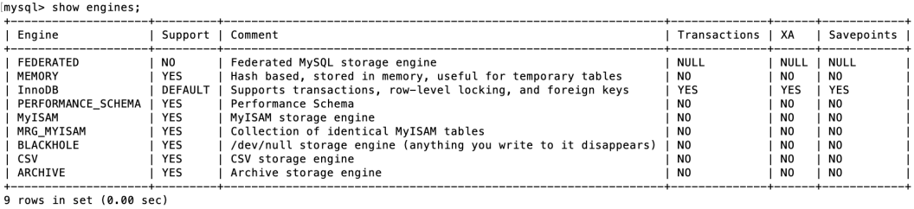

能看出在 MySQL 中，只有InnoDB 是支持事务的。

### 1.2 基本概念

**事务：**一组逻辑操作单元，使数据从一种状态变换到另一种状态。

**事务处理的原则：**保证所有事务都作为 `一个工作单元` 来执行，即使出现了故障，都不能改变这种执行方 式。当在一个事务中执行多个操作时，要么所有的事务都被提交( `commit` )，那么这些修改就 `永久` 地保 `存下来`；要么数据库管理系统将 `放弃` 所作的所有 `修改` ，整个事务回滚( rollback )到最初状态。

```mysql
# 案例：AA用户给BB用户转账100
update account set money = money - 100 where name = 'AA';
# 服务器宕机
update account set money = money + 100 where name = 'BB';
```

### 1.3 事物的ACID特性

* **原子性（atomicity）：**

原子性是指事务是一个不可分割的工作单位，要么全部提交，要么全部失败回滚。即要么转账成功，要么转账失败，是不存在中间的状态。如果无法保证原子性会怎么样？就会出现数据不一致的情形，A账户减去100元，而B账户增加100元操作失败，系统将无故丢失100元。

* **一致性（consistency）：**

（国内很多网站上对一致性的阐述有误，具体你可以参考 Wikipedia 对Consistency的阐述）

根据定义，一致性是指事务执行前后，数据从一个 `合法性状态` 变换到另外一个 `合法性状态` 。这种状态是 `语义上` 的而不是语法上的，跟具体的业务有关。

那什么是合法的数据状态呢？满足 `预定的约束` 的状态就叫做合法的状态。通俗一点，这状态是由你自己来定义的（比如满足现实世界中的约束）。满足这个状态，数据就是一致的，不满足这个状态，数据就 是不一致的！如果事务中的某个操作失败了，系统就会自动撤销当前正在执行的事务，返回到事务操作 之前的状态。

**举例1：**A账户有200元，转账300元出去，此时A账户余额为-100元。你自然就发现此时数据是不一致的，为什么呢？因为你定义了一个状态，余额这列必须>=0。

**举例2：**A账户有200元，转账50元给B账户，A账户的钱扣了，但是B账户因为各种意外，余额并没有增加。你也知道此时的数据是不一致的，为什么呢？因为你定义了一个状态，要求A+B的总余额必须不变。

**举例3：**在数据表中我们将`姓名`字段设置为`唯一性约束`，这时当事务进行提交或者事务发生回滚的时候，如果数据表的姓名不唯一，就破坏了事物的一致性要求。

* **隔离型（isolation）：**

事务的隔离性是指一个事务的执行`不能被其他事务干扰`，即一个事务内部的操作及使用的数据对`并发`的其他事务是隔离的，并发执行的各个事务之间不能相互干扰。

如果无法保证隔离性会怎么样？假设A账户有200元，B账户0元。A账户往B账户转账两次，每次金额为50 元，分别在两个事务中执行。如果无法保证隔离性，会出现下面的情形：

```mysql
UPDATE accounts SET money = money - 50 WHERE NAME = 'AA';
UPDATE accounts SET money = money + 50 WHERE NAME = 'BB';
```

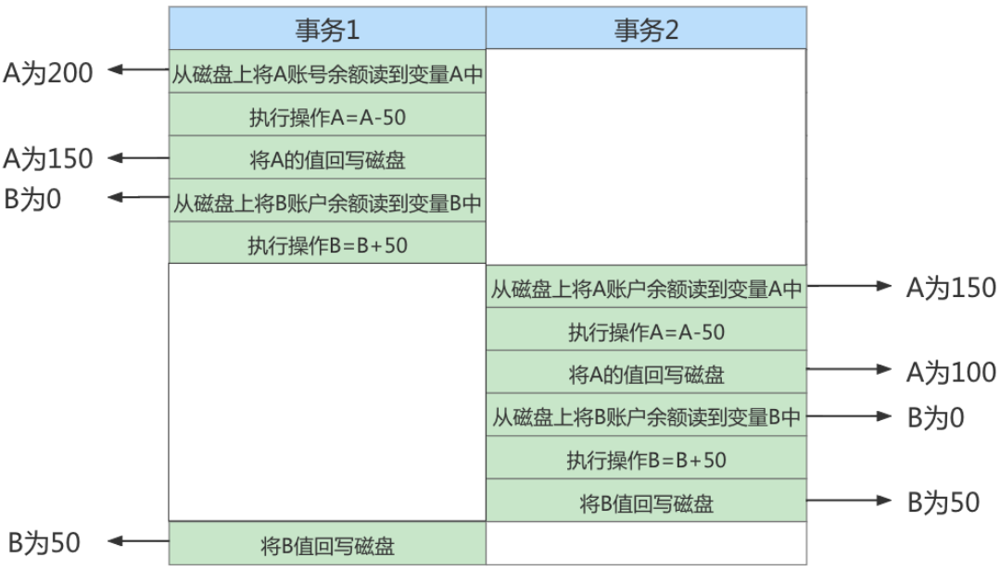

**持久性（durability）：**

持久性是指一个事务一旦被提交，它对数据库中数据的改变就是 永久性的 ，接下来的其他操作和数据库 故障不应该对其有任何影响。

持久性是通过 `事务日志` 来保证的。日志包括了 `重做日志` 和 `回滚日志` 。当我们通过事务对数据进行修改 的时候，首先会将数据库的变化信息记录到重做日志中，然后再对数据库中对应的行进行修改。这样做 的好处是，即使数据库系统崩溃，数据库重启后也能找到没有更新到数据库系统中的重做日志，重新执 行，从而使事务具有持久性。

> 总结
>
> ACID是事务的四大特征，在这四个特性中，原子性是基础，隔离性是手段，一致性是约束条件， 而持久性是我们的目的。
>
> 数据库事务，其实就是数据库设计者为了方便起见，把需要保证`原子性`、`隔离性`、`一致性`和`持久性`的一个或多个数据库操作称为一个事务。

### 1.4 事务的状态

我们现在知道 `事务` 是一个抽象的概念，它其实对应着一个或多个数据库操作，MySQL根据这些操作所执 行的不同阶段把 `事务` 大致划分成几个状态：

* **活动的（active）**

  事务对应的数据库操作正在执行过程中时，我们就说该事务处在 `活动的` 状态。

* **部分提交的（partially committed）**

  当事务中的最后一个操作执行完成，但由于操作都在内存中执行，所造成的影响并 `没有刷新到磁盘` 时，我们就说该事务处在 `部分提交的` 状态。

* **失败的（failed）**

  当事务处在 `活动的` 或者 部分提交的 状态时，可能遇到了某些错误（数据库自身的错误、操作系统 错误或者直接断电等）而无法继续执行，或者人为的停止当前事务的执行，我们就说该事务处在 失 败的 状态。

* **中止的（aborted）**

  如果事务执行了一部分而变为 `失败的` 状态，那么就需要把已经修改的事务中的操作还原到事务执 行前的状态。换句话说，就是要撤销失败事务对当前数据库造成的影响。我们把这个撤销的过程称之为 `回滚` 。当 `回滚` 操作执行完毕时，也就是数据库恢复到了执行事务之前的状态，我们就说该事 务处在了 `中止的` 状态。

  举例：

  ```mysql
  UPDATE accounts SET money = money - 50 WHERE NAME = 'AA';
  
  UPDATE accounts SET money = money + 50 WHERE NAME = 'BB';
  ```

* **提交的（committed）**

  当一个处在 `部分提交的` 状态的事务将修改过的数据都 `同步到磁盘` 上之后，我们就可以说该事务处在了 `提交的` 状态。

  一个基本的状态转换图如下所示：

  

  图中可见，只有当事物处于`提交的`或者`中止的`状态时，一个事务的生命周期才算是结束了。对于已经提交的事务来说，该事务对数据库所做的修改将永久生效，对于处于中止状态的事物，该事务对数据库所做的所有修改都会被回滚到没执行该事物之前的状态。

## 2. 如何使用事务

使用事务有两种方式，分别为 `显式事务` 和 `隐式事务` 。

### 2.1 显式事务

**步骤1：** START TRANSACTION 或者 BEGIN ，作用是显式开启一个事务。

```mysql
mysql> BEGIN;
#或者
mysql> START TRANSACTION;
```

`START TRANSACTION` 语句相较于 `BEGIN` 特别之处在于，后边能跟随几个 `修饰符` ：

① `READ ONLY` ：标识当前事务是一个 `只读事务` ，也就是属于该事务的数据库操作只能读取数据，而不能修改数据。

> 补充：只读事务中只是不允许修改那些其他事务也能访问到的表中的数据，对于临时表来说（我们使用 CREATE TMEPORARY TABLE 创建的表），由于它们只能再当前会话中可见，所有只读事务其实也是可以对临时表进行增、删、改操作的。

② `READ WRITE` ：标识当前事务是一个 `读写事务` ，也就是属于该事务的数据库操作既可以读取数据， 也可以修改数据。

③ `WITH CONSISTENT SNAPSHOT` ：启动一致性读。

比如：

```mysql
START TRANSACTION READ ONLY; # 开启一个只读事务
```

```mysql
START TRANSACTION READ ONLY, WITH CONSISTENT SNAPSHOT # 开启只读事务和一致性读
```

```mysql
START TRANSACTION READ WRITE, WITH CONSISTENT SNAPSHOT # 开启读写事务和一致性读
```

注意：

* `READ ONLY`和`READ WRITE`是用来设置所谓的事物`访问模式`的，就是以只读还是读写的方式来访问数据库中的数据，一个事务的访问模式不能同时即设置为`只读`的也设置为`读写`的，所以不能同时把`READ ONLY`和`READ WRITE`放到`START TRANSACTION`语句后边。
* 如果我们不显式指定事务的访问模式，那么该事务的访问模式就是`读写`模式

**步骤2：**一系列事务中的操作（主要是DML，不含DDL）

**步骤3：**提交事务 或 中止事务（即回滚事务）

```mysql
# 提交事务。当提交事务后，对数据库的修改是永久性的。
mysql> COMMIT;
```

```mysql
# 回滚事务。即撤销正在进行的所有没有提交的修改
mysql> ROLLBACK;

# 将事务回滚到某个保存点。
mysql> ROLLBACK TO [SAVEPOINT]
```

其中关于SAVEPOINT相关操作有：

```mysql
# 在事务中创建保存点，方便后续针对保存点进行回滚。一个事务中可以存在多个保存点。
SAVEPOINT 保存点名称;
```

```mysql
# 删除某个保存点
RELEASE SAVEPOINT 保存点名称;
```

### 2.2 隐式事务

MySQL中有一个系统变量 `autocommit` ：

```mysql
mysql> SHOW VARIABLES LIKE 'autocommit';
+---------------+-------+
| Variable_name | Value |
+---------------+-------+
| autocommit    |  ON   |
+---------------+-------+
1 row in set (0.01 sec)
```

当然，如果我们想关闭这种 `自动提交` 的功能，可以使用下边两种方法之一：

* 显式的的使用 `START TRANSACTION` 或者 `BEGIN` 语句开启一个事务。这样在本次事务提交或者回滚前会暂时关闭掉自动提交的功能。

* 把系统变量 `autocommit` 的值设置为 `OFF` ，就像这样：

  ```mysql
  SET autocommit = OFF;
  #或
  SET autocommit = 0;
  ```

### 2.3 隐式提交数据的情况

* 数据定义语言（Data definition language，缩写为：DDL）

  数据库对象，指的就是`数据库、表、视图、存储过程`等结构。当我们`CREATE、ALTER、DROP`等语句去修改数据库对象时，就会隐式的提交前边语句所属于的事物。即：

  ```mysql
  BEGIN;
  
  SELECT ... # 事务中的一条语句
  UPDATE ... # 事务中的一条语句
  ... # 事务中的其他语句
  
  CREATE TABLE ... # 此语句会隐式的提交前边语句所属于的事务
  ```

* 隐式使用或修改mysql数据库中的表

  当我们使用`ALTER USER`、`CREATE USER`、`DROP USER`、`GRANT`、`RENAME USER`、`REVOKE`、`SET PASSWORD`等语句时也会隐式的提交前边语句所属于的事务。

* 事务控制或关于锁定的语句

  ① 当我们在一个事务还没提交或者回滚时就又使用 START TRANSACTION 或者 BEGIN 语句开启了另一个事务时，会隐式的提交上一个事务。即：

  ```mysql
  BEGIN;
  
  SELECT ... # 事务中的一条语句
  UPDATE ... # 事务中的一条语句
  ... # 事务中的其他语句
  
  BEGIN; # 此语句会隐式的提交前边语句所属于的事务
  ```

  ② 当前的 autocommit 系统变量的值为 OFF ，我们手动把它调为 ON 时，也会 隐式的提交前边语句所属的事务。

  ③ 使用 LOCK TABLES 、 UNLOCK TABLES 等关于锁定的语句也会 隐式的提交 前边语句所属的事务。

* 加载数据的语句

  使用`LOAD DATA`语句来批量往数据库中导入数据时，也会`隐式的提交`前边语句所属的事务。

* 关于MySQL复制的一些语句

  使用`START SLAVE、STOP SLAVE、RESET SLAVE、CHANGE MASTER TO`等语句会隐式的提交前边语句所属的事务

* 其他的一些语句

  使用`ANALYZE TABLE、CACHE INDEX、CAECK TABLE、FLUSH、LOAD INDEX INTO CACHE、OPTIMIZE TABLE、REPAIR TABLE、RESET`等语句也会隐式的提交前边语句所属的事务。

### 2.4 使用举例1：提交与回滚

我们看下在 MySQL 的默认状态下，下面这个事务最后的处理结果是什么。

**情况1：**

```mysql
CREATE TABLE user(name varchar(20), PRIMARY KEY (name)) ENGINE=InnoDB;

BEGIN;
INSERT INTO user SELECT '张三';
COMMIT;

BEGIN;
INSERT INTO user SELECT '李四';
INSERT INTO user SELECT '李四';
ROLLBACK;

SELECT * FROM user;
```

运行结果（1 行数据）：

```mysql
mysql> commit;
Query OK, 0 rows affected (0.00 秒)

mysql> BEGIN;
Query OK, 0 rows affected (0.00 秒)

mysql> INSERT INTO user SELECT '李四';
Query OK, 1 rows affected (0.00 秒)

mysql> INSERT INTO user SELECT '李四';
Duplicate entry '李四' for key 'user.PRIMARY'
mysql> ROLLBACK;
Query OK, 0 rows affected (0.01 秒)

mysql> select * from user;
+--------+
| name   |
+--------+
| 张三    |
+--------+
1 行于数据集 (0.01 秒)
```

**情况2：**

```mysql
CREATE TABLE user (name varchar(20), PRIMARY KEY (name)) ENGINE=InnoDB;

BEGIN;
INSERT INTO user SELECT '张三';
COMMIT;

INSERT INTO user SELECT '李四';
INSERT INTO user SELECT '李四';
ROLLBACK;
```

运行结果（2 行数据）：

```mysql
mysql> SELECT * FROM user;
+--------+
| name   |
+--------+
| 张三    |
| 李四    |
+--------+
2 行于数据集 (0.01 秒)
```

**情况3：**

```mysql
CREATE TABLE user(name varchar(255), PRIMARY KEY (name)) ENGINE=InnoDB;

SET @@completion_type = 1;
BEGIN;
INSERT INTO user SELECT '张三';
COMMIT;

INSERT INTO user SELECT '李四';
INSERT INTO user SELECT '李四';
ROLLBACK;

SELECT * FROM user;
```

运行结果（1 行数据）：

```mysql
mysql> SELECT * FROM user;
+--------+
| name   |
+--------+
| 张三    |
+--------+
1 行于数据集 (0.01 秒)
```


> 当我们设置 autocommit=0 时，不论是否采用 START TRANSACTION 或者 BEGIN 的方式来开启事 务，都需要用 COMMIT 进行提交，让事务生效，使用 ROLLBACK 对事务进行回滚。
>
> 当我们设置 autocommit=1 时，每条 SQL 语句都会自动进行提交。 不过这时，如果你采用 START TRANSACTION 或者 BEGIN 的方式来显式地开启事务，那么这个事务只有在 COMMIT 时才会生效， 在 ROLLBACK 时才会回滚。

### 2.5 使用举例2：测试不支持事务的engine

```mysql
CREATE TABLE test1(i INT) ENGINE=InnoDB;

CREATE TABLE test2(i INT) ENGINE=MYISAM;
```

针对于InnoDB表

```mysql
BEGIN;
INSERT INTO test1 VALUES(1);
ROLLBACK;

SELECT * FROM test1;
```

结果：没有数据

针对于MYISAM表：

```mysql
BEGIN;
INSERT INTO test1 VALUES(1);
ROLLBACK;

SELECT * FROM test2;
```

结果：有一条数据

### 2.6 使用举例3：SAVEPOINT

创建表并添加数据：

```mysql
CREATE TABLE account(
id INT PRIMARY KEY AUTO_INCREMENT,
NAME VARCHAR(15),
balance DECIMAL(10,2)
);

INSERT INTO account(NAME,balance)
VALUES
('张三',1000),
('李四',1000);
```

```mysql
BEGIN;
UPDATE account SET balance = balance - 100 WHERE NAME = '张三';
UPDATE account SET balance = balance - 100 WHERE NAME = '张三';
SAVEPOINT s1; # 设置保存点
UPDATE account SET balance = balance + 1 WHERE NAME = '张三';
ROLLBACK TO s1; # 回滚到保存点
```

结果：张三：800.00

```mysql
ROLLBACK;
```

结果：张三：1000.00

## 3. 事务隔离级别

MySQL是一个 `客户端／服务器` 架构的软件，对于同一个服务器来说，可以有若干个客户端与之连接，每 个客户端与服务器连接上之后，就可以称为一个会话（ `Session` ）。每个客户端都可以在自己的会话中 向服务器发出请求语句，一个请求语句可能是某个事务的一部分，也就是对于服务器来说可能同时处理多个事务。事务有 `隔离性` 的特性，理论上在某个事务 `对某个数据进行访问` 时，其他事务应该进行`排队` ，当该事务提交之后，其他事务才可以继续访问这个数据。但是这样对 `性能影响太大` ，我们既想保持事务的隔离性，又想让服务器在处理访问同一数据的多个事务时 `性能尽量高些` ，那就看二者如何权衡取 舍了。

### 3.1 数据准备

```mysql
CREATE TABLE student (
    studentno INT,
    name VARCHAR(20),
    class varchar(20),
    PRIMARY KEY (studentno)
) Engine=InnoDB CHARSET=utf8;
```

然后向这个表里插入一条数据：

```mysql
INSERT INTO student VALUES(1, '小谷', '1班');
```

现在表里的数据就是这样的：

```mysql
mysql> select * from student;
+-----------+--------+-------+
| studentno | name   | class |
+-----------+--------+-------+
|      1    |   小谷  | 1班   |
+-----------+--------+-------+
1 row in set (0.00 sec)
```

### 3.2 数据并发问题

针对事务的隔离性和并发性，我们怎么做取舍呢？先看一下访问相同数据的事务在 不保证串行执行 （也 就是执行完一个再执行另一个）的情况下可能会出现哪些问题：

**1. 脏写（ Dirty Write ）**

对于两个事务 Session A、Session B，如果事务Session A `修改了` 另一个 `未提交` 事务Session B `修改过` 的数据，那就意味着发生了 `脏写`，示意图如下：

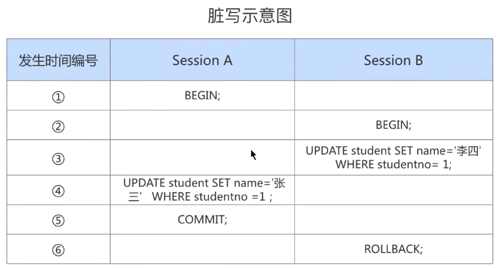

Session A 和 Session B 各开启了一个事务，Sesssion B 中的事务先将studentno列为1的记录的name列更新为'李四'，然后Session A中的事务接着又把这条studentno列为1的记录的name列更新为'张三'。如果之后Session B中的事务进行了回滚，那么Session A中的更新也将不复存在，这种现象称之为脏写。这时Session A中的事务就没有效果了，明明把数据更新了，最后也提交事务了，最后看到的数据什么变化也没有。这里大家对事务的隔离性比较了解的话，会发现默认隔离级别下，上面Session A中的更新语句会处于等待状态，这里只是跟大家说明一下会出现这样的现象。

**2. 脏读（ Dirty Read ）**

 对于两个事务 Session A、Session B，Session A `读取` 了已经被 Session B `更新` 但还 `没有被提交` 的字段。 之后若 Session B `回滚` ，Session A `读取 `的内容就是 `临时且无效` 的。

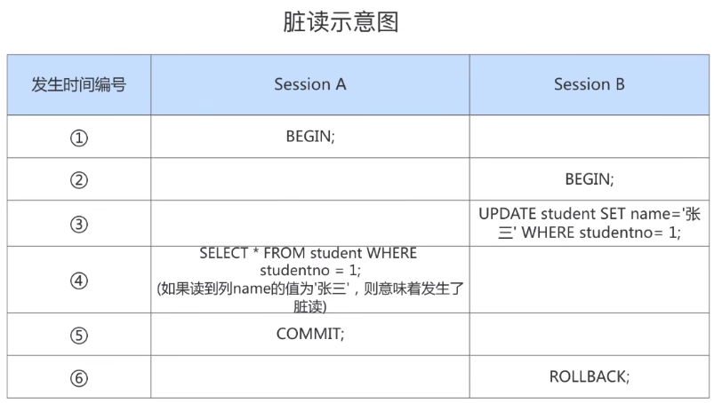

Session A和Session B各开启了一个事务，Session B中的事务先将studentno列为1的记录的name列更新 为'张三'，然后Session A中的事务再去查询这条studentno为1的记录，如果读到列name的值为'张三'，而 Session B中的事务稍后进行了回滚，那么Session A中的事务相当于读到了一个不存在的数据，这种现象就称之为 `脏读` 。

**3. 不可重复读（ Non-Repeatable Read ）**

对于两个事务Session A、Session B，Session A `读取`了一个字段，然后 Session B `更新`了该字段。 之后 Session A `再次读取` 同一个字段， `值就不同` 了。那就意味着发生了不可重复读。

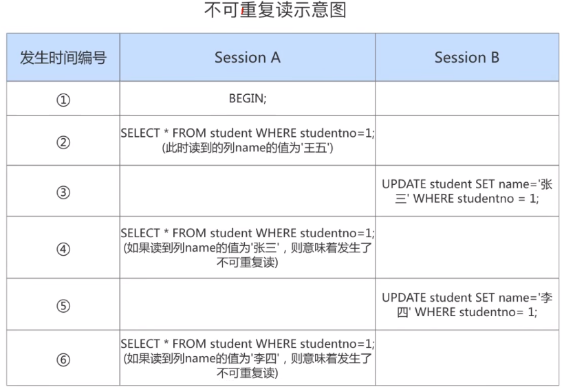

我们在Session B中提交了几个 `隐式事务` （注意是隐式事务，意味着语句结束事务就提交了），这些事务 都修改了studentno列为1的记录的列name的值，每次事务提交之后，如果Session A中的事务都可以查看到最新的值，这种现象也被称之为 `不可重复读 `。

**4. 幻读（ Phantom ）**

对于两个事务Session A、Session B, Session A 从一个表中 `读取` 了一个字段, 然后 Session B 在该表中 插 入 了一些新的行。 之后, 如果 Session A `再次读取` 同一个表, 就会多出几行。那就意味着发生了`幻读`。

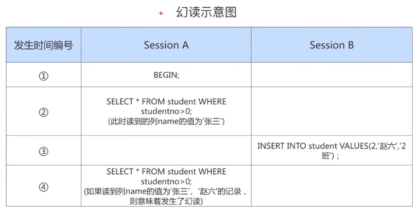

Session A中的事务先根据条件 studentno > 0这个条件查询表student，得到了name列值为'张三'的记录； 之后Session B中提交了一个 `隐式事务` ，该事务向表student中插入了一条新记录；之后Session A中的事务 再根据相同的条件 studentno > 0查询表student，得到的结果集中包含Session B中的事务新插入的那条记 录，这种现象也被称之为 幻读 。我们把新插入的那些记录称之为 `幻影记录` 。


### 3.3 SQL中的四种隔离级别

上面介绍了几种并发事务执行过程中可能遇到的一些问题，这些问题有轻重缓急之分，我们给这些问题 按照严重性来排一下序：

```mysql
脏写 > 脏读 > 不可重复读 > 幻读
```

我们愿意舍弃一部分隔离性来换取一部分性能在这里就体现在：设立一些隔离级别，隔离级别越低，并发问题发生的就越多。 `SQL标准` 中设立了4个 `隔离级别` ：

* `READ UNCOMMITTED` ：读未提交，在该隔离级别，所有事务都可以看到其他未提交事务的执行结 果。不能避免脏读、不可重复读、幻读。 
* `READ COMMITTED` ：读已提交，它满足了隔离的简单定义：一个事务只能看见已经提交事务所做 的改变。这是大多数数据库系统的默认隔离级别（但不是MySQL默认的）。可以避免脏读，但不可 重复读、幻读问题仍然存在。 
* `REPEATABLE READ` ：可重复读，事务A在读到一条数据之后，此时事务B对该数据进行了修改并提 交，那么事务A再读该数据，读到的还是原来的内容。可以避免脏读、不可重复读，但幻读问题仍 然存在。这是MySQL的默认隔离级别。 
* `SERIALIZABLE` ：可串行化，确保事务可以从一个表中读取相同的行。在这个事务持续期间，禁止 其他事务对该表执行插入、更新和删除操作。所有的并发问题都可以避免，但性能十分低下。能避 免脏读、不可重复读和幻读。

`SQL标准` 中规定，针对不同的隔离级别，并发事务可以发生不同严重程度的问题，具体情况如下：


`脏写 `怎么没涉及到？因为脏写这个问题太严重了，不论是哪种隔离级别，都不允许脏写的情况发生。

不同的隔离级别有不同的现象，并有不同的锁和并发机制，隔离级别越高，数据库的并发性能就越差，4 种事务隔离级别与并发性能的关系如下：


### 3.4 MySQL支持的四种隔离级别


MySQL的默认隔离级别为REPEATABLE READ，我们可以手动修改一下事务的隔离级别。

```mysql
# 查看隔离级别，MySQL 5.7.20的版本之前：
mysql> SHOW VARIABLES LIKE 'tx_isolation';
+---------------+-----------------+
| Variable_name | Value           |
+---------------+-----------------+
| tx_isolation  | REPEATABLE-READ |
+---------------+-----------------+
1 row in set (0.00 sec)
# MySQL 5.7.20版本之后，引入transaction_isolation来替换tx_isolation

# 查看隔离级别，MySQL 5.7.20的版本及之后：
mysql> SHOW VARIABLES LIKE 'transaction_isolation';
+-----------------------+-----------------+
| Variable_name         | Value           |
+-----------------------+-----------------+
| transaction_isolation | REPEATABLE-READ |
+-----------------------+-----------------+
1 row in set (0.02 sec)

#或者不同MySQL版本中都可以使用的：
SELECT @@transaction_isolation;
```

### 3.5 如何设置事务的隔离级别

**通过下面的语句修改事务的隔离级别：**

```mysql
SET [GLOBAL|SESSION] TRANSACTION ISOLATION LEVEL 隔离级别;
#其中，隔离级别格式：
> READ UNCOMMITTED
> READ COMMITTED
> REPEATABLE READ
> SERIALIZABLE
```

或者：

```mysql
SET [GLOBAL|SESSION] TRANSACTION_ISOLATION = '隔离级别'
#其中，隔离级别格式：
> READ-UNCOMMITTED
> READ-COMMITTED
> REPEATABLE-READ
> SERIALIZABLE
```

**关于设置时使用GLOBAL或SESSION的影响：**

* 使用 GLOBAL 关键字（在全局范围影响）：

  ```mysql
  SET GLOBAL TRANSACTION ISOLATION LEVEL SERIALIZABLE;
  #或
  SET GLOBAL TRANSACTION_ISOLATION = 'SERIALIZABLE';
  ```

  则：

  + 当前已经存在的会话无效
  + 只对执行完该语句之后产生的会话起作用

* 使用 `SESSION` 关键字（在会话范围影响）：

  ```mysql
  SET SESSION TRANSACTION ISOLATION LEVEL SERIALIZABLE;
  #或
  SET SESSION TRANSACTION_ISOLATION = 'SERIALIZABLE';
  ```

  则：

  + 对当前会话的所有后续的事务有效
  + 如果在事务之间执行，则对后续的事务有效
  + 该语句可以在已经开启的事务中间执行，但不会影响当前正在执行的事务

如果在服务器启动时想改变事务的默认隔离级别，可以修改启动参数`transaction_isolation`的值。比如，在启动服务器时指定了`transaction_isolation=SERIALIZABLE`，那么事务的默认隔离界别就从原来的`REPEATABLE-READ`变成了`SERIALIZABLE`。

> 小结： 
>
> 数据库规定了多种事务隔离级别，不同隔离级别对应不同的干扰程度，隔离级别越高，数据一致性就越好，但并发性越弱。

### 3.6 不同隔离级别举例

初始化数据：

```mysql
TRUNCATE TABLE account;
INSERT INTO account VALUES (1,'张三','100'), (2,'李四','0');
```


**演示1. 读未提交之脏读**

设置隔离级别为未提交读：


脏读就是指当前事务就在访问数据，并且对数据进行了修改，而这种修改还没有提交到数据库中，这时，另外一个事务也访问了这个数据，然后使用了这个数据。

**演示2：读已提交**

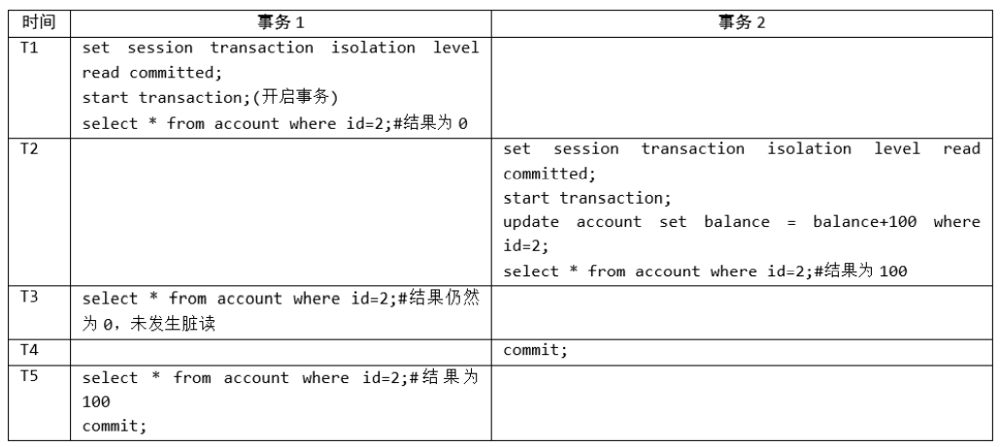

**演示3. 不可重复读**

设置隔离级别为可重复读，事务的执行流程如下：

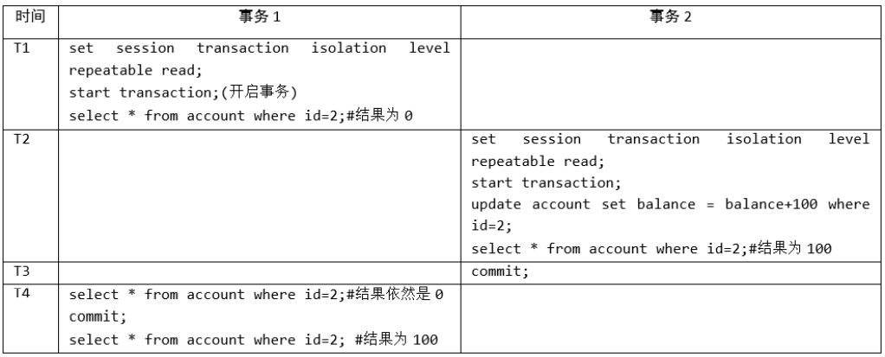

当我们将当前会话的隔离级别设置为可重复读的时候，当前会话可以重复读，就是每次读取的结果集都相同，而不管其他事务有没有提交。但是在可重复读的隔离级别上会出现幻读的问题。

**演示4：幻读**


## 4. 事务的常见分类

从事务理论的角度来看，可以把事务分为以下几种类型：

* 扁平事务（Flat Transactions） 
* 带有保存点的扁平事务（Flat Transactions with Savepoints） 
* 链事务（Chained Transactions） 
* 嵌套事务（Nested Transactions） 
* 分布式事务（Distributed Transactions）

# 第14章_MySQL事务日志

事务有4种特性：原子性、一致性、隔离性和持久性。那么事务的四种特性到底是基于什么机制实现呢？

* 事务的隔离性由 `锁机制` 实现。
* 而事务的原子性、一致性和持久性由事务的 redo 日志和undo 日志来保证。
  + REDO LOG 称为 `重做日志 `，提供再写入操作，恢复提交事务修改的页操作，用来保证事务的持久性。
  + UNDO LOG 称为 `回滚日志` ，回滚行记录到某个特定版本，用来保证事务的原子性、一致性。

有的DBA或许会认为 UNDO 是 REDO 的逆过程，其实不然。REDO 和 UNDO都可以视为是一种 `恢复操作`，但是：

* redo log: 是存储引擎层 (innodb) 生成的日志，记录的是`"物理级别"`上的页修改操作，比如页号xxx，偏移量yyy写入了'zzz'数据。主要为了保证数据的可靠性。
* undo log: 是存储引擎层 (innodb) 生成的日志，记录的是 `逻辑操作` 日志，比如对某一行数据进行了INSERT语句操作，那么undo log就记录一条与之相反的DELETE操作。主要用于 `事务的回滚` (undo log 记录的是每个修改操作的 `逆操作`) 和 `一致性非锁定读` (undo log 回滚行记录到某种特定的版本——MVCC，即多版本并发控制)。

## 1. redo日志

InnoDB存储引擎是以`页为单位`来管理存储空间的。在真正访问页面之前，需要把在`磁盘上`的页缓存到内存中的`Buffer Pool`之后才可以访问。所有的变更都必须`先更新缓冲池`中的数据，然后缓冲池中的`脏页`会以一定的频率被刷入磁盘 (`checkPoint`机制)，通过缓冲池来优化CPU和磁盘之间的鸿沟，这样就可以保证整体的性能不会下降太快。

### 1.1 为什么需要REDO日志

一方面，缓冲池可以帮助我们消除CPU和磁盘之间的鸿沟，checkpoint机制可以保证数据的最终落盘，然 而由于checkpoint `并不是每次变更的时候就触发` 的，而是master线程隔一段时间去处理的。所以最坏的情 况就是事务提交后，刚写完缓冲池，数据库宕机了，那么这段数据就是丢失的，无法恢复。

另一方面，事务包含 `持久性` 的特性，就是说对于一个已经提交的事务，在事务提交后即使系统发生了崩溃，这个事务对数据库中所做的更改也不能丢失。

那么如何保证这个持久性呢？ `一个简单的做法` ：在事务提交完成之前把该事务所修改的所有页面都刷新 到磁盘，但是这个简单粗暴的做法有些问题:

* **修改量与刷新磁盘工作量严重不成比例**

  有时候我们仅仅修改了某个页面中的一个字节，但是我们知道在InnoDB中是以页为单位来进行磁盘IO的，也就是说我们在该事务提交时不得不将一个完整的页面从内存中刷新到磁盘，我们又知道一个默认页面时16KB大小，只修改一个字节就要刷新16KB的数据到磁盘上显然是小题大做了。

* **随机IO刷新较慢**

  一个事务可能包含很多语句，即使是一条语句也可能修改许多页面，假如该事务修改的这些页面可能并不相邻，这就意味着在将某个事务修改的Buffer Pool中的页面`刷新到磁盘`时，需要进行很多的`随机IO`，随机IO比顺序IO要慢，尤其对于传统的机械硬盘来说。

`另一个解决的思路` ：我们只是想让已经提交了的事务对数据库中数据所做的修改永久生效，即使后来系 统崩溃，在重启后也能把这种修改恢复出来。所以我们其实没有必要在每次事务提交时就把该事务在内 存中修改过的全部页面刷新到磁盘，只需要把 修改 了哪些东西 记录一下 就好。比如，某个事务将系统 表空间中 第10号 页面中偏移量为 100 处的那个字节的值 1 改成 2 。我们只需要记录一下：将第0号表 空间的10号页面的偏移量为100处的值更新为 2 

InnoDB引擎的事务采用了WAL技术 (`Write-Ahead Logging`)，这种技术的思想就是先写日志，再写磁盘，只有日志写入成功，才算事务提交成功，这里的日志就是redo log。当发生宕机且数据未刷到磁盘的时候，可以通过redo log来恢复，保证ACID中的D，这就是redo log的作用。


### 1.2 REDO日志的好处、特点

#### 1. 好处

* redo日志降低了刷盘频率 
* redo日志占用的空间非常小

存储表空间ID、页号、偏移量以及需要更新的值，所需的存储空间是很小的，刷盘快。

#### 2. 特点

* **redo日志是顺序写入磁盘的**

  在执行事务的过程中，每执行一条语句，就可能产生若干条redo日志，这些日志是按照`产生的顺序写入磁盘的`，也就是使用顺序ID，效率比随机IO快。

* **事务执行过程中，redo log不断记录**

  redo log跟bin log的区别，redo log是`存储引擎层`产生的，而bin log是`数据库层`产生的。假设一个事务，对表做10万行的记录插入，在这个过程中，一直不断的往redo log顺序记录，而bin log不会记录，直到这个事务提交，才会一次写入到bin log文件中。

### 1.3 redo的组成

Redo log可以简单分为以下两个部分：

* `重做日志的缓冲 (redo log buffer)` ，保存在内存中，是易失的。

在服务器启动时就会向操作系统申请了一大片称之为 redo log buffer 的 `连续内存` 空间，翻译成中文就是redo日志缓冲区。这片内存空间被划分为若干个连续的`redo log block`。一个redo log block占用`512字节`大小。


**参数设置：innodb_log_buffer_size：**

redo log buffer 大小，默认 `16M` ，最大值是4096M，最小值为1M。

```mysql
mysql> show variables like '%innodb_log_buffer_size%';
+------------------------+----------+
| Variable_name          | Value    |
+------------------------+----------+
| innodb_log_buffer_size | 16777216 |
+------------------------+----------+
```

* `重做日志文件 (redo log file) `，保存在硬盘中，是持久的。

REDO日志文件如图所示，其中`ib_logfile0`和`ib_logfile1`即为REDO日志。

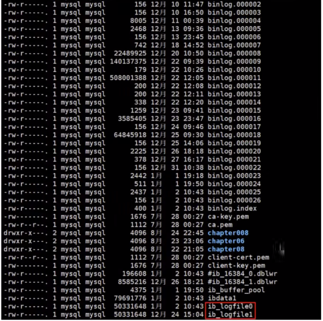

### 1.4 redo的整体流程

以一个更新事务为例，redo log 流转过程，如下图所示：


```
第1步：先将原始数据从磁盘中读入内存中来，修改数据的内存拷贝
第2步：生成一条重做日志并写入redo log buffer，记录的是数据被修改后的值
第3步：当事务commit时，将redo log buffer中的内容刷新到 redo log file，对 redo log file采用追加写的方式
第4步：定期将内存中修改的数据刷新到磁盘中
```

> 体会： Write-Ahead Log(预先日志持久化)：在持久化一个数据页之前，先将内存中相应的日志页持久化。

### 1.5 redo log的刷盘策略

redo log的写入并不是直接写入磁盘的，InnoDB引擎会在写redo log的时候先写redo log buffer，之后以` 一 定的频率 `刷入到真正的redo log file 中。这里的一定频率怎么看待呢？这就是我们要说的刷盘策略。

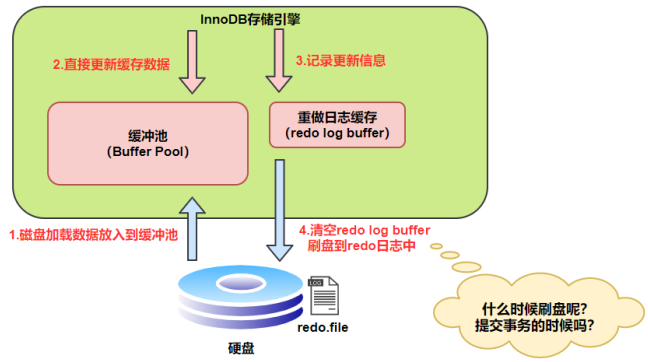

注意，redo log buffer刷盘到redo log file的过程并不是真正的刷到磁盘中去，只是刷入到 `文件系统缓存 （page cache）`中去（这是现代操作系统为了提高文件写入效率做的一个优化），真正的写入会交给系统自己来决定（比如page cache足够大了）。那么对于InnoDB来说就存在一个问题，如果交给系统来同 步，同样如果系统宕机，那么数据也丢失了（虽然整个系统宕机的概率还是比较小的）。

针对这种情况，InnoDB给出 `innodb_flush_log_at_trx_commit` 参数，该参数控制 commit提交事务 时，如何将 redo log buffer 中的日志刷新到 redo log file 中。它支持三种策略：

* `设置为0` ：表示每次事务提交时不进行刷盘操作。（系统默认master thread每隔1s进行一次重做日 志的同步） 第1步：先将原始数据从磁盘中读入内存中来，修改数据的内存拷贝 第2步：生成一条重做日志并写入redo log buffer，记录的是数据被修改后的值 第3步：当事务commit时，将redo log buffer中的内容刷新到 redo log file，对 redo log file采用追加 写的方式 第4步：定期将内存中修改的数据刷新到磁盘中 
* `设置为1` ：表示每次事务提交时都将进行同步，刷盘操作（ 默认值 ） 
* `设置为2` ：表示每次事务提交时都只把 redo log buffer 内容写入 page cache，不进行同步。由os自 己决定什么时候同步到磁盘文件。


另外，InnoDB存储引擎有一个后台线程，每隔`1秒`，就会把`redo log buffer`中的内容写到文件系统缓存(`page cache`)，然后调用刷盘操作。


也就是说，一个没有提交事务的`redo log`记录，也可能会刷盘。因为在事务执行过程 redo log 记录是会写入 `redo log buffer`中，这些redo log 记录会被`后台线程`刷盘。


除了后台线程每秒`1次`的轮询操作，还有一种情况，当`redo log buffer`占用的空间即将达到`innodb_log_buffer_size`（这个参数默认是16M）的一半的时候，后台线程会主动刷盘。

### 1.6 不同刷盘策略演示

#### 1. 流程图

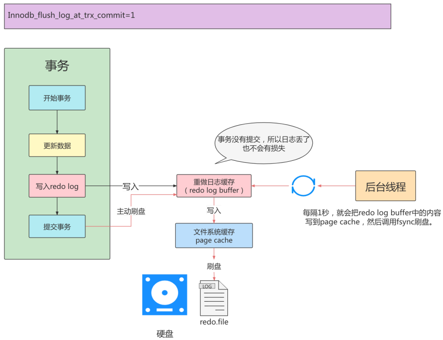

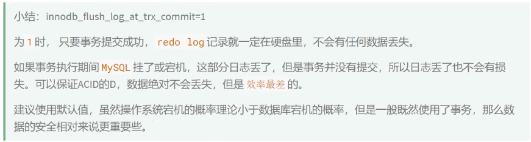

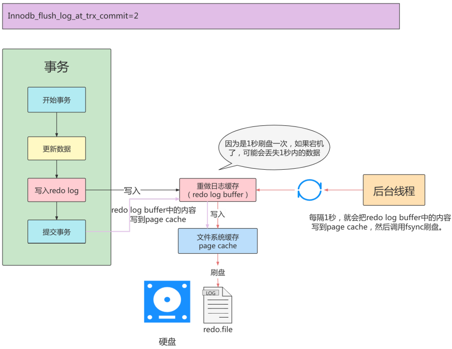

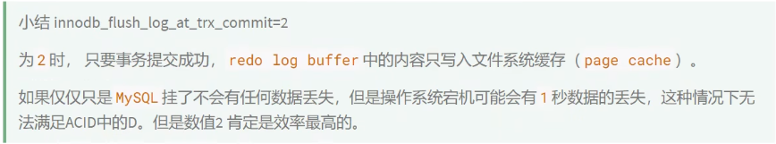


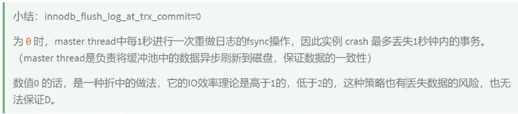

#### 2. 举例

比较innodb_flush_log_at_trx_commit对事务的影响。

```mysql
CREATE TABLE test_load(
a INT,
b CHAR(80)
)ENGINE=INNODB;
```

```mysql
DELIMITER//
CREATE PROCEDURE p_load(COUNT INT UNSIGNED)
BEGIN
DECLARE s INT UNSIGNED DEFAULT 1;
DECLARE c CHAR(80) DEFAULT REPEAT('a',80);
WHILE s<=COUNT DO
INSERT INTO test_load SELECT NULL, c;
COMMIT;
SET s=s+1;
END WHILE;
END //
DELIMITER;
```

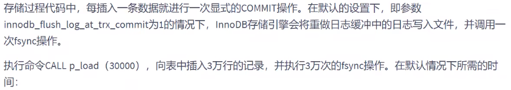

```mysql
mysql> CALL p_load(30000);
Query OK, 0 rows affected(1 min 23 sec)
```

`1 min 23 sec`的时间显然是不能接受的。而造成时间比较长的原因就在于fsync操作所需要的时间。

修改参数innodb_flush_log_at_trx_commit，设置为0：

```mysql
mysql> set global innodb_flush_log_at_trx_commit = 0;
```

```mysql
mysql> CALL p_load(30000);
Query OK, 0 rows affected(38 sec)
```

修改参数innodb_flush_log_at_trx_commit，设置为2：

```mysql
mysql> set global innodb_flush_log_at_trx_commit = 2;
```

```mysql
mysql> CALL p_load(30000);
Query OK, 0 rows affected(46 sec)
```


### 1.7 写入redo log buffer 过程

#### 1. 补充概念：Mini-Transaction

MySQL把对底层页面中的一次原子访问过程称之为一个`Mini-Transaction`，简称`mtr`，比如，向某个索引对应的B+树中插入一条记录的过程就是一个`Mini-Transaction`。一个所谓的`mtr`可以包含一组redo日志，在进行崩溃恢复时这一组`redo`日志可以作为一个不可分割的整体。

一个事务可以包含若干条语句，每一条语句其实是由若干个 `mtr` 组成，每一个 `mtr` 又可以包含若干条 redo日志，画个图表示它们的关系就是这样：

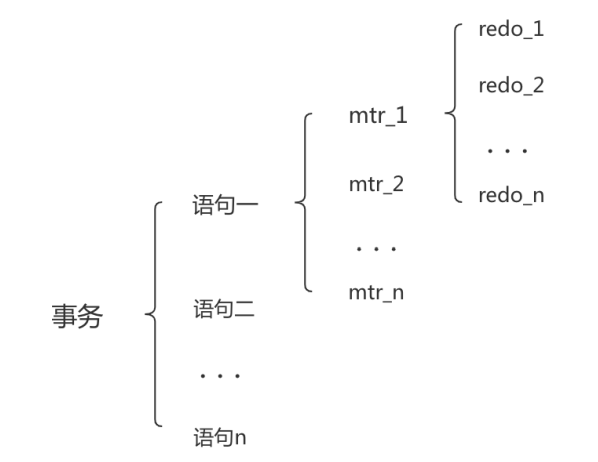

#### 2. redo 日志写入log buffer


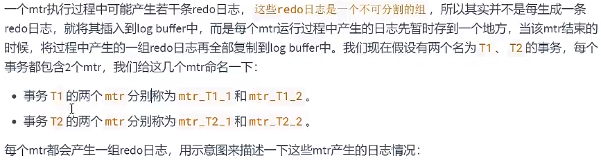


不同的事务可能是 `并发` 执行的，所以 T1 、 T2 之间的 mtr 可能是 `交替执行` 的。没当一个mtr执行完成时，伴随该mtr生成的一组redo日志就需要被复制到log buffer中，也就是说不同事务的mtr可能是交替写入log buffer的，我们画个示意图（为了美观，我们把一个mtr中产生的所有redo日志当做一个整体来画）：

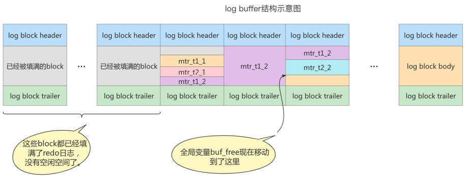

有的mtr产生的redo日志量非常大，比如`mtr_t1_2`产生的redo日志占用空间比较大，占用了3个block来存储。

#### 3. redo log block的结构图

一个redo log block是由`日志头、日志体、日志尾`组成。日志头占用12字节，日志尾占用8字节，所以一个block真正能存储的数据是512-12-8=492字节。

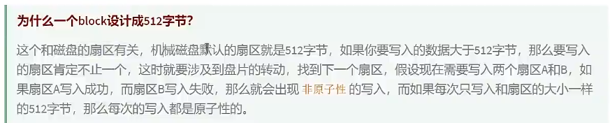

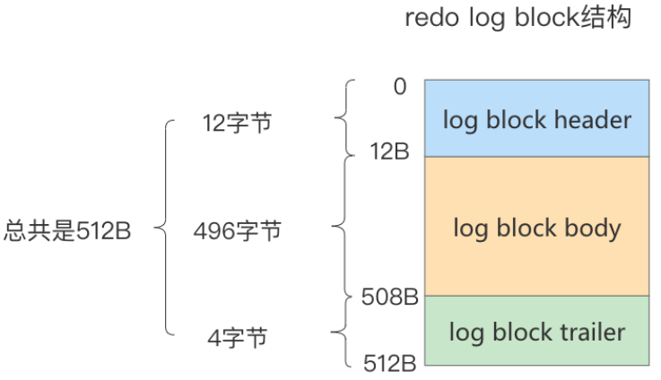

真正的redo日志都是存储到占用`496`字节大小的`log block body`中，图中的`log block header`和`log block trailer`存储的是一些管理信息。我们来看看这些所谓`管理信息`都有什么。

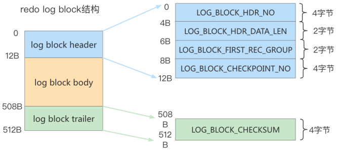


### 1.8 redo log file

#### 1. 相关参数设置

* `innodb_log_group_home_dir` ：指定 redo log 文件组所在的路径，默认值为 `./` ，表示在数据库 的数据目录下。MySQL的默认数据目录（ `var/lib/mysql`）下默认有两个名为 `ib_logfile0` 和 `ib_logfile1` 的文件，log buffer中的日志默认情况下就是刷新到这两个磁盘文件中。此redo日志 文件位置还可以修改。

* `innodb_log_files_in_group`：指明redo log file的个数，命名方式如：ib_logfile0，iblogfile1... iblogfilen。默认2个，最大100个。

  ```mysql
  mysql> show variables like 'innodb_log_files_in_group';
  +---------------------------+-------+
  | Variable_name             | Value |
  +---------------------------+-------+
  | innodb_log_files_in_group | 2     |
  +---------------------------+-------+
  #ib_logfile0
  #ib_logfile1
  ```

* `innodb_flush_log_at_trx_commit`：控制 redo log 刷新到磁盘的策略，默认为1。

* `innodb_log_file_size`：单个 redo log 文件设置大小，默认值为 `48M` 。最大值为512G，注意最大值 指的是整个 redo log 系列文件之和，即（innodb_log_files_in_group * innodb_log_file_size ）不能大 于最大值512G。

  ```mysql
  mysql> show variables like 'innodb_log_file_size';
  +----------------------+----------+
  | Variable_name        | Value    |
  +----------------------+----------+
  | innodb_log_file_size | 50331648 |
  +----------------------+----------+
  ```

根据业务修改其大小，以便容纳较大的事务。编辑my.cnf文件并重启数据库生效，如下所示

```mysql
[root@localhost ~]# vim /etc/my.cnf
innodb_log_file_size=200M
```

> 在数据库实例更新比较频繁的情况下，可以适当加大 redo log 数组和大小。但也不推荐 redo log 设置过大，在MySQL崩溃时会重新执行REDO日志中的记录。

#### 2. 日志文件组

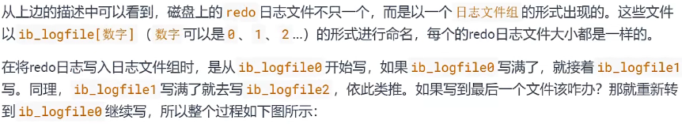


总共的redo日志文件大小其实就是： `innodb_log_file_size × innodb_log_files_in_group` 。

采用循环使用的方式向redo日志文件组里写数据的话，会导致后写入的redo日志覆盖掉前边写的redo日志？当然！所以InnoDB的设计者提出了checkpoint的概念。

#### 3. checkpoint

在整个日志文件组中还有两个重要的属性，分别是 write pos、checkpoint

* `write pos`是当前记录的位置，一边写一边后移
* `checkpoint`是当前要擦除的位置，也是往后推移

每次刷盘 redo log 记录到日志文件组中，write pos 位置就会后移更新。每次MySQL加载日志文件组恢复数据时，会清空加载过的 redo log 记录，并把check point后移更新。write pos 和 checkpoint 之间的还空着的部分可以用来写入新的 redo log 记录。


如果 write pos 追上 checkpoint ，表示`日志文件组`满了，这时候不能再写入新的 redo log记录，MySQL 得 停下来，清空一些记录，把 checkpoint 推进一下。


### 1.9 redo log 小结

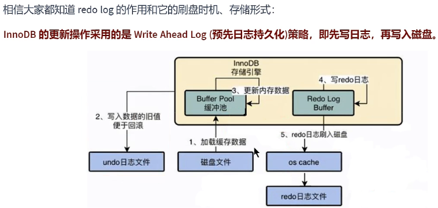

## 2. Undo日志

redo log是事务持久性的保证，undo log是事务原子性的保证。在事务中 `更新数据` 的 `前置操作` 其实是要先写入一个 `undo log` 。

### 2.1 如何理解Undo日志

事务需要保证 `原子性 `，也就是事务中的操作要么全部完成，要么什么也不做。但有时候事务执行到一半会出现一些情况，比如：

* 情况一：事务执行过程中可能遇到各种错误，比如` 服务器本身的错误` ， `操作系统错误` ，甚至是突然 `断电` 导致的错误。
* 情况二：程序员可以在事务执行过程中手动输入 `ROLLBACK` 语句结束当前事务的执行。

以上情况出现，我们需要把数据改回原先的样子，这个过程称之为 `回滚` ，这样就可以造成一个假象：这 个事务看起来什么都没做，所以符合 `原子性` 要求。

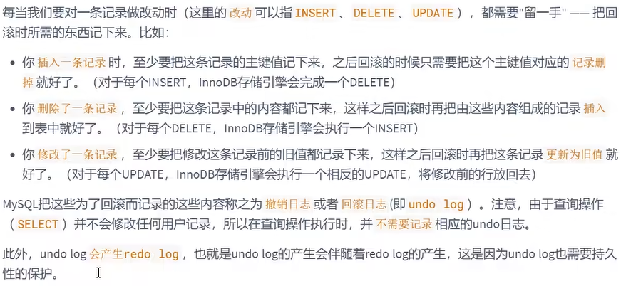

### 2.2 Undo日志的作用

* **作用1：回滚数据**


* **作用2：MVCC**

undo的另一个作用是MVCC，即在InnoDB存储引擎中MVCC的实现是通过undo来完成。当用户读取一行记录时，若该记录以及被其他事务占用，当前事务可以通过undo读取之前的行版本信息，以此实现非锁定读取。

### 2.3 undo的存储结构

#### 1. 回滚段与undo页

InnoDB对undo log的管理采用段的方式，也就是 `回滚段（rollback segment）` 。每个回滚段记录了 `1024` 个 `undo log segment` ，而在每个undo log segment段中进行 `undo页` 的申请。

* 在` InnoDB1.1版本之前` （不包括1.1版本），只有一个rollback segment，因此支持同时在线的事务限制为 `1024` 。虽然对绝大多数的应用来说都已经够用。 
* 从1.1版本开始InnoDB支持最大 `128个rollback segment` ，故其支持同时在线的事务限制提高到 了 `128*1024` 。

```mysql
mysql> show variables like 'innodb_undo_logs';
+------------------+-------+
| Variable_name    | Value |
+------------------+-------+
| innodb_undo_logs | 128   |
+------------------+-------+
```

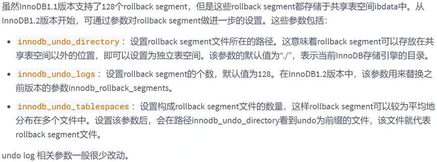


#### 2. 回滚段与事务

1. 每个事务只会使用一个回滚段，一个回滚段在同一时刻可能会服务于多个事务。

2. 当一个事务开始的时候，会制定一个回滚段，在事务进行的过程中，当数据被修改时，原始的数 据会被复制到回滚段。

3. 在回滚段中，事务会不断填充盘区，直到事务结束或所有的空间被用完。如果当前的盘区不够 用，事务会在段中请求扩展下一个盘区，如果所有已分配的盘区都被用完，事务会覆盖最初的盘 区或者在回滚段允许的情况下扩展新的盘区来使用。

4. 回滚段存在于undo表空间中，在数据库中可以存在多个undo表空间，但同一时刻只能使用一个 undo表空间。

   ```mysql
   mysql> show variables like 'innodb_undo_tablespaces';
   +-------------------------+-------+
   | Variable_name           | Value |
   +-------------------------+-------+
   | innodb_undo_tablespaces | 2     |
   +-------------------------+-------+
   # undo log的数量，最少为2. undo log的truncate操作有purge协调线程发起。在truncate某个undo log表空间的过程中，保证有一个可用的undo log可用。
   ```

5. 当事务提交时，InnoDB存储引擎会做以下两件事情：

   + 将undo log放入列表中，以供之后的purge操作 
   + 判断undo log所在的页是否可以重用，若可以分配给下个事务使用

#### 3. 回滚段中的数据分类

1. `未提交的回滚数据(uncommitted undo information)`：该数据所关联的事务并未提交，用于实现读一致性，所以该数据不能被其他事务的数据覆盖。
2. `已经提交但未过期的回滚数据(committed undo information)`：该数据关联的事务已经提交，但是仍受到undo retention参数的保持时间的影响。
3. `事务已经提交并过期的数据(expired undo information)`：事务已经提交，而且数据保存时间已经超过 undo retention参数指定的时间，属于已经过期的数据。当回滚段满了之后，就优先覆盖“事务已经提交并过期的数据"。

事务提交后不能马上删除undo log及undo log所在的页。这是因为可能还有其他事务需要通过undo log来得到行记录之前的版本。故事务提交时将undo log放入一个链表中，是否可以最终删除undo log以undo log所在页由purge线程来判断。

### 2.4 undo的类型

在InnoDB存储引擎中，undo log分为：

* insert undo log

  insert undo log是指insert操作中产生的undo log。因为insert操作的记录，只对事务本身可见，对其他事务不可见（这是事务隔离性的要求），故该undo log可以在事务提交后直接删除。不需要进行purge操作。

* update undo log

  update undo log记录的是对delete和update操作产生的undo log。该undo log可能需要提供MVCC机制，因此不能在事务提交时就进行删除。提交时放入undo log链表，等待purge线程进行最后的删除。

### 2.5 undo log的生命周期

#### 1. 简要生成过程

以下是undo+redo事务的简化过程

假设有两个数值，分别为A=1和B=2，然后将A修改为3，B修改为4


**只有Buffer Pool的流程：**


**有了Redo Log和Undo Log之后：**


在更新Buffer Pool中的数据之前，我们需要先将该数据事务开始之前的状态写入Undo Log中。假设更新到一半出错了，我们就可以通过Undo Log来回滚到事务开始前。

#### 2. 详细生成过程


**当我们执行INSERT时：**

```mysql
begin;
INSERT INTO user (name) VALUES ("tom");
```

插入的数据都会生成一条insert undo log，并且数据的回滚指针会指向它。undo log会记录undo log的序号、插入主键的列和值...，那么在进行rollback的时候，通过主键直接把对应的数据删除即可。

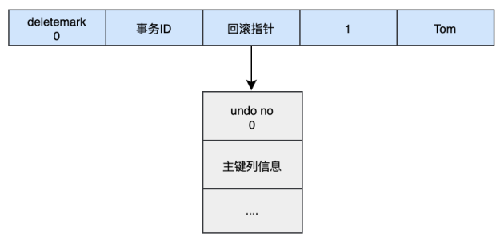

**当我们执行UPDATE时：**

对应更新的操作会产生update undo log，并且会分更新主键和不更新主键的，假设现在执行：

```mysql
UPDATE user SET name="Sun" WHERE id=1;
```

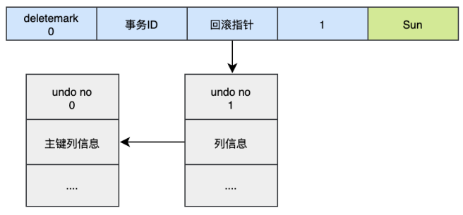

这时会把老的记录写入新的undo log，让回滚指针指向新的undo log，它的undo no是1，并且新的undo log会指向老的undo log（undo no=0）。

假设现在执行：

```mysql
UPDATE user SET id=2 WHERE id=1;
```


对于更新主键的操作，会先把原来的数据deletemark标识打开，这时并没有真正的删除数据，真正的删除会交给清理线程去判断，然后在后面插入一条新的数据，新的数据也会产生undo log，并且undo log的序号会递增。

可以发现每次对数据的变更都会产生一个undo log，当一条记录被变更多次时，那么就会产生多条undo log，undo log记录的是变更前的日志，并且每个undo log的序号是递增的，那么当要回滚的时候，按照序号`依次向前推`，就可以找到我们的原始数据了。

#### 3. undo log是如何回滚的

以上面的例子来说，假设执行rollback，那么对应的流程应该是这样：

1. 通过undo no=3的日志把id=2的数据删除 
2. 通过undo no=2的日志把id=1的数据的deletemark还原成0 
3. 通过undo no=1的日志把id=1的数据的name还原成Tom 
4. 通过undo no=0的日志把id=1的数据删除

#### 4. undo log的删除

* 针对于insert undo log

  因为insert操作的记录，只对事务本身可见，对其他事务不可见。故该undo log可以在事务提交后直接删除，不需要进行purge操作。

* 针对于update undo log

  该undo log可能需要提供MVCC机制，因此不能在事务提交时就进行删除。提交时放入undo log链表，等待purge线程进行最后的删除。

> 补充：
>
> purge线程两个主要作用是：`清理undo页`和`清理page里面带有Delete_Bit标识的数据行`。在InnoDB中，事务中的Delete操作实际上并不是真正的删除掉数据行，而是一种Delete Mark操作，在记录上标识Delete_Bit，而不删除记录。是一种“假删除”，只是做了个标记，真正的删除工作需要后台purge线程去完成。

### 2.6 小结


undo log是逻辑日志，对事务回滚时，只是将数据库逻辑地恢复到原来的样子。

redo log是物理日志，记录的是数据页的物理变化，undo log不是redo log的逆过程。
