# 第17章_其他数据库日志


**千万不要小看日志**。很多看似奇怪的问题，答案往往就藏在日志里。很多情况下，只有通过查看日志才 能发现问题的原因，真正解决问题。所以，一定要学会查看日志，养成检查日志的习惯，对提升你的数 据库应用开发能力至关重要。

MySQL8.0 官网日志地址：“ https://dev.mysql.com/doc/refman/8.0/en/server-logs.html ”

## 1. MySQL支持的日志

### 1.1 日志类型

MySQL有不同类型的日志文件，用来存储不同类型的日志，分为 `二进制日志` 、 `错误日志` 、 `通用查询日志` 和 `慢查询日志` ，这也是常用的4种。MySQL 8又新增两种支持的日志： 中继日志 和 数据定义语句日志 。使 用这些日志文件，可以查看MySQL内部发生的事情。

这6类日志分别为：

* **慢查询日志**：记录所有执行时间超过long_query_time的所有查询，方便我们对查询进行优化。 
* **通用查询日志**：记录所有连接的起始时间和终止时间，以及连接发送给数据库服务器的所有指令， 对我们复原操作的实际场景、发现问题，甚至是对数据库操作的审计都有很大的帮助。 
* **错误日志**：记录MySQL服务的启动、运行或停止MySQL服务时出现的问题，方便我们了解服务器的 状态，从而对服务器进行维护。 
* **二进制日志**：记录所有更改数据的语句，可以用于主从服务器之间的数据同步，以及服务器遇到故 障时数据的无损失恢复。 
* **中继日志**：用于主从服务器架构中，从服务器用来存放主服务器二进制日志内容的一个中间文件。 从服务器通过读取中继日志的内容，来同步主服务器上的操作。 
* **数据定义语句日志**：记录数据定义语句执行的元数据操作。

除二进制日志外，其他日志都是 `文本文件` 。默认情况下，所有日志创建于 `MySQL数据目录` 中。

### 1.2 日志的弊端

* 日志功能会 `降低MySQL数据库的性能` 。例如，在查询非常频繁的MySQL数据库系统中，如果开启了通用查询日志和慢查询日志，MySQL数据库会花费很多时间记录日志。
* 日志会 `占用大量的磁盘空间` 。对于用户量非常大，操作非常频繁的数据库，日志文件需要的存储空间设置比数据库文件需要的存储空间还要大。

## 2. 慢查询日志(slow query log)

前面章节《第09章_性能分析工具的使用》已经详细讲述。

## 3. 通用查询日志(general query log)

通用查询日志用来 `记录用户的所有操作` ，包括启动和关闭MySQL服务、所有用户的连接开始时间和截止 时间、发给 MySQL 数据库服务器的所有 SQL 指令等。当我们的数据发生异常时，**查看通用查询日志， 还原操作时的具体场景**，可以帮助我们准确定位问题。

### 3.1 问题场景


### 3.2 查看当前状态

```mysql
mysql> SHOW VARIABLES LIKE '%general%';
+------------------+------------------------------+
| Variable_name    | Value                        |
+------------------+------------------------------+
| general_log      | OFF                          | #通用查询日志处于关闭状态
| general_log_file | /var/lib/mysql/atguigu01.log | #通用查询日志文件的名称是atguigu01.log
+------------------+------------------------------+
2 rows in set (0.03 sec)
```


### 3.3 启动日志

**方式1：永久性方式**

修改my.cnf或者my.ini配置文件来设置。在[mysqld]组下加入log选项，并重启MySQL服务。格式如下：

```properties
[mysqld]
general_log=ON
general_log_file=[path[filename]] #日志文件所在目录路径，filename为日志文件
```

如果不指定目录和文件名，通用查询日志将默认存储在MySQL数据目录中的hostname.log文件中， hostname表示主机名。

**方式2：临时性方式**

```mysql
SET GLOBAL general_log=on; # 开启通用查询日志
```

```mysql
SET GLOBAL general_log_file=’path/filename’; # 设置日志文件保存位置
```

对应的，关闭操作SQL命令如下：

```mysql
SET GLOBAL general_log=off; # 关闭通用查询日志
```

查看设置后情况：

```mysql
SHOW VARIABLES LIKE 'general_log%';
```

### 3.4 查看日志

通用查询日志是以 `文本文件` 的形式存储在文件系统中的，可以使用 `文本编辑器` 直接打开日志文件。每台 MySQL服务器的通用查询日志内容是不同的。

* 在Windows操作系统中，使用文本文件查看器； 
* 在Linux系统中，可以使用vi工具或者gedit工具查看； 
* 在Mac OSX系统中，可以使用文本文件查看器或者vi等工具查看。

从 `SHOW VARIABLES LIKE 'general_log%'`; 结果中可以看到通用查询日志的位置。

```mysql
/usr/sbin/mysqld, Version: 8.0.26 (MySQL Community Server - GPL). started with:
Tcp port: 3306 Unix socket: /var/lib/mysql/mysql.sock
Time Id Command Argument
2022-01-04T07:44:58.052890Z 10 Query SHOW VARIABLES LIKE '%general%'
2022-01-04T07:45:15.666672Z 10 Query SHOW VARIABLES LIKE 'general_log%'
2022-01-04T07:45:28.970765Z 10 Query select * from student
2022-01-04T07:47:38.706804Z 11 Connect root@localhost on using Socket
2022-01-04T07:47:38.707435Z 11 Query select @@version_comment limit 1
2022-01-04T07:48:21.384886Z 12 Connect root@172.16.210.1 on using TCP/IP
2022-01-04T07:48:21.385253Z 12 Query SET NAMES utf8
2022-01-04T07:48:21.385640Z 12 Query USE `atguigu12`
2022-01-04T07:48:21.386179Z 12 Query SHOW FULL TABLES WHERE Table_Type !=
'VIEW'
2022-01-04T07:48:23.901778Z 13 Connect root@172.16.210.1 on using TCP/IP
2022-01-04T07:48:23.902128Z 13 Query SET NAMES utf8
2022-01-04T07:48:23.905179Z 13 Query USE `atguigu`
2022-01-04T07:48:23.905825Z 13 Query SHOW FULL TABLES WHERE Table_Type !=
'VIEW'
2022-01-04T07:48:32.163833Z 14 Connect root@172.16.210.1 on using TCP/IP
2022-01-04T07:48:32.164451Z 14 Query SET NAMES utf8
2022-01-04T07:48:32.164840Z 14 Query USE `atguigu`
2022-01-04T07:48:40.006687Z 14 Query select * from account
```

在通用查询日志里面，我们可以清楚地看到，什么时候开启了新的客户端登陆数据库，登录之后做了什么 SQL 操作，针对的是哪个数据表等信息。

### 3.5 停止日志

**方式1：永久性方式**

修改 `my.cnf` 或者 `my.ini` 文件，把[mysqld]组下的 `general_log` 值设置为 `OFF` 或者把general_log一项 注释掉。修改保存后，再`重启MySQL服务` ，即可生效。 

举例1：

```properties
[mysqld]
general_log=OFF
```

举例2：

```properties
[mysqld]
#general_log=ON
```

**方式2：临时性方式**

使用SET语句停止MySQL通用查询日志功能：

```mysql
SET GLOBAL general_log=off;
```

查询通用日志功能：

```mysql
SHOW VARIABLES LIKE 'general_log%';
```

### 3.6 删除\刷新日志

如果数据的使用非常频繁，那么通用查询日志会占用服务器非常大的磁盘空间。数据管理员可以删除很长时间之前的查询日志，以保证MySQL服务器上的硬盘空间。

**手动删除文件**

```mysql
SHOW VARIABLES LIKE 'general_log%';
```

可以看出，通用查询日志的目录默认为MySQL数据目录。在该目录下手动删除通用查询日志 atguigu01.log

使用如下命令重新生成查询日志文件，具体命令如下。刷新MySQL数据目录，发现创建了新的日志文 件。前提一定要开启通用日志。

```mysql
mysqladmin -uroot -p flush-logs
```

如果希望备份旧的通用查询日志，就必须先将旧的日志文件复制出来或者改名，然后执行上面的mysqladmin命令。正确流程如下：

```liunx
cd mysql-data-directory # 输入自己的通用日志文件所在目录
mv mysql.general.log mysql.general.log.old # 指定旧的文件名 以及 新的文件名
mysqladmin -uroot -p flush-logs
```

## 4. 错误日志(error log)


### 4.1 启动日志

在MySQL数据库中，错误日志功能是 `默认开启` 的。而且，错误日志 `无法被禁止` 。

默认情况下，错误日志存储在MySQL数据库的数据文件夹下，名称默认为 `mysqld.log` （Linux系统）或 `hostname.err` （mac系统）。如果需要制定文件名，则需要在my.cnf或者my.ini中做如下配置：

```properties
[mysqld]
log-error=[path/[filename]] #path为日志文件所在的目录路径，filename为日志文件名
```

修改配置项后，需要重启MySQL服务以生效。

### 4.2 查看日志

MySQL错误日志是以文本文件形式存储的，可以使用文本编辑器直接查看。

查询错误日志的存储路径：

```mysql
mysql> SHOW VARIABLES LIKE 'log_err%';
+----------------------------+----------------------------------------+
| Variable_name              | Value                                  |
+----------------------------+----------------------------------------+
| log_error                  | /var/log/mysqld.log                    |
| log_error_services         | log_filter_internal; log_sink_internal |
| log_error_suppression_list |                                        |
| log_error_verbosity        | 2                                      |
+----------------------------+----------------------------------------+
4 rows in set (0.01 sec)
```

执行结果中可以看到错误日志文件是mysqld.log，位于MySQL默认的数据目录下。

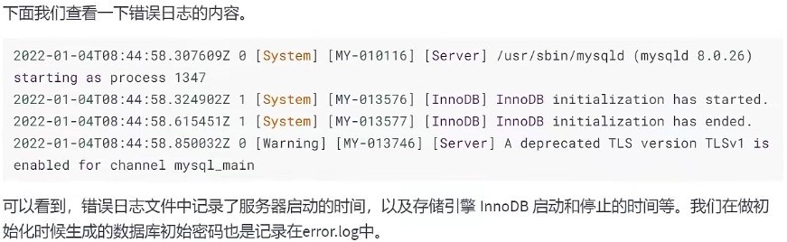

### 4.3 删除\刷新日志

对于很久以前的错误日志，数据库管理员查看这些错误日志的可能性不大，可以将这些错误日志删除， 以保证MySQL服务器上的 `硬盘空间` 。MySQL的错误日志是以文本文件的形式存储在文件系统中的，可以 `直接删除` 。

* 第一步（方式1）：删除操作

  ```mysql
  rm -f /var/lib/mysql/mysqld.log
  ```

  在运行状态下删除错误日志文件后，MySQL并不会自动创建日志文件。

* 第一步（方式2）：重命名文件

  ```mysql
  mv /var/log/mysqld.log /var/log/mysqld.log.old
  ```

* 第二步：重建日志

  ```mysql
  mysqladmin -uroot -p flush-logs
  ```

  可能会报错

  ```mysql
  [root@atguigu01 log]# mysqladmin -uroot -p flush-logs
  Enter password:
  mysqladmin: refresh failed; error: 'Could not open file '/var/log/mysqld.log' for
  error logging.'
  ```

  官网提示：

  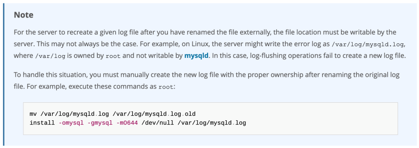

补充操作：

```mysql
install -omysql -gmysql -m0644 /dev/null /var/log/mysqld.log
```


### 4.4 MySQL 8.0 新特性

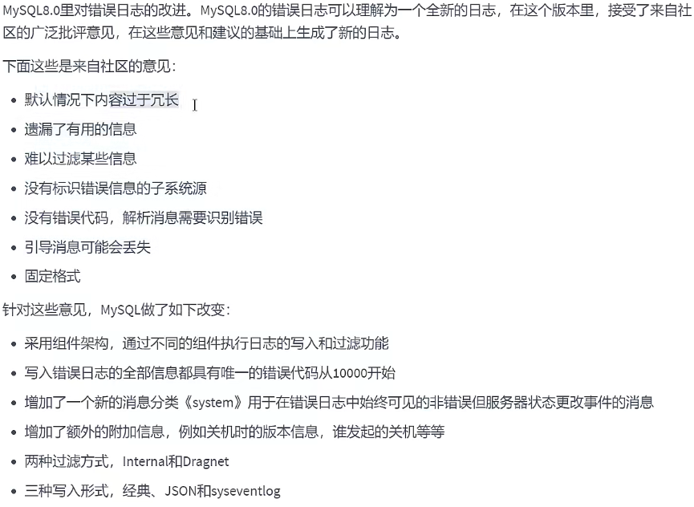

> 小结：
>
> 通常情况下，管理员不需要查看错误日志。但是，MySQL服务器发生异常时，管理员可以从错误日志中找到发生异常的时间、原因，然后根据这些信息来解决异常。

## 5. 二进制日志(bin log)

binlog可以说是MySQL中比较 `重要` 的日志了，在日常开发及运维过程中，经常会遇到。

binlog即binary log，二进制日志文件，也叫作变更日志（update log）。它记录了数据库所有执行的 `DDL` 和 `DML` 等数据库更新事件的语句，但是不包含没有修改任何数据的语句（如数据查询语句select、 show等）。

它以`事件形式`记录并保存在`二进制文件`中。通过这些信息，我们可以再现数据更新操作的全过程。

> 如果想要记录所有语句（例如，为了识别有问题的查询），需要使用通用查询日志。

binlog主要应用场景：

  

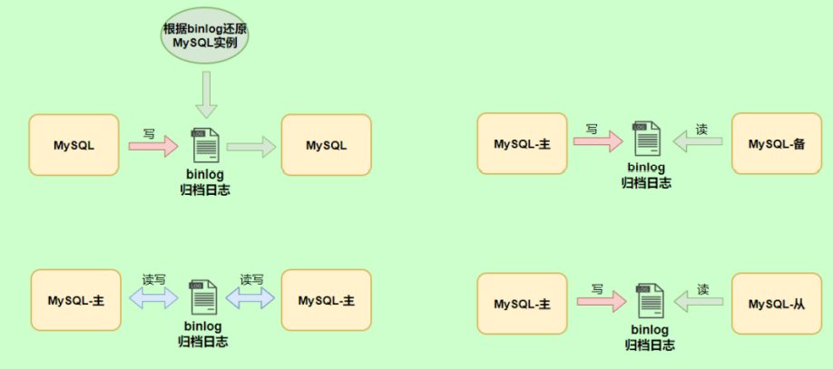

### 5.1 查看默认情况

查看记录二进制日志是否开启：在MySQL8中默认情况下，二进制文件是开启的。

```mysql
mysql> show variables like '%log_bin%';
+---------------------------------+----------------------------------+
| Variable_name                   | Value                            |
+---------------------------------+----------------------------------+
| log_bin                         | ON                               |
| log_bin_basename                | /var/lib/mysql/binlog            |
| log_bin_index                   | /var/lib/mysql/binlog.index      |
| log_bin_trust_function_creators | OFF                              |
| log_bin_use_v1_row_events       | OFF                              |
| sql_log_bin                     | ON                               |
+---------------------------------+----------------------------------+
6 rows in set (0.00 sec)
```


### 5.2 日志参数设置

**方式1：永久性方式**

修改MySQL的 `my.cnf` 或 `my.ini` 文件可以设置二进制日志的相关参数：

```properties
[mysqld]
#启用二进制日志
log-bin=atguigu-bin
binlog_expire_logs_seconds=600
max_binlog_size=100M
```


重新启动MySQL服务，查询二进制日志的信息，执行结果：

```mysql
mysql> show variables like '%log_bin%';
+---------------------------------+----------------------------------+
| Variable_name                   | Value                            |
+---------------------------------+----------------------------------+
| log_bin                         | ON                               |
| log_bin_basename                | /var/lib/mysql/atguigu-bin       |
| log_bin_index                   | /var/lib/mysql/atguigu-bin.index |
| log_bin_trust_function_creators | OFF                              |
| log_bin_use_v1_row_events       | OFF                              |
| sql_log_bin                     | ON                               |
+---------------------------------+----------------------------------+
6 rows in set (0.00 sec)
```

**设置带文件夹的bin-log日志存放目录**

如果想改变日志文件的目录和名称，可以对my.cnf或my.ini中的log_bin参数修改如下：

```properties
[mysqld]
log-bin="/var/lib/mysql/binlog/atguigu-bin"
```

注意：新建的文件夹需要使用mysql用户，使用下面的命令即可。

```mysql
chown -R -v mysql:mysql binlog
```


**方式2：临时性方式**

如果不希望通过修改配置文件并重启的方式设置二进制日志的话，还可以使用如下指令，需要注意的是 在mysql8中只有 `会话级别` 的设置，没有了global级别的设置。

```mysql
# global 级别
mysql> set global sql_log_bin=0;
ERROR 1228 (HY000): Variable 'sql_log_bin' is a SESSION variable and can`t be used
with SET GLOBAL

# session级别
mysql> SET sql_log_bin=0;
Query OK, 0 rows affected (0.01 秒)
```

### 5.3 查看日志

当MySQL创建二进制日志文件时，先创建一个以“filename”为名称、以“.index”为后缀的文件，再创建一 个以“filename”为名称、以“.000001”为后缀的文件。

MySQL服务 `重新启动一次` ，以“.000001”为后缀的文件就会增加一个，并且后缀名按1递增。即日志文件的 个数与MySQL服务启动的次数相同；如果日志长度超过了 `max_binlog_size` 的上限（默认是1GB），就会创建一个新的日志文件。

查看当前的二进制日志文件列表及大小。指令如下：

```mysql
mysql> SHOW BINARY LOGS;
+--------------------+-----------+-----------+
| Log_name           | File_size | Encrypted |
+--------------------+-----------+-----------+
| atguigu-bin.000001 | 156       | No        |
+--------------------+-----------+-----------+
1 行于数据集 (0.02 秒)
```

所有对数据库的修改都会记录在binlog中。但binlog是二进制文件，无法直接查看，想要更直观的观测它就要借助`mysqlbinlog`命令工具了。指令如下：在查看执行，先执行一条SQL语句，如下

```mysql
update student set name='张三_back' where id=1;
```

开始查看binlog

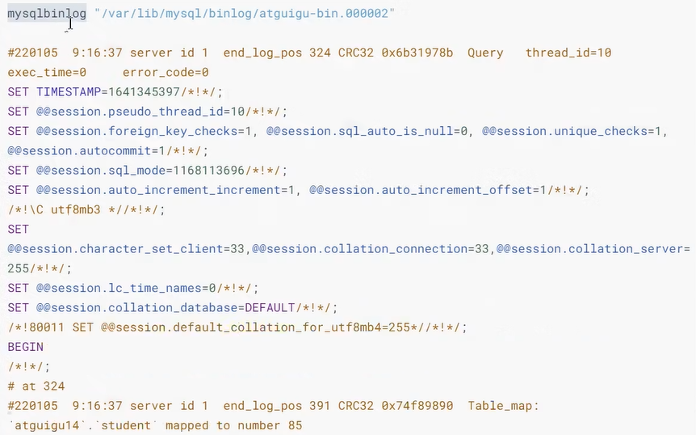


```mysql
mysqlbinlog -v "/var/lib/mysql/binlog/atguigu-bin.000002"
#220105 9:16:37 server id 1 end_log_pos 324 CRC32 0x6b31978b Query thread_id=10
exec_time=0 error_code=0
SET TIMESTAMP=1641345397/*!*/;
SET @@session.pseudo_thread_id=10/*!*/;
SET @@session.foreign_key_checks=1, @@session.sql_auto_is_null=0,
@@session.unique_checks=1, @@session.autocommit=1/*!*/;
SET @@session.sql_mode=1168113696/*!*/;
SET @@session.auto_increment_increment=1, @@session.auto_increment_offset=1/*!*/;
/*!\C utf8mb3 *//*!*/;
SET
@@session.character_set_client=33,@@session.collation_connection=33,@@session.collatio
n_server=255/*!*/;
SET @@session.lc_time_names=0/*!*/;
SET @@session.collation_database=DEFAULT/*!*/;
/*!80011 SET @@session.default_collation_for_utf8mb4=255*//*!*/;
BEGIN
/*!*/;
# at 324
#220105 9:16:37 server id 1 end_log_pos 391 CRC32 0x74f89890 Table_map:
`atguigu14`.`student` mapped to number 85
# at 391
#220105 9:16:37 server id 1 end_log_pos 470 CRC32 0xc9920491 Update_rows: table id
85 flags: STMT_END_F

BINLOG '
dfHUYRMBAAAAQwAAAIcBAAAAAFUAAAAAAAEACWF0Z3VpZ3UxNAAHc3R1ZGVudAADAw8PBDwAHgAG
AQEAAgEhkJj4dA==
dfHUYR8BAAAATwAAANYBAAAAAFUAAAAAAAEAAgAD//8AAQAAAAblvKDkuIkG5LiA54+tAAEAAAAL
5byg5LiJX2JhY2sG5LiA54+tkQSSyQ==
'/*!*/;
### UPDATE `atguigu`.`student`
### WHERE
### @1=1
### @2='张三'
### @3='一班'
### SET
### @1=1
### @2='张三_back'
### @3='一班'
# at 470
#220105 9:16:37 server id 1 end_log_pos 501 CRC32 0xca01d30f Xid = 15
COMMIT/*!*/;
```

前面的命令同时显示binlog格式的语句，使用如下命令不显示它

```mysql
mysqlbinlog -v --base64-output=DECODE-ROWS "/var/lib/mysql/binlog/atguigu-bin.000002"
#220105 9:16:37 server id 1 end_log_pos 324 CRC32 0x6b31978b Query thread_id=10
exec_time=0 error_code=0
SET TIMESTAMP=1641345397/*!*/;
SET @@session.pseudo_thread_id=10/*!*/;
SET @@session.foreign_key_checks=1, @@session.sql_auto_is_null=0,
@@session.unique_checks=1, @@session.autocommit=1/*!*/;
SET @@session.sql_mode=1168113696/*!*/;
SET @@session.auto_increment_increment=1, @@session.auto_increment_offset=1/*!*/;
/*!\C utf8mb3 *//*!*/;
SET
@@session.character_set_client=33,@@session.collation_connection=33,@@session.collatio
n_server=255/*!*/;
SET @@session.lc_time_names=0/*!*/;
SET @@session.collation_database=DEFAULT/*!*/;
/*!80011 SET @@session.default_collation_for_utf8mb4=255*//*!*/;
BEGIN
/*!*/;
# at 324
#220105 9:16:37 server id 1 end_log_pos 391 CRC32 0x74f89890 Table_map:
`atguigu14`.`student` mapped to number 85
# at 391
#220105 9:16:37 server id 1 end_log_pos 470 CRC32 0xc9920491 Update_rows: table id
85 flags: STMT_END_F
### UPDATE `atguigu14`.`student`
### WHERE
### @1=1
### @2='张三'
### @3='一班'
### SET
### @1=1
### @2='张三_back'
### @3='一班'
# at 470
#220105 9:16:37 server id 1 end_log_pos 501 CRC32 0xca01d30f Xid = 15
```

关于mysqlbinlog工具的使用技巧还有很多，例如只解析对某个库的操作或者某个时间段内的操作等。简单分享几个常用的语句，更多操作可以参考官方文档。

```mysql
# 可查看参数帮助
mysqlbinlog --no-defaults --help
# 查看最后100行
mysqlbinlog --no-defaults --base64-output=decode-rows -vv atguigu-bin.000002 |tail
-100
# 根据position查找
mysqlbinlog --no-defaults --base64-output=decode-rows -vv atguigu-bin.000002 |grep -A
20 '4939002'
```

上面这种办法读取出binlog日志的全文内容比较多，不容易分辨查看到pos点信息，下面介绍一种更为方便的查询命令：

```mysql
mysql> show binlog events [IN 'log_name'] [FROM pos] [LIMIT [offset,] row_count];
```

* `IN 'log_name'` ：指定要查询的binlog文件名（不指定就是第一个binlog文件）　 
* `FROM pos` ：指定从哪个pos起始点开始查起（不指定就是从整个文件首个pos点开始算） 
* `LIMIT [offset]` ：偏移量(不指定就是0) 
* `row_count` :查询总条数（不指定就是所有行）

```mysql
mysql> show binlog events in 'atguigu-bin.000002';
+--------------------+-----+----------------+-----------+-------------+--------------------------------------------------------+
| Log_name           | Pos | Event_type     | Server_id | End_log_pos | Info                                                   |
+--------------------+-----+----------------+-----------+-------------+--------------------------------------------------------+
| atguigu-bin.000002 | 4   | Format_desc    | 1         | 125         | Server ver: 8.0.26, Binlog ver: 4                      |
| atguigu-bin.000002 | 125 | Previous_gtids | 1         | 156         |                                                        |
| atguigu-bin.000002 | 156 | Anonymous_Gtid | 1         | 235         | SET @@SESSION.GTID_NEXT= 'ANONYMOUS'                   |
| atguigu-bin.000002 | 235 | Query          | 1         | 324         | BEGIN                                                  |
| atguigu-bin.000002 | 324 | Table_map      | 1         | 391         | table_id: 85(atguigu14.student)                        |
| atguigu-bin.000002 | 391 | Update_rows    | 1         | 470         | table_id: 85flags: STMT_END_F                          |
| atguigu-bin.000002 | 470 | Xid            | 1         | 501         | COMMIT /*xid=15 */                                     |
| atguigu-bin.000002 | 501 | Anonymous_Gtid | 1         | 578         | SET @@SESSION.GTID_NEXT= 'ANONYMOUS'                   |
| atguigu-bin.000002 | 578 | Query     | 1 | 721 | use `atguigu14`; create table test(id int, title varchar(100)) /* xid=19 */ |
| atguigu-bin.000002 | 721 | Anonymous_Gtid | 1         | 800         | SET @@SESSION.GTID_NEXT= 'ANONYMOUS'                   |
| atguigu-bin.000002 | 800 | Query          | 1         | 880         | BEGIN                                                  |
| atguigu-bin.000002 | 880 | Table_map      | 1         | 943         | table_id: 89(atguigu14.test)                           |
| atguigu-bin.000002 | 943 | Write_rows     | 1         | 992         | table_id: 89 flags: STMT_END_F                         |
| atguigu-bin.000002 | 992 | Xid            | 1         | 1023        | COMMIT /*xid=21 */                                     |
+--------------------+-----+----------------+-----------+-------------+--------------------------------------------------------+
14 行于数据集 (0.02 秒)
```

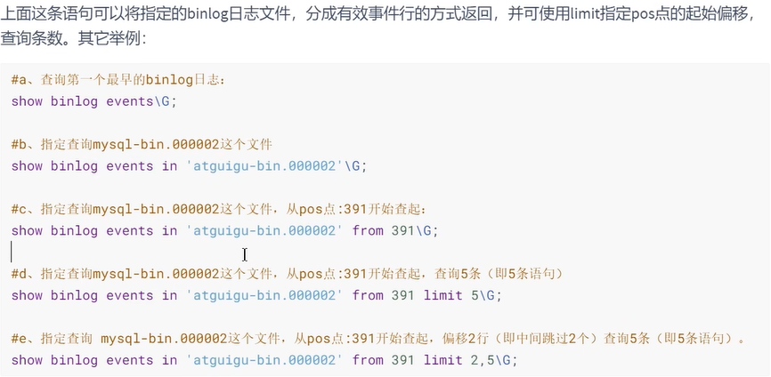

上面我们讲了这么多都是基于binlog的默认格式，binlog格式查看

```mysql
mysql> show variables like 'binlog_format';
+---------------+-------+
| Variable_name | Value |
+---------------+-------+
| binlog_format | ROW   |
+---------------+-------+
1 行于数据集 (0.02 秒)
```

除此之外，binlog还有2种格式，分别是`Statement`和`Mixed`

* Statement

  每一条会修改数据的sql都会记录在binlog中。

  优点：不需要记录每一行的变化，减少了binlog日志量，节约了IO，提高性能。

* Row

  5.1.5版本的MySQL才开始支持row level 的复制，它不记录sql语句上下文相关信息，仅保存哪条记录被修改。

  优点：row level 的日志内容会非常清楚的记录下每一行数据修改的细节。而且不会出现某些特定情况下 的存储过程，或function，以及trigger的调用和触发无法被正确复制的问题。

* Mixed

  从5.1.8版本开始，MySQL提供了Mixed格式，实际上就是Statement与Row的结合。

  详细情况，下章讲解。

### 5.4 使用日志恢复数据

如果MySQL服务器启用了二进制日志，在数据库出现意外丢失数据时，可以使用MySQLbinlog工具从指定的时间点开始（例如，最后一次备份）直到现在或另一个指定的时间点的日志中回复数据。

mysqlbinlog恢复数据的语法如下：

```mysql
mysqlbinlog [option] filename|mysql –uuser -ppass;
```

这个命令可以这样理解：使用mysqlbinlog命令来读取filename中的内容，然后使用mysql命令将这些内容恢复到数据库中。

* `filename` ：是日志文件名。

* `option` ：可选项，比较重要的两对option参数是--start-date、--stop-date 和 --start-position、-- stop-position。
  * `--start-date` 和` --stop-date` ：可以指定恢复数据库的起始时间点和结束时间点。
  * `--start-position`和`--stop-position` ：可以指定恢复数据的开始位置和结束位置。

> 注意：使用mysqlbinlog命令进行恢复操作时，必须是编号小的先恢复，例如atguigu-bin.000001必须在atguigu-bin.000002之前恢复。

详见p189，由于翻页过快，这部分没办法记录。

### 5.5 删除二进制日志

MySQL的二进制文件可以配置自动删除，同时MySQL也提供了安全的手动删除二进制文件的方法。 `PURGE MASTER LOGS` 只删除指定部分的二进制日志文件， `RESET MASTER` 删除所有的二进制日志文 件。具体如下：

**1. PURGE MASTER LOGS：删除指定日志文件**

PURGE MASTER LOGS语法如下：

```mysql
PURGE {MASTER | BINARY} LOGS TO ‘指定日志文件名’
PURGE {MASTER | BINARY} LOGS BEFORE ‘指定日期’
```


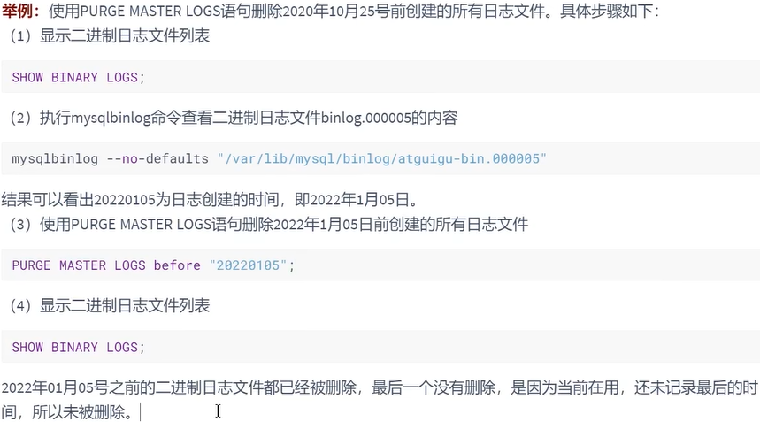

**2. RESET MASTER: 删除所有二进制日志文件**


### 5.6 其它场景

二进制日志可以通过数据库的 `全量备份` 和二进制日志中保存的 `增量信息` ，完成数据库的 `无损失恢复` 。 但是，如果遇到数据量大、数据库和数据表很多（比如分库分表的应用）的场景，用二进制日志进行数据恢复，是很有挑战性的，因为起止位置不容易管理。

在这种情况下，一个有效的解决办法是 `配置主从数据库服务器` ，甚至是 `一主多从` 的架构，把二进制日志文件的内容通过中继日志，同步到从数据库服务器中，这样就可以有效避免数据库故障导致的数据异常等问题。

## 6. 再谈二进制日志(binlog)

### 6.1 写入机制

binlog的写入时机也非常简单，事务执行过程中，先把日志写到 `binlog cache` ，事务提交的时候，再把binlog cache写到binlog文件中。因为一个事务的binlog不能被拆开，无论这个事务多大，也要确保一次性写入，所以系统会给每个线程分配一个块内存作为binlog cache。

我们可以通过`binlog_cache_size`参数控制单个线程 binlog cache 大小，如果存储内容超过了这个参数，就要暂存到磁盘（Swap）。binlog日志刷盘流程如下：

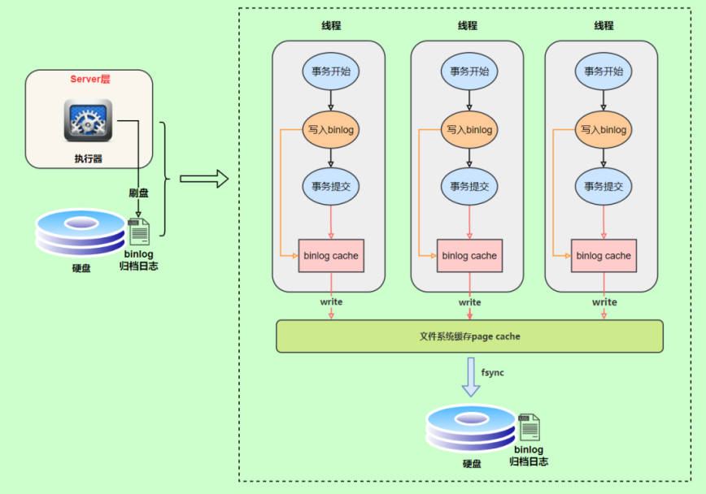

> * 上图的write，是指把日志写入到文件系统的page cache，并没有把数据持久化到磁盘，所以速度比较快
> * 上图的fsync，才是将数据持久化到磁盘的操作

write和fsync的时机，可以由参数 `sync_binlog` 控制，默认是 `0` 。为0的时候，表示每次提交事务都只 write，由系统自行判断什么时候执行fsync。虽然性能得到提升，但是机器宕机，page cache里面的 binglog 会丢失。如下图：

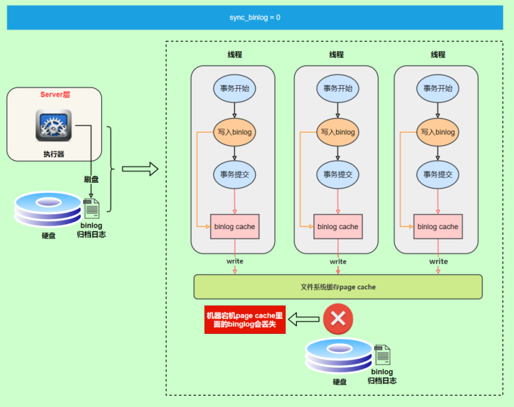

为了安全起见，可以设置为 `1` ，表示每次提交事务都会执行fsync，就如同**redo log 刷盘流程**一样。 最后还有一种折中方式，可以设置为N(N>1)，表示每次提交事务都write，但累积N个事务后才fsync。

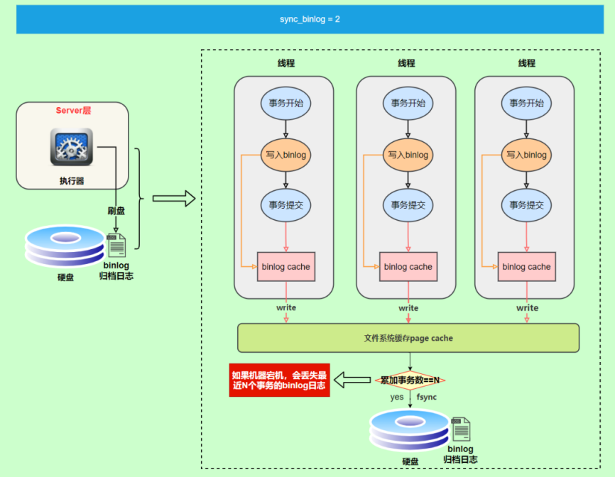

在出现IO瓶颈的场景里，将sync_binlog设置成一个比较大的值，可以提升性能。同样的，如果机器宕机，会丢失最近N个事务的binlog日志。

### 6.2 binlog与redolog对比

* redo log 它是 `物理日志` ，记录内容是“在某个数据页上做了什么修改”，属于 InnoDB 存储引擎层产生的。
* 而 binlog 是 `逻辑日志` ，记录内容是语句的原始逻辑，类似于“给 ID=2 这一行的 c 字段加 1”，属于 MySQL Server 层。
* 虽然它们都属于持久化的保证，但是侧重点不同。
  * redo log让InnoDB存储引擎拥有了崩溃恢复能力。
  * binlog保证了MySQL集群架构的数据一致性。

### 6.3 两阶段提交

在执行更新语句过程，会记录redo log与binlog两块日志，以基本的事务为单位，redo log在事务执行过程中可以不断写入，而binlog只有在提交事务时才写入，所以redo log与binlog的 `写入时机` 不一样。

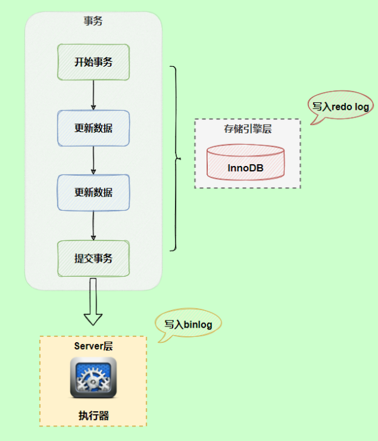

**redo log与binlog两份日志之间的逻辑不一致，会出现什么问题？**

以update语句为例，假设`id=2`的记录，字段`c`值是`0`，把字段c值更新为`1`，SQL语句为update T set c = 1 where id = 2。

假设执行过程中写完redo log日志后，binlog日志写期间发生了异常，会出现什么情况呢？


由于binlog没写完就异常，这时候binlog里面没有对应的修改记录。因此，之后用binlog日志恢复数据时，就会少这一次更新，恢复出来的这一行c值为0，而原库因为redo log日志恢复，这一行c的值是1，最终数据不一致。

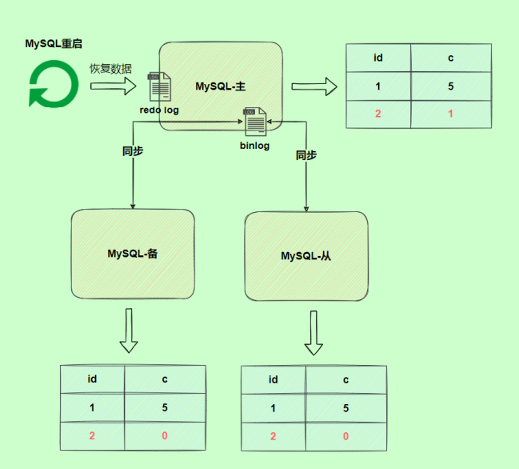

为了解决两份日志之间的逻辑一致问题，InnoDB存储引擎使用**两阶段提交**方案。原理很简单，将redo log的写入拆成了两个步骤prepare和commit，这就是**两阶段提交**。

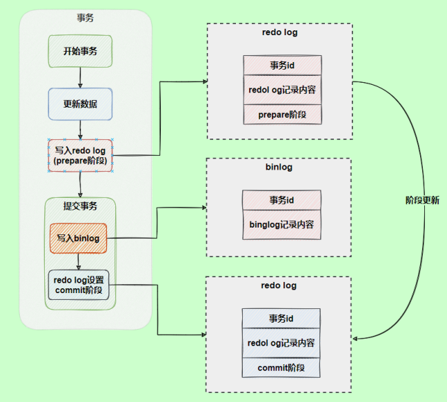

使用两阶段提交后，写入binlog时发生异常也不会有影响，因为MySQL根据redo log日志恢复数据时，发现redo log还处于prepare阶段，并且没有对应binlog日志，就会回滚该事务。

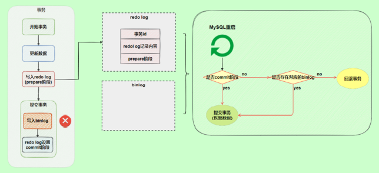

另一个场景，redo log设置commit阶段发生异常，那会不会回滚事务呢？


并不会回滚事务，它会执行上图框住的逻辑，虽然redo log是处于prepare阶段，但是能通过事务id找到对应的binlog日志，所以MySQL认为是完整的，就会提交事务恢复数据。

## 7. 中继日志(relay log)

### 7.1 介绍

**中继日志只在主从服务器架构的从服务器上存在**。从服务器为了与主服务器保持一致，要从主服务器读取二进制日志的内容，并且把读取到的信息写入 `本地的日志文件` 中，这个从服务器本地的日志文件就叫 `中继日志` 。然后，从服务器读取中继日志，并根据中继日志的内容对从服务器的数据进行更新，完成主 从服务器的 数据同步 。

搭建好主从服务器之后，中继日志默认会保存在从服务器的数据目录下。

文件名的格式是：` 从服务器名 -relay-bin.序号` 。中继日志还有一个索引文件：`从服务器名 -relaybin.index` ，用来定位当前正在使用的中继日志。

### 7.2 查看中继日志

中继日志与二进制日志的格式相同，可以用 `mysqlbinlog` 工具进行查看。下面是中继日志的一个片段：

```mysql
SET TIMESTAMP=1618558728/*!*/;
BEGIN
/*!*/;
# at 950
#210416 15:38:48 server id 1 end_log_pos 832 CRC32 0xcc16d651 Table_map:
`atguigu`.`test` mapped to number 91
# at 1000
#210416 15:38:48 server id 1 end_log_pos 872 CRC32 0x07e4047c Delete_rows: table id
91 flags: STMT_END_F -- server id 1 是主服务器，意思是主服务器删了一行数据
BINLOG '
CD95YBMBAAAAMgAAAEADAAAAAFsAAAAAAAEABGRlbW8ABHRlc3QAAQMAAQEBAFHWFsw=
CD95YCABAAAAKAAAAGgDAAAAAFsAAAAAAAEAAgAB/wABAAAAfATkBw==
'/*!*/;
# at 1040
```

这一段的意思是，主服务器（“server id 1”）对表 atguigu.test 进行了 2 步操作：

```mysql
定位到表 atguigu.test 编号是 91 的记录，日志位置是 832；
删除编号是 91 的记录，日志位置是 872
```

### 7.3 恢复的典型错误

如果从服务器宕机，有的时候为了系统恢复，要重装操作系统，这样就可能会导致你的 `服务器名称` 与之前 `不同` 。而中继日志里是 `包含从服务器名` 的。在这种情况下，就可能导致你恢复从服务器的时候，无法 从宕机前的中继日志里读取数据，以为是日志文件损坏了，其实是名称不对了。

解决的方法也很简单，把从服务器的名称改回之前的名称。

# 第18章_主从复制

## 1. 主从复制概述

### 1.1 如何提升数据库并发能力

在实际工作中，我们常常将`Redis`作为缓存与`MySQL`配合来使用，当有请求的时候，首先会从缓存中进行查找，如果存在就直接取出。如果不存在再访问数据库，这样就`提升了读取的效率`，也减少了对后端数据库的`访问压力`。Redis的缓存架构是`高并发架构`中非常重要的一环。

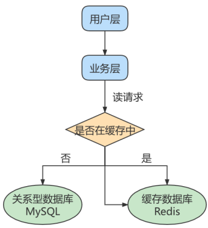

此外，一般应用对数据库而言都是“ `读多写少` ”，也就说对数据库读取数据的压力比较大，有一个思路就是采用数据库集群的方案，做 `主从架构` 、进行 `读写分离` ，这样同样可以提升数据库的并发处理能力。但并不是所有的应用都需要对数据库进行主从架构的设置，毕竟设置架构本身是有成本的。

如果我们的目的在于提升数据库高并发访问的效率，那么首先考虑的是如何 `优化SQL和索引` ，这种方式 简单有效；其次才是采用 `缓存的策略` ，比如使用 Redis将热点数据保存在内存数据库中，提升读取的效率；最后才是对数据库采用 `主从架构` ，进行读写分离。

按照上面的方式进行优化，使用和维护的成本是由低到高的。

### 1.2 主从复制的作用

主从同步设计不仅可以提高数据库的吞吐量，还有以下 3 个方面的作用。

**第1个作用：读写分离。**我们可以通过主从复制的方式来`同步数据`，然后通过读写分离提高数据库并发处理能力。

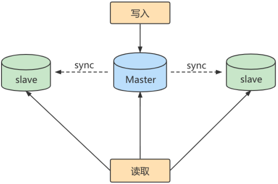

其中一个是Master主库，负责写入数据，我们称之为：写库。

其他都是Slave从库，负责读取数据，我们称之为：读库。

当主库进行更新的时候，会自动将数据复制到从库中，而我们在客户端读取数据的时候，会从从库进行读取。

面对“读多写少”的需求，采用读写分离的方式，可以实现`更高的并发访问`。同时，我们还能对从服务器进行`负载均衡`，让不同的读请求按照策略均匀地分发到不同的从服务器上，让`读取更加顺畅`。读取顺畅的另一个原因，就是`减少了锁表`的影响，比如我们让主库负责写，当主库出现写锁的时候，不会影响到从库进行SELECT的读取。

**第2个作用就是数据备份。**我们通过主从复制将主库上的数据复制到从库上，相当于一种`热备份机制`，也就是在主库正常运行的情况下进行的备份，不会影响到服务。

**第3个作用是具有高可用性。**数据备份实际上是一种冗余的机制，通过这种冗余的方式可以换取数据库的高可用性，也就是当服务器出现故障或宕机的情况下，可以切换到从服务器上，保证服务的正常运行。


## 2. 主从复制的原理

`Slave` 会从 `Master` 读取 `binlog` 来进行数据同步。

### 2.1 原理剖析

**三个线程**

实际上主从同步的原理就是基于 binlog 进行数据同步的。在主从复制过程中，会基于 `3 个线程` 来操 作，一个主库线程，两个从库线程。

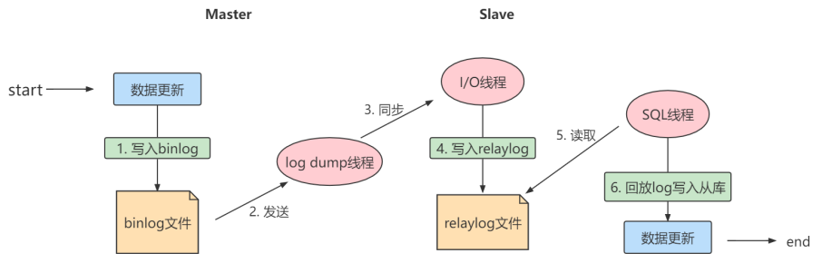

`二进制日志转储线程` （Binlog dump thread）是一个主库线程。当从库线程连接的时候， 主库可以将二进 制日志发送给从库，当主库读取事件（Event）的时候，会在 Binlog 上 `加锁` ，读取完成之后，再将锁释放掉。

`从库 I/O 线程` 会连接到主库，向主库发送请求更新 Binlog。这时从库的 I/O 线程就可以读取到主库的二进制日志转储线程发送的 Binlog 更新部分，并且拷贝到本地的中继日志 （Relay log）。

`从库 SQL 线程` 会读取从库中的中继日志，并且执行日志中的事件，将从库中的数据与主库保持同步。

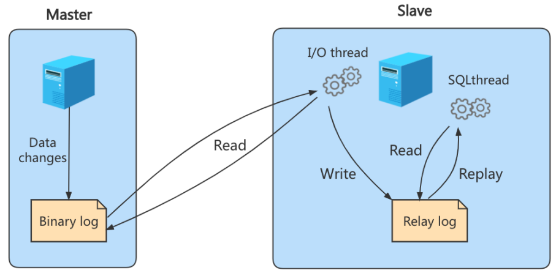

> 注意：
>
> 不是所有版本的MySQL都默认开启服务器的二进制日志。在进行主从同步的时候，我们需要先检查服务器是否已经开启了二进制日志。
>
> 除非特殊指定，默认情况下从服务器会执行所有主服务器中保存的事件。也可以通过配置，使从服务器执行特定的事件。

**复制三步骤**

步骤1： `Master` 将写操作记录到二进制日志（ `binlog` ）。

步骤2： `Slave` 将 `Master` 的binary log events拷贝到它的中继日志（ `relay log` ）；

步骤3： `Slave` 重做中继日志中的事件，将改变应用到自己的数据库中。 MySQL复制是异步的且串行化的，而且重启后从 `接入点` 开始复制。

**复制的问题**

复制的最大问题： `延时`

### 2.2 复制的基本原则

* 每个 `Slave` 只有一个 `Master`
* 每个 `Slave` 只能有一个唯一的服务器ID
* 每个 `Master` 可以有多个 `Slave`

## 3. 一主一从架构搭建

一台 `主机` 用于处理所有 `写请求` ，一台 `从机` 负责所有 `读请求` ，架构图如下:

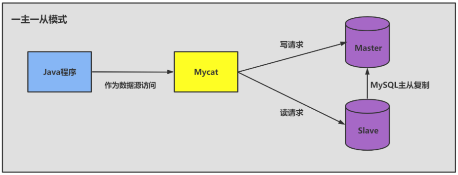

### 3.1 准备工作

1、准备 2台 CentOS 虚拟机 （具体设置内容在P192）

2、每台虚拟机上需要安装好MySQL (可以是MySQL8.0 )

说明：前面我们讲过如何克隆一台CentOS。大家可以在一台CentOS上安装好MySQL，进而通过克隆的方式复制出1台包含MySQL的虚拟机。

注意：克隆的方式需要修改新克隆出来主机的：① `MAC地址` ② `hostname` ③` IP 地址` ④ `UUID` 。

此外，克隆的方式生成的虚拟机（包含MySQL Server），则克隆的虚拟机MySQL Server的UUID相同，必须修改，否则在有些场景会报错。比如： `show slave status\G` ，报如下的错误：

```mysql
Last_IO_Error: Fatal error: The slave I/O thread stops because master and slave have
equal MySQL server UUIDs; these UUIDs must be different for replication to work.
```

修改MySQL Server 的UUID方式：

```mysql
vim /var/lib/mysql/auto.cnf

systemctl restart mysqld
```

### 3.2 主机配置文件

建议mysql版本一致且后台以服务运行，主从所有配置项都配置在 `[mysqld]` 节点下，且都是小写字母。

具体参数配置如下：

* 必选

```properties
#[必须]主服务器唯一ID
server-id=1

#[必须]启用二进制日志,指名路径。比如：自己本地的路径/log/mysqlbin
log-bin=atguigu-bin
```

* 可选

```properties
#[可选] 0（默认）表示读写（主机），1表示只读（从机）
read-only=0

#设置日志文件保留的时长，单位是秒
binlog_expire_logs_seconds=6000

#控制单个二进制日志大小。此参数的最大和默认值是1GB
max_binlog_size=200M

#[可选]设置不要复制的数据库
binlog-ignore-db=test

#[可选]设置需要复制的数据库,默认全部记录。比如：binlog-do-db=atguigu_master_slave
binlog-do-db=需要复制的主数据库名字

#[可选]设置binlog格式
binlog_format=STATEMENT
```

**binlog格式设置：**

格式1： `STATEMENT模式` （基于SQL语句的复制(statement-based replication, SBR)）

```properties
binlog_format=STATEMENT
```

每一条会修改数据的sql语句会记录到binlog中。这是默认的binlog格式。

