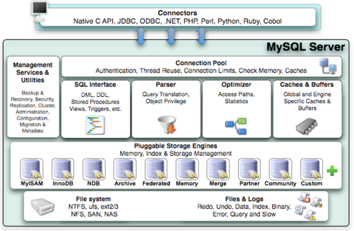
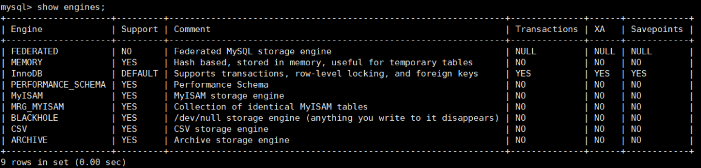
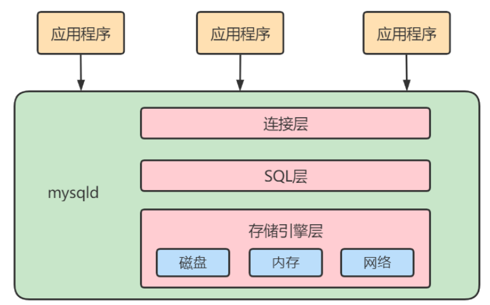
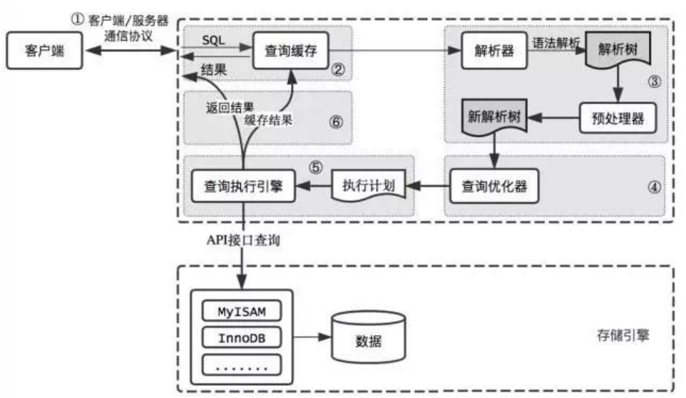
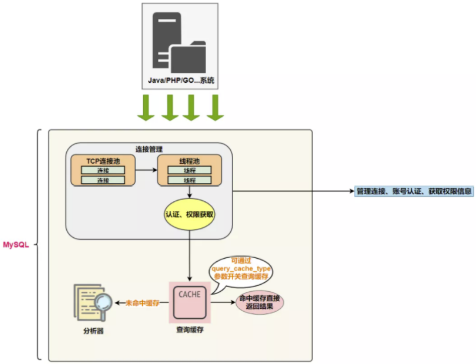

# 第04章_逻辑架构

## 1. 逻辑架构剖析

### 1.1 服务器处理客户端请求

首先MySQL是典型的C/S架构，即`Clinet/Server 架构`，服务端程序使用的mysqld。

不论客户端进程和服务器进程是采用哪种方式进行通信，最后实现的效果是：**客户端进程向服务器进程发送一段文本（SQL语句），服务器进程处理后再向客户端进程发送一段文本（处理结果）**。

那服务器进程对客户端进程发送的请求做了什么处理，才能产生最后的处理结果呢？这里以查询请求为 例展示：


下面具体展开如下：



### 1.2 Connectors

Connectors, 指的是不同语言中与SQL的交互。MySQL首先是一个网络程序，在TCP之上定义了自己的应用层协议。所以要使用MySQL，我们可以编写代码，跟MySQL Server `建立TCP连接`，之后按照其定义好的协议进行交互。或者比较方便的方法是调用SDK，比如Native C API、JDBC、PHP等各语言MySQL Connecotr,或者通过ODBC。但**通过SDK来访问MySQL，本质上还是在TCP连接上通过MySQL协议跟MySQL进行交互**

**接下来的MySQL Server结构可以分为如下三层：**

### 1.3 第一层：连接层

系统（客户端）访问 MySQL 服务器前，做的第一件事就是建立 TCP 连接。 经过三次握手建立连接成功后， MySQL 服务器对 TCP 传输过来的账号密码做身份认证、权限获取。

* 用户名或密码不对，会收到一个Access denied for user错误，客户端程序结束执行 
* 用户名密码认证通过，会从权限表查出账号拥有的权限与连接关联，之后的权限判断逻辑，都将依赖于此时读到的权限

TCP 连接收到请求后，必须要分配给一个线程专门与这个客户端的交互。所以还会有个线程池，去走后面的流程。每一个连接从线程池中获取线程，省去了创建和销毁线程的开销。

所以**连接管理**的职责是负责认证、管理连接、获取权限信息。

### 1.4 第二层：服务层

第二层架构主要完成大多数的核心服务功能，如SQL接口，并完成`缓存的查询`，SQL的分析和优化及部分内置函数的执行。所有跨存储引擎的功能也在这一层实现，如过程、函数等。

在该层，服务器会`解析查询`并创建相应的内部`解析树`，并对其完成相应的`优化`：如确定查询表的顺序，是否利用索引等，最后生成相应的执行操作。

如果是SELECT语句，服务器还会`查询内部的缓存`。如果缓存空间足够大，这样在解决大量读操作的环境中能够很好的提升系统的性能。

* SQL Interface: SQL接口 

  * 接收用户的SQL命令，并且返回用户需要查询的结果。比如SELECT ... FROM就是调用SQL Interface 
  * MySQL支持DML（数据操作语言）、DDL（数据定义语言）、存储过程、视图、触发器、自定 义函数等多种SQL语言接口

* Parser: 解析器

  * 在解析器中对 SQL 语句进行语法分析、语义分析。将SQL语句分解成数据结构，并将这个结构 传递到后续步骤，以后SQL语句的传递和处理就是基于这个结构的。如果在分解构成中遇到错 误，那么就说明这个SQL语句是不合理的。 
  * 在SQL命令传递到解析器的时候会被解析器验证和解析，并为其创建 语法树 ，并根据数据字 典丰富查询语法树，会 验证该客户端是否具有执行该查询的权限 。创建好语法树后，MySQL还 会对SQl查询进行语法上的优化，进行查询重写。

* Optimizer: 查询优化器

  * SQL语句在语法解析之后、查询之前会使用查询优化器确定 SQL 语句的执行路径，生成一个 执行计划 。 
  * 这个执行计划表明应该 使用哪些索引 进行查询（全表检索还是使用索引检索），表之间的连 接顺序如何，最后会按照执行计划中的步骤调用存储引擎提供的方法来真正的执行查询，并将 查询结果返回给用户。
  * 它使用“ 选取-投影-连接 ”策略进行查询。例如：

  ```mysql
  SELECT id,name FROM student WHERE gender = '女';
  ```

  这个SELECT查询先根据WHERE语句进行 选取 ，而不是将表全部查询出来以后再进行gender过 滤。 这个SELECT查询先根据id和name进行属性 投影 ，而不是将属性全部取出以后再进行过 滤，将这两个查询条件 连接 起来生成最终查询结果。

* Caches & Buffers： 查询缓存组件

  * MySQL内部维持着一些Cache和Buffer，比如Query Cache用来缓存一条SELECT语句的执行结 果，如果能够在其中找到对应的查询结果，那么就不必再进行查询解析、优化和执行的整个过 程了，直接将结果反馈给客户端。 
  * 这个缓存机制是由一系列小缓存组成的。比如表缓存，记录缓存，key缓存，权限缓存等 。 这个查询缓存可以在 不同客户端之间共享 。 
  * 从MySQL 5.7.20开始，不推荐使用查询缓存，并在 MySQL 8.0中删除 。

### 1.5 第三层：引擎层

插件式存储引擎层（ Storage Engines），**真正的负责了MySQL中数据的存储和提取，对物理服务器级别维护的底层数据执行操作**，服务器通过API与存储引擎进行通信。不同的存储引擎具有的功能不同，这样 我们可以根据自己的实际需要进行选取。

MySQL 8.0.25默认支持的存储引擎如下：



### 1.6 存储层

所有的数据，数据库、表的定义，表的每一行的内容，索引，都是存在文件系统 上，以`文件`的方式存在的，并完成与存储引擎的交互。当然有些存储引擎比如InnoDB，也支持不使用文件系统直接管理裸设备，但现代文件系统的实现使得这样做没有必要了。在文件系统之下，可以使用本地磁盘，可以使用 DAS、NAS、SAN等各种存储系统。

### 1.7 小结

MySQL架构图本节开篇所示。下面为了熟悉SQL执行流程方便，我们可以简化如下：



简化为三层结构： 

1. 连接层：客户端和服务器端建立连接，客户端发送 SQL 至服务器端； 
2. SQL 层（服务层）：对 SQL 语句进行查询处理；与数据库文件的存储方式无关；
3. 存储引擎层：与数据库文件打交道，负责数据的存储和读取。

## 2. SQL执行流程

### 2.1 MySQL中的SQL执行流程



MySQL的查询流程：

1. 查询缓存：Server 如果在查询缓存中发现了这条 SQL 语句，就会直接将结果返回给客户端；如果没 有，就进入到解析器阶段。需要说明的是，因为查询缓存往往效率不高，所以在 MySQL8.0 之后就抛弃了这个功能。

**总之，因为查询缓存往往弊大于利，查询缓存的失效非常频繁。**

一般建议大家在静态表里使用查询缓存，什么叫`静态表`呢？就是一般我们极少更新的表。比如，一个系统配置表、字典表，这张表上的查询才适合使用查询缓存。好在MySQL也提供了这种“`按需使用`”的方式。你可以将 my.cnf 参数 query_cache_type 设置成 DEMAND，代表当 sql 语句中有 SQL_CACHE关键字时才缓存。比如：

```mysql
# query_cache_type 有3个值。 0代表关闭查询缓存OFF，1代表开启ON，2代表(DEMAND)
query_cache_type=2
```

这样对于默认的SQL语句都不使用查询缓存。而对于你确定要使用查询缓存的语句，可以供SQL_CACHE显示指定，像下面这个语句一样：

```mysql
SELECT SQl_CACHE * FROM test WHERE ID=5;
```

查看当前 mysql 实例是否开启缓存机制

```mysql
# MySQL5.7中：
show global variables like "%query_cache_type%";
```

监控查询缓存的命中率：

```mysql
show status like '%Qcache%';
```


运行结果解析：

`Qcache_free_blocks`: 表示查询缓存中海油多少剩余的blocks，如果该值显示较大，则说明查询缓存中的`内部碎片`过多了，可能在一定的时间进行整理。

`Qcache_free_memory`: 查询缓存的内存大小，通过这个参数可以很清晰的知道当前系统的查询内存是否够用，DBA可以根据实际情况做出调整。

`Qcache_hits`: 表示有 `多少次命中缓存`。我们主要可以通过该值来验证我们的查询缓存的效果。数字越大，缓存效果越理想。

2. 解析器：在解析器中对 SQL 语句进行语法分析、语义分析。



