# 第06章_索引的数据结构

## 1. 为什么使用索引

索引是存储引擎用于快速找到数据记录的一种数据结构，就好比一本教科书的目录部分，通过目录中找到对应文章的页码，便可快速定位到需要的文章。MySQL中也是一样的道理，进行数据查找时，首先查看查询条件是否命中某条索引，符合则`通过索引查找`相关数据，如果不符合则需要`全表扫描`，即需要一条一条地查找记录，直到找到与条件符合的记录。

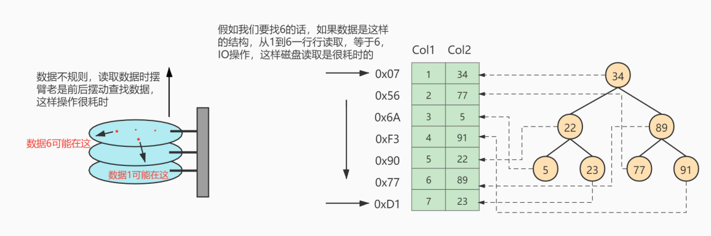

如上图所示，数据库没有索引的情况下，数据`分布在硬盘不同的位置上面`，读取数据时，摆臂需要前后摆动查询数据，这样操作非常消耗时间。如果`数据顺序摆放`，那么也需要从1到6行按顺序读取，这样就相当于进行了6次IO操作，`依旧非常耗时`。如果我们不借助任何索引结构帮助我们快速定位数据的话，我们查找 Col 2 = 89 这条记录，就要逐行去查找、去比较。从Col 2 = 34 开始，进行比较，发现不是，继续下一行。我们当前的表只有不到10行数据，但如果表很大的话，有`上千万条数据`，就意味着要做`很多很多次硬盘I/0`才能找到。现在要查找 Col 2 = 89 这条记录。CPU必须先去磁盘查找这条记录，找到之后加载到内存，再对数据进行处理。这个过程最耗时间就是磁盘I/O（涉及到磁盘的旋转时间（速度较快），磁头的寻道时间(速度慢、费时)）

假如给数据使用 `二叉树` 这样的数据结构进行存储，如下图所示

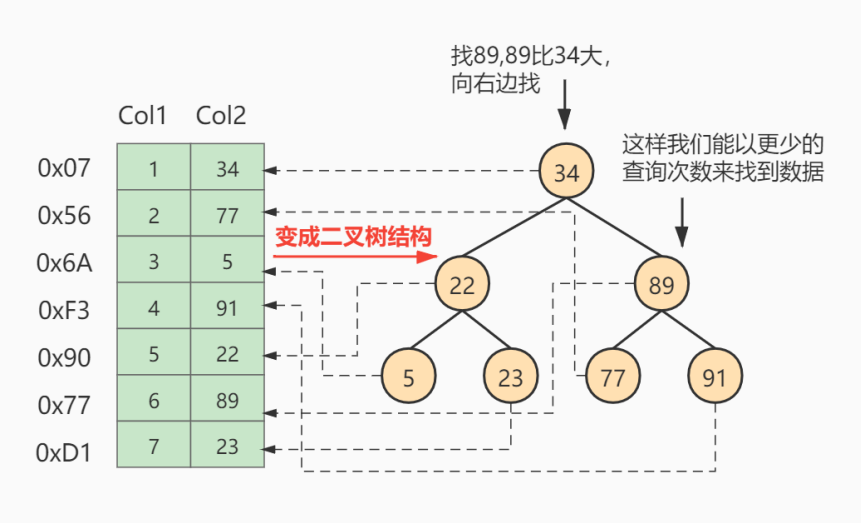

对字段 Col 2 添加了索引，就相当于在硬盘上为 Col 2 维护了一个索引的数据结构，即这个 `二叉搜索树`。二叉搜索树的每个结点存储的是 `(K, V) 结构`，key 是 Col 2，value 是该 key 所在行的文件指针（地址）。比如：该二叉搜索树的根节点就是：`(34, 0x07)`。现在对 Col 2 添加了索引，这时再去查找 Col 2 = 89 这条记录的时候会先去查找该二叉搜索树（二叉树的遍历查找）。读 34 到内存，89 > 34; 继续右侧数据，读 89 到内存，89==89；找到数据返回。找到之后就根据当前结点的 value 快速定位到要查找的记录对应的地址。我们可以发现，只需要 `查找两次` 就可以定位到记录的地址，查询速度就提高了。

这就是我们为什么要建索引，目的就是为了 `减少磁盘I/O的次数`，加快查询速率。

## 2. 索引及其优缺点

### 2.1 索引概述

MySQL官方对索引的定义为：索引（Index）是帮助MySQL高效获取数据的数据结构。

**索引的本质**：索引是数据结构。你可以简单理解为“排好序的快速查找数据结构”，满足特定查找算法。 这些数据结构以某种方式指向数据， 这样就可以在这些数据结构的基础上实现 `高级查找算法` 。

`索引是在存储引擎中实现的`，因此每种存储引擎的索引不一定完全相同，并且每种存储引擎不一定支持所有索引类型。同时，存储引擎可以定义每个表的 `最大索引数`和 `最大索引长度`。所有存储引擎支持每个表至少16个索引，总索引长度至少为256字节。有些存储引擎支持更多的索引数和更大的索引长度。

### 2.2 优点

（1）类似大学图书馆建书目索引，提高数据检索的效率，降低 **数据库的IO成本** ，这也是创建索引最主 要的原因。 

（2）通过创建唯一索引，可以保证数据库表中每一行 **数据的唯一性** 。 

（3）在实现数据的 参考完整性方面，可以 **加速表和表之间的连接** 。换句话说，对于有依赖关系的子表和父表联合查询时， 可以提高查询速度。 

（4）在使用分组和排序子句进行数据查询时，可以显著 **减少查询中分组和排序的时间** ，降低了CPU的消耗。

### 2.3 缺点 

增加索引也有许多不利的方面，主要表现在如下几个方面： 

（1）创建索引和维护索引要 **耗费时间** ，并 且随着数据量的增加，所耗费的时间也会增加。 

（2）索引需要占 **磁盘空间** ，除了数据表占数据空间之 外，每一个索引还要占一定的物理空间， 存储在磁盘上 ，如果有大量的索引，索引文件就可能比数据文 件更快达到最大文件尺寸。 

（3）虽然索引大大提高了查询速度，同时却会 **降低更新表的速度** 。当对表 中的数据进行增加、删除和修改的时候，索引也要动态地维护，这样就降低了数据的维护速度。 因此，选择使用索引时，需要综合考虑索引的优点和缺点。

因此，选择使用索引时，需要综合考虑索引的优点和缺点。

> 提示：
>
> 索引可以提高查询的速度，但是会影响插入记录的速度。这种情况下，最好的办法是先删除表中的索引，然后插入数据，插入完成后再创建索引。

## 3. InnoDB中索引的推演

### 3.1 索引之前的查找

先来看一个精确匹配的例子：

```mysql
SELECT [列名列表] FROM 表名 WHERE 列名 = xxx;
```

#### 1. 在一个页中的查找

假设目前表中的记录比较少，所有的记录都可以被存放到一个页中，在查找记录的时候可以根据搜索条件的不同分为两种情况：

* 以主键为搜索条件

  可以在页目录中使用 `二分法` 快速定位到对应的槽，然后再遍历该槽对用分组中的记录即可快速找到指定记录。

* 以其他列作为搜索条件

  因为在数据页中并没有对非主键列简历所谓的页目录，所以我们无法通过二分法快速定位相应的槽。这种情况下只能从 `最小记录` 开始 `依次遍历单链表中的每条记录`， 然后对比每条记录是不是符合搜索条件。很显然，这种查找的效率是非常低的。

#### 2. 在很多页中查找

在很多页中查找记录的活动可以分为两个步骤：

1. 定位到记录所在的页。
2. 从所在的页内中查找相应的记录。

在没有索引的情况下，不论是根据主键列或者其他列的值进行查找，由于我们并不能快速的定位到记录所在的页，所以只能 从第一个页沿着双向链表 一直往下找，在每一个页中根据我们上面的查找方式去查 找指定的记录。因为要遍历所有的数据页，所以这种方式显然是 超级耗时 的。如果一个表有一亿条记录呢？此时 索引 应运而生。

### 3.2 设计索引

建一个表：

```mysql
mysql> CREATE TABLE index_demo(
-> c1 INT,
-> c2 INT,
-> c3 CHAR(1),
-> PRIMARY KEY(c1)
-> ) ROW_FORMAT = Compact;
```

这个新建的 **index_demo** 表中有2个INT类型的列，1个CHAR(1)类型的列，而且我们规定了c1列为主键， 这个表使用 **Compact** 行格式来实际存储记录的。这里我们简化了index_demo表的行格式示意图：

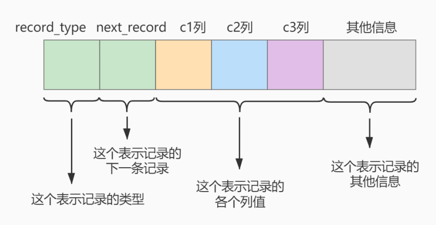

我们只在示意图里展示记录的这几个部分：

* record_type ：记录头信息的一项属性，表示记录的类型， 0 表示普通记录、 2 表示最小记 录、 3 表示最大记录、 1 暂时还没用过，下面讲。 
* mysql> CREATE TABLE index_demo( -> c1 INT, -> c2 INT, -> c3 CHAR(1), -> PRIMARY KEY(c1) -> ) ROW_FORMAT = Compact; next_record ：记录头信息的一项属性，表示下一条地址相对于本条记录的地址偏移量，我们用 箭头来表明下一条记录是谁。 
* 各个列的值 ：这里只记录在 index_demo 表中的三个列，分别是 c1 、 c2 和 c3 。 
* 其他信息 ：除了上述3种信息以外的所有信息，包括其他隐藏列的值以及记录的额外信息。

将记录格式示意图的其他信息项暂时去掉并把它竖起来的效果就是这样：

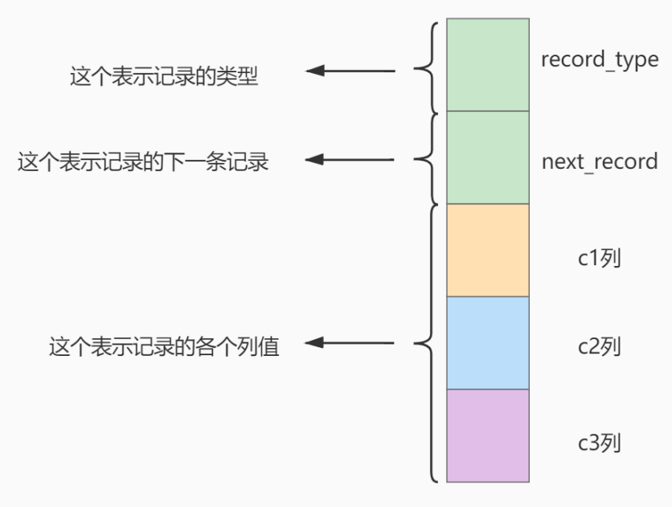

把一些记录放到页里的示意图就是：

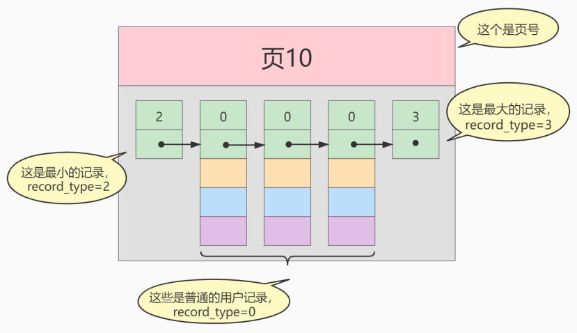

#### 1. 一个简单的索引设计方案

我们在根据某个搜索条件查找一些记录时为什么要遍历所有的数据页呢？因为各个页中的记录并没有规律，我们并不知道我们的搜索条件匹配哪些页中的记录，所以不得不依次遍历所有的数据页。所以如果我们 **想快速的定位到需要查找的记录在哪些数据页** 中该咋办？我们可以为快速定位记录所在的数据页而建立一个目录 ，建这个目录必须完成下边这些事：

* **下一个数据页中用户记录的主键值必须大于上一个页中用户记录的主键值。**

  假设：每个数据结构最多能存放3条记录（实际上一个数据页非常大，可以存放下好多记录）。

  ```mysql
  INSERT INTO index_demo VALUES(1, 4, 'u'), (3, 9, 'd'), (5, 3, 'y');
  ```

​       那么这些记录以及按照主键值的大小串联成一个单向链表了，如图所示：

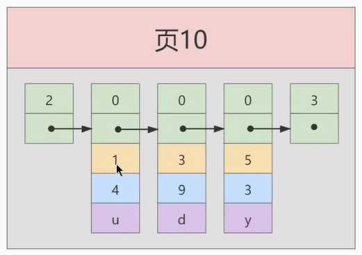

​      从图中可以看出来， index_demo 表中的3条记录都被插入到了编号为10的数据页中了。此时我们再来插入一条记录

```mysql
INSERT INTO index_demo VALUES(4, 4, 'a');
```

因为 **页10** 最多只能放3条记录，所以我们不得不再分配一个新页：

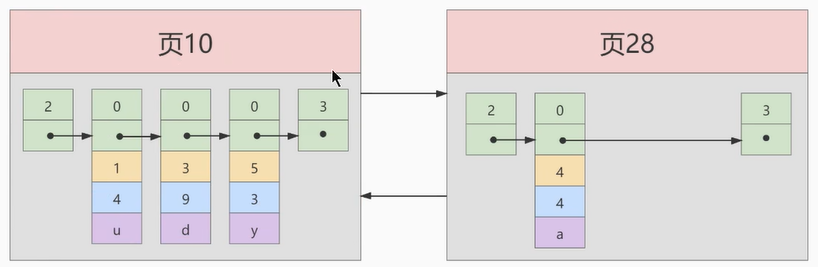

注意：新分配的 **数据页编号可能并不是连续的**。它们只是通过维护者上一个页和下一个页的编号而建立了 **链表** 关系。另外，**页10**中用户记录最大的主键值是5，而**页28**中有一条记录的主键值是4，因为5>4，所以这就不符合下一个数据页中用户记录的主键值必须大于上一个页中用户记录的主键值的要求，所以在插入主键值为4的记录的时候需要伴随着一次 **记录移动**，也就是把主键值为5的记录移动到页28中，然后再把主键值为4的记录插入到页10中，这个过程的示意图如下：

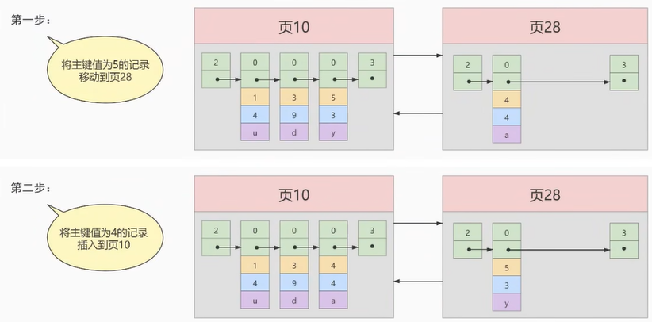

这个过程表明了在对页中的记录进行增删改查操作的过程中，我们必须通过一些诸如 **记录移动** 的操作来始终保证这个状态一直成立：下一个数据页中用户记录的主键值必须大于上一个页中用户记录的主键值。这个过程称为 **页分裂**。

* **给所有的页建立一个目录项。**

由于数据页的 **编号可能是不连续** 的，所以在向 index_demo 表中插入许多条记录后，可能是这样的效果：

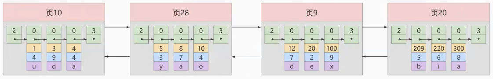

我们需要给它们做个 **目录**，每个页对应一个目录项，每个目录项包括下边两个部分：

1）页的用户记录中最小的主键值，我们用 **key** 来表示。

2）页号，我们用 **page_on** 表示。

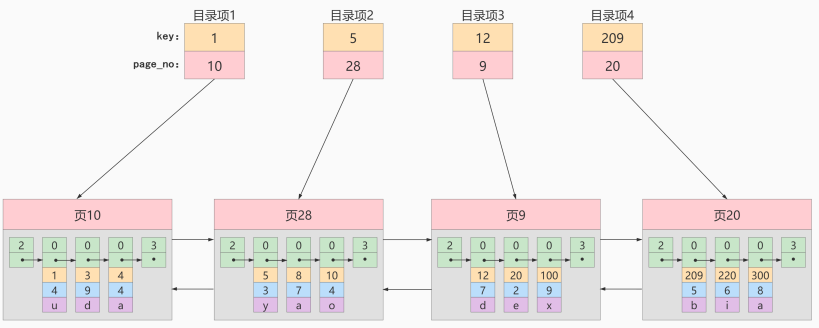

以 页28 为例，它对应 目录项2 ，这个目录项中包含着该页的页号 28 以及该页中用户记录的最小主 键值 5 。我们只需要把几个目录项在物理存储器上连续存储（比如：数组），就可以实现根据主键 值快速查找某条记录的功能了。比如：查找主键值为 20 的记录，具体查找过程分两步：

1. 先从目录项中根据 二分法 快速确定出主键值为 20 的记录在 目录项3 中（因为 12 < 20 < 209 ），它对应的页是 页9 。 
2. 再根据前边说的在页中查找记录的方式去 页9 中定位具体的记录。

至此，针对数据页做的简易目录就搞定了。这个目录有一个别名，称为 **索引** 。

#### 2. InnoDB中的索引方案

##### ① 迭代1次：目录项纪录的页

InnoDB怎么区分一条记录是普通的 **用户记录** 还是 **目录项记录** 呢？使用记录头信息里的 **record_type** 属性，它的各自取值代表的意思如下：

* 0：普通的用户记录
* 1：目录项记录
* 2：最小记录
* 3：最大记录

我们把前边使用到的目录项放到数据页中的样子就是这样：

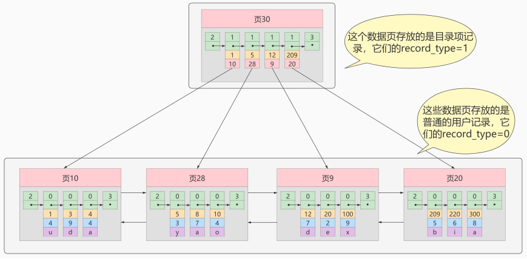

从图中可以看出来，我们新分配了一个编号为30的页来专门存储目录项记录。这里再次强调 **目录项记录** 和普通的 **用户记录** 的不同点：

* **目录项记录** 的 record_type 值是1，而 **普通用户记录** 的 record_type 值是0。 
* 目录项记录只有 **主键值和页的编号** 两个列，而普通的用户记录的列是用户自己定义的，可能包含 **很多列** ，另外还有InnoDB自己添加的隐藏列。 
* 了解：记录头信息里还有一个叫 **min_rec_mask** 的属性，只有在存储 **目录项记录** 的页中的主键值最小的 **目录项记录** 的 **min_rec_mask** 值为 **1** ，其他别的记录的 **min_rec_mask** 值都是 **0** 。

**相同点**：两者用的是一样的数据页，都会为主键值生成 **Page Directory （页目录）**，从而在按照主键值进行查找时可以使用 **二分法** 来加快查询速度。

现在以查找主键为 20 的记录为例，根据某个主键值去查找记录的步骤就可以大致拆分成下边两步：

1. 先到存储 目录项记录 的页，也就是页30中通过 二分法 快速定位到对应目录项，因为 12 < 20 < 209 ，所以定位到对应的记录所在的页就是页9。 
2. 再到存储用户记录的页9中根据 二分法 快速定位到主键值为 20 的用户记录。

##### ② 迭代2次：多个目录项纪录的页

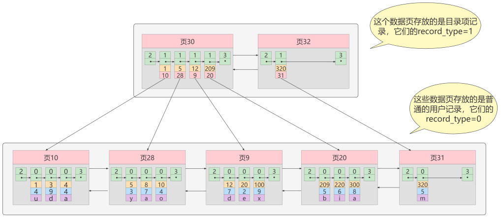

从图中可以看出，我们插入了一条主键值为320的用户记录之后需要两个新的数据页：

* 为存储该用户记录而新生成了 页31 。 
* 因为原先存储目录项记录的 页30的容量已满 （我们前边假设只能存储4条目录项记录），所以不得 不需要一个新的 页32 来存放 页31 对应的目录项。

现在因为存储目录项记录的页不止一个，所以如果我们想根据主键值查找一条用户记录大致需要3个步骤，以查找主键值为 20 的记录为例：

1. 确定 目录项记录页 我们现在的存储目录项记录的页有两个，即 页30 和 页32 ，又因为页30表示的目录项的主键值的 范围是 [1, 320) ，页32表示的目录项的主键值不小于 320 ，所以主键值为 20 的记录对应的目 录项记录在 页30 中。 
2. 通过目录项记录页 确定用户记录真实所在的页 。 在一个存储 目录项记录 的页中通过主键值定位一条目录项记录的方式说过了。 
3. 在真实存储用户记录的页中定位到具体的记录。

##### ③ 迭代3次：目录项记录页的目录页

如果我们表中的数据非常多则会`产生很多存储目录项记录的页`，那我们怎么根据主键值快速定位一个存储目录项记录的页呢？那就为这些存储目录项记录的页再生成一个`更高级的目录`，就像是一个多级目录一样，`大目录里嵌套小目录`，小目录里才是实际的数据，所以现在各个页的示意图就是这样子：

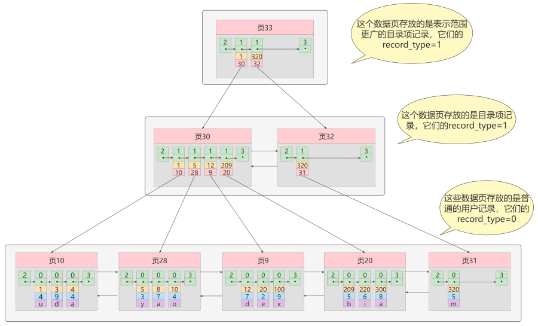

如图，我们生成了一个存储更高级目录项的 页33 ，这个页中的两条记录分别代表页30和页32，如果用 户记录的主键值在 [1, 320) 之间，则到页30中查找更详细的目录项记录，如果主键值 不小于320 的 话，就到页32中查找更详细的目录项记录。

我们可以用下边这个图来描述它：

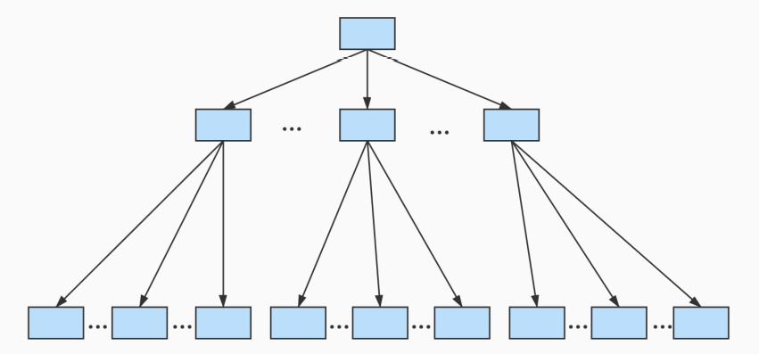

这个数据结构，它的名称是 B+树 。

##### ④ B+Tree

一个B+树的节点其实可以分成好多层，规定最下边的那层，也就是存放我们用户记录的那层为第 0 层， 之后依次往上加。之前我们做了一个非常极端的假设：存放用户记录的页 最多存放3条记录 ，存放目录项 记录的页 最多存放4条记录 。其实真实环境中一个页存放的记录数量是非常大的，假设所有存放用户记录 的叶子节点代表的数据页可以存放 100条用户记录 ，所有存放目录项记录的内节点代表的数据页可以存 放 1000条目录项记录 ，那么：

* 如果B+树只有1层，也就是只有1个用于存放用户记录的节点，最多能存放 100 条记录。
* 如果B+树有2层，最多能存放 1000×100=10,0000 条记录。 
* 如果B+树有3层，最多能存放 1000×1000×100=1,0000,0000 条记录。 
* 如果B+树有4层，最多能存放 1000×1000×1000×100=1000,0000,0000 条记录。相当多的记录！

你的表里能存放 **100000000000** 条记录吗？所以一般情况下，我们用到的 **B+树都不会超过4层** ，那我们通过主键值去查找某条记录最多只需要做4个页面内的查找（查找3个目录项页和一个用户记录页），又因为在每个页面内有所谓的 **Page Directory** （页目录），所以在页面内也可以通过 **二分法** 实现快速 定位记录。

### 3.3 常见索引概念

索引按照物理实现方式，索引可以分为 2 种：聚簇（聚集）和非聚簇（非聚集）索引。我们也把非聚集 索引称为二级索引或者辅助索引。

#### 1. 聚簇索引

聚簇索引并不是一种单独的索引类型，而是**一种数据存储方式**（所有的用户记录都存储在了叶子结点），也就是所谓的 `索引即数据，数据即索引`。

> 术语"聚簇"表示当前数据行和相邻的键值聚簇的存储在一起

**特点：**

* 使用记录主键值的大小进行记录和页的排序，这包括三个方面的含义： 

  * `页内` 的记录是按照主键的大小顺序排成一个 `单向链表` 。 
  * 各个存放 `用户记录的页` 也是根据页中用户记录的主键大小顺序排成一个 `双向链表` 。 
  * 存放 `目录项记录的页` 分为不同的层次，在同一层次中的页也是根据页中目录项记录的主键大小顺序排成一个 `双向链表` 。 

* B+树的 叶子节点 存储的是完整的用户记录。 

  所谓完整的用户记录，就是指这个记录中存储了所有列的值（包括隐藏列）。

我们把具有这两种特性的B+树称为聚簇索引，所有完整的用户记录都存放在这个`聚簇索引`的叶子节点处。这种聚簇索引并不需要我们在MySQL语句中显式的使用INDEX 语句去创建， `InnDB` 存储引擎会 `自动` 的为我们创建聚簇索引。

**优点：**

* `数据访问更快` ，因为聚簇索引将索引和数据保存在同一个B+树中，因此从聚簇索引中获取数据比非聚簇索引更快 
* 聚簇索引对于主键的 `排序查找` 和 `范围查找` 速度非常快 
* 按照聚簇索引排列顺序，查询显示一定范围数据的时候，由于数据都是紧密相连，数据库不用从多 个数据块中提取数据，所以 `节省了大量的io操作` 。

**缺点：**

* `插入速度严重依赖于插入顺序` ，按照主键的顺序插入是最快的方式，否则将会出现页分裂，严重影响性能。因此，对于InnoDB表，我们一般都会定义一个`自增的ID列为主键`
* `更新主键的代价很高` ，因为将会导致被更新的行移动。因此，对于InnoDB表，我们一般定义**主键为不可更新**
* `二级索引访问需要两次索引查找` ，第一次找到主键值，第二次根据主键值找到行数据

#### 2. 二级索引（辅助索引、非聚簇索引）

如果我们想以别的列作为搜索条件该怎么办？肯定不能是从头到尾沿着链表依次遍历记录一遍。

答案：我们可以`多建几颗B+树`，不同的B+树中的数据采用不同的排列规则。比方说我们用`c2`列的大小作为数据页、页中记录的排序规则，再建一课B+树，效果如下图所示：

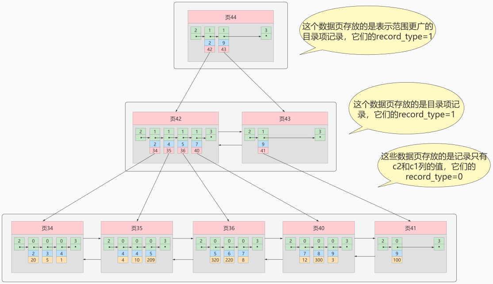

这个B+树与上边介绍的聚簇索引有几处不同：

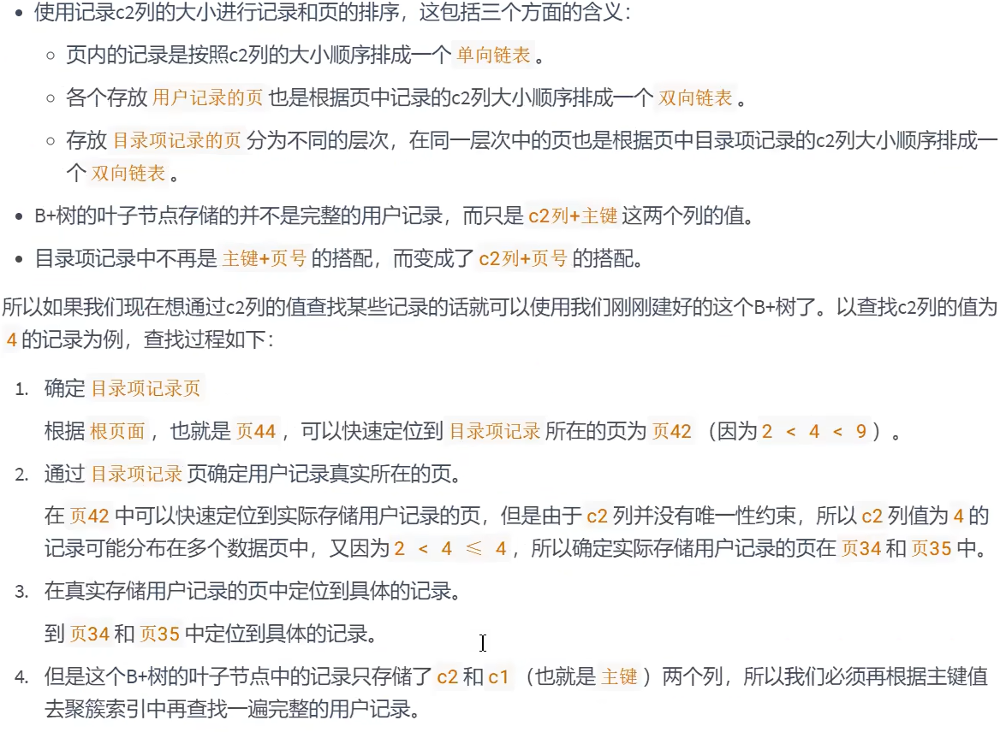

**概念：回表 **

我们根据这个以c2列大小排序的B+树只能确定我们要查找记录的主键值，所以如果我们想根 据c2列的值查找到完整的用户记录的话，仍然需要到 聚簇索引 中再查一遍，这个过程称为 回表 。也就 是根据c2列的值查询一条完整的用户记录需要使用到 2 棵B+树！

**问题**：为什么我们还需要一次 回表 操作呢？直接把完整的用户记录放到叶子节点不OK吗？

**回答**：

如果把完整的用户记录放到叶子结点是可以不用回表。但是`太占地方`了，相当于每建立一课B+树都需要把所有的用户记录再都拷贝一遍，这就有点太浪费存储空间了。

因为这种按照`非主键列`建立的B+树需要一次回表操作才可以定位到完整的用户记录，所以这种B+树也被称为`二级索引`，或者辅助索引。由于使用的是c2列的大小作为B+树的排序规则，所以我们也称这个B+树为c2列简历的索引。

非聚簇索引的存在不影响数据在聚簇索引中的组织，所以一张表可以有多个非聚簇索引。

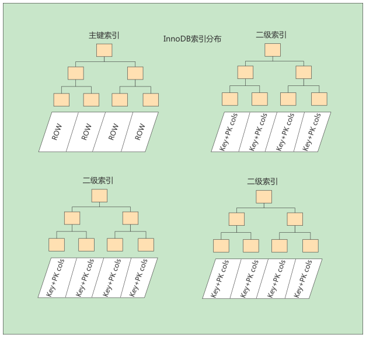

小结：聚簇索引与非聚簇索引的原理不同，在使用上也有一些区别：

1. 聚簇索引的`叶子节点`存储的就是我们的`数据记录`, 非聚簇索引的叶子节点存储的是`数据位置`。非聚簇索引不会影响数据表的物理存储顺序。
2. 一个表`只能有一个聚簇索引`，因为只能有一种排序存储的方式，但可以有`多个非聚簇索引`，也就是多个索引目录提供数据检索。
3. 使用聚簇索引的时候，数据的`查询效率高`，但如果对数据进行插入，删除，更新等操作，效率会比非聚簇索引低。

#### 3.联合索引

我们也可以同时以多个列的大小作为排序规则，也就是同时为多个列建立索引，比方说我们想让B+树按 照 c2和c3列 的大小进行排序，这个包含两层含义： 

* 先把各个记录和页按照c2列进行排序。 
* 在记录的c2列相同的情况下，采用c3列进行排序 

为c2和c3建立的索引的示意图如下：

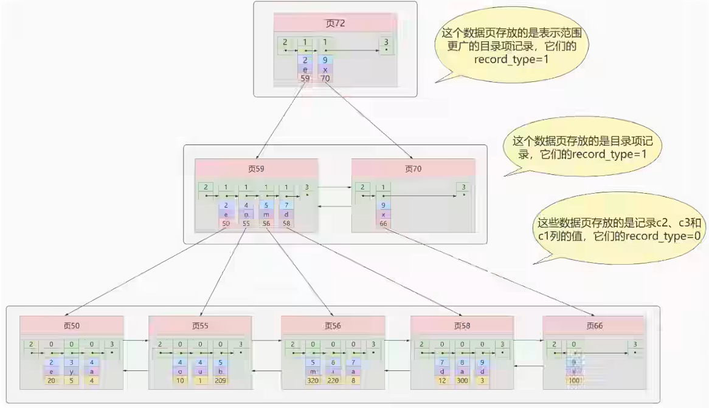

如图所示，我们需要注意以下几点：

* 每条目录项都有c2、c3、页号这三个部分组成，各条记录先按照c2列的值进行排序，如果记录的c2列相同，则按照c3列的值进行排序
* B+树叶子节点处的用户记录由c2、c3和主键c1列组成

注意一点，以c2和c3列的大小为排序规则建立的B+树称为 联合索引 ，本质上也是一个二级索引。它的意 思与分别为c2和c3列分别建立索引的表述是不同的，不同点如下： 

* 建立 联合索引 只会建立如上图一样的1棵B+树。 
* 为c2和c3列分别建立索引会分别以c2和c3列的大小为排序规则建立2棵B+树。

### 3.4 InnoDB的B+树索引的注意事项

#### 1. 根页面位置万年不动

实际上B+树的形成过程是这样的：

* 每当为某个表创建一个B+树索引（聚簇索引不是人为创建的，默认就有）的时候，都会为这个索引创建一个 `根结点` 页面。最开始表中没有数据的时候，每个B+树索引对应的 `根结点` 中即没有用户记录，也没有目录项记录。
* 随后向表中插入用户记录时，先把用户记录存储到这个`根节点` 中。
* 当根节点中的可用 `空间用完时` 继续插入记录，此时会将根节点中的所有记录复制到一个新分配的页，比如 `页a` 中，然后对这个新页进行 `页分裂` 的操作，得到另一个新页，比如`页b` 。这时新插入的记录根据键值（也就是聚簇索引中的主键值，二级索引中对应的索引列的值）的大小就会被分配到 `页a` 或者 `页b` 中，而 `根节点` 便升级为存储目录项记录的页。

这个过程特别注意的是：一个B+树索引的根节点自诞生之日起，便不会再移动。这样只要我们对某个表建议一个索引，那么它的根节点的页号便会被记录到某个地方。然后凡是 `InnoDB` 存储引擎需要用到这个索引的时候，都会从哪个固定的地方取出根节点的页号，从而来访问这个索引。

#### 2. 内节点中目录项记录的唯一性

我们知道B+树索引的内节点中目录项记录的内容是 `索引列 + 页号` 的搭配，但是这个搭配对于二级索引来说有点不严谨。还拿 index_demo 表为例，假设这个表中的数据是这样的：

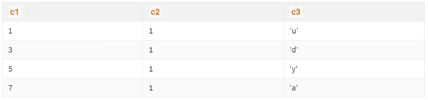

如果二级索引中目录项记录的内容只是 `索引列 + 页号` 的搭配的话，那么为 `c2` 列简历索引后的B+树应该长这样：

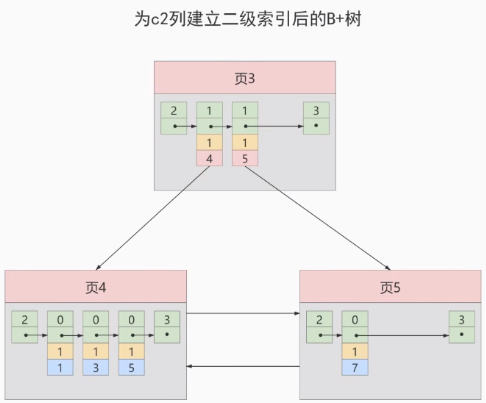

如果我们想新插入一行记录，其中 `c1` 、`c2` 、`c3` 的值分别是: `9`、`1`、`c`, 那么在修改这个为 c2 列建立的二级索引对应的 B+ 树时便碰到了个大问题：由于 `页3` 中存储的目录项记录是由 `c2列 + 页号` 的值构成的，`页3` 中的两条目录项记录对应的 c2 列的值都是1，而我们 `新插入的这条记录` 的 c2 列的值也是 `1`，那我们这条新插入的记录到底应该放在 `页4` 中，还是应该放在 `页5` 中？答案：对不起，懵了

为了让新插入记录找到自己在那个页面，我们需要**保证在B+树的同一层页节点的目录项记录除页号这个字段以外是唯一的**。所以对于二级索引的内节点的目录项记录的内容实际上是由三个部分构成的：

* 索引列的值
* 主键值
* 页号

也就是我们把`主键值`也添加到二级索引内节点中的目录项记录，这样就能保住 B+ 树每一层节点中各条目录项记录除页号这个字段外是唯一的，所以我们为c2建立二级索引后的示意图实际上应该是这样子的：

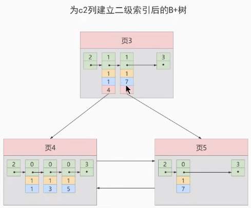

这样我们再插入记录`(9, 1, 'c')` 时，由于 `页3` 中存储的目录项记录是由 `c2列 + 主键 + 页号` 的值构成的，可以先把新纪录的 `c2` 列的值和 `页3` 中各目录项记录的 `c2` 列的值作比较，如果 `c2` 列的值相同的话，可以接着比较主键值，因为B+树同一层中不同目录项记录的 `c2列 + 主键`的值肯定是不一样的，所以最后肯定能定位唯一的一条目录项记录，在本例中最后确定新纪录应该被插入到 `页5` 中。

#### 3. 一个页面最少存储 2 条记录

一个B+树只需要很少的层级就可以轻松存储数亿条记录，查询速度相当不错！这是因为B+树本质上就是一个大的多层级目录，每经过一个目录时都会过滤掉许多无效的子目录，直到最后访问到存储真实数据的目录。那如果一个大的目录中只存放一个子目录是个啥效果呢？那就是目录层级非常非常多，而且最后的那个存放真实数据的目录中只存放一条数据。所以 **InnoDB 的一个数据页至少可以存放两条记录**。

## 4. MyISAM中的索引方案

B树索引使用存储引擎如表所示：

| 索引 / 存储引擎 | MyISAM | InnoDB | Memory |
| --------------- | ------ | ------ | ------ |
| B-Tree索引      | 支持   | 支持   | 支持   |

即使多个存储引擎支持同一种类型的索引，但是他们的实现原理也是不同的。Innodb和MyISAM默认的索 引是Btree索引；而Memory默认的索引是Hash索引。

MyISAM引擎使用 B+Tree 作为索引结构，叶子节点的data域存放的是 数据记录的地址 。

### 4.1 MyISAM索引的原理


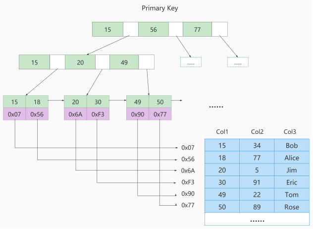


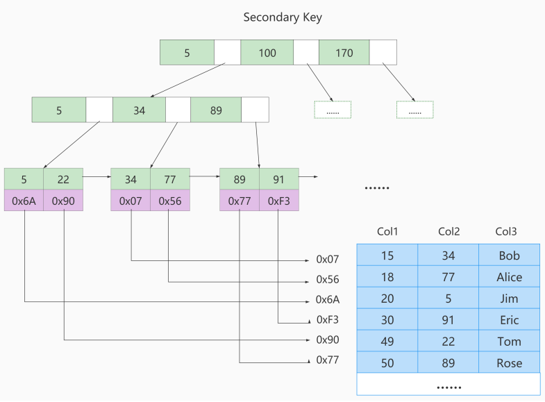


### 4.2 MyISAM 与 InnoDB对比

**MyISAM的索引方式都是“非聚簇”的，与InnoDB包含1个聚簇索引是不同的。小结两种引擎中索引的区别：**

① 在InnoDB存储引擎中，我们只需要根据主键值对 聚簇索引 进行一次查找就能找到对应的记录，而在 MyISAM 中却需要进行一次 回表 操作，意味着MyISAM中建立的索引相当于全部都是 二级索引 。

 ② InnoDB的数据文件本身就是索引文件，而MyISAM索引文件和数据文件是 分离的 ，索引文件仅保存数 据记录的地址。

 ③ InnoDB的非聚簇索引data域存储相应记录 主键的值 ，而MyISAM索引记录的是 地址 。换句话说， InnoDB的所有非聚簇索引都引用主键作为data域。

 ④ MyISAM的回表操作是十分 快速 的，因为是拿着地址偏移量直接到文件中取数据的，反观InnoDB是通 过获取主键之后再去聚簇索引里找记录，虽然说也不慢，但还是比不上直接用地址去访问。 

⑤ InnoDB要求表 必须有主键 （ MyISAM可以没有 ）。如果没有显式指定，则MySQL系统会自动选择一个 可以非空且唯一标识数据记录的列作为主键。如果不存在这种列，则MySQL自动为InnoDB表生成一个隐 含字段作为主键，这个字段长度为6个字节，类型为长整型。

**小结：**


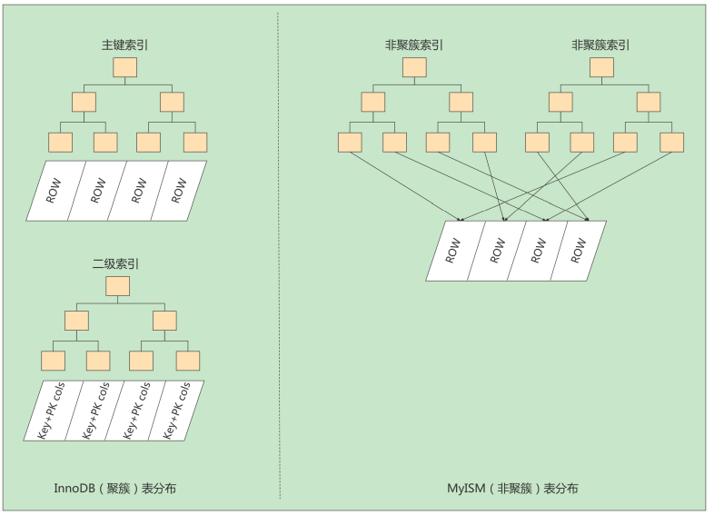

## 5. 索引的代价

索引是个好东西，可不能乱建，它在空间和时间上都会有消耗：

* 空间上的代价

  每建立一个索引都要为它建立一棵B+树，每一棵B+树的每一个节点都是一个数据页，一个页默认会 占用 16KB 的存储空间，一棵很大的B+树由许多数据页组成，那就是很大的一片存储空间。

* 时间上的代价

  每次对表中的数据进行 增、删、改 操作时，都需要去修改各个B+树索引。而且我们讲过，B+树每 层节点都是按照索引列的值 从小到大的顺序排序 而组成了 双向链表 。不论是叶子节点中的记录，还 是内节点中的记录（也就是不论是用户记录还是目录项记录）都是按照索引列的值从小到大的顺序 而形成了一个单向链表。而增、删、改操作可能会对节点和记录的排序造成破坏，所以存储引擎需 要额外的时间进行一些 记录移位 ， 页面分裂 、 页面回收 等操作来维护好节点和记录的排序。如果 我们建了许多索引，每个索引对应的B+树都要进行相关的维护操作，会给性能拖后腿。

> 一个表上索引建的越多，就会占用越多的存储空间，在增删改记录的时候性能就越差。为了能建立又好又少的索引，我们得学学这些索引在哪些条件下起作用的。

## 6. MySQL数据结构选择的合理性


### 6.1 全表查询

这里都懒得说了。

### 6.2 Hash查询


**加快查找速度的数据结构，常见的有两类：**

(1) 树，例如平衡二叉搜索树，查询/插入/修改/删除的平均时间复杂度都是 `O(log2N)`;

(2)哈希，例如HashMap，查询/插入/修改/删除的平均时间复杂度都是 `O(1)`; (key, value)

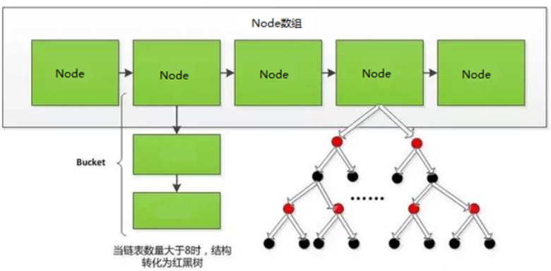


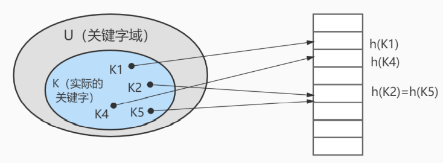

上图中哈希函数h有可能将两个不同的关键字映射到相同的位置，这叫做 碰撞 ，在数据库中一般采用 链 接法 来解决。在链接法中，将散列到同一槽位的元素放在一个链表中，如下图所示：

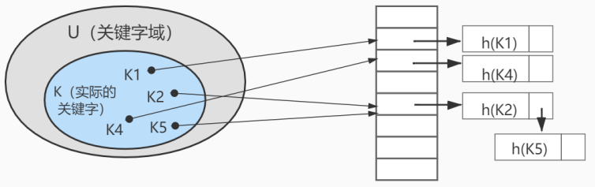

实验：体会数组和hash表的查找方面的效率区别

```mysql
// 算法复杂度为 O(n)
@Test
public void test1(){
    int[] arr = new int[100000];
    for(int i = 0;i < arr.length;i++){
        arr[i] = i + 1;
    }
    long start = System.currentTimeMillis();
    for(int j = 1; j<=100000;j++){
        int temp = j;
        for(int i = 0;i < arr.length;i++){
            if(temp == arr[i]){
                break;
            }
        }
    }
    long end = System.currentTimeMillis();
    System.out.println("time： " + (end - start)); //time： 823
}
```

```mysql
// 算法复杂度为 O(1)
@Test
public void test2(){
    HashSet<Integer> set = new HashSet<>(100000);
    for(int i = 0;i < 100000;i++){
    	set.add(i + 1);
    }
    long start = System.currentTimeMillis();
    for(int j = 1; j<=100000;j++) {
        int temp = j;
        boolean contains = set.contains(temp);
    }
    long end = System.currentTimeMillis();
    System.out.println("time： " + (end - start)); //time： 5
}
```

**Hash结构效率高，那为什么索引结构要设计成树型呢？**


**Hash索引适用存储引擎如表所示：**

| 索引 / 存储引擎 | MyISAM | InnoDB | Memory |
| --------------- | ------ | ------ | ------ |
| HASH索引        | 不支持 | 不支持 | 支持   |

**Hash索引的适用性：**


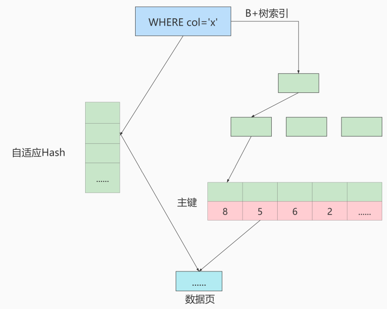

采用自适应 Hash 索引目的是方便根据 SQL 的查询条件加速定位到叶子节点，特别是当 B+ 树比较深的时 候，通过自适应 Hash 索引可以明显提高数据的检索效率。

我们可以通过 innodb_adaptive_hash_index 变量来查看是否开启了自适应 Hash，比如：

```mysql
mysql> show variables like '%adaptive_hash_index';
```

### 6.3 二叉搜索树

如果我们利用二叉树作为索引结构，那么磁盘的IO次数和索引树的高度是相关的。

**1. 二叉搜索树的特点**

* 一个节点只能有两个子节点，也就是一个节点度不能超过2
* 左子节点 < 本节点; 右子节点 >= 本节点，比我大的向右，比我小的向左

**2. 查找规则**


但是特殊情况，就是有时候二叉树的深度非常大，比如：

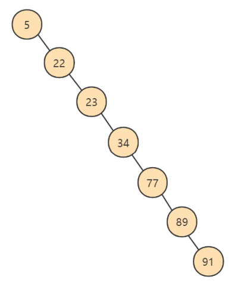

为了提高查询效率，就需要 减少磁盘IO数 。为了减少磁盘IO的次数，就需要尽量 降低树的高度 ，需要把 原来“瘦高”的树结构变的“矮胖”，树的每层的分叉越多越好。

### 6.4 AVL树


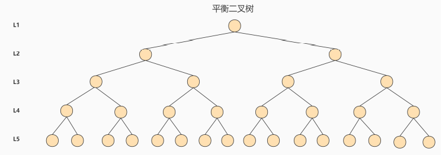

`每访问一次节点就需要进行一次磁盘 I/O 操作，对于上面的树来说，我们需要进行 5次 I/O 操作。虽然平衡二叉树的效率高，但是树的深度也同样高，这就意味着磁盘 I/O 操作次数多，会影响整体数据查询的效率。

针对同样的数据，如果我们把二叉树改成 M 叉树 （M>2）呢？当 M=3 时，同样的 31 个节点可以由下面 的三叉树来进行存储：

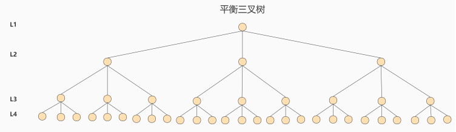

你能看到此时树的高度降低了，当数据量 N 大的时候，以及树的分叉树 M 大的时候，M叉树的高度会远小于二叉树的高度 (M > 2)。所以，我们需要把 `树从“瘦高” 变 “矮胖”。

### 6.5 B-Tree

B 树的英文是 Balance Tree，也就是 `多路平衡查找树`。简写为 B-Tree。它的高度远小于平衡二叉树的高度。

B 树的结构如下图所示：

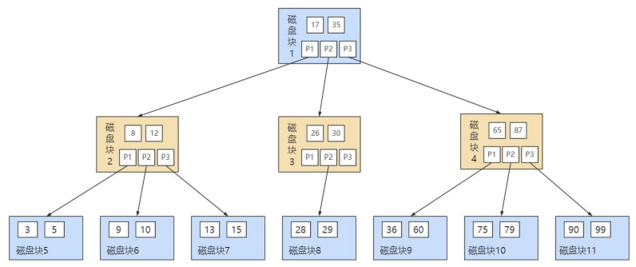


一个 M 阶的 B 树（M>2）有以下的特性：

1. 根节点的儿子数的范围是 [2,M]。 
2. 每个中间节点包含 k-1 个关键字和 k 个孩子，孩子的数量 = 关键字的数量 +1，k 的取值范围为 [ceil(M/2), M]。 
3. 叶子节点包括 k-1 个关键字（叶子节点没有孩子），k 的取值范围为 [ceil(M/2), M]。 
4. 假设中间节点节点的关键字为：Key[1], Key[2], …, Key[k-1]，且关键字按照升序排序，即 Key[i]<Key[i+1]。此时 k-1 个关键字相当于划分了 k 个范围，也就是对应着 k 个指针，即为：P[1], P[2], …, P[k]，其中 P[1] 指向关键字小于 Key[1] 的子树，P[i] 指向关键字属于 (Key[i-1], Key[i]) 的子树，P[k] 指向关键字大于 Key[k-1] 的子树。
5. 所有叶子节点位于同一层。

上面那张图所表示的 B 树就是一棵 3 阶的 B 树。我们可以看下磁盘块 2，里面的关键字为（8，12），它 有 3 个孩子 (3，5)，(9，10) 和 (13，15)，你能看到 (3，5) 小于 8，(9，10) 在 8 和 12 之间，而 (13，15) 大于 12，刚好符合刚才我们给出的特征。

然后我们来看下如何用 B 树进行查找。假设我们想要 查找的关键字是 9 ，那么步骤可以分为以下几步：

1. 我们与根节点的关键字 (17，35）进行比较，9 小于 17 那么得到指针 P1； 
2. 按照指针 P1 找到磁盘块 2，关键字为（8，12），因为 9 在 8 和 12 之间，所以我们得到指针 P2； 
3. 按照指针 P2 找到磁盘块 6，关键字为（9，10），然后我们找到了关键字 9。

你能看出来在 B 树的搜索过程中，我们比较的次数并不少，但如果把数据读取出来然后在内存中进行比 较，这个时间就是可以忽略不计的。而读取磁盘块本身需要进行 I/O 操作，消耗的时间比在内存中进行 比较所需要的时间要多，是数据查找用时的重要因素。 B 树相比于平衡二叉树来说磁盘 I/O 操作要少 ， 在数据查询中比平衡二叉树效率要高。所以 只要树的高度足够低，IO次数足够少，就可以提高查询性能 。


**再举例1：**

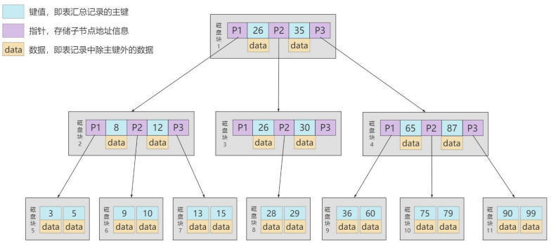

### 6.6 B+Tree


* MySQL官网说明：

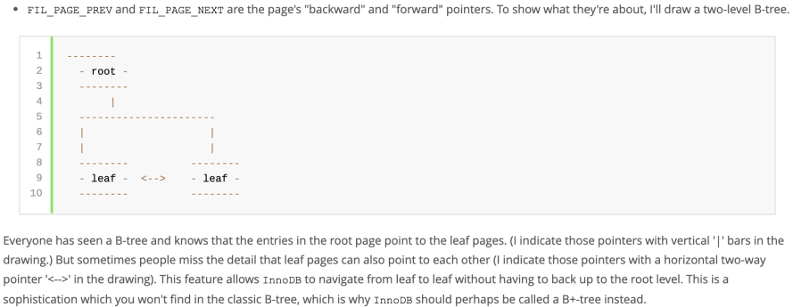

**B+ 树和 B 树的差异在于以下几点：**

1. 有 k 个孩子的节点就有 k 个关键字。也就是孩子数量 = 关键字数，而 B 树中，孩子数量 = 关键字数 +1。
2. 非叶子节点的关键字也会同时存在在子节点中，并且是在子节点中所有关键字的最大（或最 小）。 
3. 非叶子节点仅用于索引，不保存数据记录，跟记录有关的信息都放在叶子节点中。而 B 树中， 非 叶子节点既保存索引，也保存数据记录 。 
4. 所有关键字都在叶子节点出现，叶子节点构成一个有序链表，而且叶子节点本身按照关键字的大 小从小到大顺序链接。


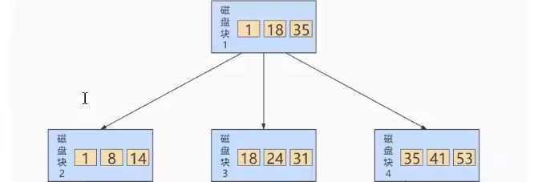

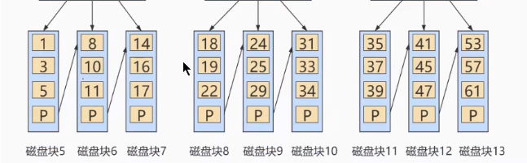

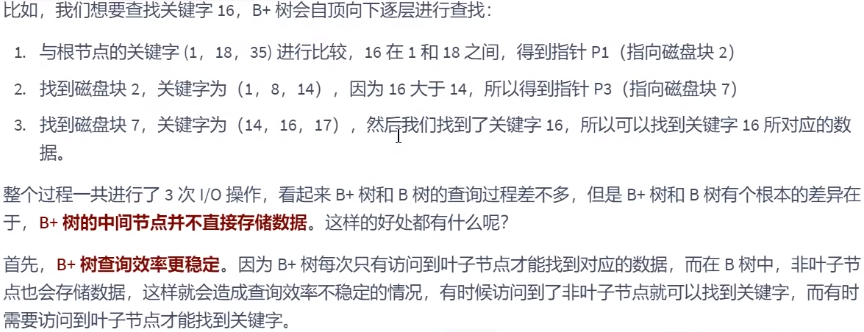


> B 树和 B+ 树都可以作为索引的数据结构，在 MySQL 中采用的是 B+ 树。 但B树和B+树各有自己的应用场景，不能说B+树完全比B树好，反之亦然。

**思考题：为了减少IO，索引树会一次性加载吗？**


**思考题：B+树的存储能力如何？为何说一般查找行记录，最多只需1~3次磁盘IO**

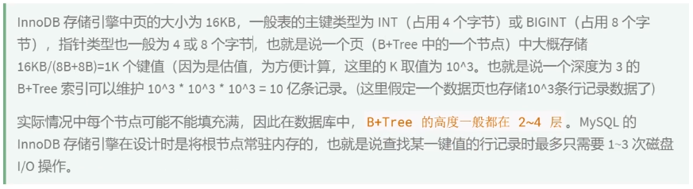

**思考题：为什么说B+树比B-树更适合实际应用中操作系统的文件索引和数据库索引？**


**思考题：Hash 索引与 B+ 树索引的区别**

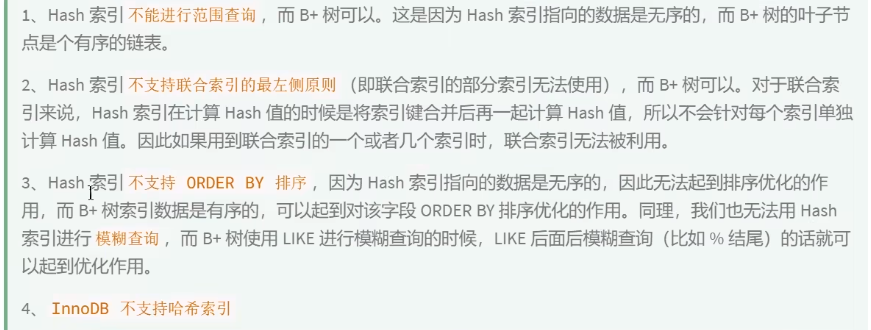

**思考题：Hash 索引与 B+ 树索引是在建索引的时候手动指定的吗？**


### 6.7 R树

R-Tree在MySQL很少使用，仅支持 geometry数据类型 ，支持该类型的存储引擎只有myisam、bdb、 innodb、ndb、archive几种。举个R树在现实领域中能够解决的例子：查找20英里以内所有的餐厅。如果 没有R树你会怎么解决？一般情况下我们会把餐厅的坐标(x,y)分为两个字段存放在数据库中，一个字段记 录经度，另一个字段记录纬度。这样的话我们就需要遍历所有的餐厅获取其位置信息，然后计算是否满 足要求。如果一个地区有100家餐厅的话，我们就要进行100次位置计算操作了，如果应用到谷歌、百度 地图这种超大数据库中，这种方法便必定不可行了。R树就很好的 解决了这种高维空间搜索问题 。它把B 树的思想很好的扩展到了多维空间，采用了B树分割空间的思想，并在添加、删除操作时采用合并、分解 结点的方法，保证树的平衡性。因此，R树就是一棵用来 存储高维数据的平衡树 。相对于B-Tree，R-Tree 的优势在于范围查找。

| 索引 / 存储引擎 | MyISAM | InnoDB | Memory |
| --------------- | ------ | ------ | ------ |
| R-Tree索引      | 支持   | 支持   | 不支持 |

### 6.8 小结


### 附录：算法的时间复杂度

同一问题可用不同算法解决，而一个算法的质量优劣将影响到算法乃至程序的效率。算法分析的目的在 于选择合适算法和改进算法。

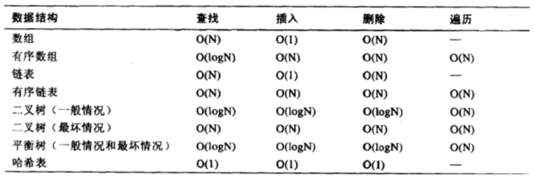

# 第7章_InnoDB数据存储结构

## 1. 数据库的存储结构：页


### 1.1 磁盘与内存交互基本单位：页


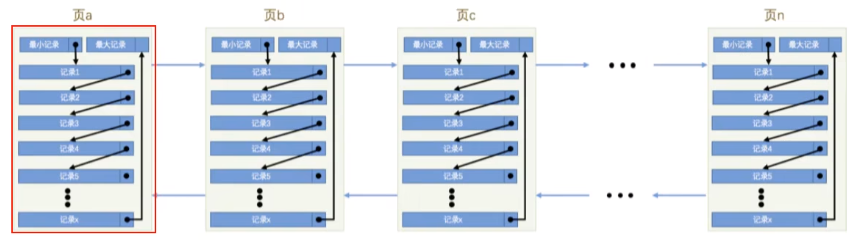

### 1.2 页结构概述


### 1.3 页的大小

不同的数据库管理系统（简称DBMS）的页大小不同。比如在 MySQL 的 InnoDB 存储引擎中，默认页的大小是 `16KB`，我们可以通过下面的命令来进行查看：

```mysql
show variables like '%innodb_page_size%'
```

SQL Server 中页的大小为 `8KB`，而在 Oracle 中我们用术语 "`块`" （Block）来表示 "页"，Oracle 支持的快大小为2KB, 4KB, 8KB, 16KB, 32KB 和 64KB。

### 1.4 页的上层结构

另外在数据库中，还存在着区（Extent）、段（Segment）和表空间（Tablespace）的概念。行、页、区、段、表空间的关系如下图所示：

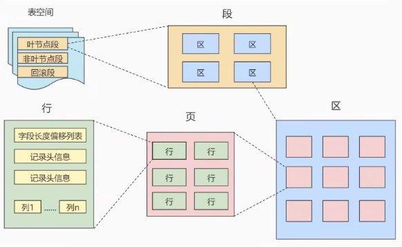


## 2. 页的内部结构

页如果按类型划分的话，常见的有 `数据页（保存B+树节点）、系统表、Undo 页 和 事物数据页` 等。数据页是我们最常使用的页。

数据页的 `16KB` 大小的存储空间被划分为七个部分，分别是文件头（File Header）、页头（Page Header）、最大最小记录（Infimum + supremum）、用户记录（User Records）、空闲空间（Free Space）、页目录（Page Directory）和文件尾（File Tailer）。

页结构的示意图如下所示：

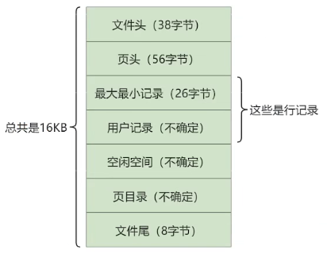

如下表所示：

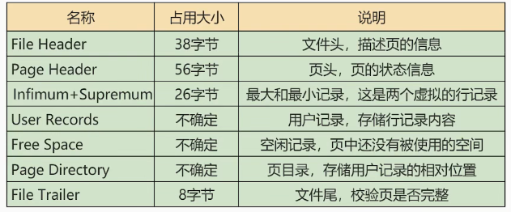

我们可以把这7个结构分为3个部分。

### 第一部分：File Header (文件头部) 和 File Trailer (文件尾部)

见文件InnoDB数据库存储结构.mmap

### 第二部分：User Records (用户记录)、最大最小记录、Free Space (空闲空间)

见文件InnoDB数据库存储结构.mmap

### 第三部分：Page Directory (页目录) 和 Page Header (页面头部)

见文件InnoDB数据库存储结构.mmap

### 2.3 从数据库页的角度看B+树如何查询

一颗B+树按照字节类型可以分为两部分：

1. 叶子节点，B+ 树最底层的节点，节点的高度为0，存储行记录。
2. 非叶子节点，节点的高度大于0，存储索引键和页面指针，并不存储行记录本身。

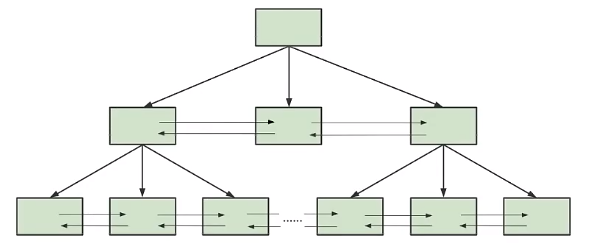

当我们从页结构来理解 B+ 树的结构的时候，可以帮我们理解一些通过索引进行检索的原理：


## 3. InnoDB行格式 (或记录格式)

见文件InnoDB数据库存储结构.mmap

## 4. 区、段与碎片区

### 4.1 为什么要有区？


### 4.2 为什么要有段？


### 4.3 为什么要有碎片区？


### 4.4 区的分类

区大体上可以分为4种类型：

* 空闲的区 (FREE) : 现在还没有用到这个区中的任何页面。
* 有剩余空间的碎片区 (FREE_FRAG)：表示碎片区中还有可用的页面。
* 没有剩余空间的碎片区 (FULL_FRAG)：表示碎片区中的所有页面都被使用，没有空闲页面。
* 附属于某个段的区 (FSEG)：每一个索引都可以分为叶子节点段和非叶子节点段。

处于FREE、FREE_FRAG 以及 FULL_FRAG 这三种状态的区都是独立的，直属于表空间。而处于 FSEG 状态的区是附属于某个段的。

> 如果把表空间比作是一个集团军，段就相当于师，区就相当于团。一般的团都是隶属于某个师的，就像是处于 FSEG 的区全部隶属于某个段，而处于 FREE、FREE_FRAG 以及 FULL_FRAG 这三种状态的区却直接隶属于表空间，就像独立团直接听命于军部一样。

## 5. 表空间


### 5.1 独立表空间

独立表空间，即每张表有一个独立的表空间，也就是数据和索引信息都会保存在自己的表空间中。独立的表空间 (即：单表) 可以在不同的数据库之间进行 `迁移`。

空间可以回收 (DROP TABLE 操作可自动回收表空间；其他情况，表空间不能自己回收) 。如果对于统计分析或是日志表，删除大量数据后可以通过：alter table TableName engine=innodb; 回收不用的空间。对于使用独立表空间的表，不管怎么删除，表空间的碎片不会太严重的影响性能，而且还有机会处理。

**独立表空间结构**

独立表空间由段、区、页组成。

**真实表空间对应的文件大小**

我们到数据目录里看，会发现一个新建的表对应的 .ibd 文件只占用了 96K，才6个页面大小 (MySQL5.7中)，这是因为一开始表空间占用的空间很小，因为表里边都没有数据。不过别忘了这些 .ibd 文件是自扩展的，随着表中数据的增多，表空间对应的文件也逐渐增大。

**查看 InnoDB 的表空间类型：**

```mysql
show variables like 'innodb_file_per_table'
```

你能看到 innodb_file_per_table=ON, 这就意味着每张表都会单词保存一个 .ibd 文件。

### 5.2 系统表空间

系统表空间的结构和独立表空间基本类似，只不过由于整个MySQL进程只有一个系统表空间，在系统表空间中会额外记录一些有关整个系统信息的页面，这部分是独立表空间中没有的。

**InnoDB数据字典**


删除这些数据并不是我们使用 INSERT 语句插入的用户数据，实际上是为了更好的管理我们这些用户数据而不得以引入的一些额外数据，这些数据页称为 元数据。InnoDB 存储引擎特意定义了一些列的 内部系统表 (internal system table) 来记录这些元数据：

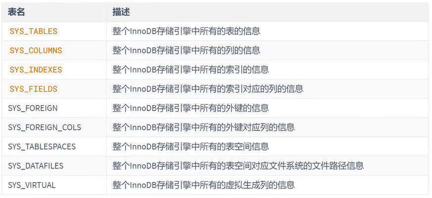

这些系统表也称为 `数据字典`，它们都是以 B+ 树的形式保存在系统表空间的某个页面中。其中 `SYS_TABLES、SYS_COLUMNS、SYS_INDEXES、SYS_FIELDS` 这四个表尤其重要，称之为基本系统表 (basic system tables) ，我们先看看这4个表的结构：

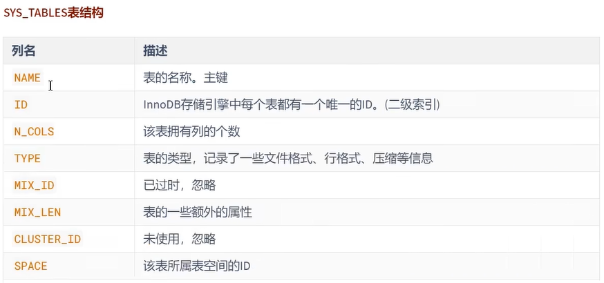

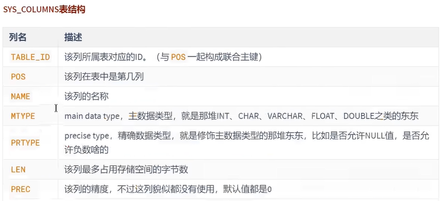

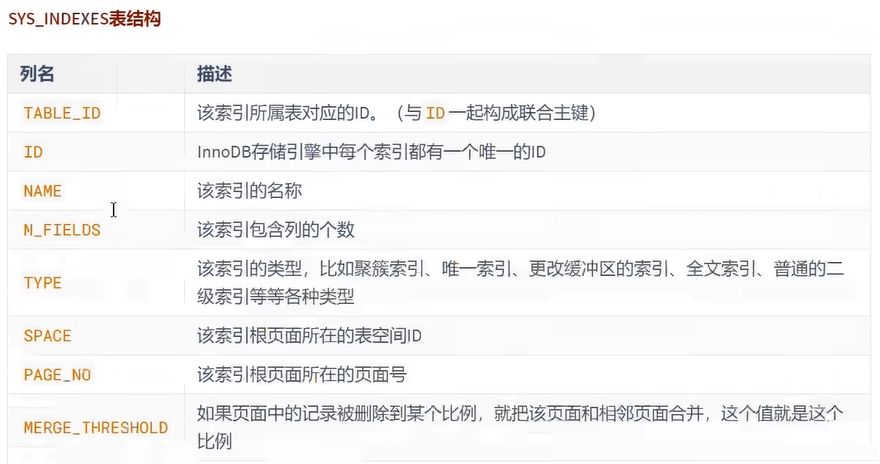


注意：用户不能直接访问 InnoDB 的这些内部系统表，除非你直接去解析系统表空间对应文件系统上的文件。不过考虑到查看这些表的内容可能有助于大家分析问题，所以在系统数据库 `information_schema` 中提供了一些以 `innodb_sys` 开头的表:

```mysql
USE information_schema;
```

```mysql
SHOW TABLES LIKE 'innodb_sys%';
```

在 `information_scheme` 数据库中的这些以 `INNODB_SYS` 开头的表并不是真正的内部系统表 (内部系统表就是我们上边以 `SYS` 开头的那些表)，而是在存储引擎启动时读取这些以 `SYS` 开头的系统表，然后填充到这些以 `INNODB_SYS` 开头的表中。以 `INNODB_SYS` 开头的表和以 `SYS` 开头的表中的字段并不完全一样，但仅供大家参考已经足矣。

## 附录：数据页加载的三种方式

InnoDB从磁盘中读取数据 `最小单位` 是数据页。而你想得到的 id = xxx 的数据，就是这个数据页众多行中的一行。

对于MySQL存放的数据，逻辑概念上我们称之为表，在磁盘等物理层面而言是按 `数据页` 形式进行存放的，当其加载到 MySQL 中我们称之为 `缓存页`。

如果缓冲池没有该页数据，那么缓冲池有以下三种读取数据的方式，每种方式的读取速率是不同的：

**1. 内存读取**

如果该数据存在于内存中，基本上执行时间在 1ms 左右，效率还是很高的。

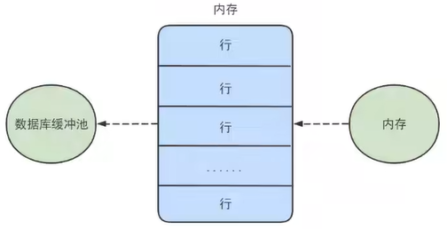

**2. 随机读取**


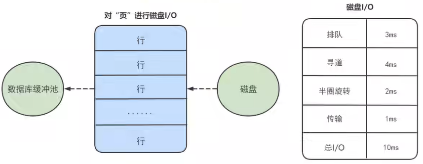

**3. 顺序读取**


# 第8章_索引的创建与设计原则

## 1. 索引的声明与使用

### 1.1 索引的分类

MySQL的索引包括普通索引、唯一性索引、全文索引、单列索引、多列索引和空间索引等。

从 功能逻辑 上说，索引主要有 4 种，分别是普通索引、唯一索引、主键索引、全文索引。 

按照 物理实现方式 ，索引可以分为 2 种：聚簇索引和非聚簇索引。 

按照 作用字段个数 进行划分，分成单列索引和联合索引。

**1. 普通索引**


**2. 唯一性索引**


**3. 主键索引**


**4. 单列索引**


**5. 多列 (组合、联合) 索引**


**6. 全文检索**


**7. 补充：空间索引**


**小结：不同的存储引擎支持的索引类型也不一样 **

InnoDB ：支持 B-tree、Full-text 等索引，不支持 Hash 索引； 

MyISAM ： 支持 B-tree、Full-text 等索引，不支持 Hash 索引； 

Memory ：支持 B-tree、Hash 等 索引，不支持 Full-text 索引；

NDB ：支持 Hash 索引，不支持 B-tree、Full-text 等索引； 

Archive ：不支 持 B-tree、Hash、Full-text 等索引；

### 1.2 创建索引

MySQL支持多种方法在单个或多个列上创建索引：在创建表的定义语句 CREATE TABLE 中指定索引列，使用 ALTER TABLE 语句在存在的表上创建索引，或者使用 CREATE INDEX 语句在已存在的表上添加索引。

#### 1. 创建表的时候创建索引

使用CREATE TABLE创建表时，除了可以定义列的数据类型外，还可以定义主键约束、外键约束或者唯一性约束，而不论创建哪种约束，在定义约束的同时相当于在指定列上创建了一个索引。

举例：

```mysql
CREATE TABLE dept(
dept_id INT PRIMARY KEY AUTO_INCREMENT,
dept_name VARCHAR(20)
);

CREATE TABLE emp(
emp_id INT PRIMARY KEY AUTO_INCREMENT,
emp_name VARCHAR(20) UNIQUE,
dept_id INT,
CONSTRAINT emp_dept_id_fk FOREIGN KEY(dept_id) REFERENCES dept(dept_id)
)
```

但是，如果显式创建表时创建索引的话，基本语法格式如下：

```mysql
CREATE TABLE table_name [col_name data_type]
[UNIQUE | FULLTEXT | SPATIAL] [INDEX | KEY] [index_name] (col_name [length]) [ASC |
DESC]
```

* UNIQUE 、 FULLTEXT 和 SPATIAL 为可选参数，分别表示唯一索引、全文索引和空间索引； 
* INDEX 与 KEY 为同义词，两者的作用相同，用来指定创建索引； 
* index_name 指定索引的名称，为可选参数，如果不指定，那么MySQL默认col_name为索引名； 
* col_name 为需要创建索引的字段列，该列必须从数据表中定义的多个列中选择； 
* length 为可选参数，表示索引的长度，只有字符串类型的字段才能指定索引长度； 
* ASC 或 DESC 指定升序或者降序的索引值存储。

**1. 创建普通索引**

在book表中的year_publication字段上建立普通索引，SQL语句如下：

```mysql
CREATE TABLE book(
book_id INT ,
book_name VARCHAR(100),
authors VARCHAR(100),
info VARCHAR(100) ,
comment VARCHAR(100),
year_publication YEAR,
INDEX(year_publication)
);
```

**2. 创建唯一索引**

```mysql
CREATE TABLE test1(
id INT NOT NULL,
name varchar(30) NOT NULL,
UNIQUE INDEX uk_idx_id(id)
);
```

该语句执行完毕之后，使用SHOW CREATE TABLE查看表结构：

```mysql
SHOW INDEX FROM test1 \G
```

**3. 主键索引**

设定为主键后数据库会自动建立索引，innodb为聚簇索引，语法：

* 随表一起建索引：

```mysql
CREATE TABLE student (
id INT(10) UNSIGNED AUTO_INCREMENT ,
student_no VARCHAR(200),
student_name VARCHAR(200),
PRIMARY KEY(id)
);
```

* 删除主键索引：

```mysql
ALTER TABLE student
drop PRIMARY KEY;
```

* 修改主键索引：必须先删除掉(drop)原索引，再新建(add)索引

**4. 创建单列索引**

引举:

```mysql
CREATE TABLE test2(
id INT NOT NULL,
name CHAR(50) NULL,
INDEX single_idx_name(name(20))
);
```

该语句执行完毕之后，使用SHOW CREATE TABLE查看表结构：

```mysql
SHOW INDEX FROM test2 \G
```

**5. 创建组合索引**

举例：创建表test3，在表中的id、name和age字段上建立组合索引，SQL语句如下：

```mysql
CREATE TABLE test3(
id INT(11) NOT NULL,
name CHAR(30) NOT NULL,
age INT(11) NOT NULL,
info VARCHAR(255),
INDEX multi_idx(id,name,age)
);
```

该语句执行完毕之后，使用SHOW INDEX 查看：

```mysql
SHOW INDEX FROM test3 \G
```

在test3表中，查询id和name字段，使用EXPLAIN语句查看索引的使用情况：

```mysql
EXPLAIN SELECT * FROM test3 WHERE id=1 AND name='songhongkang' \G
```

可以看到，查询id和name字段时，使用了名称为MultiIdx的索引，如果查询 (name, age) 组合或者单独查询name和age字段，会发现结果中possible_keys和key值为NULL, 并没有使用在t3表中创建的索引进行查询。

**6. 创建全文索引**

FULLTEXT全文索引可以用于全文检索，并且只为 `CHAR` 、`VARCHAR` 和 `TEXT` 列创建索引。索引总是对整个列进行，不支持局部 (前缀) 索引。

举例1：创建表test4，在表中的info字段上建立全文索引，SQL语句如下：

```mysql
CREATE TABLE test4(
id INT NOT NULL,
name CHAR(30) NOT NULL,
age INT NOT NULL,
info VARCHAR(255),
FULLTEXT INDEX futxt_idx_info(info)
) ENGINE=MyISAM;
```

> 在MySQL5.7及之后版本中可以不指定最后的ENGINE了，因为在此版本中InnoDB支持全文索引。

语句执行完毕之后，使用SHOW CREATE TABLE查看表结构：

```mysql
SHOW INDEX FROM test4 \G
```

由结果可以看到，info字段上已经成功建立了一个名为futxt_idx_info的FULLTEXT索引。

举例2：

```mysql
CREATE TABLE articles (
id INT UNSIGNED AUTO_INCREMENT PRIMARY KEY,
title VARCHAR (200),
body TEXT,
FULLTEXT index (title, body)
) ENGINE = INNODB;
```

创建了一个给title和body字段添加全文索引的表。

举例3：

```mysql
CREATE TABLE `papers` (
`id` int(10) unsigned NOT NULL AUTO_INCREMENT,
`title` varchar(200) DEFAULT NULL,
`content` text,
PRIMARY KEY (`id`),
FULLTEXT KEY `title` (`title`,`content`)
) ENGINE=MyISAM DEFAULT CHARSET=utf8;
```

不同于like方式的的查询：

```mysql
SELECT * FROM papers WHERE content LIKE ‘%查询字符串%’;
```

全文索引用match+against方式查询：

```mysql
SELECT * FROM papers WHERE MATCH(title,content) AGAINST (‘查询字符串’);
```

明显的提高查询效率。

> 注意点 
>
> 1. 使用全文索引前，搞清楚版本支持情况； 
> 2. 全文索引比 like + % 快 N 倍，但是可能存在精度问题；
> 3. 如果需要全文索引的是大量数据，建议先添加数据，再创建索引。

**7. 创建空间索引**

空间索引创建中，要求空间类型的字段必须为 非空 。

举例：创建表test5，在空间类型为GEOMETRY的字段上创建空间索引，SQL语句如下：

```mysql
CREATE TABLE test5(
geo GEOMETRY NOT NULL,
SPATIAL INDEX spa_idx_geo(geo)
) ENGINE=MyISAM;
```

该语句执行完毕之后，使用SHOW CREATE TABLE查看表结构：

```mysql
SHOW INDEX FROM test5 \G
```

可以看到，test5表的geo字段上创建了名称为spa_idx_geo的空间索引。注意创建时指定空间类型字段值的非空约束，并且表的存储引擎为MyISAM。

#### 2. 在已经存在的表上创建索引

在已经存在的表中创建索引可以使用ALTER TABLE语句或者CREATE INDEX语句。

**1. 使用ALTER TABLE语句创建索引** ALTER TABLE语句创建索引的基本语法如下：

```mysql
ALTER TABLE table_name ADD [UNIQUE | FULLTEXT | SPATIAL] [INDEX | KEY]
[index_name] (col_name[length],...) [ASC | DESC]
```

**2. 使用CREATE INDEX创建索引** CREATE INDEX语句可以在已经存在的表上添加索引，在MySQL中， CREATE INDEX被映射到一个ALTER TABLE语句上，基本语法结构为：

```mysql
CREATE [UNIQUE | FULLTEXT | SPATIAL] INDEX index_name
ON table_name (col_name[length],...) [ASC | DESC]
```

### 1.3 删除索引

**1. 使用ALTER TABLE删除索引**  ALTER TABLE删除索引的基本语法格式如下：

```mysql
ALTER TABLE table_name DROP INDEX index_name;
```

**2. 使用DROP INDEX语句删除索引** DROP INDEX删除索引的基本语法格式如下：

```mysql
DROP INDEX index_name ON table_name;
```

> 提示: 删除表中的列时，如果要删除的列为索引的组成部分，则该列也会从索引中删除。如果组成索引的所有列都被删除，则整个索引将被删除。

## 2. MySQL8.0索引新特性

### 2.1 支持降序索引

降序索引以降序存储键值。虽然在语法上，从MySQL 4版本开始就已经支持降序索引的语法了，但实际上DESC定义是被忽略的，直到MySQL 8.x版本才开始真正支持降序索引 (仅限于InnoDBc存储引擎)。

MySQL在8.0版本之前创建的仍然是升序索引，使用时进行反向扫描，这大大降低了数据库的效率。在某些场景下，降序索引意义重大。例如，如果一个查询，需要对多个列进行排序，且顺序要求不一致，那么使用降序索引将会避免数据库使用额外的文件排序操作，从而提高性能。

举例：分别在MySQL 5.7版本和MySQL 8.0版本中创建数据表ts1，结果如下：

```mysql
CREATE TABLE ts1(a int,b int,index idx_a_b(a,b desc));
```

在MySQL 5.7版本中查看数据表ts1的结构，结果如下:

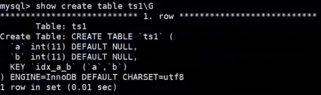

从结果可以看出，索引仍然是默认的升序

在MySQL 8.0版本中查看数据表ts1的结构，结果如下：

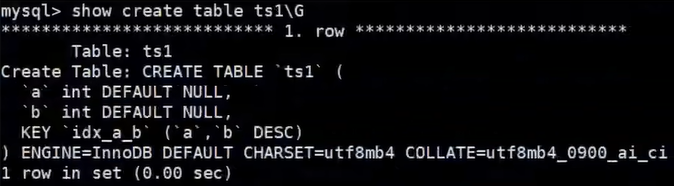

从结果可以看出，索引已经是降序了。下面继续测试降序索引在执行计划中的表现。

分别在MySQL 5.7版本和MySQL 8.0版本的数据表ts1中插入800条随机数据，执行语句如下：

```mysql
DELIMITER //
CREATE PROCEDURE ts_insert()
BEGIN
	DECLARE i INT DEFAULT 1;
	WHILE i < 800
	DO
		insert into ts1 select rand()*80000, rand()*80000;
		SET i = i+1;
	END WHILE;
	commit;
END //
DELIMITER;

# 调用
CALL ts_insert();
```

在MySQL 5.7版本中查看数据表ts1的执行计划，结果如下:

```mysql
EXPLAIN SELECT * FROM ts1 ORDER BY a, b DESC LIMIT 5;
```

在MySQL 8.0版本中查看数据表 ts1 的执行计划。

从结果可以看出，修改后MySQL 5.7 的执行计划要明显好于MySQL 8.0。

### 2.2 隐藏索引

在MySQL 5.7版本及之前，只能通过显式的方式删除索引。此时，如果发展删除索引后出现错误，又只能通过显式创建索引的方式将删除的索引创建回来。如果数据表中的数据量非常大，或者数据表本身比较 大，这种操作就会消耗系统过多的资源，操作成本非常高。

从MySQL 8.x开始支持 隐藏索引（invisible indexes） ，只需要将待删除的索引设置为隐藏索引，使 查询优化器不再使用这个索引（即使使用force index（强制使用索引），优化器也不会使用该索引）， 确认将索引设置为隐藏索引后系统不受任何响应，就可以彻底删除索引。 这种通过先将索引设置为隐藏索 引，再删除索引的方式就是软删除。

同时，如果你想验证某个索引删除之后的 `查询性能影响`，就可以暂时先隐藏该索引。

> 注意：
>
> 主键不能被设置为隐藏索引。当表中没有显式主键时，表中第一个唯一非空索引会成为隐式主键，也不能设置为隐藏索引。

索引默认是可见的，在使用CREATE TABLE, CREATE INDEX 或者 ALTER TABLE 等语句时可以通过 `VISIBLE` 或者 `INVISIBLE` 关键词设置索引的可见性。

**1. 创建表时直接创建**

在MySQL中创建隐藏索引通过SQL语句INVISIBLE来实现，其语法形式如下：

```mysql
CREATE TABLE tablename(
propname1 type1[CONSTRAINT1],
propname2 type2[CONSTRAINT2],
……
propnamen typen,
INDEX [indexname](propname1 [(length)]) INVISIBLE
);
```

上述语句比普通索引多了一个关键字INVISIBLE，用来标记索引为不可见索引。

**2. 在已经存在的表上创建**

可以为已经存在的表设置隐藏索引，其语法形式如下：

```mysql
CREATE INDEX indexname
ON tablename(propname[(length)]) INVISIBLE;
```

**3. 通过ALTER TABLE语句创建**

语法形式如下：

```mysql
ALTER TABLE tablename
ADD INDEX indexname (propname [(length)]) INVISIBLE;
```

**4. 切换索引可见状态**

已存在的索引可通过如下语句切换可见状态：

```mysql
ALTER TABLE tablename ALTER INDEX index_name INVISIBLE; #切换成隐藏索引
ALTER TABLE tablename ALTER INDEX index_name VISIBLE; #切换成非隐藏索引
```

如果将index_cname索引切换成可见状态，通过explain查看执行计划，发现优化器选择了index_cname索引。

> 注意 当索引被隐藏时，它的内容仍然是和正常索引一样实时更新的。如果一个索引需要长期被隐藏，那么可以将其删除，因为索引的存在会影响插入、更新和删除的性能。

通过设置隐藏索引的可见性可以查看索引对调优的帮助。

**5. 使隐藏索引对查询优化器可见**

在MySQL 8.x版本中，为索引提供了一种新的测试方式，可以通过查询优化器的一个开关 (use_invisible_indexes) 来打开某个设置，使隐藏索引对查询优化器可见。如果use_invisible_indexes 设置为off (默认)，优化器会忽略隐藏索引。如果设置为on，即使隐藏索引不可见，优化器在生成执行计 划时仍会考虑使用隐藏索引。

（1）在MySQL命令行执行如下命令查看查询优化器的开关设置。

```mysql
mysql> select @@optimizer_switch \G
```

在输出的结果信息中找到如下属性配置。

```mysql
use_invisible_indexes=off
```

此属性配置值为off，说明隐藏索引默认对查询优化器不可见。

（2）使隐藏索引对查询优化器可见，需要在MySQL命令行执行如下命令：

```mysql
mysql> set session optimizer_switch="use_invisible_indexes=on";
Query OK, 0 rows affected (0.00 sec)
```

SQL语句执行成功，再次查看查询优化器的开关设置。

```mysql
mysql> select @@optimizer_switch \G
*************************** 1. row ***************************
@@optimizer_switch:
index_merge=on,index_merge_union=on,index_merge_sort_union=on,index_merge_
intersection=on,engine_condition_pushdown=on,index_condition_pushdown=on,mrr=on,mrr_co
st_based=on,block_nested_loop=on,batched_key_access=off,materialization=on,semijoin=on
,loosescan=on,firstmatch=on,duplicateweedout=on,subquery_materialization_cost_based=on
,use_index_extensions=on,condition_fanout_filter=on,derived_merge=on,use_invisible_ind
exes=on,skip_scan=on,hash_join=on
1 row in set (0.00 sec)
```

此时，在输出结果中可以看到如下属性配置。

```mysql
use_invisible_indexes=on
```

use_invisible_indexes属性的值为on，说明此时隐藏索引对查询优化器可见。

（3）使用EXPLAIN查看以字段invisible_column作为查询条件时的索引使用情况。

```mysql
explain select * from classes where cname = '高一2班';
```

查询优化器会使用隐藏索引来查询数据。

（4）如果需要使隐藏索引对查询优化器不可见，则只需要执行如下命令即可。

```mysql
mysql> set session optimizer_switch="use_invisible_indexes=off";
Query OK, 0 rows affected (0.00 sec)
```

再次查看查询优化器的开关设置。

```mysql
mysql> select @@optimizer_switch \G
```

此时，use_invisible_indexes属性的值已经被设置为“off”。

## 3. 索引的设计原则

为了使索引的使用效率更高，在创建索引时，必须考虑在哪些字段上创建索引和创建什么类型的索引。**索引设计不合理或者缺少索引都会对数据库和应用程序的性能造成障碍。**高效的索引对于获得良好的性能非常重要。设计索引时，应该考虑相应准则。

### 3.1 数据准备

**第1步：创建数据库、创建表**

```mysql
CREATE DATABASE atguigudb1;
USE atguigudb1;
#1.创建学生表和课程表
CREATE TABLE `student_info` (
`id` INT(11) NOT NULL AUTO_INCREMENT,
`student_id` INT NOT NULL ,
`name` VARCHAR(20) DEFAULT NULL,
`course_id` INT NOT NULL ,
`class_id` INT(11) DEFAULT NULL,
`create_time` DATETIME DEFAULT CURRENT_TIMESTAMP ON UPDATE CURRENT_TIMESTAMP,
PRIMARY KEY (`id`)
) ENGINE=INNODB AUTO_INCREMENT=1 DEFAULT CHARSET=utf8;

CREATE TABLE `course` (
`id` INT(11) NOT NULL AUTO_INCREMENT,
`course_id` INT NOT NULL ,
`course_name` VARCHAR(40) DEFAULT NULL,
PRIMARY KEY (`id`)
) ENGINE=INNODB AUTO_INCREMENT=1 DEFAULT CHARSET=utf8;
```

**第2步：创建模拟数据必需的存储函数**

```mysql
#函数1：创建随机产生字符串函数
DELIMITER //
CREATE FUNCTION rand_string(n INT)
	RETURNS VARCHAR(255) #该函数会返回一个字符串
BEGIN
	DECLARE chars_str VARCHAR(100) DEFAULT
'abcdefghijklmnopqrstuvwxyzABCDEFJHIJKLMNOPQRSTUVWXYZ';
	DECLARE return_str VARCHAR(255) DEFAULT '';
    DECLARE i INT DEFAULT 0;
    WHILE i < n DO
    	SET return_str =CONCAT(return_str,SUBSTRING(chars_str,FLOOR(1+RAND()*52),1));
    	SET i = i + 1;
    END WHILE;
    RETURN return_str;
END //
DELIMITER ;
```

```mysql
#函数2：创建随机数函数
DELIMITER //
CREATE FUNCTION rand_num (from_num INT ,to_num INT) RETURNS INT(11)
BEGIN
DECLARE i INT DEFAULT 0;
SET i = FLOOR(from_num +RAND()*(to_num - from_num+1)) ;
RETURN i;
END //
DELIMITER ;
```

创建函数，假如报错：

```mysql
This function has none of DETERMINISTIC......
```

由于开启过慢查询日志bin-log, 我们就必须为我们的function指定一个参数。

主从复制，主机会将写操作记录在bin-log日志中。从机读取bin-log日志，执行语句来同步数据。如果使 用函数来操作数据，会导致从机和主键操作时间不一致。所以，默认情况下，mysql不开启创建函数设置。

* 查看mysql是否允许创建函数：

```mysql
show variables like 'log_bin_trust_function_creators';
```

* 命令开启：允许创建函数设置：

```mysql
set global log_bin_trust_function_creators=1; # 不加global只是当前窗口有效。
```

* mysqld重启，上述参数又会消失。永久方法：

  * windows下：my.ini[mysqld]加上：

    ```mysql
    log_bin_trust_function_creators=1
    ```

  * linux下：/etc/my.cnf下my.cnf[mysqld]加上：

    ```mysql
    log_bin_trust_function_creators=1
    ```

**第3步：创建插入模拟数据的存储过程**

```mysql
# 存储过程1：创建插入课程表存储过程
DELIMITER //
CREATE PROCEDURE insert_course( max_num INT )
BEGIN
DECLARE i INT DEFAULT 0;
SET autocommit = 0; #设置手动提交事务
REPEAT #循环
SET i = i + 1; #赋值
INSERT INTO course (course_id, course_name ) VALUES
(rand_num(10000,10100),rand_string(6));
UNTIL i = max_num
END REPEAT;
COMMIT; #提交事务
END //
DELIMITER ;
```

```mysql
# 存储过程2：创建插入学生信息表存储过程
DELIMITER //
CREATE PROCEDURE insert_stu( max_num INT )
BEGIN
DECLARE i INT DEFAULT 0;
SET autocommit = 0; #设置手动提交事务
REPEAT #循环
SET i = i + 1; #赋值
INSERT INTO student_info (course_id, class_id ,student_id ,NAME ) VALUES
(rand_num(10000,10100),rand_num(10000,10200),rand_num(1,200000),rand_string(6));
UNTIL i = max_num
END REPEAT;
COMMIT; #提交事务
END //
DELIMITER ;
```

**第4步：调用存储过程**

```mysql
CALL insert_course(100);
```

```mysql
CALL insert_stu(1000000);
```

### 3.2 哪些情况适合创建索引

#### 1. 字段的数值有唯一性的限制


> 业务上具有唯一特性的字段，即使是组合字段，也必须建成唯一索引。（来源：Alibaba） 说明：不要以为唯一索引影响了 insert 速度，这个速度损耗可以忽略，但提高查找速度是明显的。

#### 2. 频繁作为 WHERE 查询条件的字段

某个字段在SELECT语句的 WHERE 条件中经常被使用到，那么就需要给这个字段创建索引了。尤其是在 数据量大的情况下，创建普通索引就可以大幅提升数据查询的效率。 

比如student_info数据表（含100万条数据），假设我们想要查询 student_id=123110 的用户信息。

#### 3. 经常 GROUP BY 和 ORDER BY 的列

索引就是让数据按照某种顺序进行存储或检索，因此当我们使用 GROUP BY 对数据进行分组查询，或者使用 ORDER BY 对数据进行排序的时候，就需要对分组或者排序的字段进行索引 。如果待排序的列有多个，那么可以在这些列上建立组合索引 。

#### 4. UPDATE、DELETE 的 WHERE 条件列

对数据按照某个条件进行查询后再进行 UPDATE 或 DELETE 的操作，如果对 WHERE 字段创建了索引，就能大幅提升效率。原理是因为我们需要先根据 WHERE 条件列检索出来这条记录，然后再对它进行更新或删除。**如果进行更新的时候，更新的字段是非索引字段，提升的效率会更明显，这是因为非索引字段更新不需要对索引进行维护。**

#### 5.DISTINCT 字段需要创建索引

有时候我们需要对某个字段进行去重，使用 DISTINCT，那么对这个字段创建索引，也会提升查询效率。 

比如，我们想要查询课程表中不同的 student_id 都有哪些，如果我们没有对 student_id 创建索引，执行 SQL 语句：

```mysql
SELECT DISTINCT(student_id) FROM `student_info`;
```

运行结果（600637 条记录，运行时间 0.683s ）

如果我们对 student_id 创建索引，再执行 SQL 语句：

```mysql
SELECT DISTINCT(student_id) FROM `student_info`;
```

运行结果（600637 条记录，运行时间 0.010s ）

你能看到 SQL 查询效率有了提升，同时显示出来的 student_id 还是按照递增的顺序 进行展示的。这是因为索引会对数据按照某种顺序进行排序，所以在去重的时候也会快很多。

#### 6. 多表 JOIN 连接操作时，创建索引注意事项

首先， `连接表的数量尽量不要超过 3 张` ，因为每增加一张表就相当于增加了一次嵌套的循环，数量级增 长会非常快，严重影响查询的效率。 

其次， `对 WHERE 条件创建索引` ，因为 WHERE 才是对数据条件的过滤。如果在数据量非常大的情况下， 没有 WHERE 条件过滤是非常可怕的。 

最后， `对用于连接的字段创建索引` ，并且该字段在多张表中的 类型必须一致 。比如 course_id 在 student_info 表和 course 表中都为 int(11) 类型，而不能一个为 int 另一个为 varchar 类型。

举个例子，如果我们只对 student_id 创建索引，执行 SQL 语句：

```mysql
SELECT s.course_id, name, s.student_id, c.course_name
FROM student_info s JOIN course c
ON s.course_id = c.course_id
WHERE name = '462eed7ac6e791292a79';
```

运行结果（1 条数据，运行时间 0.189s ）

这里我们对 name 创建索引，再执行上面的 SQL 语句，运行时间为 0.002s 。

#### 7. 使用列的类型小的创建索引


#### 8. 使用字符串前缀创建索引


创建一张商户表，因为地址字段比较长，在地址字段上建立前缀索引

```mysql
create table shop(address varchar(120) not null);
alter table shop add index(address(12));
```

问题是，截取多少呢？截取得多了，达不到节省索引存储空间的目的；截取得少了，重复内容太多，字 段的散列度(选择性)会降低。怎么计算不同的长度的选择性呢？

先看一下字段在全部数据中的选择度：

```mysql
select count(distinct address) / count(*) from shop
```

通过不同长度去计算，与全表的选择性对比：

公式：

```mysql
count(distinct left(列名, 索引长度))/count(*)
```

例如：

```mysql
select count(distinct left(address,10)) / count(*) as sub10, -- 截取前10个字符的选择度
count(distinct left(address,15)) / count(*) as sub11, -- 截取前15个字符的选择度
count(distinct left(address,20)) / count(*) as sub12, -- 截取前20个字符的选择度
count(distinct left(address,25)) / count(*) as sub13 -- 截取前25个字符的选择度
from shop;
```

> 越接近于1越好，说明越有区分度

**引申另一个问题：索引列前缀对排序的影响**

如果使用了索引列前缀，比方说前边只把address列的 `前12个字符` 放到了二级索引中，下边这个查询可能就有点尴尬了：

```mysql
SELECT * FROM shop
ORDER BY address
LIMIT 12;
```

因为二级索引中不包含完整的address列信息，所以无法对前12个字符相同，后边的字符不同的记录进行排序，也就是使用索引列前缀的方式 `无法支持使用索引排序` ，只能使用文件排序。

**拓展：Alibaba《Java开发手册》**

【 强制 】在 varchar 字段上建立索引时，必须指定索引长度，没必要对全字段建立索引，根据实际文本 区分度决定索引长度。 

说明：索引的长度与区分度是一对矛盾体，一般对字符串类型数据，长度为 20 的索引，区分度会高达 90% 以上 ，可以使用 count(distinct left(列名, 索引长度))/count(*)的区分度来确定。

#### 9. 区分度高(散列性高)的列适合作为索引

`列的基数` 指的是某一列中不重复数据的个数，比方说某个列包含值 `2, 5, 8, 2, 5, 8, 2, 5, 8`，虽然有`9`条记录，但该列的基数却是3。也就是说**在记录行数一定的情况下，列的基数越大，该列中的值越分散；列的基数越小，该列中的值越集中。**这个列的基数指标非常重要，直接影响我们是否能有效的利用索引。最好为列的基数大的列简历索引，为基数太小的列的简历索引效果可能不好。

可以使用公式`select count(distinct a) / count(*) from t1` 计算区分度，越接近1越好，一般超过33%就算比较高效的索引了。

扩展：联合索引把区分度搞(散列性高)的列放在前面。

#### 10. 使用最频繁的列放到联合索引的左侧

这样也可以较少的建立一些索引。同时，由于"最左前缀原则"，可以增加联合索引的使用率。

#### 11. 在多个字段都要创建索引的情况下，联合索引优于单值索引

### 3.3 限制索引的数目


### 3.4 哪些情况不适合创建索引

#### 1. 在where中使用不到的字段，不要设置索引

WHERE条件 (包括 GROUP BY、ORDER BY) 里用不到的字段不需要创建索引，索引的价值是快速定位，如果起不到定位的字段通常是不需要创建索引的。举个例子：

```mysql
SELECT course_id, student_id, create_time
FROM student_info
WHERE student_id = 41251;
```

因为我们是按照 student_id 来进行检索的，所以不需要对其他字段创建索引，即使这些字段出现在SELECT字段中。

#### 2. 数据量小的表最好不要使用索引

如果表记录太少，比如少于1000个，那么是不需要创建索引的。表记录太少，是否创建索引 `对查询效率的影响并不大`。甚至说，查询花费的时间可能比遍历索引的时间还要短，索引可能不会产生优化效果。

举例：创建表1：

```mysql
CREATE TABLE t_without_index(
a INT PRIMARY KEY AUTO_INCREMENT,
b INT
);
```

提供存储过程1：

```mysql
#创建存储过程
DELIMITER //
CREATE PROCEDURE t_wout_insert()
BEGIN
    DECLARE i INT DEFAULT 1;
    WHILE i <= 900
    DO
        INSERT INTO t_without_index(b) SELECT RAND()*10000;
        SET i = i + 1;
    END WHILE;
    COMMIT;
END //
DELIMITER ;

#调用
CALL t_wout_insert()
```

创建表2：

```mysql
CREATE TABLE t_with_index(
a INT PRIMARY KEY AUTO_INCREMENT,
b INT,
INDEX idx_b(b)
);
```

创建存储过程2：

```mysql
#创建存储过程
DELIMITER //
CREATE PROCEDURE t_with_insert()
BEGIN
    DECLARE i INT DEFAULT 1;
    WHILE i <= 900
    DO
        INSERT INTO t_with_index(b) SELECT RAND()*10000;
        SET i = i + 1;
    END WHILE;
    COMMIT;
END //
DELIMITER ;

#调用
CALL t_with_insert();
```

查询对比：

```mysql
mysql> select * from t_without_index where b = 9879;
+------+------+
| a | b |
+------+------+
| 1242 | 9879 |
+------+------+
1 row in set (0.00 sec)

mysql> select * from t_with_index where b = 9879;
+-----+------+
| a | b |
+-----+------+
| 112 | 9879 |
+-----+------+
1 row in set (0.00 sec)
```

你能看到运行结果相同，但是在数据量不大的情况下，索引就发挥不出作用了。

> 结论：在数据表中的数据行数比较少的情况下，比如不到 1000 行，是不需要创建索引的。

#### 3. 有大量重复数据的列上不要建立索引

在条件表达式中经常用到的不同值较多的列上建立索引，但字段中如果有大量重复数据，也不用创建索引。比如在学生表的"性别"字段上只有“男”与“女”两个不同值，因此无须建立索引。如果建立索引，不但不会提高查询效率，反而会`严重降低数据更新速度`。

举例1：要在 100 万行数据中查找其中的 50 万行（比如性别为男的数据），一旦创建了索引，你需要先 访问 50 万次索引，然后再访问 50 万次数据表，这样加起来的开销比不使用索引可能还要大。

举例2：假设有一个学生表，学生总数为 100 万人，男性只有 10 个人，也就是占总人口的 10 万分之 1。

学生表 student_gender 结构如下。其中数据表中的 student_gender 字段取值为 0 或 1，0 代表女性，1 代表男性。

```mysql
CREATE TABLE student_gender(
    student_id INT(11) NOT NULL,
    student_name VARCHAR(50) NOT NULL,
    student_gender TINYINT(1) NOT NULL,
    PRIMARY KEY(student_id)
)ENGINE = INNODB;
```

如果我们要筛选出这个学生表中的男性，可以使用：

```mysql
SELECT * FROM student_gender WHERE student_gender = 1;
```

> 结论：当数据重复度大，比如 高于 10% 的时候，也不需要对这个字段使用索引。

#### 4.  避免对经常更新的表创建过多的索引

第一层含义：频繁更新的字段不一定要创建索引。因为更新数据的时候，也需要更新索引，如果索引太多，在更新索引的时候也会造成负担，从而影响效率。

第二层含义：避免对经常更新的表创建过多的索引，并且索引中的列尽可能少。此时，虽然提高了查询速度，同时却降低更新表的速度。

#### 5. 不建议用无序的值作为索引

例如身份证、UUID(在索引比较时需要转为ASCII，并且插入时可能造成页分裂)、MD5、HASH、无序长字 符串等。

#### 6. 删除不再使用或者很少使用的索引

表中的数据被大量更新，或者数据的使用方式被改变后，原有的一些索引可能不再需要。数据库管理员应当定期找出这些索引，将它们删除，从而减少索引对更新操作的影响。

#### 7. 不要定义夯余或重复的索引

① 冗余索引 

举例：建表语句如下

```mysql
CREATE TABLE person_info(
    id INT UNSIGNED NOT NULL AUTO_INCREMENT,
    name VARCHAR(100) NOT NULL,
    birthday DATE NOT NULL,
    phone_number CHAR(11) NOT NULL,
    country varchar(100) NOT NULL,
    PRIMARY KEY (id),
    KEY idx_name_birthday_phone_number (name(10), birthday, phone_number),
    KEY idx_name (name(10))
);
```

我们知道，通过 idx_name_birthday_phone_number 索引就可以对 name 列进行快速搜索，再创建一 个专门针对 name 列的索引就算是一个 冗余索引 ，维护这个索引只会增加维护的成本，并不会对搜索有 什么好处。

② 重复索引 

另一种情况，我们可能会对某个列 重复建立索引 ，比方说这样：

```mysql
CREATE TABLE repeat_index_demo (
col1 INT PRIMARY KEY,
col2 INT,
UNIQUE uk_idx_c1 (col1),
INDEX idx_c1 (col1)
);
```

我们看到，col1 既是主键、又给它定义为一个唯一索引，还给它定义了一个普通索引，可是主键本身就 会生成聚簇索引，所以定义的唯一索引和普通索引是重复的，这种情况要避免。

# 第09章_性能分析工具的使用

在数据库调优中，我们的目标是 `响应时间更快, 吞吐量更大` 。利用宏观的监控工具和微观的日志分析可以帮我们快速找到调优的思路和方式。

## 1. 数据库服务器的优化步骤

当我们遇到数据库调优问题的时候，该如何思考呢？这里把思考的流程整理成下面这张图。

整个流程划分成了 `观察（Show status）` 和 `行动（Action）` 两个部分。字母 S 的部分代表观察（会使 用相应的分析工具），字母 A 代表的部分是行动（对应分析可以采取的行动）。

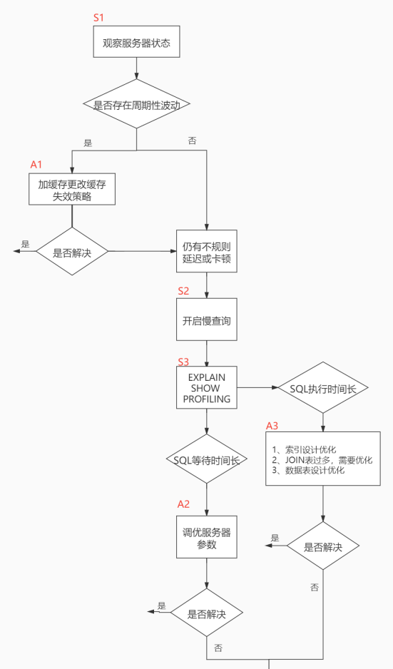


我们可以通过观察了解数据库整体的运行状态，通过性能分析工具可以让我们了解执行慢的SQL都有哪些，查看具体的SQL执行计划，甚至是SQL执行中的每一步的成本代价，这样才能定位问题所在，找到了问题，再采取相应的行动。

**详细解释一下这张图：**

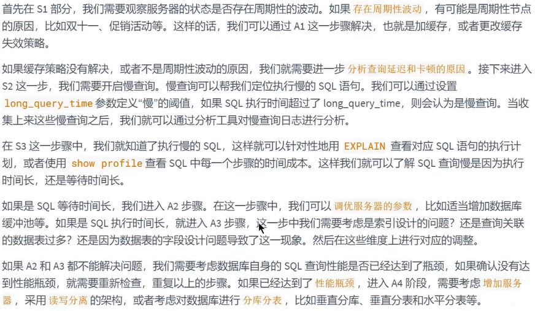

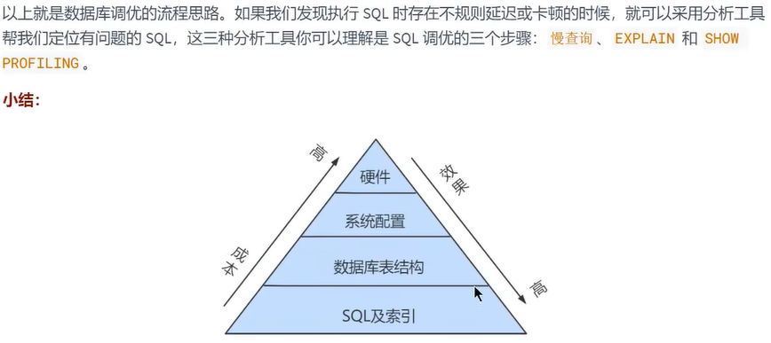

## 2. 查看系统性能参数

在MySQL中，可以使用 `SHOW STATUS` 语句查询一些MySQL数据库服务器的`性能参数、执行频率`。

SHOW STATUS语句语法如下：

```mysql
SHOW [GLOBAL|SESSION] STATUS LIKE '参数';
```

一些常用的性能参数如下：

* Connections：连接MySQL服务器的次数。 
* Uptime：MySQL服务器的上线时间。 
* Slow_queries：慢查询的次数。 
* Innodb_rows_read：Select查询返回的行数 
* Innodb_rows_inserted：执行INSERT操作插入的行数 
* Innodb_rows_updated：执行UPDATE操作更新的 行数 
* Innodb_rows_deleted：执行DELETE操作删除的行数 
* Com_select：查询操作的次数。 
* Com_insert：插入操作的次数。对于批量插入的 INSERT 操作，只累加一次。 
* Com_update：更新操作 的次数。 
* Com_delete：删除操作的次数。

若查询MySQL服务器的连接次数，则可以执行如下语句:

```mysql
SHOW STATUS LIKE 'Connections';
```

若查询服务器工作时间，则可以执行如下语句:

```mysql
SHOW STATUS LIKE 'Uptime';
```

若查询MySQL服务器的慢查询次数，则可以执行如下语句:

```mysql
SHOW STATUS LIKE 'Slow_queries';
```

慢查询次数参数可以结合慢查询日志找出慢查询语句，然后针对慢查询语句进行`表结构优化`或者`查询语句优化`。

再比如，如下的指令可以查看相关的指令情况：

```mysql
SHOW STATUS LIKE 'Innodb_rows_%';
```

## 3. 统计SQL的查询成本: last_query_cost

一条SQL查询语句在执行前需要查询执行计划，如果存在多种执行计划的话，MySQL会计算每个执行计划所需要的成本，从中选择`成本最小`的一个作为最终执行的执行计划。

如果我们想要查看某条SQL语句的查询成本，可以在执行完这条SQL语句之后，通过查看当前会话中的`last_query_cost`变量值来得到当前查询的成本。它通常也是我们`评价一个查询的执行效率`的一个常用指标。这个查询成本对应的是`SQL 语句所需要读取的读页的数量`。

我们依然使用第8章的 student_info 表为例：

```mysql
CREATE TABLE `student_info` (
    `id` INT(11) NOT NULL AUTO_INCREMENT,
    `student_id` INT NOT NULL ,
    `name` VARCHAR(20) DEFAULT NULL,
    `course_id` INT NOT NULL ,
    `class_id` INT(11) DEFAULT NULL,
    `create_time` DATETIME DEFAULT CURRENT_TIMESTAMP ON UPDATE CURRENT_TIMESTAMP,
    PRIMARY KEY (`id`)
) ENGINE=INNODB AUTO_INCREMENT=1 DEFAULT CHARSET=utf8;
```

如果我们想要查询 id=900001 的记录，然后看下查询成本，我们可以直接在聚簇索引上进行查找：

```mysql
SELECT student_id, class_id, NAME, create_time FROM student_info WHERE id = 900001;
```

运行结果（1 条记录，运行时间为 0.042s ）

然后再看下查询优化器的成本，实际上我们只需要检索一个页即可：

```mysql
mysql> SHOW STATUS LIKE 'last_query_cost';
+-----------------+----------+
| Variable_name   |   Value  |
+-----------------+----------+
| Last_query_cost | 1.000000 |
+-----------------+----------+
```

如果我们想要查询 id 在 900001 到 9000100 之间的学生记录呢？

```mysql
SELECT student_id, class_id, NAME, create_time FROM student_info WHERE id BETWEEN 900001 AND 900100;
```

运行结果（100 条记录，运行时间为 0.046s ）： 

然后再看下查询优化器的成本，这时我们大概需要进行 20 个页的查询。

```mysql
mysql> SHOW STATUS LIKE 'last_query_cost';
+-----------------+-----------+
| Variable_name   |   Value   |
+-----------------+-----------+
| Last_query_cost | 21.134453 |
+-----------------+-----------+
```

你能看到页的数量是刚才的 20 倍，但是查询的效率并没有明显的变化，实际上这两个 SQL 查询的时间 基本上一样，就是因为采用了顺序读取的方式将页面一次性加载到缓冲池中，然后再进行查找。虽然 页 数量（last_query_cost）增加了不少 ，但是通过缓冲池的机制，并 没有增加多少查询时间 。 

**使用场景：**它对于比较开销是非常有用的，特别是我们有好几种查询方式可选的时候。

> SQL查询时一个动态的过程，从页加载的角度来看，我们可以得到以下两点结论：
>
> 1. `位置决定效率`。如果页就在数据库 `缓冲池` 中，那么效率是最高的，否则还需要从 `内存` 或者 `磁盘` 中进行读取，当然针对单个页的读取来说，如果页存在于内存中，会比在磁盘中读取效率高很多。
> 2. `批量决定效率`。如果我们从磁盘中对单一页进行随机读，那么效率是很低的(差不多10ms)，而采用顺序读取的方式，批量对页进行读取，平均一页的读取效率就会提升很多，甚至要快于单个页面在内存中的随机读取。
>
> 所以说，遇到I/O并不用担心，方法找对了，效率还是很高的。我们首先要考虑数据存放的位置，如果是进程使用的数据就要尽量放到`缓冲池`中，其次我们可以充分利用磁盘的吞吐能力，一次性批量读取数据，这样单个页的读取效率也就得到了提升。

## 4. 定位执行慢的 SQL：慢查询日志


### 4.1 开启慢查询日志参数

**1. 开启 slow_query_log**

在使用前，我们需要先查下慢查询是否已经开启，使用下面这条命令即可：

```mysql
mysql > show variables like '%slow_query_log';
```

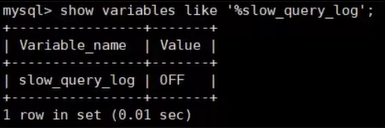

我们可以看到 `slow_query_log=OFF`，我们可以把慢查询日志打开，注意设置变量值的时候需要使用 global，否则会报错：

```mysql
mysql > set global slow_query_log='ON';
```

然后我们再来查看下慢查询日志是否开启，以及慢查询日志文件的位置：

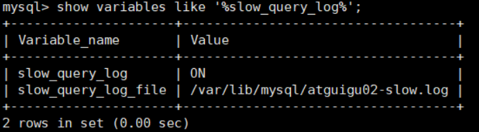

你能看到这时慢查询分析已经开启，同时文件保存在 `/var/lib/mysql/atguigu02-slow.log` 文件 中。

**2. 修改 long_query_time 阈值**

接下来我们来看下慢查询的时间阈值设置，使用如下命令：

```mysql
mysql > show variables like '%long_query_time%';
```

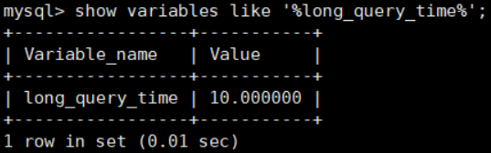

这里如果我们想把时间缩短，比如设置为 1 秒，可以这样设置：

```mysql
#测试发现：设置global的方式对当前session的long_query_time失效。对新连接的客户端有效。所以可以一并
执行下述语句
mysql > set global long_query_time = 1;
mysql> show global variables like '%long_query_time%';

mysql> set long_query_time=1;
mysql> show variables like '%long_query_time%';
```

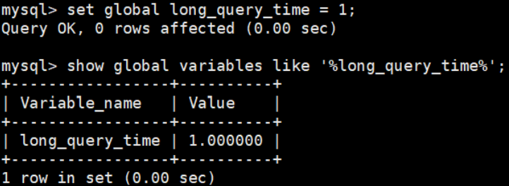

**补充：配置文件中一并设置参数**

如下的方式相较于前面的命令行方式，可以看做是永久设置的方式。

修改 `my.cnf` 文件，[mysqld] 下增加或修改参数 `long_query_time、slow_query_log` 和 `slow_query_log_file` 后，然后重启 MySQL 服务器。

```properties
[mysqld]
slow_query_log=ON  # 开启慢查询日志开关
slow_query_log_file=/var/lib/mysql/atguigu-low.log  # 慢查询日志的目录和文件名信息
long_query_time=3  # 设置慢查询的阈值为3秒，超出此设定值的SQL即被记录到慢查询日志
log_output=FILE
```

如果不指定存储路径，慢查询日志默认存储到MySQL数据库的数据文件夹下。如果不指定文件名，默认文件名为hostname_slow.log。

### 4.2 查看慢查询数目

查询当前系统中有多少条慢查询记录

```mysql
SHOW GLOBAL STATUS LIKE '%Slow_queries%';
```

### 4.3 案例演示

**步骤1. 建表**

```mysql
CREATE TABLE `student` (
    `id` INT(11) NOT NULL AUTO_INCREMENT,
    `stuno` INT NOT NULL ,
    `name` VARCHAR(20) DEFAULT NULL,
    `age` INT(3) DEFAULT NULL,
    `classId` INT(11) DEFAULT NULL,
    PRIMARY KEY (`id`)
) ENGINE=INNODB AUTO_INCREMENT=1 DEFAULT CHARSET=utf8;
```

**步骤2：设置参数 log_bin_trust_function_creators**

创建函数，假如报错：

```mysql
This function has none of DETERMINISTIC......
```

* 命令开启：允许创建函数设置：

```mysql
set global log_bin_trust_function_creators=1; # 不加global只是当前窗口有效。
```

**步骤3：创建函数**

随机产生字符串：（同上一章）

```mysql
DELIMITER //
CREATE FUNCTION rand_string(n INT)
	RETURNS VARCHAR(255) #该函数会返回一个字符串
BEGIN
	DECLARE chars_str VARCHAR(100) DEFAULT
'abcdefghijklmnopqrstuvwxyzABCDEFJHIJKLMNOPQRSTUVWXYZ';
	DECLARE return_str VARCHAR(255) DEFAULT '';
    DECLARE i INT DEFAULT 0;
    WHILE i < n DO
    	SET return_str =CONCAT(return_str,SUBSTRING(chars_str,FLOOR(1+RAND()*52),1));
    	SET i = i + 1;
    END WHILE;
    RETURN return_str;
END //
DELIMITER ;

# 测试
SELECT rand_string(10);
```

产生随机数值：（同上一章）

```mysql
DELIMITER //
CREATE FUNCTION rand_num (from_num INT ,to_num INT) RETURNS INT(11)
BEGIN
    DECLARE i INT DEFAULT 0;
    SET i = FLOOR(from_num +RAND()*(to_num - from_num+1)) ;
    RETURN i;
END //
DELIMITER ;

#测试：
SELECT rand_num(10,100);
```

**步骤4：创建存储过程**

```mysql
DELIMITER //
CREATE PROCEDURE insert_stu1( START INT , max_num INT )
BEGIN
DECLARE i INT DEFAULT 0;
    SET autocommit = 0; #设置手动提交事务
    REPEAT #循环
    SET i = i + 1; #赋值
    INSERT INTO student (stuno, NAME ,age ,classId ) VALUES
    ((START+i),rand_string(6),rand_num(10,100),rand_num(10,1000));
    UNTIL i = max_num
    END REPEAT;
    COMMIT; #提交事务
END //
DELIMITER ;
```

**步骤5：调用存储过程**

```mysql
#调用刚刚写好的函数, 4000000条记录,从100001号开始

CALL insert_stu1(100001,4000000);
```

### 4.4 测试及分析

**1. 测试**

```mysql
mysql> SELECT * FROM student WHERE stuno = 3455655;
+---------+---------+--------+------+---------+
|   id    |  stuno  |  name  | age  | classId |
+---------+---------+--------+------+---------+
| 3523633 | 3455655 | oQmLUr |  19  |    39   |
+---------+---------+--------+------+---------+
1 row in set (2.09 sec)

mysql> SELECT * FROM student WHERE name = 'oQmLUr';
+---------+---------+--------+------+---------+
|   id    |  stuno  |  name  |  age | classId |
+---------+---------+--------+------+---------+
| 1154002 | 1243200 | OQMlUR | 266  |   28    |
| 1405708 | 1437740 | OQMlUR | 245  |   439   |
| 1748070 | 1680092 | OQMlUR | 240  |   414   |
| 2119892 | 2051914 | oQmLUr | 17   |   32    |
| 2893154 | 2825176 | OQMlUR | 245  |   435   |
| 3523633 | 3455655 | oQmLUr | 19   |   39    |
+---------+---------+--------+------+---------+
6 rows in set (2.39 sec)
```

从上面的结果可以看出来，查询学生编号为“3455655”的学生信息花费时间为2.09秒。查询学生姓名为 “oQmLUr”的学生信息花费时间为2.39秒。已经达到了秒的数量级，说明目前查询效率是比较低的，下面 的小节我们分析一下原因。

**2. 分析**

```mysql
show status like 'slow_queries';
```

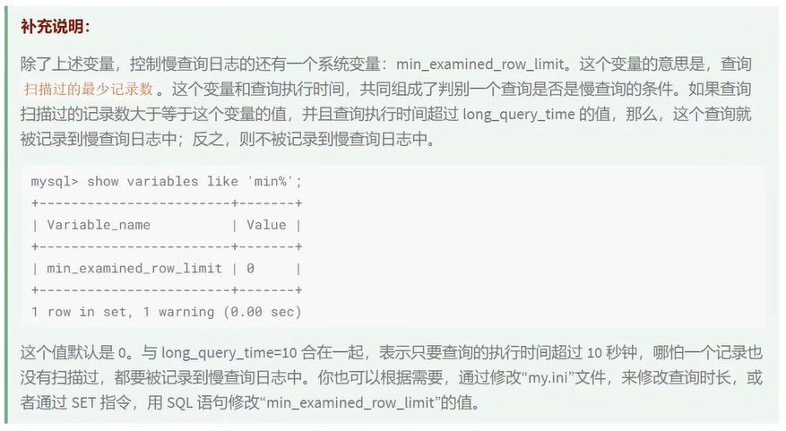

### 4.5 慢查询日志分析工具：mysqldumpslow

在生产环境中，如果要手工分析日志，查找、分析SQL，显然是个体力活，MySQL提供了日志分析工具 `mysqldumpslow` 。

查看mysqldumpslow的帮助信息

```properties
mysqldumpslow --help
```

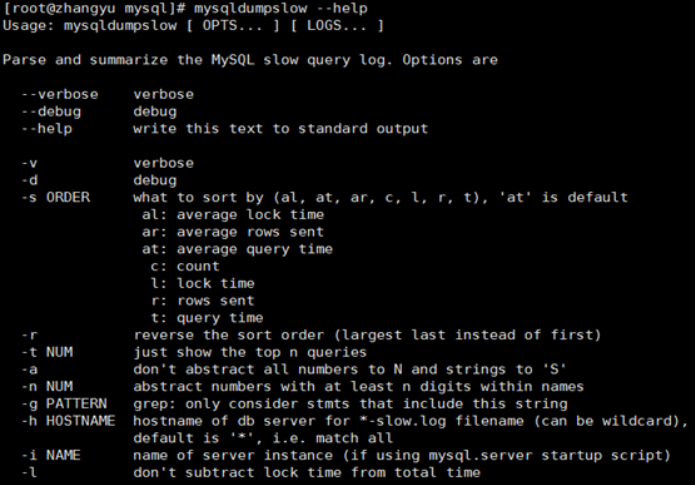

mysqldumpslow 命令的具体参数如下：

* -a: 不将数字抽象成N，字符串抽象成S
* -s: 是表示按照何种方式排序：
  * c: 访问次数 
  * l: 锁定时间 
  * r: 返回记录 
  * t: 查询时间 
  * al:平均锁定时间 
  * ar:平均返回记录数 
  * at:平均查询时间 （默认方式） 
  * ac:平均查询次数
* -t: 即为返回前面多少条的数据；
* -g: 后边搭配一个正则匹配模式，大小写不敏感的；

举例：我们想要按照查询时间排序，查看前五条 SQL 语句，这样写即可：

```properties
mysqldumpslow -s t -t 5 /var/lib/mysql/atguigu01-slow.log
```

```properties
[root@bogon ~]# mysqldumpslow -s t -t 5 /var/lib/mysql/atguigu01-slow.log

Reading mysql slow query log from /var/lib/mysql/atguigu01-slow.log
Count: 1 Time=2.39s (2s) Lock=0.00s (0s) Rows=13.0 (13), root[root]@localhost
SELECT * FROM student WHERE name = 'S'

Count: 1 Time=2.09s (2s) Lock=0.00s (0s) Rows=2.0 (2), root[root]@localhost
SELECT * FROM student WHERE stuno = N

Died at /usr/bin/mysqldumpslow line 162, <> chunk 2.
```

**工作常用参考：**

```properties
#得到返回记录集最多的10个SQL
mysqldumpslow -s r -t 10 /var/lib/mysql/atguigu-slow.log

#得到访问次数最多的10个SQL
mysqldumpslow -s c -t 10 /var/lib/mysql/atguigu-slow.log

#得到按照时间排序的前10条里面含有左连接的查询语句
mysqldumpslow -s t -t 10 -g "left join" /var/lib/mysql/atguigu-slow.log

#另外建议在使用这些命令时结合 | 和more 使用 ，否则有可能出现爆屏情况
mysqldumpslow -s r -t 10 /var/lib/mysql/atguigu-slow.log | more
```

### 4.6 关闭慢查询日志

MySQL服务器停止慢查询日志功能有两种方法：

**方式1：永久性方式**

```properties
[mysqld]
slow_query_log=OFF
```

或者，把slow_query_log一项注释掉 或 删除

```properties
[mysqld]
#slow_query_log =OFF
```

重启MySQL服务，执行如下语句查询慢日志功能。

```mysql
SHOW VARIABLES LIKE '%slow%'; #查询慢查询日志所在目录
SHOW VARIABLES LIKE '%long_query_time%'; #查询超时时长
```

**方式2：临时性方式**

使用SET语句来设置。 

（1）停止MySQL慢查询日志功能，具体SQL语句如下。

```mysql
SET GLOBAL slow_query_log=off;
```

（2）**重启MySQL服务**，使用SHOW语句查询慢查询日志功能信息，具体SQL语句如下。

```mysql
SHOW VARIABLES LIKE '%slow%';
#以及
SHOW VARIABLES LIKE '%long_query_time%';
```

### 4.7 删除慢查询日志

使用SHOW语句显示慢查询日志信息，具体SQL语句如下。

```mysql
SHOW VARIABLES LIKE `slow_query_log%`;
```

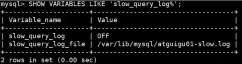

从执行结果可以看出，慢查询日志的目录默认为MySQL的数据目录，在该目录下 `手动删除慢查询日志文件` 即可。

使用命令 `mysqladmin flush-logs` 来重新生成查询日志文件，具体命令如下，执行完毕会在数据目录下重新生成慢查询日志文件。

```properties
mysqladmin -uroot -p flush-logs slow
```

> 提示
>
> 慢查询日志都是使用mysqladmin flush-logs命令来删除重建的。使用时一定要注意，一旦执行了这个命令，慢查询日志都只存在新的日志文件中，如果需要旧的查询日志，就必须事先备份。

## 5. 查看 SQL 执行成本：SHOW PROFILE

show profile 在《逻辑架构》章节中讲过，这里作为复习。

show profile 是 MySQL 提供的可以用来分析当前会话中 SQL 都做了什么、执行的资源消耗工具的情况，可用于 sql 调优的测量。`默认情况下处于关闭状态`，并保存最近15次的运行结果。

我们可以在会话级别开启这个功能。

```mysql
mysql > show variables like 'profiling';
```

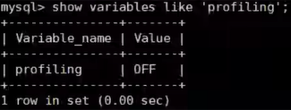

通过设置 profiling='ON' 来开启 show profile:

```mysql
mysql > set profiling = 'ON';
```

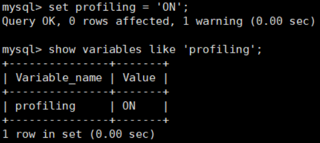

然后执行相关的查询语句。接着看下当前会话都有哪些 profiles，使用下面这条命令：

```mysql
mysql > show profiles;
```

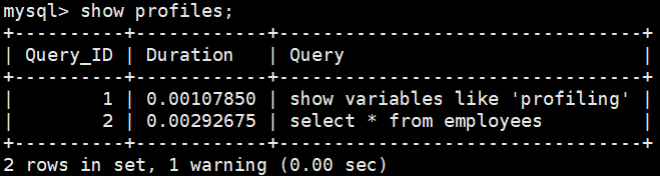

你能看到当前会话一共有 2 个查询。如果我们想要查看最近一次查询的开销，可以使用：

```mysql
mysql > show profile;
```


```mysql
mysql> show profile cpu,block io for query 2
```

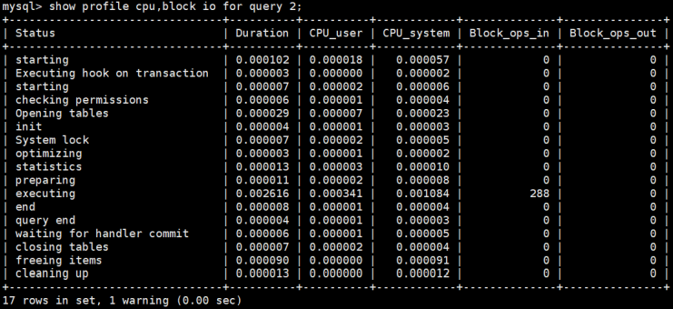

**show profile的常用查询参数： **

① ALL：显示所有的开销信息。 

② BLOCK IO：显示块IO开销。 

③ CONTEXT SWITCHES：上下文切换开销。 

④ CPU：显示CPU开销信息。 

⑤ IPC：显示发送和接收开销信息。

⑥ MEMORY：显示内存开销信 息。 

⑦ PAGE FAULTS：显示页面错误开销信息。 

⑧ SOURCE：显示和Source_function，Source_file， Source_line相关的开销信息。 

⑨ SWAPS：显示交换次数开销信息。

**日常开发需注意的结论：**

① `converting HEAP to MyISAM`: 查询结果太大，内存不够，数据往磁盘上搬了。 

② `Creating tmp table`：创建临时表。先拷贝数据到临时表，用完后再删除临时表。 

③ `Copying to tmp table on disk`：把内存中临时表复制到磁盘上，警惕！ 

④ `locked`。 

如果在show profile诊断结果中出现了以上4条结果中的任何一条，则sql语句需要优化。

**注意：**

不过SHOW PROFILE命令将被启用，我们可以从 information_schema 中的 profiling 数据表进行查看。

## 6. 分析查询语句：EXPLAIN

### 6.1 概述


**1. 能做什么？**

* 表的读取顺序
* 数据读取操作的操作类型
* 哪些索引可以使用
* 哪些索引被实际使用
* 表之间的引用
* 每张表有多少行被优化器查询

**2. 官网介绍**

https://dev.mysql.com/doc/refman/5.7/en/explain-output.html 

https://dev.mysql.com/doc/refman/8.0/en/explain-output.html

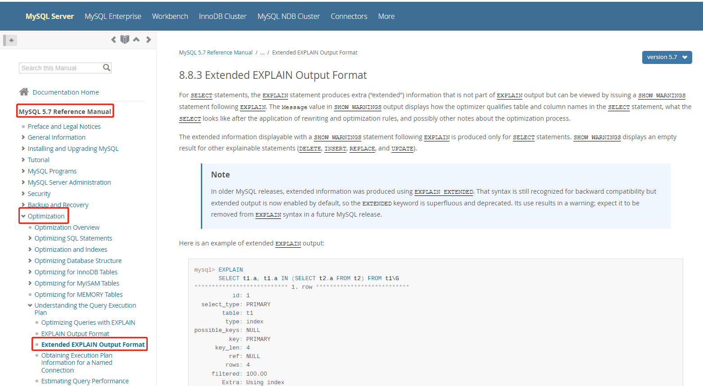

**3. 版本情况**

* MySQL 5.6.3以前只能 EXPLAIN SELECT ；MYSQL 5.6.3以后就可以 EXPLAIN SELECT，UPDATE， DELETE 
* 在5.7以前的版本中，想要显示 partitions 需要使用 explain partitions 命令；想要显示 filtered 需要使用 explain extended 命令。在5.7版本后，默认explain直接显示partitions和 filtered中的信息。

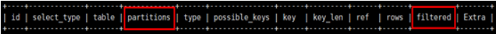

### 6.2 基本语法

EXPLAIN 或 DESCRIBE语句的语法形式如下：

```mysql
EXPLAIN SELECT select_options
或者
DESCRIBE SELECT select_options
```

如果我们想看看某个查询的执行计划的话，可以在具体的查询语句前边加一个 EXPLAIN ，就像这样：

```mysql
mysql> EXPLAIN SELECT 1;
```

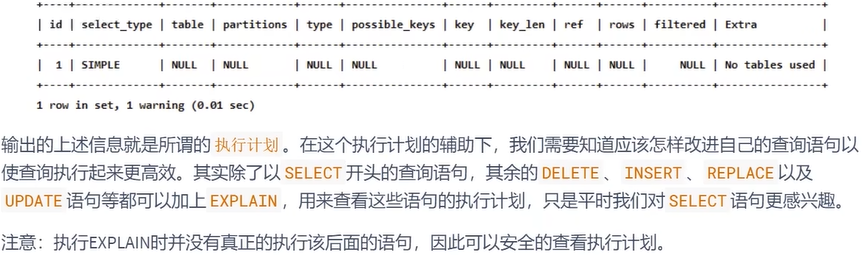

EXPLAIN 语句输出的各个列的作用如下：

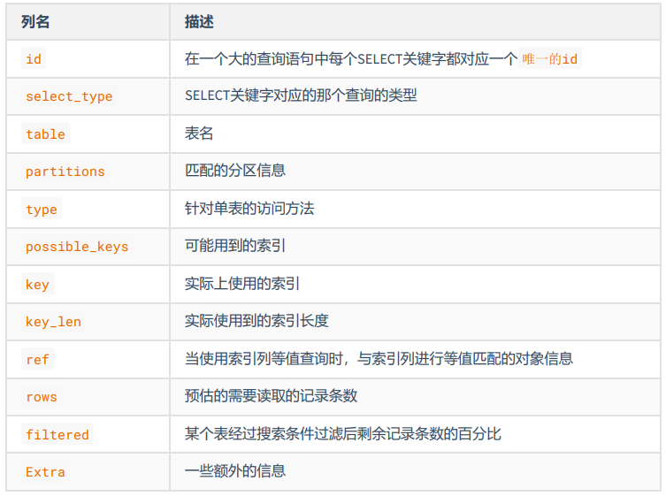

在这里把它们都列出来知识为了描述一个轮廓，让大家有一个大致的印象。

### 6.3 数据准备

**1. 建表**

```mysql
CREATE TABLE s1 (
    id INT AUTO_INCREMENT,
    key1 VARCHAR(100),
    key2 INT,
    key3 VARCHAR(100),
    key_part1 VARCHAR(100),
    key_part2 VARCHAR(100),
    key_part3 VARCHAR(100),
    common_field VARCHAR(100),
    PRIMARY KEY (id),
    INDEX idx_key1 (key1),
    UNIQUE INDEX idx_key2 (key2),
    INDEX idx_key3 (key3),
    INDEX idx_key_part(key_part1, key_part2, key_part3)
) ENGINE=INNODB CHARSET=utf8;
```

```mysql
CREATE TABLE s2 (
    id INT AUTO_INCREMENT,
    key1 VARCHAR(100),
    key2 INT,
    key3 VARCHAR(100),
    key_part1 VARCHAR(100),
    key_part2 VARCHAR(100),
    key_part3 VARCHAR(100),
    common_field VARCHAR(100),
    PRIMARY KEY (id),
    INDEX idx_key1 (key1),
    UNIQUE INDEX idx_key2 (key2),
    INDEX idx_key3 (key3),
    INDEX idx_key_part(key_part1, key_part2, key_part3)
) ENGINE=INNODB CHARSET=utf8;
```

**2. 设置参数 log_bin_trust_function_creators**

创建函数，假如报错，需开启如下命令：允许创建函数设置：

```mysql
set global log_bin_trust_function_creators=1; # 不加global只是当前窗口有效。
```

**3. 创建函数**

```mysql
DELIMITER //
CREATE FUNCTION rand_string1(n INT)
	RETURNS VARCHAR(255) #该函数会返回一个字符串
BEGIN
	DECLARE chars_str VARCHAR(100) DEFAULT
'abcdefghijklmnopqrstuvwxyzABCDEFJHIJKLMNOPQRSTUVWXYZ';
    DECLARE return_str VARCHAR(255) DEFAULT '';
    DECLARE i INT DEFAULT 0;
    WHILE i < n DO
        SET return_str =CONCAT(return_str,SUBSTRING(chars_str,FLOOR(1+RAND()*52),1));
        SET i = i + 1;
    END WHILE;
    RETURN return_str;
END //
DELIMITER ;
```

**4. 创建存储过程**

创建往s1表中插入数据的存储过程：

```mysql
DELIMITER //
CREATE PROCEDURE insert_s1 (IN min_num INT (10),IN max_num INT (10))
BEGIN
    DECLARE i INT DEFAULT 0;
    SET autocommit = 0;
    REPEAT
    SET i = i + 1;
    INSERT INTO s1 VALUES(
        (min_num + i),
        rand_string1(6),
        (min_num + 30 * i + 5),
        rand_string1(6),
        rand_string1(10),
        rand_string1(5),
        rand_string1(10),
        rand_string1(10));
    UNTIL i = max_num
    END REPEAT;
    COMMIT;
END //
DELIMITER ;
```

创建往s2表中插入数据的存储过程：

```mysql
DELIMITER //
CREATE PROCEDURE insert_s2 (IN min_num INT (10),IN max_num INT (10))
BEGIN
    DECLARE i INT DEFAULT 0;
    SET autocommit = 0;
    REPEAT
    SET i = i + 1;
    INSERT INTO s2 VALUES(
        (min_num + i),
        rand_string1(6),
        (min_num + 30 * i + 5),
        rand_string1(6),
        rand_string1(10),
        rand_string1(5),
        rand_string1(10),
        rand_string1(10));
    UNTIL i = max_num
    END REPEAT;
    COMMIT;
END //
DELIMITER ;
```

**5. 调用存储过程**

s1表数据的添加：加入1万条记录：

```mysql
CALL insert_s1(10001,10000);
```

s2表数据的添加：加入1万条记录：

```mysql
CALL insert_s2(10001,10000);
```

### 6.4 EXPLAIN各列作用

为了让大家有比较好的体验，我们调整了下 `EXPLAIN` 输出列的顺序。

#### 1. table

不论我们的查询语句有多复杂，里边儿 包含了多少个表 ，到最后也是需要对每个表进行 单表访问 的，所 以MySQL规定EXPLAIN语句输出的每条记录都对应着某个单表的访问方法，该条记录的table列代表着该 表的表名（有时不是真实的表名字，可能是简称）。

```mysql
mysql > EXPLAIN SELECT * FROM s1;
```

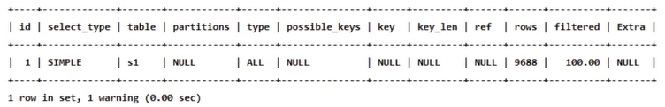

这个查询语句只涉及对s1表的单表查询，所以 `EXPLAIN` 输出中只有一条记录，其中的table列的值为s1，表明这条记录是用来说明对s1表的单表访问方法的。

下边我们看一个连接查询的执行计划

```mysql
mysql > EXPLAIN SELECT * FROM s1 INNER JOIN s2;
```

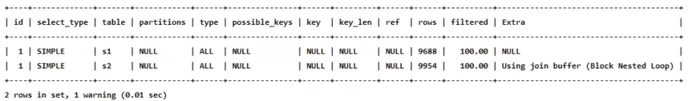

可以看出这个连接查询的执行计划中有两条记录，这两条记录的table列分别是s1和s2，这两条记录用来分别说明对s1表和s2表的访问方法是什么。

#### 2. id

我们写的查询语句一般都以 SELECT 关键字开头，比较简单的查询语句里只有一个 SELECT 关键字，比 如下边这个查询语句：

```mysql
SELECT * FROM s1 WHERE key1 = 'a';
```

稍微复杂一点的连接查询中也只有一个 SELECT 关键字，比如：

```mysql
SELECT * FROM s1 INNER JOIN s2
ON s1.key1 = s2.key1
WHERE s1.common_field = 'a';
```

但是下边两种情况下在一条查询语句中会出现多个SELECT关键字：


```mysql
mysql > EXPLAIN SELECT * FROM s1 WHERE key1 = 'a';
```

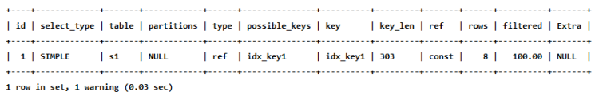

对于连接查询来说，一个SELECT关键字后边的FROM字句中可以跟随多个表，所以在连接查询的执行计划中，每个表都会对应一条记录，但是这些记录的id值都是相同的，比如：

```mysql
mysql> EXPLAIN SELECT * FROM s1 INNER JOIN s2;
```

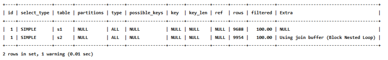

可以看到，上述连接查询中参与连接的s1和s2表分别对应一条记录，但是这两条记录对应的`id`都是1。这里需要大家记住的是，**在连接查询的执行计划中，每个表都会对应一条记录，这些记录的id列的值是相同的**，出现在前边的表表示`驱动表`，出现在后面的表表示`被驱动表`。所以从上边的EXPLAIN输出中我们可以看到，查询优化器准备让s1表作为驱动表，让s2表作为被驱动表来执行查询。

对于包含子查询的查询语句来说，就可能涉及多个`SELECT`关键字，所以在**包含子查询的查询语句的执行计划中，每个`SELECT`关键字都会对应一个唯一的id值，比如这样：

```mysql
mysql> EXPLAIN SELECT * FROM s1 WHERE key1 IN (SELECT key1 FROM s2) OR key3 = 'a';
```

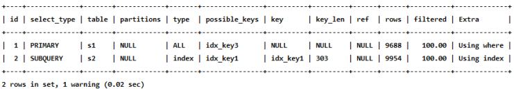


```mysql
# 查询优化器可能对涉及子查询的查询语句进行重写，转变为多表查询的操作。  
mysql> EXPLAIN SELECT * FROM s1 WHERE key1 IN (SELECT key2 FROM s2 WHERE common_field = 'a');
```

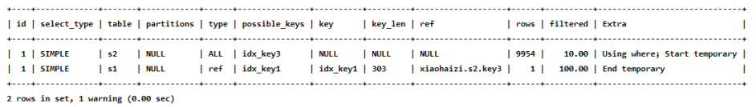

可以看到，虽然我们的查询语句是一个子查询，但是执行计划中s1和s2表对应的记录的`id`值全部是1，这就表明`查询优化器将子查询转换为了连接查询`。

对于包含`UNION`子句的查询语句来说，每个`SELECT`关键字对应一个`id`值也是没错的，不过还是有点儿特别的东西，比方说下边的查询：

```mysql
# Union去重
mysql> EXPLAIN SELECT * FROM s1 UNION SELECT * FROM s2;
```

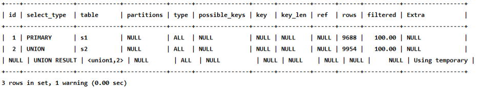


```mysql
mysql> EXPLAIN SELECT * FROM s1 UNION ALL SELECT * FROM s2;
```

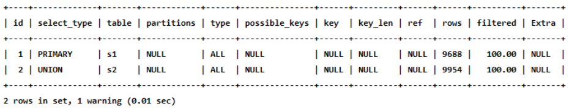

**小结:**

* id如果相同，可以认为是一组，从上往下顺序执行 
* 在所有组中，id值越大，优先级越高，越先执行 
* 关注点：id号每个号码，表示一趟独立的查询, 一个sql的查询趟数越少越好

#### 3. select_type


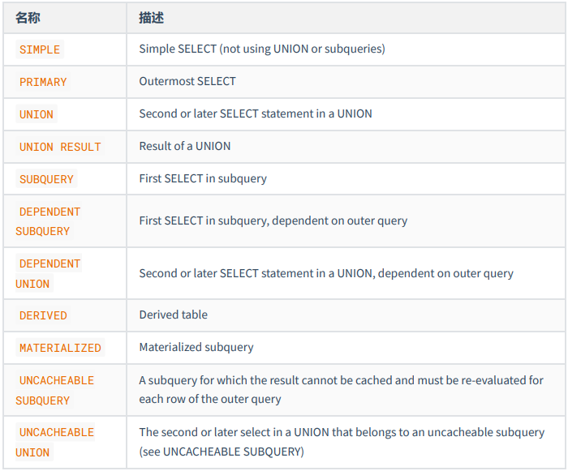

具体分析如下：

* SIMPLE

  查询语句中不包含`UNION`或者子查询的查询都算作是`SIMPLE`类型，比方说下边这个单表查询`select_type`的值就是`SIMPLE`:

  ```mysql
  mysql> EXPLAIN SELECT * FROM s1;
  ```

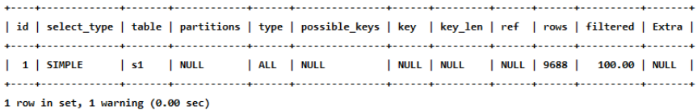

​        当然，连接查询也算是 SIMPLE 类型，比如：

```mysql
mysql> EXPLAIN SELECT * FROM s1 INNER JOIN s2;
```

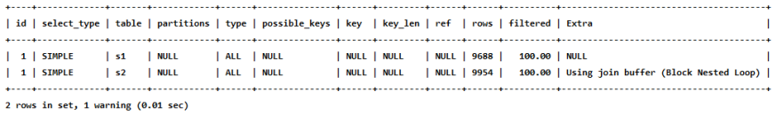

* PRIMARY

  对于包含`UNION、UNION ALL`或者子查询的大查询来说，它是由几个小查询组成的，其中最左边的那个查询的`select_type`的值就是`PRIMARY`,比方说：

  ```mysql
  mysql> EXPLAIN SELECT * FROM s1 UNION SELECT * FROM s2;
  ```

  

  从结果中可以看到，最左边的小查询`SELECT * FROM s1`对应的是执行计划中的第一条记录，它的`select_type`的值就是`PRIMARY`。

* UNION

  对于包含`UNION`或者`UNION ALL`的大查询来说，它是由几个小查询组成的，其中除了最左边的那个小查询意外，其余的小查询的`select_type`值就是UNION，可以对比上一个例子的效果。

* UNION RESULT

  MySQL 选择使用临时表来完成`UNION`查询的去重工作，针对该临时表的查询的`select_type`就是`UNION RESULT`, 例子上边有。

* SUBQUERY

  如果包含子查询的查询语句不能够转为对应的`semi-join`的形式，并且该子查询是不相关子查询，并且查询优化器决定采用将该子查询物化的方案来执行该子查询时，该子查询的第一个`SELECT`关键字代表的那个查询的`select_type`就是`SUBQUERY`，比如下边这个查询：

  ```mysql
  mysql> EXPLAIN SELECT * FROM s1 WHERE key1 IN (SELECT key1 FROM s2) OR key3 = 'a';
  ```

  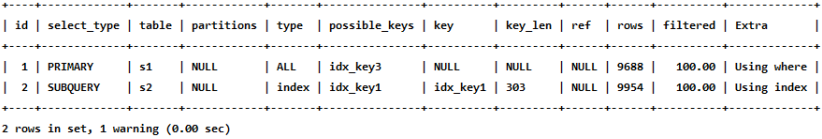

* DEPENDENT SUBQUERY

  ```mysql
  mysql> EXPLAIN SELECT * FROM s1 WHERE key1 IN (SELECT key1 FROM s2 WHERE s1.key2 = s2.key2) OR key3 = 'a';
  ```

  

* DEPENDENT UNION

  ```mysql
  mysql> EXPLAIN SELECT * FROM s1 WHERE key1 IN (SELECT key1 FROM s2 WHERE key1 = 'a' UNION SELECT key1 FROM s1 WHERE key1 = 'b');
  ```

  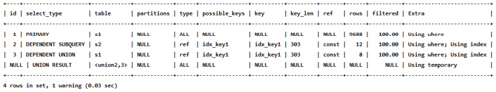

* DERIVED

  ```mysql
  mysql> EXPLAIN SELECT * FROM (SELECT key1, count(*) as c FROM s1 GROUP BY key1) AS derived_s1 where c > 1;
  ```

  

  从执行计划中可以看出，id为2的记录就代表子查询的执行方式，它的select_type是DERIVED, 说明该子查询是以物化的方式执行的。id为1的记录代表外层查询，大家注意看它的table列显示的是derived2，表示该查询时针对将派生表物化之后的表进行查询的。

* MATERIALIZED

  当查询优化器在执行包含子查询的语句时，选择将子查询物化之后的外层查询进行连接查询时，该子查询对应的`select_type`属性就是DERIVED，比如下边这个查询：

  ```mysql
  mysql> EXPLAIN SELECT * FROM s1 WHERE key1 IN (SELECT key1 FROM s2);
  ```

  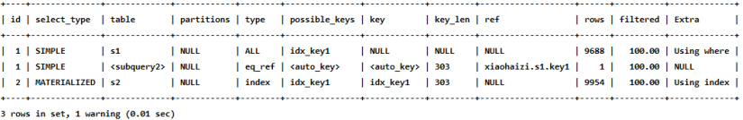

* UNCACHEABLE SUBQUERY

  不常用，就不多说了。

* UNCACHEABLE UNION

  不常用，就不多说了。

####  4. partitions (可略)

* 代表分区表中的命中情况，非分区表，该项为`NULL`。一般情况下我们的额查询语句的执行计划的`partitions`列的值为`NULL`。
* <a>https://dev.mysql.com/doc/refman/5.7/en/alter-table-partition-operations.html</a>
* 如果想详细了解，可以如下方式测试。创建分区表：

```mysql
-- 创建分区表，
-- 按照id分区，id<100 p0分区，其他p1分区
CREATE TABLE user_partitions (id INT auto_increment,
NAME VARCHAR(12),PRIMARY KEY(id))
PARTITION BY RANGE(id)(
PARTITION p0 VALUES less than(100),
PARTITION p1 VALUES less than MAXVALUE
);
```

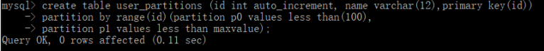

```mysql
DESC SELECT * FROM user_partitions WHERE id>200;
```

查询id大于200（200>100，p1分区）的记录，查看执行计划，partitions是p1，符合我们的分区规则

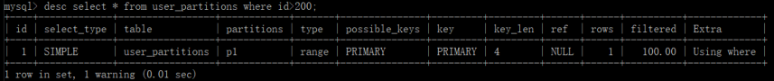

#### 5. type ☆

执行计划的一条记录就代表着MySQL对某个表的 `执行查询时的访问方法` , 又称“访问类型”，其中的 `type` 列就表明了这个访问方法是啥，是较为重要的一个指标。比如，看到`type`列的值是`ref`，表明`MySQL`即将使用`ref`访问方法来执行对`s1`表的查询。

完整的访问方法如下： `system ， const ， eq_ref ， ref ， fulltext ， ref_or_null ， index_merge ， unique_subquery ， index_subquery ， range ， index ， ALL` 。

我们详细解释一下：

* `system`

  当表中`只有一条记录`并且该表使用的存储引擎的统计数据是精确的，比如MyISAM、Memory，那么对该表的访问方法就是`system`。比方说我们新建一个`MyISAM`表，并为其插入一条记录：

  ```mysql
  mysql> CREATE TABLE t(i int) Engine=MyISAM;
  Query OK, 0 rows affected (0.05 sec)
  
  mysql> INSERT INTO t VALUES(1);
  Query OK, 1 row affected (0.01 sec)
  ```

  然后我们看一下查询这个表的执行计划：

  ```mysql
  mysql> EXPLAIN SELECT * FROM t;
  ```

  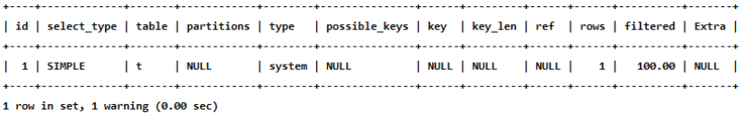

  可以看到`type`列的值就是`system`了，

  > 测试，可以把表改成使用InnoDB存储引擎，试试看执行计划的`type`列是什么。ALL

* `const`

  当我们根据主键或者唯一二级索引列与常数进行等值匹配时，对单表的访问方法就是`const`, 比如：

  ```mysql
  mysql> EXPLAIN SELECT * FROM s1 WHERE id = 10005;
  ```

  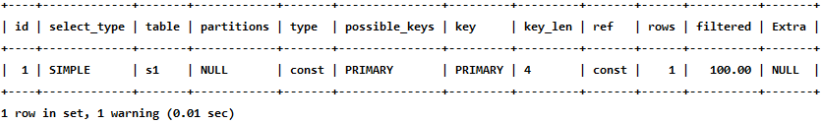

* `eq_ref`

  在连接查询时，如果被驱动表是通过主键或者唯一二级索引列等值匹配的方式进行访问的（如果该主键或者唯一二级索引是联合索引的话，所有的索引列都必须进行等值比较）。则对该被驱动表的访问方法就是`eq_ref`，比方说：

  ```mysql
  mysql> EXPLAIN SELECT * FROM s1 INNER JOIN s2 ON s1.id = s2.id;
  ```

  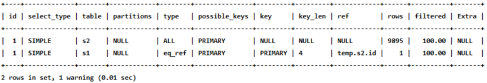

  从执行计划的结果中可以看出，MySQL打算将s2作为驱动表，s1作为被驱动表，重点关注s1的访问 方法是 `eq_ref` ，表明在访问s1表的时候可以 `通过主键的等值匹配` 来进行访问。

* `ref`

  当通过普通的二级索引列与常量进行等值匹配时来查询某个表，那么对该表的访问方法就可能是`ref`，比方说下边这个查询：

  ```mysql
  mysql> EXPLAIN SELECT * FROM s1 WHERE key1 = 'a';
  ```

  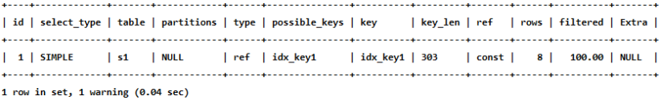

* `fulltext`

  全文索引

* `ref_or_null`

  当对普通二级索引进行等值匹配查询，该索引列的值也可以是`NULL`值时，那么对该表的访问方法就可能是`ref_or_null`，比如说：

  ```mysql
  mysql> EXPLAIN SELECT * FROM s1 WHERE key1 = 'a' OR key1 IS NULL;
  ```

  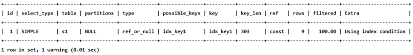

* `index_merge`

  一般情况下对于某个表的查询只能使用到一个索引，但单表访问方法时在某些场景下可以使用`Interseation、union、Sort-Union`这三种索引合并的方式来执行查询。我们看一下执行计划中是怎么体现MySQL使用索引合并的方式来对某个表执行查询的：

  ```mysql
  mysql> EXPLAIN SELECT * FROM s1 WHERE key1 = 'a' OR key3 = 'a';
  ```

  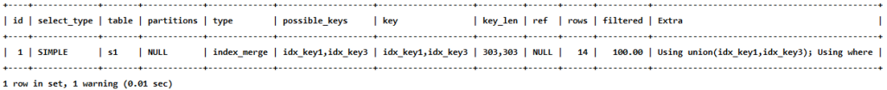

  从执行计划的 `type` 列的值是 `index_merge` 就可以看出，MySQL 打算使用索引合并的方式来执行 对 s1 表的查询。

* `unique_subquery`

  类似于两表连接中被驱动表的`eq_ref`访问方法，`unique_subquery`是针对在一些包含`IN`子查询的查询语句中，如果查询优化器决定将`IN`子查询转换为`EXISTS`子查询，而且子查询可以使用到主键进行等值匹配的话，那么该子查询执行计划的`type`列的值就是`unique_subquery`，比如下边的这个查询语句：

  ```mysql
  mysql> EXPLAIN SELECT * FROM s1 WHERE key2 IN (SELECT id FROM s2 where s1.key1 = s2.key1) OR key3 = 'a';
  ```

  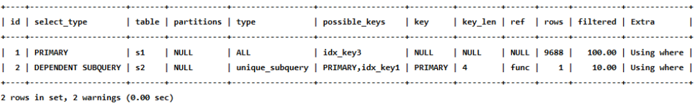

+ `index_subquery`

  `index_subquery` 与 `unique_subquery` 类似，只不过访问子查询中的表时使用的是普通的索引，比如这样：

  ```mysql
  mysql> EXPLAIN SELECT * FROM s1 WHERE common_field IN (SELECT key3 FROM s2 where s1.key1 = s2.key1) OR key3 = 'a';
  ```

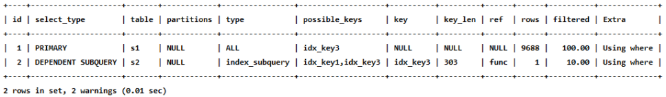

* `range`

  ```mysql
  mysql> EXPLAIN SELECT * FROM s1 WHERE key1 IN ('a', 'b', 'c');
  ```

  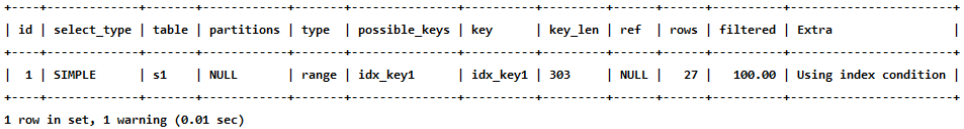

  或者：

  ```mysql
  mysql> EXPLAIN SELECT * FROM s1 WHERE key1 > 'a' AND key1 < 'b';
  ```

  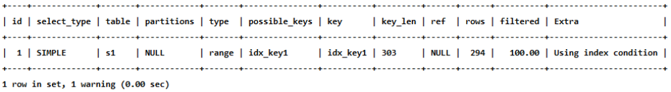

* `index`

  当我们可以使用索引覆盖，但需要扫描全部的索引记录时，该表的访问方法就是`index`，比如这样：

  ```mysql
  mysql> EXPLAIN SELECT key_part2 FROM s1 WHERE key_part3 = 'a';
  ```

  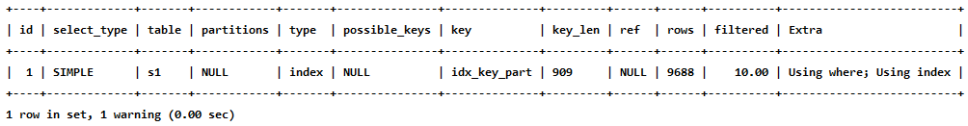

  上述查询中的所有列表中只有key_part2 一个列，而且搜索条件中也只有 key_part3 一个列，这两个列又恰好包含在idx_key_part这个索引中，可是搜索条件key_part3不能直接使用该索引进行`ref`和`range`方式的访问，只能扫描整个`idx_key_part`索引的记录，所以查询计划的`type`列的值就是`index`。

  > 再一次强调，对于使用InnoDB存储引擎的表来说，二级索引的记录只包含索引列和主键列的值，而聚簇索引中包含用户定义的全部列以及一些隐藏列，所以扫描二级索引的代价比直接全表扫描，也就是扫描聚簇索引的代价更低一些。

* `ALL`

  最熟悉的全表扫描，就不多说了，直接看例子：

  ```mysql
  mysql> EXPLAIN SELECT * FROM s1;
  ```

  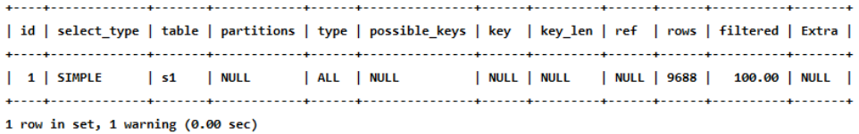

**小结: **

**结果值从最好到最坏依次是： **

**system > const > eq_ref > ref** > fulltext > ref_or_null > index_merge > unique_subquery > index_subquery > range > index > ALL 

**其中比较重要的几个提取出来（见上图中的粗体）。SQL 性能优化的目标：至少要达到 range 级别，要求是 ref 级别，最好是 consts级别。（阿里巴巴 开发手册要求）**

####  6. possible_keys和key

在EXPLAIN语句输出的执行计划中，`possible_keys`列表示在某个查询语句中，对某个列执行`单表查询时可能用到的索引`有哪些。一般查询涉及到的字段上若存在索引，则该索引将被列出，但不一定被查询使用。`key`列表示`实际用到的索引`有哪些，如果为NULL，则没有使用索引。比方说下面这个查询：

```mysql
mysql> EXPLAIN SELECT * FROM s1 WHERE key1 > 'z' AND key3 = 'a';
```

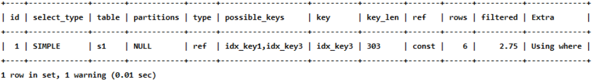

上述执行计划的`possible_keys`列的值是`idx_key1, idx_key3`，表示该查询可能使用到`idx_key1, idx_key3`两个索引，然后`key`列的值是`idx_key3`，表示经过查询优化器计算使用不同索引的成本后，最后决定采用`idx_key3`。

#### 7. key_len ☆

实际使用到的索引长度 (即：字节数)

帮你检查`是否充分的利用了索引`，`值越大越好`，主要针对于联合索引，有一定的参考意义。

```mysql
mysql> EXPLAIN SELECT * FROM s1 WHERE id = 10005;
```

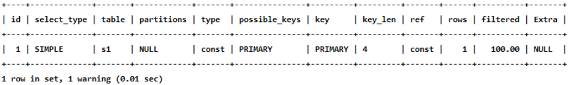

> int 占用 4 个字节

```mysql
mysql> EXPLAIN SELECT * FROM s1 WHERE key2 = 10126;
```

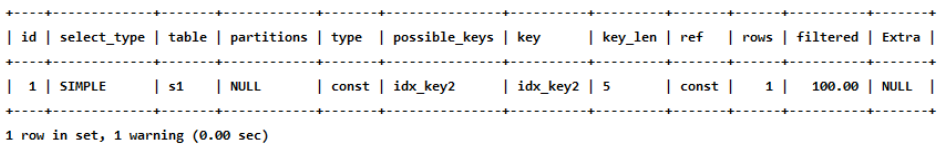

> key2上有一个唯一性约束，是否为NULL占用一个字节，那么就是5个字节

```mysql
mysql> EXPLAIN SELECT * FROM s1 WHERE key1 = 'a';
```

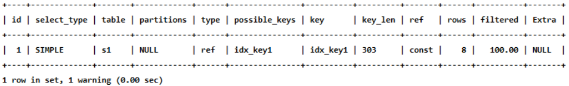

> key1 VARCHAR(100) 一个字符占3个字节，100*3，是否为NULL占用一个字节，varchar的长度信息占两个字节。

```mysql
mysql> EXPLAIN SELECT * FROM s1 WHERE key_part1 = 'a';
```

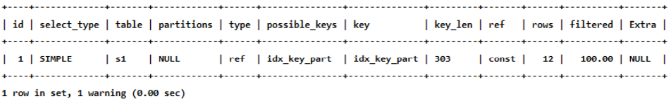

```mysql
mysql> EXPLAIN SELECT * FROM s1 WHERE key_part1 = 'a' AND key_part2 = 'b';
```

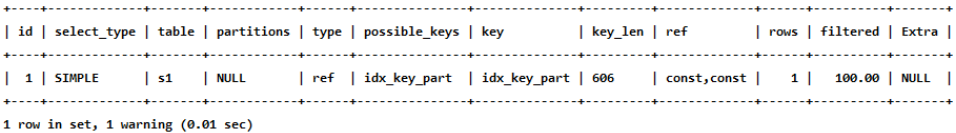

> 联合索引中可以比较，key_len=606的好于key_len=303

**练习： **

key_len的长度计算公式：

```mysql
varchar(10)变长字段且允许NULL = 10 * ( character set：utf8=3,gbk=2,latin1=1)+1(NULL)+2(变长字段)

varchar(10)变长字段且不允许NULL = 10 * ( character set：utf8=3,gbk=2,latin1=1)+2(变长字段)

char(10)固定字段且允许NULL = 10 * ( character set：utf8=3,gbk=2,latin1=1)+1(NULL)

char(10)固定字段且不允许NULL = 10 * ( character set：utf8=3,gbk=2,latin1=1)
```

#### 8. ref


```mysql
mysql> EXPLAIN SELECT * FROM s1 WHERE key1 = 'a';
```

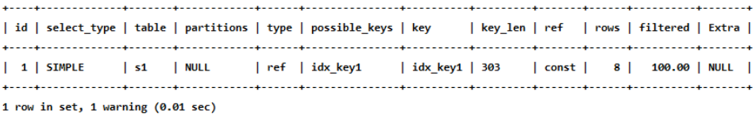

可以看到`ref`列的值是`const`，表明在使用`idx_key1`索引执行查询时，与`key1`列作等值匹配的对象是一个常数，当然有时候更复杂一点:

```mysql
mysql> EXPLAIN SELECT * FROM s1 INNER JOIN s2 ON s1.id = s2.id;
```

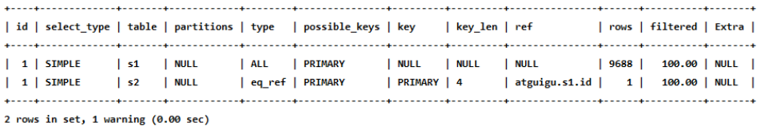

```mysql
mysql> EXPLAIN SELECT * FROM s1 INNER JOIN s2 ON s2.key1 = UPPER(s1.key1);
```

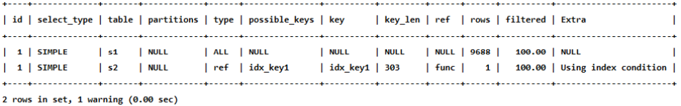

#### 9. rows ☆

预估的需要读取的记录条数，`值越小越好`。

```mysql
mysql> EXPLAIN SELECT * FROM s1 WHERE key1 > 'z';
```

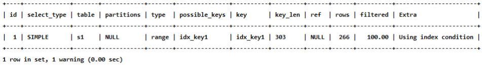

#### 10. filtered

某个表经过搜索条件过滤后剩余记录条数的百分比

如果使用的是索引执行的单表扫描，那么计算时需要估计出满足除使用到对应索引的搜索条件外的其他搜索条件的记录有多少条。

```mysql
mysql> EXPLAIN SELECT * FROM s1 WHERE key1 > 'z' AND common_field = 'a';
```

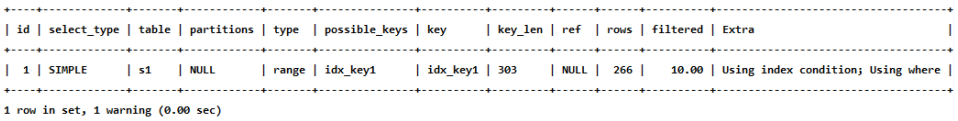

对于单表查询来说，这个filtered的值没有什么意义，我们`更关注在连接查询中驱动表对应的执行计划记录的filtered值`，它决定了被驱动表要执行的次数 (即: rows * filtered)

```mysql
mysql> EXPLAIN SELECT * FROM s1 INNER JOIN s2 ON s1.key1 = s2.key1 WHERE s1.common_field = 'a';
```


从执行计划中可以看出来，查询优化器打算把`s1`作为驱动表，`s2`当做被驱动表。我们可以看到驱动表`s1`表的执行计划的`rows`列为`9688`，filtered列为`10.00`，这意味着驱动表`s1`的扇出值就是`9688 x 10.00% = 968.8`，这说明还要对被驱动表执行大约`968`次查询。

#### 11. Extra ☆

顾名思义，`Extra`列是用来说明一些额外信息的，包含不适合在其他列中显示但十分重要的额外信息。我们可以通过这些额外信息来`更准确的理解MySQL到底将如何执行给定的查询语句`。MySQL提供的额外信息有好几十个，我们就不一个一个介绍了，所以我们只挑选比较重要的额外信息介绍给大家。

* `No tables used`

  当查询语句没有`FROM`子句时将会提示该额外信息，比如：

  ```mysql
  mysql> EXPLAIN SELECT 1;
  ```

  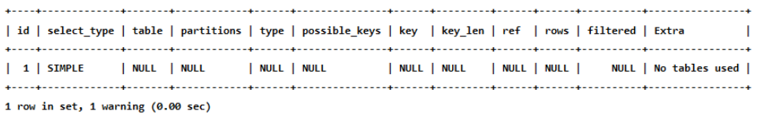

* `Impossible WHERE`

  当查询语句的`WHERE`子句永远为`FALSE`时将会提示该额外信息

  ```mysql
  mysql> EXPLAIN SELECT * FROM s1 WHERE 1 != 1;
  ```

  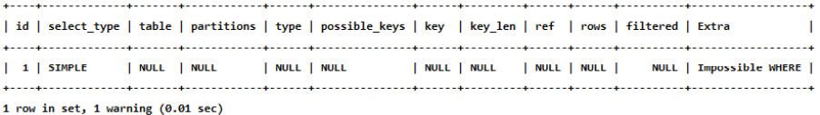

* `Using where`

  

  ```mysql
  mysql> EXPLAIN SELECT * FROM s1 WHERE common_field = 'a';
  ```

  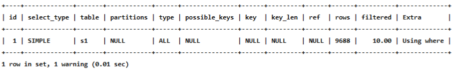

  

  ```mysql
  mysql> EXPLAIN SELECT * FROM s1 WHERE key1 = 'a' AND common_field = 'a';
  ```

  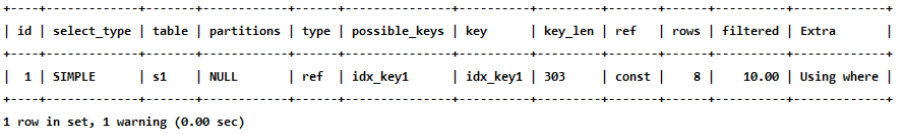

* `No matching min/max row`

  当查询列表处有`MIN`或者`MAX`聚合函数，但是并没有符合`WHERE`子句中的搜索条件的记录时。

  ```mysql
  mysql> EXPLAIN SELECT MIN(key1) FROM s1 WHERE key1 = 'abcdefg';
  ```

  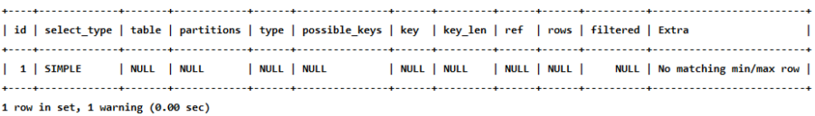

* `Using index`

  当我们的查询列表以及搜索条件中只包含属于某个索引的列，也就是在可以使用覆盖索引的情况下，在`Extra`列将会提示该额外信息。比方说下边这个查询中只需要用到`idx_key1`而不需要回表操作:

  ```mysql
  mysql> EXPLAIN SELECT key1 FROM s1 WHERE key1 = 'a';
  ```

  

* `Using index condition`

  有些搜索条件中虽然出现了索引列，但却不能使用到索引，比如下边这个查询：

  ```mysql
  SELECT * FROM s1 WHERE key1 > 'z' AND key1 LIKE '%a';
  ```

  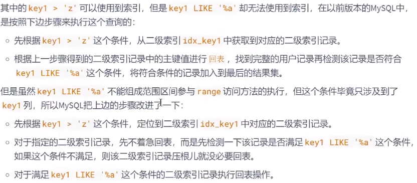

  

  ```mysql
  mysql> EXPLAIN SELECT * FROM s1 WHERE key1 > 'z' AND key1 LIKE '%b';
  ```

  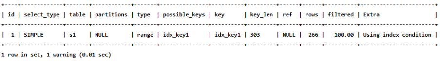

* `Using join buffer (Block Nested Loop)`

  在连接查询执行过程中，当被驱动表不能有效的利用索引加快访问速度，MySQL一般会为其分配一块名叫`join buffer`的内存块来加快查询速度，也就是我们所讲的`基于块的嵌套循环算法`。

  ```mysql
  mysql> EXPLAIN SELECT * FROM s1 INNER JOIN s2 ON s1.common_field = s2.common_field;
  ```

  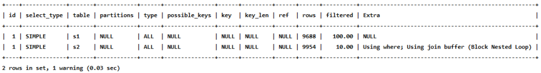

* `Not exists`

  当我们使用左(外)连接时，如果`WHERE`子句中包含要求被驱动表的某个列等于`NULL`值的搜索条件，而且那个列是不允许存储`NULL`值的，那么在该表的执行计划的Extra列就会提示这个信息：

  ```mysql
  mysql> EXPLAIN SELECT * FROM s1 LEFT JOIN s2 ON s1.key1 = s2.key1 WHERE s2.id IS NULL;
  ```

  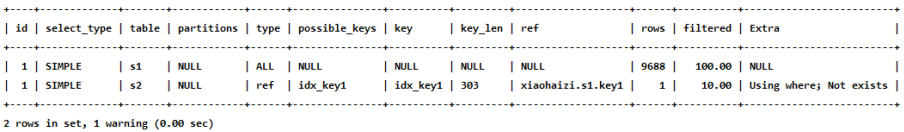

* `Using intersect(...) 、 Using union(...) 和 Using sort_union(...)`

  如果执行计划的`Extra`列出现了`Using intersect(...)`提示，说明准备使用`Intersect`索引合并的方式执行查询，括号中的`...`表示需要进行索引合并的索引名称；

  如果出现`Using union(...)`提示，说明准备使用`Union`索引合并的方式执行查询;

  如果出现`Using sort_union(...)`提示，说明准备使用`Sort-Union`索引合并的方式执行查询。

  ```mysql
  mysql> EXPLAIN SELECT * FROM s1 WHERE key1 = 'a' OR key3 = 'a';
  ```

  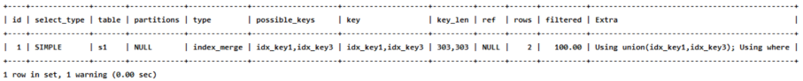

* `Zero limit`

  当我们的`LIMIT`子句的参数为`0`时，表示压根儿不打算从表中读取任何记录，将会提示该额外信息

  ```mysql
  mysql> EXPLAIN SELECT * FROM s1 LIMIT 0;
  ```

  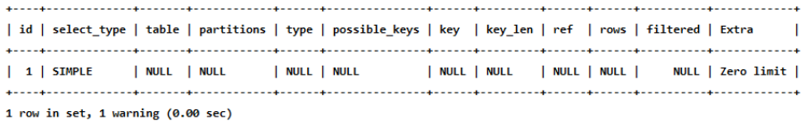

* `Using filesort`

  有一些情况下对结果集中的记录进行排序是可以使用到索引的。

  ```mysql
  mysql> EXPLAIN SELECT * FROM s1 ORDER BY key1 LIMIT 10;
  ```

  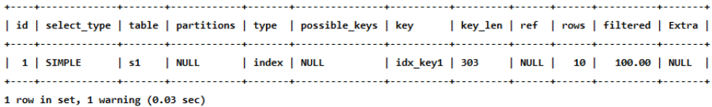

  

  ```mysql
  mysql> EXPLAIN SELECT * FROM s1 ORDER BY common_field LIMIT 10;
  ```

  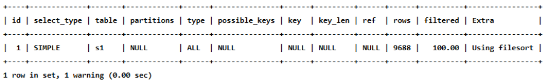

  需要注意的是，如果查询中需要使用`filesort`的方式进行排序的记录非常多，那么这个过程是很耗费性能的，我们最好想办法`将使用文件排序的执行方式改为索引进行排序`。

* `Using temporary`

  

  ```mysql
  mysql> EXPLAIN SELECT DISTINCT common_field FROM s1;
  ```

  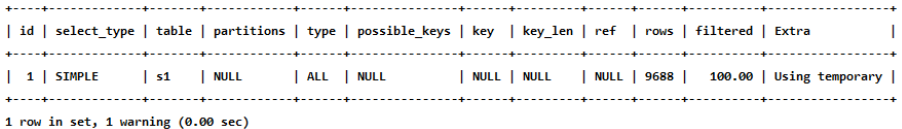

  再比如：

  ```mysql
  mysql> EXPLAIN SELECT common_field, COUNT(*) AS amount FROM s1 GROUP BY common_field;
  ```

  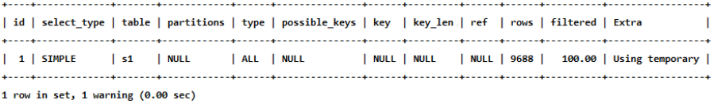

  执行计划中出现`Using temporary`并不是一个好的征兆，因为建立与维护临时表要付出很大的成本的，所以我们`最好能使用索引来替代掉使用临时表`，比方说下边这个包含`GROUP BY`子句的查询就不需要使用临时表：

  ```mysql
  mysql> EXPLAIN SELECT key1, COUNT(*) AS amount FROM s1 GROUP BY key1;
  ```

  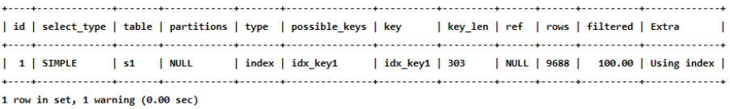

  从 `Extra` 的 `Using index` 的提示里我们可以看出，上述查询只需要扫描 `idx_key1` 索引就可以搞 定了，不再需要临时表了。

* 其他

  其它特殊情况这里省略。

#### 12. 小结

* EXPLAIN不考虑各种Cache 
* EXPLAIN不能显示MySQL在执行查询时所作的优化工作 
* EXPLAIN不会告诉你关于触发器、存储过程的信息或用户自定义函数对查询的影响情况 
* 部分统计信息是估算的，并非精确值

## 7. EXPLAIN的进一步使用

### 7.1 EXPLAIN四种输出格式

这里谈谈EXPLAIN的输出格式。EXPLAIN可以输出四种格式： `传统格式` ，`JSON格式` ， `TREE格式` 以及 `可视化输出` 。用户可以根据需要选择适用于自己的格式。

#### 1. 传统格式

传统格式简单明了，输出是一个表格形式，概要说明查询计划。

```mysql
mysql> EXPLAIN SELECT s1.key1, s2.key1 FROM s1 LEFT JOIN s2 ON s1.key1 = s2.key1 WHERE s2.common_field IS NOT NULL;
```

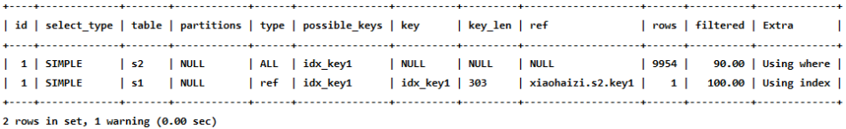

#### 2. JSON格式

第1种格式中介绍的`EXPLAIN`语句输出中缺少了一个衡量执行好坏的重要属性 —— `成本`。而JSON格式是四种格式里面输出`信息最详尽`的格式，里面包含了执行的成本信息。

* JSON格式：在EXPLAIN单词和真正的查询语句中间加上 FORMAT=JSON 。

```mysql
EXPLAIN FORMAT=JSON SELECT ....
```

* EXPLAIN的Column与JSON的对应关系：(来源于MySQL 5.7文档)

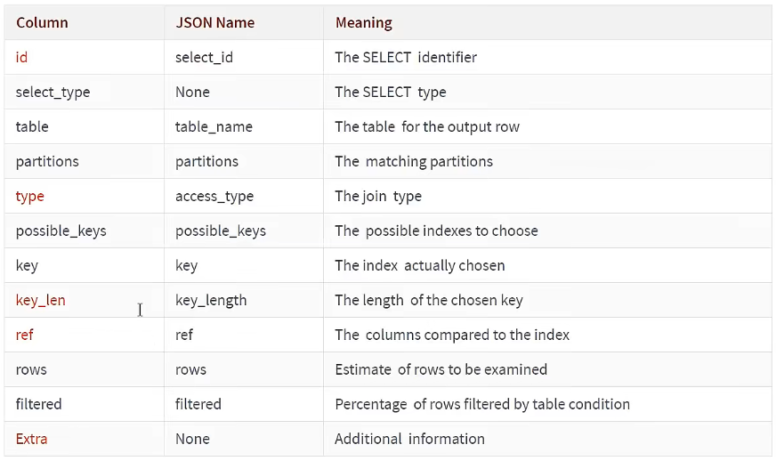

这样我们就可以得到一个json格式的执行计划，里面包含该计划花费的成本。比如这样：

```mysql
mysql> EXPLAIN FORMAT=JSON SELECT * FROM s1 INNER JOIN s2 ON s1.key1 = s2.key2 WHERE s1.common_field = 'a'\G
```


我们使用 # 后边跟随注释的形式为大家解释了 `EXPLAIN FORMAT=JSON` 语句的输出内容，但是大家可能 有疑问 "`cost_info`" 里边的成本看着怪怪的，它们是怎么计算出来的？先看 s1 表的 "`cost_info`" 部 分：

```
"cost_info": {
    "read_cost": "1840.84",
    "eval_cost": "193.76",
    "prefix_cost": "2034.60",
    "data_read_per_join": "1M"
}
```

* `read_cost` 是由下边这两部分组成的：

  * IO 成本
  * 检测 rows × (1 - filter) 条记录的 CPU 成本

  > 小贴士： rows和filter都是我们前边介绍执行计划的输出列，在JSON格式的执行计划中，rows 相当于rows_examined_per_scan，filtered名称不变。

+ `eval_cost` 是这样计算的：

  检测 rows × filter 条记录的成本。

+ `prefix_cost` 就是单独查询 s1 表的成本，也就是：

  `read_cost + eval_cost`

+ `data_read_per_join` 表示在此次查询中需要读取的数据量。

对于 `s2` 表的 "`cost_info`" 部分是这样的：

```
"cost_info": {
    "read_cost": "968.80",
    "eval_cost": "193.76",
    "prefix_cost": "3197.16",
    "data_read_per_join": "1M"
}
```

由于 `s2` 表是被驱动表，所以可能被读取多次，这里的`read_cost` 和 `eval_cost` 是访问多次 `s2` 表后累加起来的值，大家主要关注里边儿的 `prefix_cost` 的值代表的是整个连接查询预计的成本，也就是单次查询 `s1` 表和多次查询 `s2` 表后的成本的和，也就是：

```
968.80 + 193.76 + 2034.60 = 3197.16
```

#### 3. TREE格式

TREE格式是8.0.16版本之后引入的新格式，主要根据查询的 `各个部分之间的关系` 和 `各部分的执行顺序` 来描述如何查询。

```mysql
mysql> EXPLAIN FORMAT=tree SELECT * FROM s1 INNER JOIN s2 ON s1.key1 = s2.key2 WHERE
s1.common_field = 'a'\G
*************************** 1. row ***************************
EXPLAIN: -> Nested loop inner join (cost=1360.08 rows=990)
-> Filter: ((s1.common_field = 'a') and (s1.key1 is not null)) (cost=1013.75
rows=990)
-> Table scan on s1 (cost=1013.75 rows=9895)
-> Single-row index lookup on s2 using idx_key2 (key2=s1.key1), with index
condition: (cast(s1.key1 as double) = cast(s2.key2 as double)) (cost=0.25 rows=1)
1 row in set, 1 warning (0.00 sec)
```

#### 4. 可视化输出

可视化输出，可以通过MySQL Workbench可视化查看MySQL的执行计划。通过点击Workbench的放大镜图标，即可生成可视化的查询计划。 

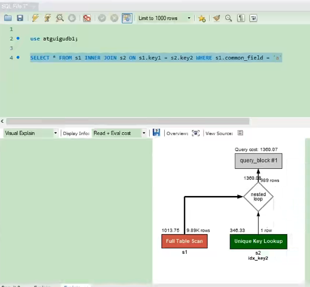

上图按从左到右的连接顺序显示表。红色框表示 `全表扫描` ，而绿色框表示使用 `索引查找` 。对于每个表， 显示使用的索引。还要注意的是，每个表格的框上方是每个表访问所发现的行数的估计值以及访问该表的成本。

### 7.2 SHOW WARNINGS的使用

在我们使用`EXPLAIN`语句查看了某个查询的执行计划后，紧接着还可以使用`SHOW WARNINGS`语句查看与这个查询的执行计划有关的一些扩展信息，比如这样：

```mysql
mysql> EXPLAIN SELECT s1.key1, s2.key1 FROM s1 LEFT JOIN s2 ON s1.key1 = s2.key1 WHERE s2.common_field IS NOT NULL;
```

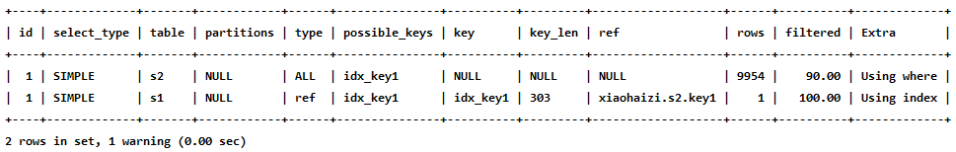

```mysql
mysql> SHOW WARNINGS\G
*************************** 1. row ***************************
    Level: Note
     Code: 1003
Message: /* select#1 */ select `atguigu`.`s1`.`key1` AS `key1`,`atguigu`.`s2`.`key1`
AS `key1` from `atguigu`.`s1` join `atguigu`.`s2` where ((`atguigu`.`s1`.`key1` =
`atguigu`.`s2`.`key1`) and (`atguigu`.`s2`.`common_field` is not null))
1 row in set (0.00 sec)
```

大家可以看到`SHOW WARNINGS`展示出来的信息有三个字段，分别是`Level、Code、Message`。我们最常见的就是Code为1003的信息，当Code值为1003时，`Message`字段展示的信息类似于查询优化器将我们的查询语句重写后的语句。比如我们上边的查询本来是一个左(外)连接查询，但是有一个s2.common_field IS NOT NULL的条件，这就会导致查询优化器把左(外)连接查询优化为内连接查询，从`SHOW WARNINGS`的`Message`字段也可以看出来，原本的LEFE JOIN已经变成了JOIN。

但是大家一定要注意，我们说`Message`字段展示的信息类似于查询优化器将我们的查询语句`重写后的语句`，并不是等价于，也就是说`Message`字段展示的信息并不是标准的查询语句，在很多情况下并不能直接拿到黑框框中运行，它只能作为帮助我们理解MySQL将如何执行查询语句的一个参考依据而已。

## 8. 分析优化器执行计划：trace


```mysql
SET optimizer_trace="enabled=on",end_markers_in_json=on;
set optimizer_trace_max_mem_size=1000000;
```

开启后，可分析如下语句： 

* SELECT 
* INSERT 
* REPLACE
* UPDATE 
* DELETE 
* EXPLAIN 
* SET 
* DECLARE 
* CASE 
* IF 
* RETURN 
* CALL

测试：执行如下SQL语句

```mysql
select * from student where id < 10;
```

最后， 查询 information_schema.optimizer_trace 就可以知道MySQL是如何执行SQL的 ：

```mysql
select * from information_schema.optimizer_trace\G
```

```mysql
*************************** 1. row ***************************
//第1部分：查询语句
QUERY: select * from student where id < 10
//第2部分：QUERY字段对应语句的跟踪信息
TRACE: {
"steps": [
{
    "join_preparation": { //预备工作
        "select#": 1,
        "steps": [
            {
            "expanded_query": "/* select#1 */ select `student`.`id` AS
            `id`,`student`.`stuno` AS `stuno`,`student`.`name` AS `name`,`student`.`age` AS
            `age`,`student`.`classId` AS `classId` from `student` where (`student`.`id` < 10)"
            }
        ] /* steps */
    } /* join_preparation */
},
{
    "join_optimization": { //进行优化
    "select#": 1,
    "steps": [
        {
        "condition_processing": { //条件处理
        "condition": "WHERE",
        "original_condition": "(`student`.`id` < 10)",
        "steps": [
        {
            "transformation": "equality_propagation",
            "resulting_condition": "(`student`.`id` < 10)"
        },
        {
            "transformation": "constant_propagation",
            "resulting_condition": "(`student`.`id` < 10)"
        },
        {
            "transformation": "trivial_condition_removal",
            "resulting_condition": "(`student`.`id` < 10)"
        }
        ] /* steps */
    } /* condition_processing */
    },
    {
        "substitute_generated_columns": { //替换生成的列
        } /* substitute_generated_columns */
    },
    {
        "table_dependencies": [ //表的依赖关系
        {
            "table": "`student`",
            "row_may_be_null": false,
            "map_bit": 0,
            "depends_on_map_bits": [
            ] /* depends_on_map_bits */
        }
    ] /* table_dependencies */
    },
    {
    "ref_optimizer_key_uses": [ //使用键
        ] /* ref_optimizer_key_uses */
        },
    {
        "rows_estimation": [ //行判断
        {
            "table": "`student`",
            "range_analysis": {
                "table_scan": {
                    "rows": 3973767,
                    "cost": 408558
            } /* table_scan */, //扫描表
            "potential_range_indexes": [ //潜在的范围索引
                {
                    "index": "PRIMARY",
                    "usable": true,
                    "key_parts": [
                    "id"
                    ] /* key_parts */
                }
            ] /* potential_range_indexes */,
        "setup_range_conditions": [ //设置范围条件
        ] /* setup_range_conditions */,
        "group_index_range": {
            "chosen": false,
            "cause": "not_group_by_or_distinct"
        } /* group_index_range */,
            "skip_scan_range": {
                "potential_skip_scan_indexes": [
                    {
                        "index": "PRIMARY",
                        "usable": false,
                        "cause": "query_references_nonkey_column"
                    }
                ] /* potential_skip_scan_indexes */
            } /* skip_scan_range */,
        "analyzing_range_alternatives": { //分析范围选项
            "range_scan_alternatives": [
                {
                "index": "PRIMARY",
                    "ranges": [
                        "id < 10"
                    ] /* ranges */,
                "index_dives_for_eq_ranges": true,
                "rowid_ordered": true,
                "using_mrr": false,
                "index_only": false,
                "rows": 9,
                "cost": 1.91986,
                "chosen": true
                }
            ] /* range_scan_alternatives */,
        "analyzing_roworder_intersect": {
            "usable": false,
            "cause": "too_few_roworder_scans"
        	} /* analyzing_roworder_intersect */
        } /* analyzing_range_alternatives */,
        "chosen_range_access_summary": { //选择范围访问摘要
            "range_access_plan": {
                "type": "range_scan",
                "index": "PRIMARY",
                "rows": 9,
                "ranges": [
                "id < 10"
                ] /* ranges */
                } /* range_access_plan */,
                "rows_for_plan": 9,
                "cost_for_plan": 1.91986,
                "chosen": true
                } /* chosen_range_access_summary */
                } /* range_analysis */
            }
        ] /* rows_estimation */
    },
    {
    "considered_execution_plans": [ //考虑执行计划
    {
    "plan_prefix": [
    ] /* plan_prefix */,
        "table": "`student`",
        "best_access_path": { //最佳访问路径
        "considered_access_paths": [
        {
            "rows_to_scan": 9,
            "access_type": "range",
            "range_details": {
            "used_index": "PRIMARY"
        } /* range_details */,
        "resulting_rows": 9,
        "cost": 2.81986,
        "chosen": true
    }
    ] /* considered_access_paths */
    } /* best_access_path */,
        "condition_filtering_pct": 100, //行过滤百分比
        "rows_for_plan": 9,
        "cost_for_plan": 2.81986,
        "chosen": true
    }
    ] /* considered_execution_plans */
    },
    {
        "attaching_conditions_to_tables": { //将条件附加到表上
        "original_condition": "(`student`.`id` < 10)",
        "attached_conditions_computation": [
        ] /* attached_conditions_computation */,
        "attached_conditions_summary": [ //附加条件概要
    {
        "table": "`student`",
        "attached": "(`student`.`id` < 10)"
    }
    ] /* attached_conditions_summary */
    } /* attaching_conditions_to_tables */
    },
    {
    "finalizing_table_conditions": [
    {
        "table": "`student`",
        "original_table_condition": "(`student`.`id` < 10)",
        "final_table_condition ": "(`student`.`id` < 10)"
    }
    ] /* finalizing_table_conditions */
    },
    {
    "refine_plan": [ //精简计划
    {
    	"table": "`student`"
    }
    ] /* refine_plan */
    }
    ] /* steps */
    } /* join_optimization */
},
	{
        "join_execution": { //执行
            "select#": 1,
            "steps": [
            ] /* steps */
        	} /* join_execution */
        }
    ] /* steps */
}
//第3部分：跟踪信息过长时，被截断的跟踪信息的字节数。
MISSING_BYTES_BEYOND_MAX_MEM_SIZE: 0 //丢失的超出最大容量的字节
//第4部分：执行跟踪语句的用户是否有查看对象的权限。当不具有权限时，该列信息为1且TRACE字段为空，一般在
调用带有SQL SECURITY DEFINER的视图或者是存储过程的情况下，会出现此问题。
INSUFFICIENT_PRIVILEGES: 0 //缺失权限
1 row in set (0.00 sec)
```

## 9. MySQL监控分析视图-sys schema

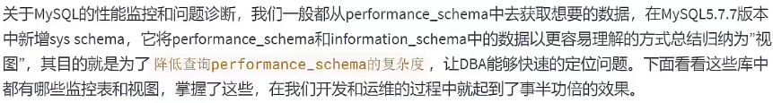

### 9.1 Sys schema视图摘要

1. **主机相关**：以host_summary开头，主要汇总了IO延迟的信息。 
2. **Innodb相关**：以innodb开头，汇总了innodb buffer信息和事务等待innodb锁的信息。 
3. **I/o相关**：以io开头，汇总了等待I/O、I/O使用量情况。 
4. **内存使用情况**：以memory开头，从主机、线程、事件等角度展示内存的使用情况 
5. **连接与会话信息**：processlist和session相关视图，总结了会话相关信息。 
6. **表相关**：以schema_table开头的视图，展示了表的统计信息。 
7. **索引信息**：统计了索引的使用情况，包含冗余索引和未使用的索引情况。 
8. **语句相关**：以statement开头，包含执行全表扫描、使用临时表、排序等的语句信息。 
9. **用户相关**：以user开头的视图，统计了用户使用的文件I/O、执行语句统计信息。 
10. **等待事件相关信息**：以wait开头，展示等待事件的延迟情况。

### 9.2 Sys schema视图使用场景

索引情况

```mysql
#1. 查询冗余索引
select * from sys.schema_redundant_indexes;
#2. 查询未使用过的索引
select * from sys.schema_unused_indexes;
#3. 查询索引的使用情况
select index_name,rows_selected,rows_inserted,rows_updated,rows_deleted
from sys.schema_index_statistics where table_schema='dbname';
```

表相关

```mysql
# 1. 查询表的访问量
select table_schema,table_name,sum(io_read_requests+io_write_requests) as io from
sys.schema_table_statistics group by table_schema,table_name order by io desc;
# 2. 查询占用bufferpool较多的表
select object_schema,object_name,allocated,data
from sys.innodb_buffer_stats_by_table order by allocated limit 10;
# 3. 查看表的全表扫描情况
select * from sys.statements_with_full_table_scans where db='dbname';
```

语句相关

```mysql
#1. 监控SQL执行的频率
select db,exec_count,query from sys.statement_analysis
order by exec_count desc;
#2. 监控使用了排序的SQL
select db,exec_count,first_seen,last_seen,query
from sys.statements_with_sorting limit 1;
#3. 监控使用了临时表或者磁盘临时表的SQL
select db,exec_count,tmp_tables,tmp_disk_tables,query
from sys.statement_analysis where tmp_tables>0 or tmp_disk_tables >0
order by (tmp_tables+tmp_disk_tables) desc;
```

IO相关

```mysql
#1. 查看消耗磁盘IO的文件
select file,avg_read,avg_write,avg_read+avg_write as avg_io
from sys.io_global_by_file_by_bytes order by avg_read limit 10;
```

Innodb 相关

```mysql
#1. 行锁阻塞情况
select * from sys.innodb_lock_waits;
```


## 10. 小结

查询是数据库中最频繁的操作，提高查询速度可以有效地提高MySQL数据库的性能。通过对查询语句的分析可以了解查询语句的执行情况，找出查询语句执行的瓶颈，从而优化查询语句。

# 第10章_索引优化与查询优化

都有哪些维度可以进行数据库调优？简言之：

* 索引失效、没有充分利用到索引——建立索引
* 关联查询太多JOIN（设计缺陷或不得已的需求）——SQL优化
* 服务器调优及各个参数设置（缓冲、线程数等）——调整my.cnf
* 数据过多——分库分表

关于数据库调优的知识非常分散。不同的DBMS，不同的公司，不同的职位，不同的项目遇到的问题都不尽相同。这里我们分为三个章节进行细致讲解。

虽然SQL查询优化的技术有很多，但是大方向上完全可以分成`物理查询优化`和`逻辑查询优化`两大块。

* 物理查询优化是通过`索引`和`表连接方式`等技术来进行优化，这里重点需要掌握索引的使用。
* 逻辑查询优化就是通过SQL`等价变换`提升查询效率，直白一点就是说，换一种查询写法效率可能更高。

## 1. 数据准备

`学员表` 插 `50万` 条，` 班级表` 插 `1万` 条。

```mysql
CREATE DATABASE atguigudb2;
USE atguigudb2;
```

**步骤1：建表**

```mysql
CREATE TABLE `class` (
    `id` INT(11) NOT NULL AUTO_INCREMENT,
    `className` VARCHAR(30) DEFAULT NULL,
    `address` VARCHAR(40) DEFAULT NULL,
    `monitor` INT NULL ,
    PRIMARY KEY (`id`)
) ENGINE=INNODB AUTO_INCREMENT=1 DEFAULT CHARSET=utf8;

CREATE TABLE `student` (
    `id` INT(11) NOT NULL AUTO_INCREMENT,
    `stuno` INT NOT NULL ,
    `name` VARCHAR(20) DEFAULT NULL,
    `age` INT(3) DEFAULT NULL,
    `classId` INT(11) DEFAULT NULL,
    PRIMARY KEY (`id`)
    #CONSTRAINT `fk_class_id` FOREIGN KEY (`classId`) REFERENCES `t_class` (`id`)
) ENGINE=INNODB AUTO_INCREMENT=1 DEFAULT CHARSET=utf8;
```

**步骤2：设置参数**

* 命令开启：允许创建函数设置：

```mysql
set global log_bin_trust_function_creators=1; # 不加global只是当前窗口有效。
```

**步骤3：创建函数**

保证每条数据都不同。

```mysql
#随机产生字符串
DELIMITER //
CREATE FUNCTION rand_string(n INT) RETURNS VARCHAR(255)
BEGIN
DECLARE chars_str VARCHAR(100) DEFAULT
'abcdefghijklmnopqrstuvwxyzABCDEFJHIJKLMNOPQRSTUVWXYZ';
DECLARE return_str VARCHAR(255) DEFAULT '';
DECLARE i INT DEFAULT 0;
WHILE i < n DO
SET return_str =CONCAT(return_str,SUBSTRING(chars_str,FLOOR(1+RAND()*52),1));
SET i = i + 1;
END WHILE;
RETURN return_str;
END //
DELIMITER ;
#假如要删除
#drop function rand_string;
```

随机产生班级编号

```mysql
#用于随机产生多少到多少的编号
DELIMITER //
CREATE FUNCTION rand_num (from_num INT ,to_num INT) RETURNS INT(11)
BEGIN
DECLARE i INT DEFAULT 0;
SET i = FLOOR(from_num +RAND()*(to_num - from_num+1)) ;
RETURN i;
END //
DELIMITER ;
#假如要删除
#drop function rand_num;
```

**步骤4：创建存储过程**

```mysql
#创建往stu表中插入数据的存储过程
DELIMITER //
CREATE PROCEDURE insert_stu( START INT , max_num INT )
BEGIN
DECLARE i INT DEFAULT 0;
SET autocommit = 0; #设置手动提交事务
REPEAT #循环
SET i = i + 1; #赋值
INSERT INTO student (stuno, name ,age ,classId ) VALUES
((START+i),rand_string(6),rand_num(1,50),rand_num(1,1000));
UNTIL i = max_num
END REPEAT;
COMMIT; #提交事务
END //
DELIMITER ;
#假如要删除
#drop PROCEDURE insert_stu;
```

创建往class表中插入数据的存储过程

```mysql
#执行存储过程，往class表添加随机数据
DELIMITER //
CREATE PROCEDURE `insert_class`( max_num INT )
BEGIN
DECLARE i INT DEFAULT 0;
SET autocommit = 0;
REPEAT
SET i = i + 1;
INSERT INTO class ( classname,address,monitor ) VALUES
(rand_string(8),rand_string(10),rand_num(1,100000));
UNTIL i = max_num
END REPEAT;
COMMIT;
END //
DELIMITER ;
#假如要删除
#drop PROCEDURE insert_class;
```

**步骤5：调用存储过程**

class

```mysql
#执行存储过程，往class表添加1万条数据
CALL insert_class(10000);
```

stu

```mysql
#执行存储过程，往stu表添加50万条数据
CALL insert_stu(100000,500000);
```

**步骤6：删除某表上的索引**

创建存储过程

```mysql
DELIMITER //
CREATE PROCEDURE `proc_drop_index`(dbname VARCHAR(200),tablename VARCHAR(200))
BEGIN
        DECLARE done INT DEFAULT 0;
        DECLARE ct INT DEFAULT 0;
        DECLARE _index VARCHAR(200) DEFAULT '';
        DECLARE _cur CURSOR FOR SELECT index_name FROM
information_schema.STATISTICS WHERE table_schema=dbname AND table_name=tablename AND
seq_in_index=1 AND index_name <>'PRIMARY' ;
#每个游标必须使用不同的declare continue handler for not found set done=1来控制游标的结束
		DECLARE CONTINUE HANDLER FOR NOT FOUND set done=2 ;
#若没有数据返回,程序继续,并将变量done设为2
        OPEN _cur;
        FETCH _cur INTO _index;
        WHILE _index<>'' DO
            SET @str = CONCAT("drop index " , _index , " on " , tablename );
            PREPARE sql_str FROM @str ;
            EXECUTE sql_str;
            DEALLOCATE PREPARE sql_str;
            SET _index='';
            FETCH _cur INTO _index;
        END WHILE;
    CLOSE _cur;
END //
DELIMITER ;
```

执行存储过程

```mysql
CALL proc_drop_index("dbname","tablename");
```

## 2. 索引失效案例


### 2.1 全值匹配我最爱

系统中经常出现的sql语句如下：

```mysql
EXPLAIN SELECT SQL_NO_CACHE * FROM student WHERE age=30;
EXPLAIN SELECT SQL_NO_CACHE * FROM student WHERE age=30 AND classId=4;
EXPLAIN SELECT SQL_NO_CACHE * FROM student WHERE age=30 AND classId=4 AND name = 'abcd';
```

建立索引前执行：（关注执行时间）

```mysql
mysql> SELECT SQL_NO_CACHE * FROM student WHERE age=30 AND classId=4 AND name = 'abcd';
Empty set, 1 warning (0.28 sec)
```

**建立索引**

```mysql
CREATE INDEX idx_age ON student(age);
CREATE INDEX idx_age_classid ON student(age,classId);
CREATE INDEX idx_age_classid_name ON student(age,classId,name);
```

建立索引后执行：

```mysql
mysql> SELECT SQL_NO_CACHE * FROM student WHERE age=30 AND classId=4 AND name = 'abcd';
Empty set, 1 warning (0.01 sec)
```


### 2.2 最佳左前缀法则

在MySQL建立联合索引时会遵守最佳左前缀原则，即最左优先，在检索数据时从联合索引的最左边开始匹配。

举例1：

```mysql
EXPLAIN SELECT SQL_NO_CACHE * FROM student WHERE student.age=30 AND student.name = 'abcd';
```

举例2：

```mysql
EXPLAIN SELECT SQL_NO_CACHE * FROM student WHERE student.classId=1 AND student.name = 'abcd';
```

举例3：索引`idx_age_classid_name`还能否正常使用？

```mysql
EXPLAIN SELECT SQL_NO_CACHE * FROM student WHERE student.classId=4 AND student.age=30 AND student.name = 'abcd';
```

如果索引了多列，要遵守最左前缀法则。指的是查询从索引的最左前列开始并且不跳过索引中的列。

```mysql
mysql> EXPLAIN SELECT SQL_NO_CACHE * FROM student WHERE student.age=30 AND student.name = 'abcd';
```


虽然可以正常使用，但是只有部分被使用到了。

```mysql
mysql> EXPLAIN SELECT SQL_NO_CACHE * FROM student WHERE student.classId=1 AND student.name = 'abcd';
```


完全没有使用上索引。

结论：MySQL可以为多个字段创建索引，一个索引可以包含16个字段。对于多列索引，**过滤条件要使用索引必须按照索引建立时的顺序，依次满足，一旦跳过某个字段，索引后面的字段都无法被使用**。如果查询条件中没有用这些字段中第一个字段时，多列（或联合）索引不会被使用。

> 拓展：Alibaba《Java开发手册》 
>
> 索引文件具有 B-Tree 的最左前缀匹配特性，如果左边的值未确定，那么无法使用此索引。

### 2.3 主键插入顺序


如果此时再插入一条主键值为 9 的记录，那它插入的位置就如下图：


可这个数据页已经满了，再插进来咋办呢？我们需要把当前 `页面分裂` 成两个页面，把本页中的一些记录移动到新创建的这个页中。页面分裂和记录移位意味着什么？意味着： `性能损耗` ！所以如果我们想尽量避免这样无谓的性能损耗，最好让插入的记录的 `主键值依次递增` ，这样就不会发生这样的性能损耗了。 所以我们建议：让主键具有 `AUTO_INCREMENT` ，让存储引擎自己为表生成主键，而不是我们手动插入 ， 比如： `person_info` 表：

```mysql
CREATE TABLE person_info(
    id INT UNSIGNED NOT NULL AUTO_INCREMENT,
    name VARCHAR(100) NOT NULL,
    birthday DATE NOT NULL,
    phone_number CHAR(11) NOT NULL,
    country varchar(100) NOT NULL,
    PRIMARY KEY (id),
    KEY idx_name_birthday_phone_number (name(10), birthday, phone_number)
);
```

我们自定义的主键列 `id` 拥有 `AUTO_INCREMENT` 属性，在插入记录时存储引擎会自动为我们填入自增的主键值。这样的主键占用空间小，顺序写入，减少页分裂。

### 2.4 计算、函数、类型转换(自动或手动)导致索引失效

1. 这两条sql哪种写法更好

   ```mysql
   EXPLAIN SELECT SQL_NO_CACHE * FROM student WHERE student.name LIKE 'abc%';
   ```

   ```mysql
   EXPLAIN SELECT SQL_NO_CACHE * FROM student WHERE LEFT(student.name,3) = 'abc';
   ```

2. 创建索引

   ```mysql
   CREATE INDEX idx_name ON student(NAME);
   ```

3. 第一种：索引优化生效

   ```mysql
   mysql> EXPLAIN SELECT SQL_NO_CACHE * FROM student WHERE student.name LIKE 'abc%';
   ```

   ```mysql
   mysql> SELECT SQL_NO_CACHE * FROM student WHERE student.name LIKE 'abc%';
   +---------+---------+--------+------+---------+
   | id | stuno | name | age | classId |
   +---------+---------+--------+------+---------+
   | 5301379 | 1233401 | AbCHEa | 164 | 259 |
   | 7170042 | 3102064 | ABcHeB | 199 | 161 |
   | 1901614 | 1833636 | ABcHeC | 226 | 275 |
   | 5195021 | 1127043 | abchEC | 486 | 72 |
   | 4047089 | 3810031 | AbCHFd | 268 | 210 |
   | 4917074 | 849096 | ABcHfD | 264 | 442 |
   | 1540859 | 141979 | abchFF | 119 | 140 |
   | 5121801 | 1053823 | AbCHFg | 412 | 327 |
   | 2441254 | 2373276 | abchFJ | 170 | 362 |
   | 7039146 | 2971168 | ABcHgI | 502 | 465 |
   | 1636826 | 1580286 | ABcHgK | 71 | 262 |
   | 374344 | 474345 | abchHL | 367 | 212 |
   | 1596534 | 169191 | AbCHHl | 102 | 146 |
   ...
   | 5266837 | 1198859 | abclXe | 292 | 298 |
   | 8126968 | 4058990 | aBClxE | 316 | 150 |
   | 4298305 | 399962 | AbCLXF | 72 | 423 |
   | 5813628 | 1745650 | aBClxF | 356 | 323 |
   | 6980448 | 2912470 | AbCLXF | 107 | 78 |
   | 7881979 | 3814001 | AbCLXF | 89 | 497 |
   | 4955576 | 887598 | ABcLxg | 121 | 385 |
   | 3653460 | 3585482 | AbCLXJ | 130 | 174 |
   | 1231990 | 1283439 | AbCLYH | 189 | 429 |
   | 6110615 | 2042637 | ABcLyh | 157 | 40 |
   +---------+---------+--------+------+---------+
   401 rows in set, 1 warning (0.01 sec)
   ```

4. 第二种：索引优化失效

   ```mysql
   mysql> EXPLAIN SELECT SQL_NO_CACHE * FROM student WHERE LEFT(student.name,3) = 'abc';
   ```

   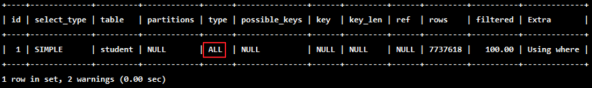

   ```mysql
   mysql> SELECT SQL_NO_CACHE * FROM student WHERE LEFT(student.name,3) = 'abc';
   +---------+---------+--------+------+---------+
   | id | stuno | name | age | classId |
   +---------+---------+--------+------+---------+
   | 5301379 | 1233401 | AbCHEa | 164 | 259 |
   | 7170042 | 3102064 | ABcHeB | 199 | 161 |
   | 1901614 | 1833636 | ABcHeC | 226 | 275 |
   | 5195021 | 1127043 | abchEC | 486 | 72 |
   | 4047089 | 3810031 | AbCHFd | 268 | 210 |
   | 4917074 | 849096 | ABcHfD | 264 | 442 |
   | 1540859 | 141979 | abchFF | 119 | 140 |
   | 5121801 | 1053823 | AbCHFg | 412 | 327 |
   | 2441254 | 2373276 | abchFJ | 170 | 362 |
   | 7039146 | 2971168 | ABcHgI | 502 | 465 |
   | 1636826 | 1580286 | ABcHgK | 71 | 262 |
   | 374344 | 474345 | abchHL | 367 | 212 |
   | 1596534 | 169191 | AbCHHl | 102 | 146 |
   ...
   | 5266837 | 1198859 | abclXe | 292 | 298 |
   | 8126968 | 4058990 | aBClxE | 316 | 150 |
   | 4298305 | 399962 | AbCLXF | 72 | 423 |
   | 5813628 | 1745650 | aBClxF | 356 | 323 |
   | 6980448 | 2912470 | AbCLXF | 107 | 78 |
   | 7881979 | 3814001 | AbCLXF | 89 | 497 |
   | 4955576 | 887598 | ABcLxg | 121 | 385 |
   | 3653460 | 3585482 | AbCLXJ | 130 | 174 |
   | 1231990 | 1283439 | AbCLYH | 189 | 429 |
   | 6110615 | 2042637 | ABcLyh | 157 | 40 |
   +---------+---------+--------+------+---------+
   401 rows in set, 1 warning (3.62 sec)
   ```

   type为“ALL”，表示没有使用到索引，查询时间为 3.62 秒，查询效率较之前低很多。

**再举例：**

* student表的字段stuno上设置有索引

  ```mysql
  CREATE INDEX idx_sno ON student(stuno);
  ```

* 索引优化失效：（假设：student表的字段stuno上设置有索引）

  ```mysql
  EXPLAIN SELECT SQL_NO_CACHE id, stuno, NAME FROM student WHERE stuno+1 = 900001;

运行结果：

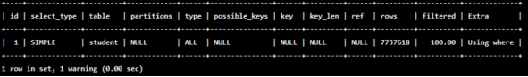

* 索引优化生效：

  ```mysql
  EXPLAIN SELECT SQL_NO_CACHE id, stuno, NAME FROM student WHERE stuno = 900000;
  ```

**再举例：**

* student表的字段name上设置有索引

  ```mysql
  CREATE INDEX idx_name ON student(NAME);
  ```

  ```mysql
  EXPLAIN SELECT id, stuno, name FROM student WHERE SUBSTRING(name, 1,3)='abc';
  ```

  

* 索引优化生效

  ```mysql
  EXPLAIN SELECT id, stuno, NAME FROM student WHERE NAME LIKE 'abc%';
  ```

  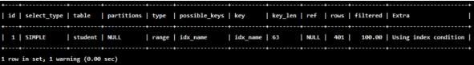

### 2.5 类型转换导致索引失效

下列哪个sql语句可以用到索引。（假设name字段上设置有索引）

```mysql
# 未使用到索引
EXPLAIN SELECT SQL_NO_CACHE * FROM student WHERE name=123;
```

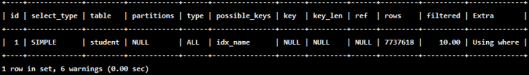

```mysql
# 使用到索引
EXPLAIN SELECT SQL_NO_CACHE * FROM student WHERE name='123';
```

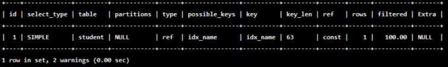

name=123发生类型转换，索引失效。

### 2.6 范围条件右边的列索引失效

1. 系统经常出现的sql如下：

```mysql
ALTER TABLE student DROP INDEX idx_name;
ALTER TABLE student DROP INDEX idx_age;
ALTER TABLE student DROP INDEX idx_age_classid;

EXPLAIN SELECT SQL_NO_CACHE * FROM student
WHERE student.age=30 AND student.classId>20 AND student.name = 'abc' ;
```

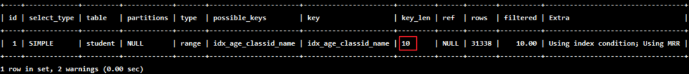

2. 那么索引 idx_age_classId_name 这个索引还能正常使用么？

* 不能，范围右边的列不能使用。比如：(<) (<=) (>) (>=) 和 between 等
* 如果这种sql出现较多，应该建立：

```mysql
create index idx_age_name_classId on student(age,name,classId);
```

* 将范围查询条件放置语句最后：

```mysql
EXPLAIN SELECT SQL_NO_CACHE * FROM student WHERE student.age=30 AND student.name = 'abc' AND student.classId>20;
```

> 应用开发中范围查询，例如：金额查询，日期查询往往都是范围查询。应将查询条件放置where语句最后。（创建的联合索引中，务必把范围涉及到的字段写在最后）

3. 效果

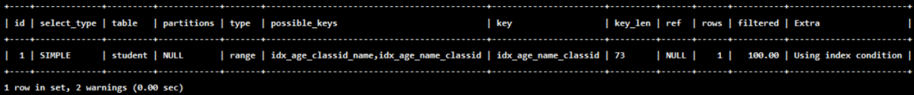

### 2.7 不等于(!= 或者<>)索引失效

* 为name字段创建索引

```mysql
CREATE INDEX idx_name ON student(NAME);
```

* 查看索引是否失效

```mysql
EXPLAIN SELECT SQL_NO_CACHE * FROM student WHERE student.name <> 'abc';
```

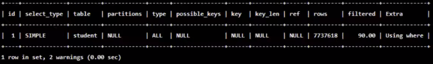

或者

```mysql
EXPLAIN SELECT SQL_NO_CACHE * FROM student WHERE student.name != 'abc';
```

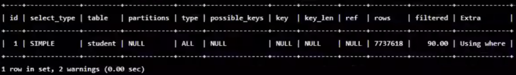

场景举例：用户提出需求，将财务数据，产品利润金额不等于0的都统计出来。

###  2.8 is null可以使用索引，is not null无法使用索引

* IS NULL: 可以触发索引

```mysql
EXPLAIN SELECT SQL_NO_CACHE * FROM student WHERE age IS NULL;
```

* IS NOT NULL: 无法触发索引

```mysql
EXPLAIN SELECT SQL_NO_CACHE * FROM student WHERE age IS NOT NULL;
```


> 结论：最好在设计数据库的时候就将`字段设置为 NOT NULL 约束`，比如你可以将 INT 类型的字段，默认值设置为0。将字符类型的默认值设置为空字符串('')。
>
> 扩展：同理，在查询中使用`not like`也无法使用索引，导致全表扫描。

### 2.9 like以通配符%开头索引失效

在使用LIKE关键字进行查询的查询语句中，如果匹配字符串的第一个字符为'%'，索引就不会起作用。只有'%'不在第一个位置，索引才会起作用。

* 使用到索引

```mysql
EXPLAIN SELECT SQL_NO_CACHE * FROM student WHERE name LIKE 'ab%';
```

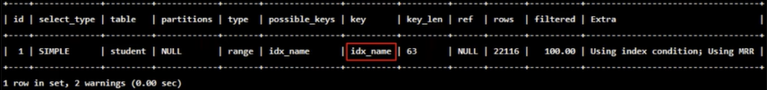

* 未使用到索引

```mysql
EXPLAIN SELECT SQL_NO_CACHE * FROM student WHERE name LIKE '%ab%';
```

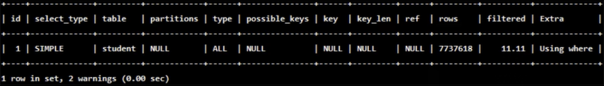

> 拓展：Alibaba《Java开发手册》 
>
> 【强制】页面搜索严禁左模糊或者全模糊，如果需要请走搜索引擎来解决。

### 2.10 OR 前后存在非索引的列，索引失效

在WHERE子句中，如果在OR前的条件列进行了索引，而在OR后的条件列没有进行索引，那么索引会失效。也就是说，**OR前后的两个条件中的列都是索引时，查询中才使用索引。**

因为OR的含义就是两个只要满足一个即可，因此`只有一个条件列进行了索引是没有意义的`，只要有条件列没有进行索引，就会进行`全表扫描`，因此所以的条件列也会失效。

查询语句使用OR关键字的情况：

```mysql
# 未使用到索引
EXPLAIN SELECT SQL_NO_CACHE * FROM student WHERE age = 10 OR classid = 100;
```

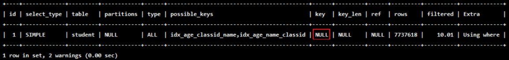

因为classId字段上没有索引，所以上述查询语句没有使用索引。

```mysql
#使用到索引
EXPLAIN SELECT SQL_NO_CACHE * FROM student WHERE age = 10 OR name = 'Abel';
```

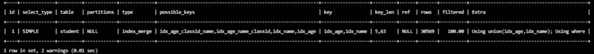

因为age字段和name字段上都有索引，所以查询中使用了索引。你能看到这里使用到了`index_merge`，简单来说index_merge就是对age和name分别进行了扫描，然后将这两个结果集进行了合并。这样做的好处就是`避免了全表扫描`。

### 2.11 数据库和表的字符集统一使用utf8mb4

统一使用utf8mb4( 5.5.3版本以上支持)兼容性更好，统一字符集可以避免由于字符集转换产生的乱码。不 同的 `字符集` 进行比较前需要进行 `转换` 会造成索引失效。

### 2.12 练习及一般性建议

**练习：**假设：index(a,b,c)

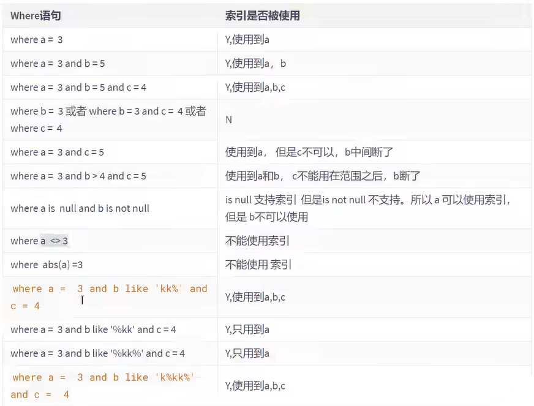

**一般性建议**

* 对于单列索引，尽量选择针对当前query过滤性更好的索引
* 在选择组合索引的时候，当前query中过滤性最好的字段在索引字段顺序中，位置越靠前越好。
* 在选择组合索引的时候，尽量选择能够当前query中where子句中更多的索引。
* 在选择组合索引的时候，如果某个字段可能出现范围查询时，尽量把这个字段放在索引次序的最后面。

**总之，书写SQL语句时，尽量避免造成索引失效的情况**

## 3. 关联查询优化

### 3.1 数据准备

```mysql
# 分类
CREATE TABLE IF NOT EXISTS `type` (
`id` INT(10) UNSIGNED NOT NULL AUTO_INCREMENT,
`card` INT(10) UNSIGNED NOT NULL,
PRIMARY KEY (`id`)
);
#图书
CREATE TABLE IF NOT EXISTS `book` (
`bookid` INT(10) UNSIGNED NOT NULL AUTO_INCREMENT,
`card` INT(10) UNSIGNED NOT NULL,
PRIMARY KEY (`bookid`)
);

#向分类表中添加20条记录
INSERT INTO `type`(card) VALUES(FLOOR(1 + (RAND() * 20)));
INSERT INTO `type`(card) VALUES(FLOOR(1 + (RAND() * 20)));
INSERT INTO `type`(card) VALUES(FLOOR(1 + (RAND() * 20)));
INSERT INTO `type`(card) VALUES(FLOOR(1 + (RAND() * 20)));
INSERT INTO `type`(card) VALUES(FLOOR(1 + (RAND() * 20)));
INSERT INTO `type`(card) VALUES(FLOOR(1 + (RAND() * 20)));
INSERT INTO `type`(card) VALUES(FLOOR(1 + (RAND() * 20)));
INSERT INTO `type`(card) VALUES(FLOOR(1 + (RAND() * 20)));
INSERT INTO `type`(card) VALUES(FLOOR(1 + (RAND() * 20)));
INSERT INTO `type`(card) VALUES(FLOOR(1 + (RAND() * 20)));
INSERT INTO `type`(card) VALUES(FLOOR(1 + (RAND() * 20)));
INSERT INTO `type`(card) VALUES(FLOOR(1 + (RAND() * 20)));
INSERT INTO `type`(card) VALUES(FLOOR(1 + (RAND() * 20)));
INSERT INTO `type`(card) VALUES(FLOOR(1 + (RAND() * 20)));
INSERT INTO `type`(card) VALUES(FLOOR(1 + (RAND() * 20)));
INSERT INTO `type`(card) VALUES(FLOOR(1 + (RAND() * 20)));
INSERT INTO `type`(card) VALUES(FLOOR(1 + (RAND() * 20)));
INSERT INTO `type`(card) VALUES(FLOOR(1 + (RAND() * 20)));
INSERT INTO `type`(card) VALUES(FLOOR(1 + (RAND() * 20)));
INSERT INTO `type`(card) VALUES(FLOOR(1 + (RAND() * 20)));

#向图书表中添加20条记录
INSERT INTO book(card) VALUES(FLOOR(1 + (RAND() * 20)));
INSERT INTO book(card) VALUES(FLOOR(1 + (RAND() * 20)));
INSERT INTO book(card) VALUES(FLOOR(1 + (RAND() * 20)));
INSERT INTO book(card) VALUES(FLOOR(1 + (RAND() * 20)));
INSERT INTO book(card) VALUES(FLOOR(1 + (RAND() * 20)));
INSERT INTO book(card) VALUES(FLOOR(1 + (RAND() * 20)));
INSERT INTO book(card) VALUES(FLOOR(1 + (RAND() * 20)));
INSERT INTO book(card) VALUES(FLOOR(1 + (RAND() * 20)));
INSERT INTO book(card) VALUES(FLOOR(1 + (RAND() * 20)));
INSERT INTO book(card) VALUES(FLOOR(1 + (RAND() * 20)));
INSERT INTO book(card) VALUES(FLOOR(1 + (RAND() * 20)));
INSERT INTO book(card) VALUES(FLOOR(1 + (RAND() * 20)));
INSERT INTO book(card) VALUES(FLOOR(1 + (RAND() * 20)));
INSERT INTO book(card) VALUES(FLOOR(1 + (RAND() * 20)));
INSERT INTO book(card) VALUES(FLOOR(1 + (RAND() * 20)));
INSERT INTO book(card) VALUES(FLOOR(1 + (RAND() * 20)));
INSERT INTO book(card) VALUES(FLOOR(1 + (RAND() * 20)));
INSERT INTO book(card) VALUES(FLOOR(1 + (RAND() * 20)));
INSERT INTO book(card) VALUES(FLOOR(1 + (RAND() * 20)));
INSERT INTO book(card) VALUES(FLOOR(1 + (RAND() * 20)));
```

### 3.2 采用左外连接

下面开始 EXPLAIN 分析

```mysql
EXPLAIN SELECT SQL_NO_CACHE * FROM `type` LEFT JOIN book ON type.card = book.card;
```

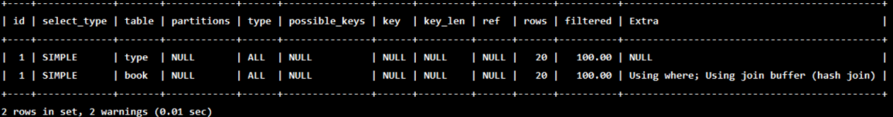

结论：type 有All

添加索引优化

```mysql
ALTER TABLE book ADD INDEX Y ( card); #【被驱动表】，可以避免全表扫描
EXPLAIN SELECT SQL_NO_CACHE * FROM `type` LEFT JOIN book ON type.card = book.card;
```

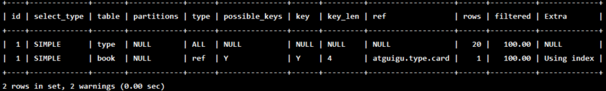

可以看到第二行的 type 变为了 ref，rows 也变成了优化比较明显。这是由左连接特性决定的。LEFT JOIN 条件用于确定如何从右表搜索行，左边一定都有，所以 `右边是我们的关键点,一定需要建立索引` 。

```mysql
ALTER TABLE `type` ADD INDEX X (card); #【驱动表】，无法避免全表扫描
EXPLAIN SELECT SQL_NO_CACHE * FROM `type` LEFT JOIN book ON type.card = book.card;
```

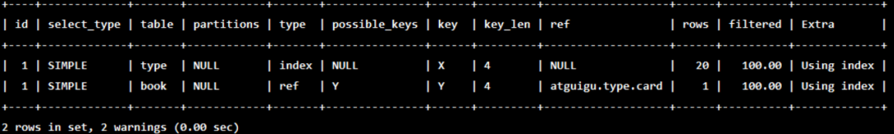

接着：

```mysql
DROP INDEX Y ON book;
EXPLAIN SELECT SQL_NO_CACHE * FROM `type` LEFT JOIN book ON type.card = book.card;
```

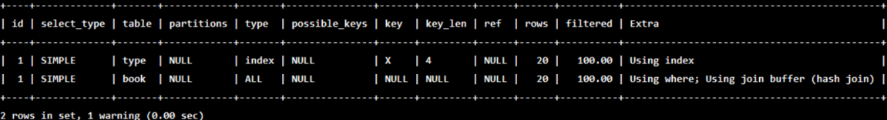

### 3.3 采用内连接

```mysql
drop index X on type;
drop index Y on book;（如果已经删除了可以不用再执行该操作）
```

换成 inner join（MySQL自动选择驱动表）

```mysql
EXPLAIN SELECT SQL_NO_CACHE * FROM type INNER JOIN book ON type.card=book.card;
```

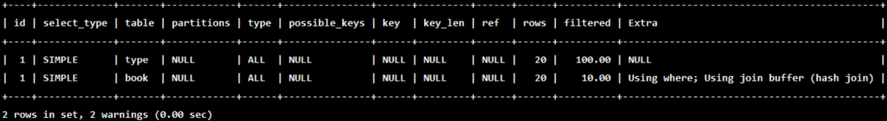

添加索引优化

```mysql
ALTER TABLE book ADD INDEX Y (card);
EXPLAIN SELECT SQL_NO_CACHE * FROM type INNER JOIN book ON type.card=book.card;
```

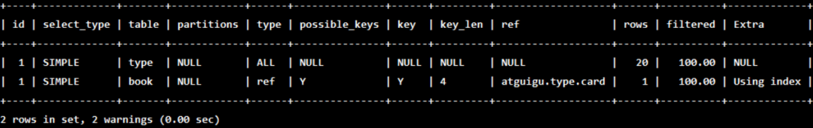

```mysql
ALTER TABLE type ADD INDEX X (card);
EXPLAIN SELECT SQL_NO_CACHE * FROM type INNER JOIN book ON type.card=book.card;
```


对于内连接来说，查询优化器可以决定谁作为驱动表，谁作为被驱动表出现的

接着：

```mysql
DROP INDEX X ON `type`;
EXPLAIN SELECT SQL_NO_CACHE * FROM TYPE INNER JOIN book ON type.card=book.card;
```

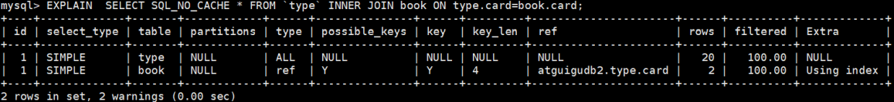

接着：

```mysql
ALTER TABLE `type` ADD INDEX X (card);
EXPLAIN SELECT SQL_NO_CACHE * FROM `type` INNER JOIN book ON type.card=book.card;
```

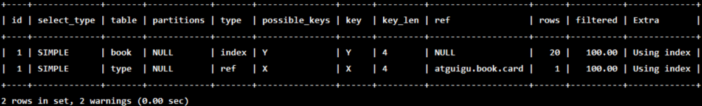

接着：

```mysql
#向图书表中添加20条记录
INSERT INTO book(card) VALUES(FLOOR(1 + (RAND() * 20)));
INSERT INTO book(card) VALUES(FLOOR(1 + (RAND() * 20)));
INSERT INTO book(card) VALUES(FLOOR(1 + (RAND() * 20)));
INSERT INTO book(card) VALUES(FLOOR(1 + (RAND() * 20)));
INSERT INTO book(card) VALUES(FLOOR(1 + (RAND() * 20)));
INSERT INTO book(card) VALUES(FLOOR(1 + (RAND() * 20)));
INSERT INTO book(card) VALUES(FLOOR(1 + (RAND() * 20)));
INSERT INTO book(card) VALUES(FLOOR(1 + (RAND() * 20)));
INSERT INTO book(card) VALUES(FLOOR(1 + (RAND() * 20)));
INSERT INTO book(card) VALUES(FLOOR(1 + (RAND() * 20)));
INSERT INTO book(card) VALUES(FLOOR(1 + (RAND() * 20)));
INSERT INTO book(card) VALUES(FLOOR(1 + (RAND() * 20)));
INSERT INTO book(card) VALUES(FLOOR(1 + (RAND() * 20)));
INSERT INTO book(card) VALUES(FLOOR(1 + (RAND() * 20)));
INSERT INTO book(card) VALUES(FLOOR(1 + (RAND() * 20)));
INSERT INTO book(card) VALUES(FLOOR(1 + (RAND() * 20)));
INSERT INTO book(card) VALUES(FLOOR(1 + (RAND() * 20)));
INSERT INTO book(card) VALUES(FLOOR(1 + (RAND() * 20)));
INSERT INTO book(card) VALUES(FLOOR(1 + (RAND() * 20)));
INSERT INTO book(card) VALUES(FLOOR(1 + (RAND() * 20)));

ALTER TABLE book ADD INDEX Y (card);
EXPLAIN SELECT SQL_NO_CACHE * FROM `type` INNER JOIN book ON `type`.card = book.card;
```


图中发现，由于type表数据大于book表数据，MySQL选择将type作为被驱动表。

### 3.4 join语句原理

join方式连接多个表，本质就是各个表之间数据的循环匹配。MySQL5.5版本之前，MySQL只支持一种表间关联方式，就是嵌套循环(Nested Loop Join)。如果关联表的数据量很大，则join关联的执行时间会很长。在MySQL5.5以后的版本中，MySQL通过引入BNLJ算法来优化嵌套执行。

#### 1. 驱动表和被驱动表

驱动表就是主表，被驱动表就是从表、非驱动表。

* 对于内连接来说：

```mysql
SELECT * FROM A JOIN B ON ...
```

A一定是驱动表吗？不一定，优化器会根据你查询语句做优化，决定先查哪张表。先查询的那张表就是驱动表，反之就是被驱动表。通过explain关键字可以查看。

* 对于外连接来说：

```mysql
SELECT * FROM A LEFT JOIN B ON ...
# 或
SELECT * FROM B RIGHT JOIN A ON ... 
```

通常，大家会认为A就是驱动表，B就是被驱动表。但也未必。测试如下：

```mysql
CREATE TABLE a(f1 INT, f2 INT, INDEX(f1)) ENGINE=INNODB;
CREATE TABLE b(f1 INT, f2 INT) ENGINE=INNODB;

INSERT INTO a VALUES(1,1),(2,2),(3,3),(4,4),(5,5),(6,6);
INSERT INTO b VALUES(3,3),(4,4),(5,5),(6,6),(7,7),(8,8);

SELECT * FROM b;

# 测试1
EXPLAIN SELECT * FROM a LEFT JOIN b ON(a.f1=b.f1) WHERE (a.f2=b.f2);

# 测试2
EXPLAIN SELECT * FROM a LEFT JOIN b ON(a.f1=b.f1) AND (a.f2=b.f2);
```

#### 2. Simple Nested-Loop Join (简单嵌套循环连接)

算法相当简单，从表A中取出一条数据1，遍历表B，将匹配到的数据放到result.. 以此类推，驱动表A中的每一条记录与被驱动表B的记录进行判断：

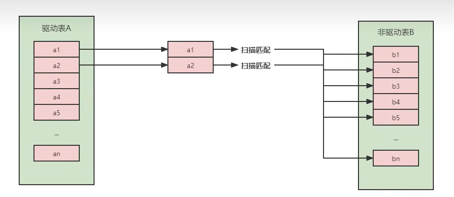

可以看到这种方式效率是非常低的，以上述表A数据100条，表B数据1000条计算，则A*B=10万次。开销统计如下:

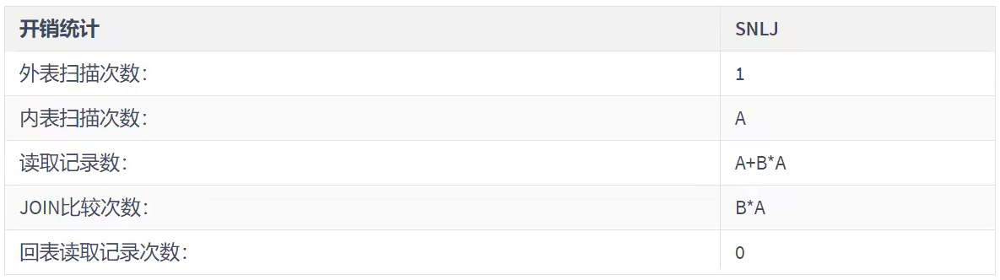

当然mysql肯定不会这么粗暴的去进行表的连接，所以就出现了后面的两种对Nested-Loop Join优化算法。

#### 3. Index Nested-Loop Join （索引嵌套循环连接）

Index Nested-Loop Join其优化的思路主要是为了`减少内存表数据的匹配次数`，所以要求被驱动表上必须`有索引`才行。通过外层表匹配条件直接与内层表索引进行匹配，避免和内存表的每条记录去进行比较，这样极大的减少了对内存表的匹配次数。

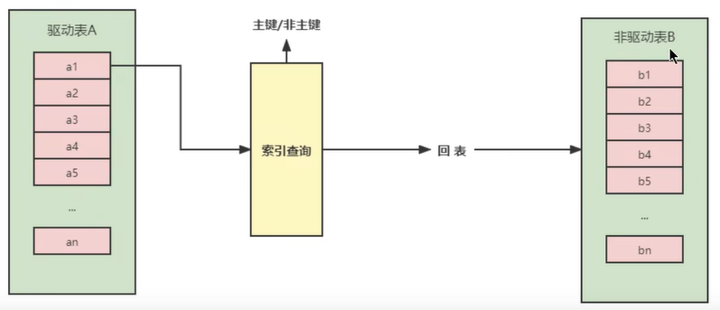

驱动表中的每条记录通过被驱动表的索引进行访问，因为索引查询的成本是比较固定的，故mysql优化器都倾向于使用记录数少的表作为驱动表（外表）。


如果被驱动表加索引，效率是非常高的，但如果索引不是主键索引，所以还得进行一次回表查询。相比，被驱动表的索引是主键索引，效率会更高。

#### 4. Block Nested-Loop Join（块嵌套循环连接）


> 注意：
>
> 这里缓存的不只是关联表的列，select后面的列也会缓存起来。
>
> 在一个有N个join关联的sql中会分配N-1个join buffer。所以查询的时候尽量减少不必要的字段，可以让join buffer中可以存放更多的列。

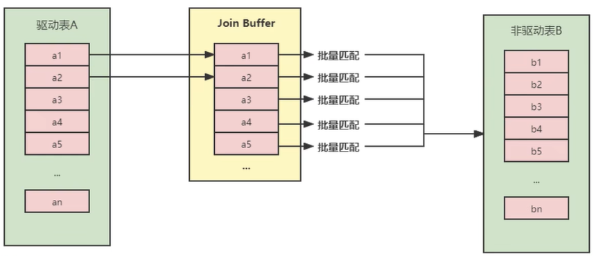

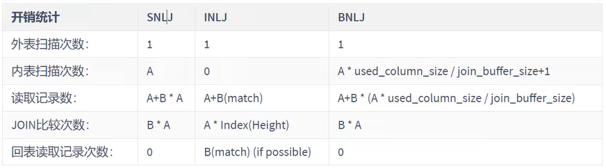

参数设置：

* block_nested_loop

通过`show variables like '%optimizer_switch%` 查看 `block_nested_loop`状态。默认是开启的。

* join_buffer_size

驱动表能不能一次加载完，要看join buffer能不能存储所有的数据，默认情况下`join_buffer_size=256k`。

```mysql
mysql> show variables like '%join_buffer%';
```

join_buffer_size的最大值在32位操作系统可以申请4G，而在64位操作系统下可以申请大于4G的Join Buffer空间（64位Windows除外，其大值会被截断为4GB并发出警告）。

#### 5. Join小结

1、**整体效率比较：INLJ > BNLJ > SNLJ**

2、永远用小结果集驱动大结果集（其本质就是减少外层循环的数据数量）（小的度量单位指的是表行数 * 每行大小）

```mysql
select t1.b,t2.* from t1 straight_join t2 on (t1.b=t2.b) where t2.id<=100; # 推荐
select t1.b,t2.* from t2 straight_join t1 on (t1.b=t2.b) where t2.id<=100; # 不推荐
```

3、为被驱动表匹配的条件增加索引(减少内存表的循环匹配次数)

4、增大join buffer size的大小（一次索引的数据越多，那么内层包的扫描次数就越少）

5、减少驱动表不必要的字段查询（字段越少，join buffer所缓存的数据就越多）

#### 6. Hash Join

**从MySQL的8.0.20版本开始将废弃BNLJ，因为从MySQL8.0.18版本开始就加入了hash join默认都会使用hash join**

* Nested Loop:

  对于被连接的数据子集较小的情况，Nested Loop是个较好的选择。

* Hash Join是做`大数据集连接`时的常用方式，优化器使用两个表中较小（相对较小）的表利用Join Key在内存中建立`散列表`，然后扫描较大的表并探测散列表，找出与Hash表匹配的行。
  * 这种方式适合于较小的表完全可以放于内存中的情况，这样总成本就是访问两个表的成本之和。
  * 在表很大的情况下并不能完全放入内存，这时优化器会将它分割成`若干不同的分区`，不能放入内存的部分就把该分区写入磁盘的临时段，此时要求有较大的临时段从而尽量提高I/O的性能。
  * 它能够很好的工作于没有索引的大表和并行查询的环境中，并提供最好的性能。大多数人都说它是Join的重型升降机。Hash Join只能应用于等值连接（如WHERE A.COL1 = B.COL2），这是由Hash的特点决定的。

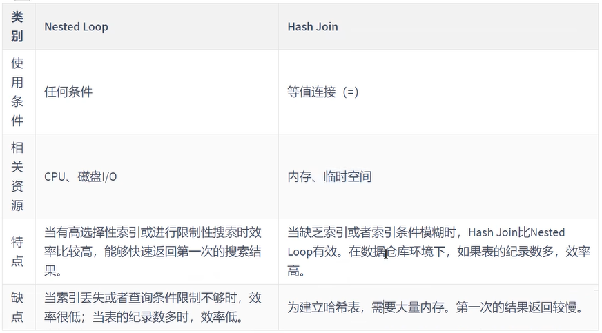

### 3.5 小结

* 保证被驱动表的JOIN字段已经创建了索引 
* 需要JOIN 的字段，数据类型保持绝对一致。 
* LEFT JOIN 时，选择小表作为驱动表， 大表作为被驱动表 。减少外层循环的次数。 
* INNER JOIN 时，MySQL会自动将 小结果集的表选为驱动表 。选择相信MySQL优化策略。 
* 能够直接多表关联的尽量直接关联，不用子查询。(减少查询的趟数) 
* 不建议使用子查询，建议将子查询SQL拆开结合程序多次查询，或使用 JOIN 来代替子查询。 
* 衍生表建不了索引

## 4. 子查询优化

MySQL从4.1版本开始支持子查询，使用子查询可以进行SELECT语句的嵌套查询，即一个SELECT查询的结 果作为另一个SELECT语句的条件。 `子查询可以一次性完成很多逻辑上需要多个步骤才能完成的SQL操作` 。

**子查询是 MySQL 的一项重要的功能，可以帮助我们通过一个 SQL 语句实现比较复杂的查询。但是，子 查询的执行效率不高。**原因：

① 执行子查询时，MySQL需要为内层查询语句的查询结果 建立一个临时表 ，然后外层查询语句从临时表 中查询记录。查询完毕后，再 撤销这些临时表 。这样会消耗过多的CPU和IO资源，产生大量的慢查询。

② 子查询的结果集存储的临时表，不论是内存临时表还是磁盘临时表都 不会存在索引 ，所以查询性能会 受到一定的影响。

③ 对于返回结果集比较大的子查询，其对查询性能的影响也就越大。

**在MySQL中，可以使用连接（JOIN）查询来替代子查询。**连接查询 `不需要建立临时表` ，其 `速度比子查询` 要快 ，如果查询中使用索引的话，性能就会更好。

举例1：查询学生表中是班长的学生信息

* 使用子查询

```mysql
# 创建班级表中班长的索引
CREATE INDEX idx_monitor ON class(monitor);

EXPLAIN SELECT * FROM student stu1
WHERE stu1.`stuno` IN (
SELECT monitor
FROM class c
WHERE monitor IS NOT NULL
)
```

* 推荐使用多表查询

```mysql
EXPLAIN SELECT stu1.* FROM student stu1 JOIN class c
ON stu1.`stuno` = c.`monitor`
WHERE c.`monitor` is NOT NULL;
```

举例2：取所有不为班长的同学

* 不推荐

```mysql
EXPLAIN SELECT SQL_NO_CACHE a.*
FROM student a
WHERE a.stuno NOT IN (
	SELECT monitor FROM class b
    WHERE monitor IS NOT NULL
);
```

执行结果如下：

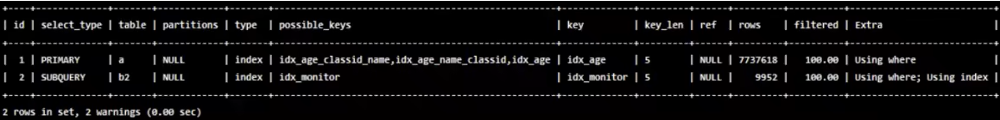

* 推荐：

```mysql
EXPLAIN SELECT SQL_NO_CACHE a.*
FROM student a LEFT OUTER JOIN class b
ON a.stuno = b.monitor
WHERE b.monitor IS NULL;
```

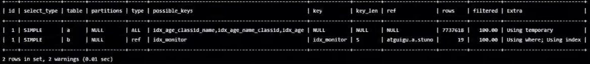

> 结论：尽量不要使用NOT IN或者NOT EXISTS，用LEFT JOIN xxx ON xx WHERE xx IS NULL替代

## 5. 排序优化

### 5.1 排序优化

**问题**：在 WHERE 条件字段上加索引，但是为什么在 ORDER BY 字段上还要加索引呢？

**回答：**

在MySQL中，支持两种排序方式，分别是 `FileSort` 和 `Index` 排序。

* Index 排序中，索引可以保证数据的有序性，不需要再进行排序，`效率更高`。
* FileSort 排序则一般在 `内存中` 进行排序，占用`CPU较多`。如果待排结果较大，会产生临时文件 I/O 到磁盘进行排序的情况，效率较低。

**优化建议：**

1. SQL 中，可以在 WHERE 子句和 ORDER BY 子句中使用索引，目的是在 WHERE 子句中 `避免全表扫描` ，在 ORDER BY 子句 `避免使用 FileSort 排序` 。当然，某些情况下全表扫描，或者 FileSort 排序不一定比索引慢。但总的来说，我们还是要避免，以提高查询效率。 
2. 尽量使用 Index 完成 ORDER BY 排序。如果 WHERE 和 ORDER BY 后面是相同的列就使用单索引列； 如果不同就使用联合索引。 
3. 无法使用 Index 时，需要对 FileSort 方式进行调优。

### 5.2 测试

删除student表和class表中已创建的索引。

```mysql
# 方式1
DROP INDEX idx_monitor ON class;
DROP INDEX idx_cid ON student;
DROP INDEX idx_age ON student;
DROP INDEX idx_name ON student;
DROP INDEX idx_age_name_classId ON student;
DROP INDEX idx_age_classId_name ON student;

# 方式2
call proc_drop_index('atguigudb2','student';)
```

以下是否能使用到索引，`能否去掉using filesort`

**过程一：**


**过程二： order by 时不limit,索引失效**


**过程三：order by 时顺序错误，索引失效**

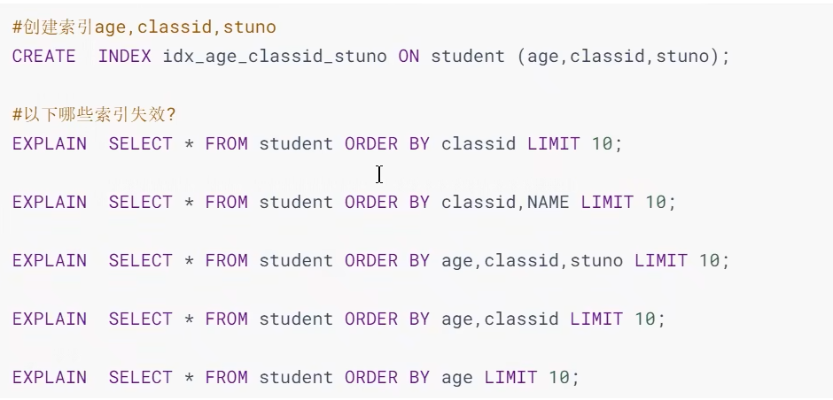

**过程四：order by 时规则不一致，索引失效（顺序错，不索引；方向反，不索引）**


> 结论：ORDER BY 子句，尽量使用 Index 方式排序，避免使用 FileSort 方式排序

**过程五：无过滤，不索引**


**小结**

```mysql
INDEX a_b_c(a,b,c)
order by 能使用索引最左前缀
- ORDER BY a
- ORDER BY a,b
- ORDER BY a,b,c
- ORDER BY a DESC,b DESC,c DESC
如果WHERE使用索引的最左前缀定义为常量，则order by 能使用索引
- WHERE a = const ORDER BY b,c
- WHERE a = const AND b = const ORDER BY c
- WHERE a = const ORDER BY b,c
- WHERE a = const AND b > const ORDER BY b,c
不能使用索引进行排序
- ORDER BY a ASC,b DESC,c DESC /* 排序不一致 */
- WHERE g = const ORDER BY b,c /*丢失a索引*/
- WHERE a = const ORDER BY c /*丢失b索引*/
- WHERE a = const ORDER BY a,d /*d不是索引的一部分*/
- WHERE a in (...) ORDER BY b,c /*对于排序来说，多个相等条件也是范围查询*/
```

### 5.3 案例实战

ORDER BY子句，尽量使用Index方式排序，避免使用FileSort方式排序。 

执行案例前先清除student上的索引，只留主键：

```mysql
DROP INDEX idx_age ON student;
DROP INDEX idx_age_classid_stuno ON student;
DROP INDEX idx_age_classid_name ON student;

#或者
call proc_drop_index('atguigudb2','student');
```

**场景:查询年龄为30岁的，且学生编号小于101000的学生，按用户名称排序**

```mysql
EXPLAIN SELECT SQL_NO_CACHE * FROM student WHERE age = 30 AND stuno <101000 ORDER BY NAME ;
```

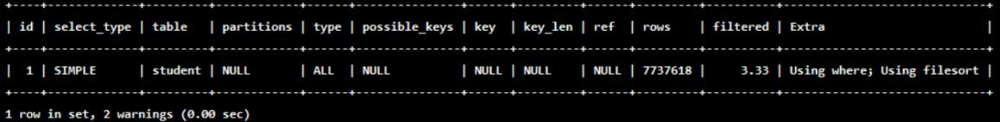

查询结果如下：

```mysql
mysql> SELECT SQL_NO_CACHE * FROM student WHERE age = 30 AND stuno <101000 ORDER BY NAME;
+---------+--------+--------+------+---------+
| id      | stuno  |  name  | age  | classId |
+---------+--------+--------+------+---------+
| 922     | 100923 | elTLXD | 30   | 249     |
| 3723263 | 100412 | hKcjLb | 30   | 59      |
| 3724152 | 100827 | iHLJmh | 30   | 387     |
| 3724030 | 100776 | LgxWoD | 30   | 253     |
| 30      | 100031 | LZMOIa | 30   | 97      |
| 3722887 | 100237 | QzbJdx | 30   | 440     |
| 609     | 100610 | vbRimN | 30   | 481     |
| 139     | 100140 | ZqFbuR | 30   | 351     |
+---------+--------+--------+------+---------+
8 rows in set, 1 warning (3.16 sec)
```

> 结论：type 是 ALL，即最坏的情况。Extra 里还出现了 Using filesort,也是最坏的情况。优化是必须的。

**方案一: 为了去掉filesort我们可以把索引建成**

```mysql
#创建新索引
CREATE INDEX idx_age_name ON student(age,NAME);
```

```mysql
EXPLAIN SELECT SQL_NO_CACHE * FROM student WHERE age = 30 AND stuno <101000 ORDER BY NAME;
```

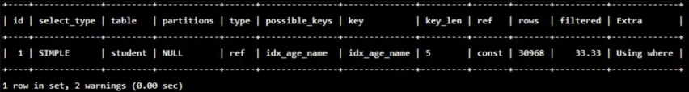

这样我们优化掉了 using filesort

查询结果如下：

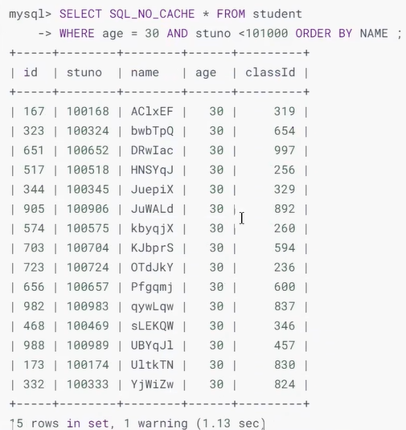

**方案二：尽量让where的过滤条件和排序使用上索引**

建一个三个字段的组合索引：

```mysql
DROP INDEX idx_age_name ON student;
CREATE INDEX idx_age_stuno_name ON student (age,stuno,NAME);
EXPLAIN SELECT SQL_NO_CACHE * FROM student WHERE age = 30 AND stuno <101000 ORDER BY NAME;
```

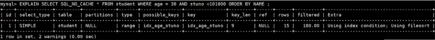

我们发现using filesort依然存在，所以name并没有用到索引，而且type还是range光看名字其实并不美好。原因是，因为`stuno是一个范围过滤`，所以索引后面的字段不会在使用索引了 。

结果如下：

```mysql
mysql> SELECT SQL_NO_CACHE * FROM student
-> WHERE age = 30 AND stuno <101000 ORDER BY NAME ;
+-----+--------+--------+------+---------+
| id | stuno | name | age | classId |
+-----+--------+--------+------+---------+
| 167 | 100168 | AClxEF | 30 | 319 |
| 323 | 100324 | bwbTpQ | 30 | 654 |
| 651 | 100652 | DRwIac | 30 | 997 |
| 517 | 100518 | HNSYqJ | 30 | 256 |
| 344 | 100345 | JuepiX | 30 | 329 |
| 905 | 100906 | JuWALd | 30 | 892 |
| 574 | 100575 | kbyqjX | 30 | 260 |
| 703 | 100704 | KJbprS | 30 | 594 |
| 723 | 100724 | OTdJkY | 30 | 236 |
| 656 | 100657 | Pfgqmj | 30 | 600 |
| 982 | 100983 | qywLqw | 30 | 837 |
| 468 | 100469 | sLEKQW | 30 | 346 |
| 988 | 100989 | UBYqJl | 30 | 457 |
| 173 | 100174 | UltkTN | 30 | 830 |
| 332 | 100333 | YjWiZw | 30 | 824 |
+-----+--------+--------+------+---------+
15 rows in set, 1 warning (0.00 sec)
```

结果竟然有 filesort的 sql 运行速度， 超过了已经优化掉 filesort的 sql ，而且快了很多，几乎一瞬间就出现了结果。

原因：


> 结论：
>
> 1. 两个索引同时存在，mysql自动选择最优的方案。（对于这个例子，mysql选择 idx_age_stuno_name）。但是， `随着数据量的变化，选择的索引也会随之变化的 `。 
> 2. **当【范围条件】和【group by 或者 order by】的字段出现二选一时，优先观察条件字段的过 滤数量，如果过滤的数据足够多，而需要排序的数据并不多时，优先把索引放在范围字段上。反之，亦然。**

思考：这里我们使用如下索引，是否可行？

```mysql
DROP INDEX idx_age_stuno_name ON student;

CREATE INDEX idx_age_stuno ON student(age,stuno);
```

当然可以。

### 5.4 filesort算法：双路排序和单路排序

排序的字段若不在索引列上，则filesort会有两种算法：双路排序和单路排序

**双路排序 （慢）**

* MySQL 4.1之前是使用双路排序 ，字面意思就是两次扫描磁盘，最终得到数据， 读取行指针和 order by列 ，对他们进行排序，然后扫描已经排序好的列表，按照列表中的值重新从列表中读取对应的数据输出 
* 从磁盘取排序字段，在buffer进行排序，再从磁盘取其他字段 。

取一批数据，要对磁盘进行两次扫描，众所周知，IO是很耗时的，所以在mysql4.1之后，出现了第二种 改进的算法，就是单路排序。

**单路排序 （快）**

从磁盘读取查询需要的 所有列 ，按照order by列在buffer对它们进行排序，然后扫描排序后的列表进行输出， 它的效率更快一些，避免了第二次读取数据。并且把随机IO变成了顺序IO，但是它会使用更多的空间， 因为它把每一行都保存在内存中了。

**结论及引申出的问题**

* 由于单路是后出的，总体而言好过双路 
* 但是用单路有问题
  * 在sort_buffer中，单路要比多路多占用很多空间，因为单路是把所有字段都取出，所以有可能取出的数据的总大小超出了`sort_buffer`的容量，导致每次只能取`sort_buffer`容量大小的数据，进行排序（创建tmp文件，多路合并），排完再取sort_buffer容量大小，再排...从而多次I/O。
  * 单路本来想省一次I/O操作，反而导致了大量的I/O操作，反而得不偿失。

**优化策略**

**1. 尝试提高 sort_buffer_size**

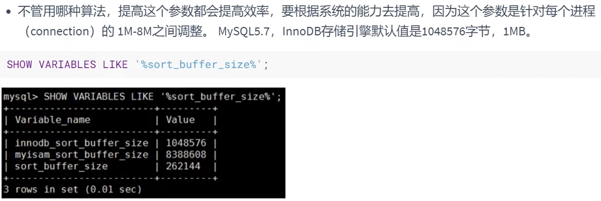

**2. 尝试提高 max_length_for_sort_data**


**3. Order by 时select * 是一个大忌。最好只Query需要的字段。**


## 6. GROUP BY优化

* group by 使用索引的原则几乎跟order by一致 ，group by 即使没有过滤条件用到索引，也可以直接使用索引。 
* group by 先排序再分组，遵照索引建的最佳左前缀法则 
* 当无法使用索引列，增大 max_length_for_sort_data 和 sort_buffer_size 参数的设置 
* where效率高于having，能写在where限定的条件就不要写在having中了 
* 减少使用order by，和业务沟通能不排序就不排序，或将排序放到程序端去做。Order by、group by、distinct这些语句较为耗费CPU，数据库的CPU资源是极其宝贵的。 
* 包含了order by、group by、distinct这些查询的语句，where条件过滤出来的结果集请保持在1000行 以内，否则SQL会很慢。

## 7. 优化分页查询

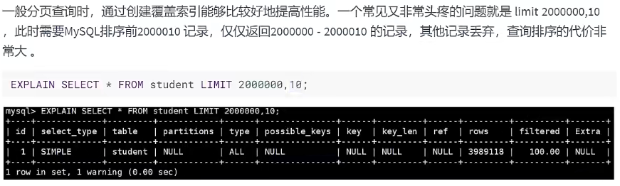

**优化思路一**

在索引上完成排序分页操作，最后根据主键关联回原表查询所需要的其他列内容。

```mysql
EXPLAIN SELECT * FROM student t,(SELECT id FROM student ORDER BY id LIMIT 2000000,10) a WHERE t.id = a.id;
```


**优化思路二**

该方案适用于主键自增的表，可以把Limit 查询转换成某个位置的查询 。

```mysql
EXPLAIN SELECT * FROM student WHERE id > 2000000 LIMIT 10;
```

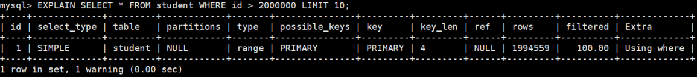

## 8. 优先考虑覆盖索引

### 8.1 什么是覆盖索引？

**理解方式一**：索引是高效找到行的一个方法，但是一般数据库也能使用索引找到一个列的数据，因此它不必读取整个行。毕竟索引叶子节点存储了它们索引的数据；当能通过读取索引就可以得到想要的数据，那就不需要读取行了。**一个索引包含了满足查询结果的数据就叫做覆盖索引**。

**理解方式二**：非聚簇复合索引的一种形式，它包括在查询里的SELECT、JOIN和WHERE子句用到的所有列 （即建索引的字段正好是覆盖查询条件中所涉及的字段）。

简单说就是， `索引列+主键` 包含 `SELECT 到 FROM之间查询的列` 。

**举例一：**

```mysql
# 删除之前的索引
DROP INDEX idx_age_stuno ON student;
CREATE INDEX idx_age_name ON student(age, NAME);
EXPLAIN SELECT * FROM student WHERE age <> 20;
```

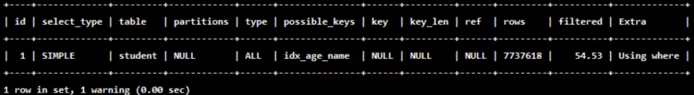

**举例二：**

```mysql
EXPLAIN SELECT * FROM student WHERE NAME LIKE '%abc';
```

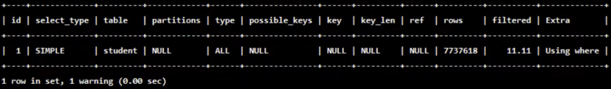

```mysql
CREATE INDEX idx_age_name ON student(age, NAME);
EXPLAIN SELECT id,age,NAME FROM student WHERE NAME LIKE '%abc';
```

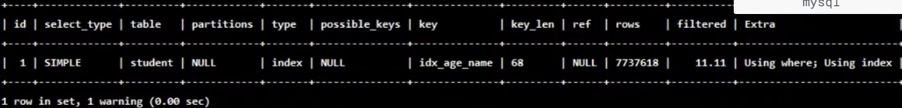

上述都使用到了声明的索引，下面的情况则不然，查询列依然多了classId,结果是未使用到索引：

```mysql
EXPLAIN SELECT id,age,NAME,classId FROM student WHERE NAME LIKE '%abc';
```

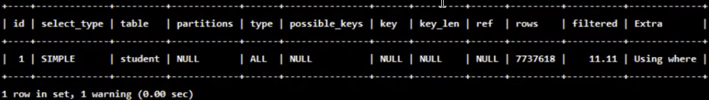

### 8.2 覆盖索引的利弊


## 9. 如何给字符串添加索引

有一张教师表，表定义如下：

```mysql
create table teacher(
ID bigint unsigned primary key,
email varchar(64),
...
)engine=innodb;
```

讲师要使用邮箱登录，所以业务代码中一定会出现类似于这样的语句：

```mysql
mysql> select col1, col2 from teacher where email='xxx';
```

如果email这个字段上没有索引，那么这个语句就只能做 `全表扫描` 。

### 9.1 前缀索引

MySQL是支持前缀索引的。默认地，如果你创建索引的语句不指定前缀长度，那么索引就会包含整个字 符串。

```mysql
mysql> alter table teacher add index index1(email);
#或
mysql> alter table teacher add index index2(email(6));
```

这两种不同的定义在数据结构和存储上有什么区别呢？下图就是这两个索引的示意图。

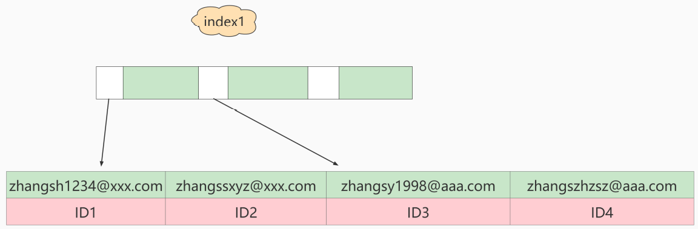

以及

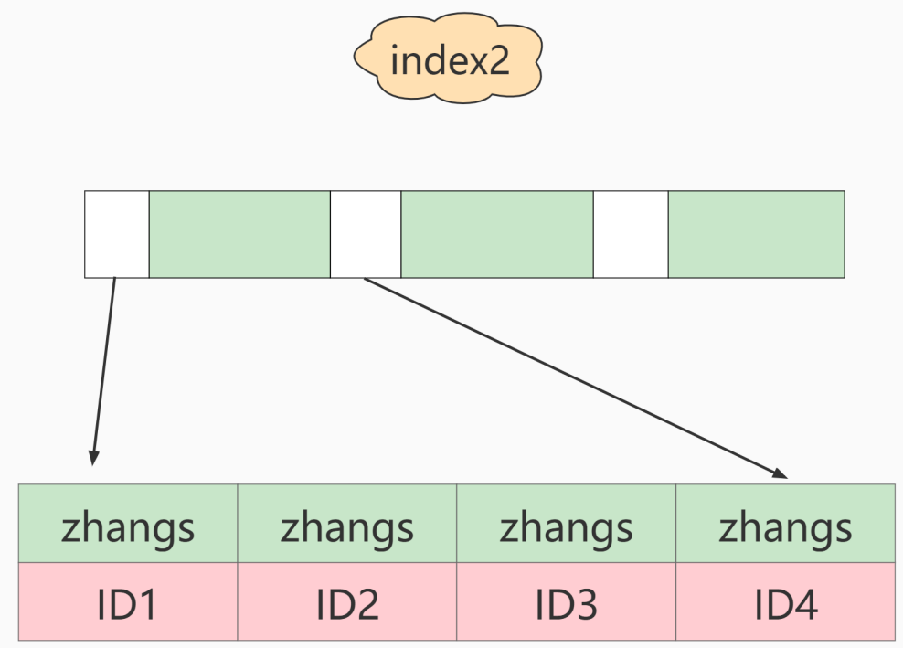

**如果使用的是index1**（即email整个字符串的索引结构），执行顺序是这样的：

1. 从index1索引树找到满足索引值是’ zhangssxyz@xxx.com’的这条记录，取得ID2的值； 
2. 到主键上查到主键值是ID2的行，判断email的值是正确的，将这行记录加入结果集； 
3. 取index1索引树上刚刚查到的位置的下一条记录，发现已经不满足email=' zhangssxyz@xxx.com ’的 条件了，循环结束。

这个过程中，只需要回主键索引取一次数据，所以系统认为只扫描了一行。

**如果使用的是index2**（即email(6)索引结构），执行顺序是这样的：

1. 从index2索引树找到满足索引值是’zhangs’的记录，找到的第一个是ID1； 
2. 到主键上查到主键值是ID1的行，判断出email的值不是’ zhangssxyz@xxx.com ’，这行记录丢弃； 
3. 取index2上刚刚查到的位置的下一条记录，发现仍然是’zhangs’，取出ID2，再到ID索引上取整行然 后判断，这次值对了，将这行记录加入结果集； 
4. 重复上一步，直到在idxe2上取到的值不是’zhangs’时，循环结束。

也就是说**使用前缀索引，定义好长度，就可以做到既节省空间，又不用额外增加太多的查询成本。**前面 已经讲过区分度，区分度越高越好。因为区分度越高，意味着重复的键值越少。

### 9.2 前缀索引对覆盖索引的影响

> 结论： 使用前缀索引就用不上覆盖索引对查询性能的优化了，这也是你在选择是否使用前缀索引时需要考虑的一个因素。

## 10. 索引下推

### 10.1 使用前后对比

Index Condition Pushdown(ICP)是MySQL 5.6中新特性，是一种在存储引擎层使用索引过滤数据的一种优化方式。


### 10.2 ICP的开启/关闭

* 默认情况下启动索引条件下推。可以通过设置系统变量`optimizer_switch`控制：`index_condition_pushdown`

```mysql
# 打开索引下推
SET optimizer_switch = 'index_condition_pushdown=on';

# 关闭索引下推
SET optimizer_switch = 'index_condition_pushdown=off';
```

* 当使用索引条件下推是，`EXPLAIN`语句输出结果中`Extra`列内容显示为`Using index condition`。

### 10.3 ICP使用案例

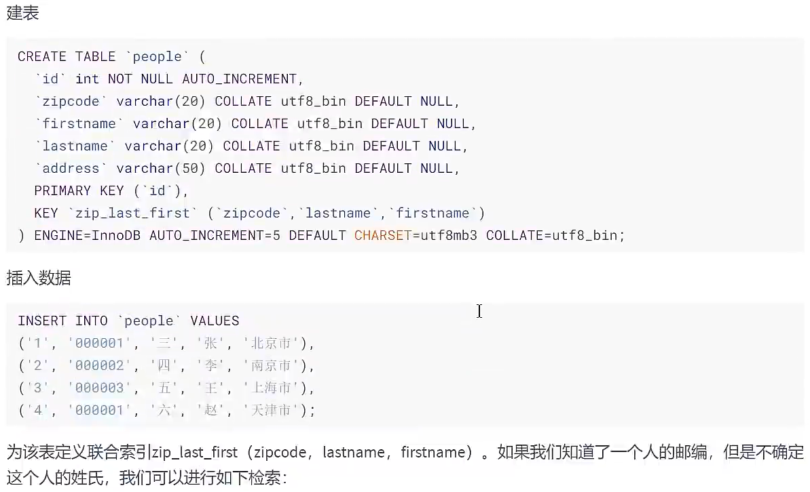

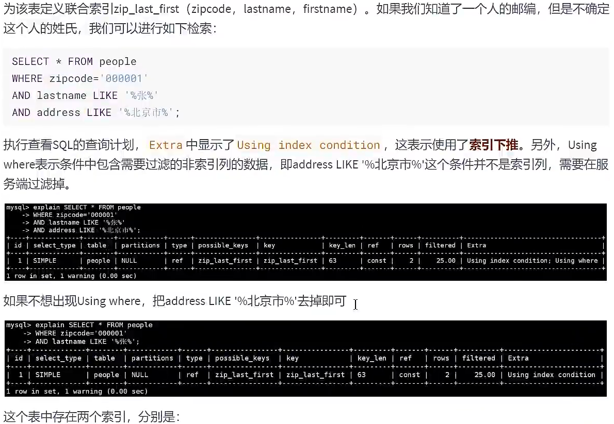

* 主键索引 (简图)


二级索引zip_last_first (简图，这里省略了数据页等信息)


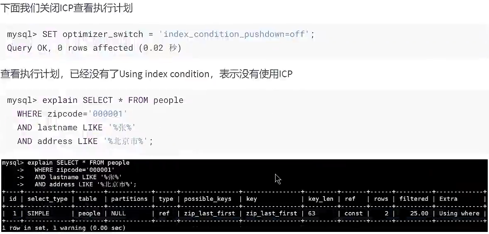

### 10.4 开启和关闭ICP性能对比

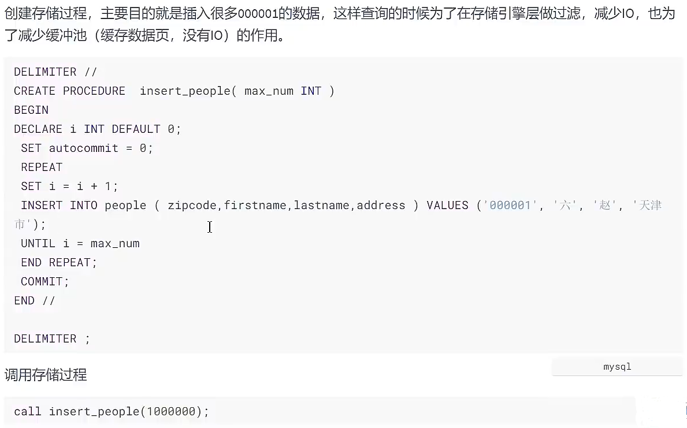


### 10.5 ICP的使用条件

1. 如果表的访问类型为 range 、 ref 、 eq_ref 或者 ref_or_null 可以使用ICP。
2. ICP可以使用`InnDB`和`MyISAM`表，包括分区表`InnoDB`和`MyISAM`表
3. 对于`InnoDB`表，ICP仅用于`二级索引`。ICP的目标是减少全行读取次数，从而减少I/O操作。
4. 当SQL使用覆盖索引时，不支持ICP优化方法。因为这种情况下使用ICP不会减少I/O。
5. 相关子查询的条件不能使用ICP

## 11. 普通索引 vs 唯一索引

从性能的角度考虑，你选择唯一索引还是普通索引呢？选择的依据是什么呢？

假设，我们有一个主键列为ID的表，表中有字段k，并且在k上有索引，假设字段 k 上的值都不重复。

这个表的建表语句是：

```mysql
mysql> create table test(
id int primary key,
k int not null,
name varchar(16),
index (k)
)engine=InnoDB;
```

表中R1~R5的(ID,k)值分别为(100,1)、(200,2)、(300,3)、(500,5)和(600,6)。

### 11.1 查询过程

假设，执行查询的语句是 select id from test where k=5。

* 对于普通索引来说，查找到满足条件的第一个记录(5,500)后，需要查找下一个记录，直到碰到第一 个不满足k=5条件的记录。 
* 对于唯一索引来说，由于索引定义了唯一性，查找到第一个满足条件的记录后，就会停止继续检 索。

那么，这个不同带来的性能差距会有多少呢？答案是， 微乎其微 。

### 11.2 更新过程

为了说明普通索引和唯一索引对更新语句性能的影响这个问题，介绍一下change buffer。

当需要更新一个数据页时，如果数据页在内存中就直接更新，而如果这个数据页还没有在内存中的话， 在不影响数据一致性的前提下， `InooDB会将这些更新操作缓存在change buffer中` ，这样就不需要从磁盘中读入这个数据页了。在下次查询需要访问这个数据页的时候，将数据页读入内存，然后执行change buffer中与这个页有关的操作。通过这种方式就能保证这个数据逻辑的正确性。

将change buffer中的操作应用到原数据页，得到最新结果的过程称为 merge 。除了 `访问这个数据页` 会触 发merge外，系统有 `后台线程会定期` merge。在 `数据库正常关闭（shutdown）` 的过程中，也会执行merge 操作。

如果能够将更新操作先记录在change buffer， `减少读磁盘` ，语句的执行速度会得到明显的提升。而且， 数据读入内存是需要占用 buffer pool 的，所以这种方式还能够 `避免占用内存 `，提高内存利用率。

`唯一索引的更新就不能使用change buffer` ，实际上也只有普通索引可以使用。

如果要在这张表中插入一个新记录(4,400)的话，InnoDB的处理流程是怎样的？

### 11.3 change buffer的使用场景

1. 普通索引和唯一索引应该怎么选择？其实，这两类索引在查询能力上是没差别的，主要考虑的是 对 更新性能 的影响。所以，建议你 尽量选择普通索引 。 
2. 在实际使用中会发现， 普通索引 和 change buffer 的配合使用，对于 数据量大 的表的更新优化 还是很明显的。 
3. 如果所有的更新后面，都马上 伴随着对这个记录的查询 ，那么你应该 关闭change buffer 。而在 其他情况下，change buffer都能提升更新性能。 
4. 由于唯一索引用不上change buffer的优化机制，因此如果 业务可以接受 ，从性能角度出发建议优 先考虑非唯一索引。但是如果"业务可能无法确保"的情况下，怎么处理呢？ 
   * 首先， 业务正确性优先 。我们的前提是“业务代码已经保证不会写入重复数据”的情况下，讨论性能 问题。如果业务不能保证，或者业务就是要求数据库来做约束，那么没得选，必须创建唯一索引。 这种情况下，本节的意义在于，如果碰上了大量插入数据慢、内存命中率低的时候，给你多提供一 个排查思路。 
   * 然后，在一些“ 归档库 ”的场景，你是可以考虑使用唯一索引的。比如，线上数据只需要保留半年， 然后历史数据保存在归档库。这时候，归档数据已经是确保没有唯一键冲突了。要提高归档效率， 可以考虑把表里面的唯一索引改成普通索引。

## 12. 其它查询优化策略

### 12.1 EXISTS 和 IN 的区分

**问题：**

不太理解哪种情况下应该使用 EXISTS，哪种情况应该用 IN。选择的标准是看能否使用表的索引吗？

**回答：**

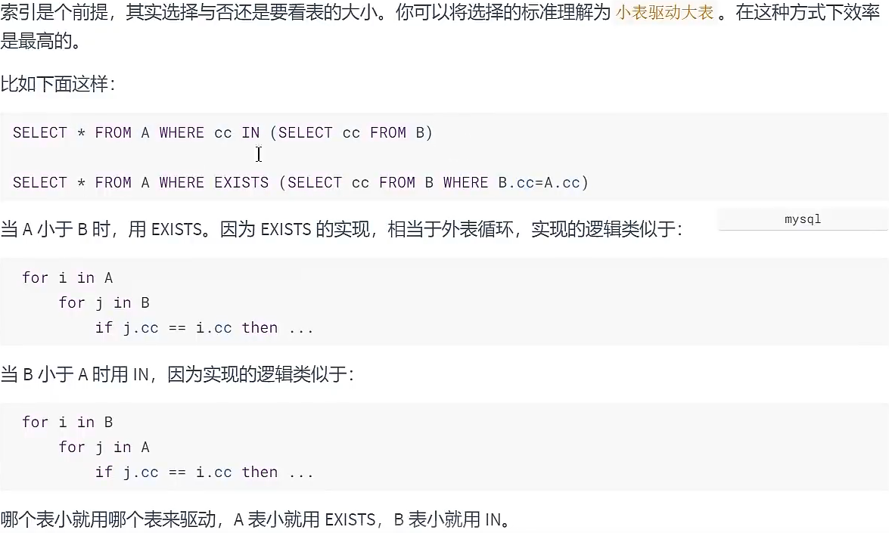

### 12.2 COUNT(*)与COUNT(具体字段)效率

问：在 MySQL 中统计数据表的行数，可以使用三种方式： SELECT COUNT(*) 、 SELECT COUNT(1) 和 SELECT COUNT(具体字段) ，使用这三者之间的查询效率是怎样的？

答：


### 12.3 关于SELECT(*)

在表查询中，建议明确字段，不要使用 * 作为查询的字段列表，推荐使用SELECT <字段列表> 查询。原因： 

① MySQL 在解析的过程中，会通过查询数据字典 将"*"按序转换成所有列名，这会大大的耗费资源和时间。 

② 无法使用 覆盖索引

### 12.4 LIMIT 1 对优化的影响

针对的是会扫描全表的 SQL 语句，如果你可以确定结果集只有一条，那么加上 LIMIT 1 的时候，当找到一条结果的时候就不会继续扫描了，这样会加快查询速度。

 如果数据表已经对字段建立了唯一索引，那么可以通过索引进行查询，不会全表扫描的话，就不需要加上 LIMIT 1 了。

### 12.5 多使用COMMIT

只要有可能，在程序中尽量多使用 COMMIT，这样程序的性能得到提高，需求也会因为 COMMIT 所释放 的资源而减少。

COMMIT 所释放的资源： 

* 回滚段上用于恢复数据的信息 
* 被程序语句获得的锁 
* redo / undo log buffer 中的空间 
* 管理上述 3 种资源中的内部花费

## 13. 淘宝数据库，主键如何设计的？

聊一个实际问题：淘宝的数据库，主键是如何设计的？

某些错的离谱的答案还在网上年复一年的流传着，甚至还成为了所谓的MySQL军规。其中，一个最明显的错误就是关于MySQL的主键设计。

大部分人的回答如此自信：用8字节的 BIGINT 做主键，而不要用INT。 `错 `！

这样的回答，只站在了数据库这一层，而没有 `从业务的角度` 思考主键。主键就是一个自增ID吗？站在 2022年的新年档口，用自增做主键，架构设计上可能 `连及格都拿不到` 。

### 13.1 自增ID的问题

自增ID做主键，简单易懂，几乎所有数据库都支持自增类型，只是实现上各自有所不同而已。自增ID除 了简单，其他都是缺点，总体来看存在以下几方面的问题：

1. **可靠性不高**

   存在自增ID回溯的问题，这个问题直到最新版本的MySQL 8.0才修复。 

2. **安全性不高 **

   对外暴露的接口可以非常容易猜测对应的信息。比如：/User/1/这样的接口，可以非常容易猜测用户ID的 值为多少，总用户数量有多少，也可以非常容易地通过接口进行数据的爬取。 

3. **性能差** 

   自增ID的性能较差，需要在数据库服务器端生成。 

4. **交互多** 

   业务还需要额外执行一次类似 last_insert_id() 的函数才能知道刚才插入的自增值，这需要多一次的 网络交互。在海量并发的系统中，多1条SQL，就多一次性能上的开销。 

5. **局部唯一性 **

   最重要的一点，自增ID是局部唯一，只在当前数据库实例中唯一，而不是全局唯一，在任意服务器间都 是唯一的。对于目前分布式系统来说，这简直就是噩梦。

### 13.2 业务字段做主键

为了能够唯一地标识一个会员的信息，需要为 会员信息表 设置一个主键。那么，怎么为这个表设置主 键，才能达到我们理想的目标呢？ 这里我们考虑业务字段做主键。

表数据如下：


在这个表里，哪个字段比较合适呢？

* **选择卡号（cardno）**

会员卡号（cardno）看起来比较合适，因为会员卡号不能为空，而且有唯一性，可以用来 标识一条会员 记录。

```mysql
mysql> CREATE TABLE demo.membermaster
-> (
-> cardno CHAR(8) PRIMARY KEY, -- 会员卡号为主键
-> membername TEXT,
-> memberphone TEXT,
-> memberpid TEXT,
-> memberaddress TEXT,
-> sex TEXT,
-> birthday DATETIME
-> );
Query OK, 0 rows affected (0.06 sec)
```

不同的会员卡号对应不同的会员，字段“cardno”唯一地标识某一个会员。如果都是这样，会员卡号与会 员一一对应，系统是可以正常运行的。

但实际情况是， 会员卡号可能存在重复使用 的情况。比如，张三因为工作变动搬离了原来的地址，不再 到商家的门店消费了 （退还了会员卡），于是张三就不再是这个商家门店的会员了。但是，商家不想让 这个会 员卡空着，就把卡号是“10000001”的会员卡发给了王五。

从系统设计的角度看，这个变化只是修改了会员信息表中的卡号是“10000001”这个会员 信息，并不会影 响到数据一致性。也就是说，修改会员卡号是“10000001”的会员信息， 系统的各个模块，都会获取到修 改后的会员信息，不会出现“有的模块获取到修改之前的会员信息，有的模块获取到修改后的会员信息， 而导致系统内部数据不一致”的情况。因此，从 信息系统层面 上看是没问题的。

但是从使用 系统的业务层面 来看，就有很大的问题 了，会对商家造成影响。

比如，我们有一个销售流水表（trans），记录了所有的销售流水明细。2020 年 12 月 01 日，张三在门店 购买了一本书，消费了 89 元。那么，系统中就有了张三买书的流水记录，如下所示：


接着，我们查询一下 2020 年 12 月 01 日的会员销售记录：

```mysql
mysql> SELECT b.membername,c.goodsname,a.quantity,a.salesvalue,a.transdate
-> FROM demo.trans AS a
-> JOIN demo.membermaster AS b
-> JOIN demo.goodsmaster AS c
-> ON (a.cardno = b.cardno AND a.itemnumber=c.itemnumber);
+------------+-----------+----------+------------+---------------------+
| membername | goodsname | quantity | salesvalue | transdate |
+------------+-----------+----------+------------+---------------------+
|     张三   | 书         | 1.000    | 89.00      | 2020-12-01 00:00:00 |
+------------+-----------+----------+------------+---------------------+
1 row in set (0.00 sec)
```

如果会员卡“10000001”又发给了王五，我们会更改会员信息表。导致查询时：

```mysql
mysql> SELECT b.membername,c.goodsname,a.quantity,a.salesvalue,a.transdate
-> FROM demo.trans AS a
-> JOIN demo.membermaster AS b
-> JOIN demo.goodsmaster AS c
-> ON (a.cardno = b.cardno AND a.itemnumber=c.itemnumber);
+------------+-----------+----------+------------+---------------------+
| membername | goodsname | quantity | salesvalue | transdate |
+------------+-----------+----------+------------+---------------------+
| 王五        | 书        | 1.000    | 89.00      | 2020-12-01 00:00:00 |
+------------+-----------+----------+------------+---------------------+
1 row in set (0.01 sec)
```

这次得到的结果是：王五在 2020 年 12 月 01 日，买了一本书，消费 89 元。显然是错误的！结论：千万 不能把会员卡号当做主键。

* **选择会员电话 或 身份证号**

会员电话可以做主键吗？不行的。在实际操作中，手机号也存在 被运营商收回 ，重新发给别人用的情况。

那身份证号行不行呢？好像可以。因为身份证决不会重复，身份证号与一个人存在一一对 应的关系。可 问题是，身份证号属于 个人隐私 ，顾客不一定愿意给你。要是强制要求会员必须登记身份证号，会把很 多客人赶跑的。其实，客户电话也有这个问题，这也是我们在设计会员信息表的时候，允许身份证号和 电话都为空的原因。

**所以，建议尽量不要用跟业务有关的字段做主键。毕竟，作为项目设计的技术人员，我们谁也无法预测 在项目的整个生命周期中，哪个业务字段会因为项目的业务需求而有重复，或者重用之类的情况出现。**

> 经验： 刚开始使用 MySQL 时，很多人都很容易犯的错误是喜欢用业务字段做主键，想当然地认为了解业 务需求，但实际情况往往出乎意料，而更改主键设置的成本非常高。

### 13.3 淘宝的主键设计

在淘宝的电商业务中，订单服务是一个核心业务。请问， 订单表的主键 淘宝是如何设计的呢？是自增ID 吗？

打开淘宝，看一下订单信息：


从上图可以发现，订单号不是自增ID！我们详细看下上述4个订单号：

```mysql
1550672064762308113
1481195847180308113
1431156171142308113
1431146631521308113
```

订单号是19位的长度，且订单的最后5位都是一样的，都是08113。且订单号的前面14位部分是单调递增的。

大胆猜测，淘宝的订单ID设计应该是：

```mysql
订单ID = 时间 + 去重字段 + 用户ID后6位尾号
```

这样的设计能做到全局唯一，且对分布式系统查询及其友好。

### 13.4 推荐的主键设计

**非核心业务** ：对应表的主键自增ID，如告警、日志、监控等信息。

**核心业务** ：`主键设计至少应该是全局唯一且是单调递增`。全局唯一保证在各系统之间都是唯一的，单调 递增是希望插入时不影响数据库性能。

这里推荐最简单的一种主键设计：UUID。

**UUID的特点：**

全局唯一，占用36字节，数据无序，插入性能差。

**认识UUID：**

* 为什么UUID是全局唯一的？ 
* 为什么UUID占用36个字节？ 
* 为什么UUID是无序的？

MySQL数据库的UUID组成如下所示：

```mysql
UUID = 时间+UUID版本（16字节）- 时钟序列（4字节） - MAC地址（12字节）
```

我们以UUID值e0ea12d4-6473-11eb-943c-00155dbaa39d举例：

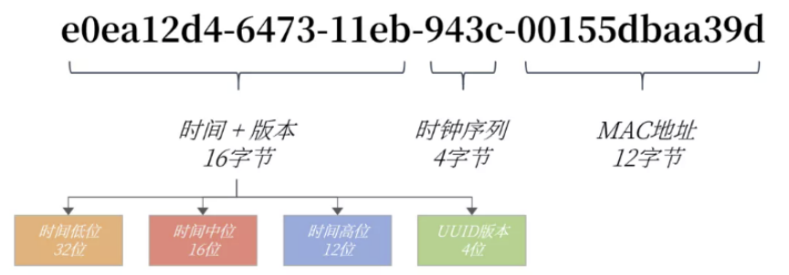

`为什么UUID是全局唯一的？`

在UUID中时间部分占用60位，存储的类似TIMESTAMP的时间戳，但表示的是从1582-10-15 00：00：00.00 到现在的100ns的计数。可以看到UUID存储的时间精度比TIMESTAMPE更高，时间维度发生重复的概率降 低到1/100ns。

时钟序列是为了避免时钟被回拨导致产生时间重复的可能性。MAC地址用于全局唯一。

`为什么UUID占用36个字节？`

UUID根据字符串进行存储，设计时还带有无用"-"字符串，因此总共需要36个字节。

`为什么UUID是随机无序的呢？`

因为UUID的设计中，将时间低位放在最前面，而这部分的数据是一直在变化的，并且是无序。

**改造UUID**

若将时间高低位互换，则时间就是单调递增的了，也就变得单调递增了。MySQL 8.0可以更换时间低位和时间高位的存储方式，这样UUID就是有序的UUID了。

MySQL 8.0还解决了UUID存在的空间占用的问题，除去了UUID字符串中无意义的"-"字符串，并且将字符串用二进制类型保存，这样存储空间降低为了16字节。

可以通过MySQL8.0提供的uuid_to_bin函数实现上述功能，同样的，MySQL也提供了bin_to_uuid函数进行转化：

```mysql
SET @uuid = UUID();
SELECT @uuid,uuid_to_bin(@uuid),uuid_to_bin(@uuid,TRUE);
```

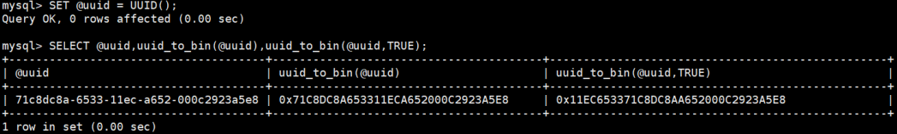

**通过函数uuid_to_bin(@uuid,true)将UUID转化为有序UUID了**。全局唯一 + 单调递增，这不就是我们想要的主键！

**有序UUID性能测试**

16字节的有序UUID，相比之前8字节的自增ID，性能和存储空间对比究竟如何呢？

我们来做一个测试，插入1亿条数据，每条数据占用500字节，含有3个二级索引，最终的结果如下所示：

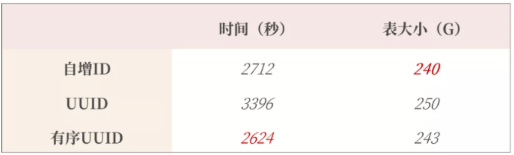

从上图可以看到插入1亿条数据有序UUID是最快的，而且在实际业务使用中有序UUID在 `业务端就可以生成` 。还可以进一步减少SQL的交互次数。

另外，虽然有序UUID相比自增ID多了8个字节，但实际只增大了3G的存储空间，还可以接受。

> 在当今的互联网环境中，非常不推荐自增ID作为主键的数据库设计。更推荐类似有序UUID的全局 唯一的实现。 
>
> 另外在真实的业务系统中，主键还可以加入业务和系统属性，如用户的尾号，机房的信息等。这样 的主键设计就更为考验架构师的水平了。

**如果不是MySQL8.0 肿么办？**

手动赋值字段做主键！

比如，设计各个分店的会员表的主键，因为如果每台机器各自产生的数据需要合并，就可能会出现主键重复的问题。

可以在总部 MySQL 数据库中，有一个管理信息表，在这个表中添加一个字段，专门用来记录当前会员编号的最大值。

门店在添加会员的时候，先到总部 MySQL 数据库中获取这个最大值，在这个基础上加 1，然后用这个值 作为新会员的“id”，同时，更新总部 MySQL 数据库管理信息表中的当前会员编号的最大值。

这样一来，各个门店添加会员的时候，都对同一个总部 MySQL 数据库中的数据表字段进行操作，就解 决了各门店添加会员时会员编号冲突的问题。

# 第11章_数据库的设计规范

## 1. 为什么需要数据库设计


## 2. 范 式

### 2.1 范式简介

在关系型数据库中，关于数据表设计的基本原则、规则就称为范式。可以理解为，一张数据表的设计结 构需要满足的某种设计标准的 级别 。要想设计一个结构合理的关系型数据库，必须满足一定的范式。

### 2.2 范式都包括哪些

目前关系型数据库有六种常见范式，按照范式级别，从低到高分别是：第一范式（1NF）、第二范式 （2NF）、第三范式（3NF）、巴斯-科德范式（BCNF）、第四范式(4NF）和第五范式（5NF，又称完美范式）。

数据库的范式设计越高阶，夯余度就越低，同时高阶的范式一定符合低阶范式的要求，满足最低要求的范式是第一范式（1NF）。在第一范式的基础上进一步满足更多规范的要求称为第二范式（2NF），其余范式以此类推。

一般来说，在关系型数据库设计中，最高也就遵循到`BCNF`, 普遍还是`3NF`。但也不绝对，有时候为了提高某些查询性能，我们还需要破坏范式规则，也就是`反规范化`。

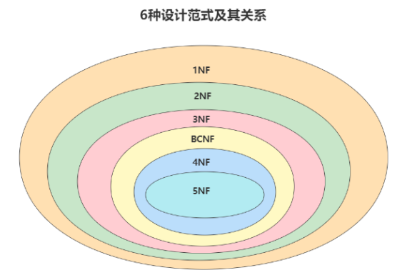

### 2.3 键和相关属性的概念


**举例:**

这里有两个表：

`球员表(player)` ：球员编号 | 姓名 | 身份证号 | 年龄 | 球队编号 

`球队表(team) `：球队编号 | 主教练 | 球队所在地

* 超键 ：对于球员表来说，超键就是包括球员编号或者身份证号的任意组合，比如（球员编号） （球员编号，姓名）（身份证号，年龄）等。 
* 候选键 ：就是最小的超键，对于球员表来说，候选键就是（球员编号）或者（身份证号）。 
* 主键 ：我们自己选定，也就是从候选键中选择一个，比如（球员编号）。 
* 外键 ：球员表中的球队编号。 
* 主属性 、 非主属性 ：在球员表中，主属性是（球员编号）（身份证号），其他的属性（姓名） （年龄）（球队编号）都是非主属性。

### 2.4 第一范式(1st NF)

第一范式主要确保数据库中每个字段的值必须具有`原子性`，也就是说数据表中每个字段的值为`不可再次拆分`的最小数据单元。

我们在设计某个字段的时候，对于字段X来说，不能把字段X拆分成字段X-1和字段X-2。事实上，任何的DBMS都会满足第一范式的要求，不会将字段进行拆分。

**举例1：**

假设一家公司要存储员工的姓名和联系方式。它创建一个如下表：

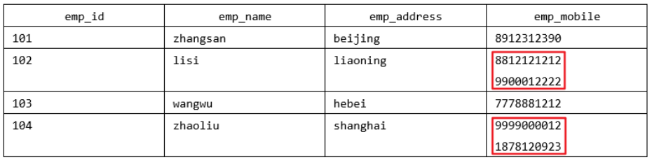

该表不符合 1NF ，因为规则说“表的每个属性必须具有原子（单个）值”，lisi和zhaoliu员工的 emp_mobile 值违反了该规则。为了使表符合 1NF ，我们应该有如下表数据：

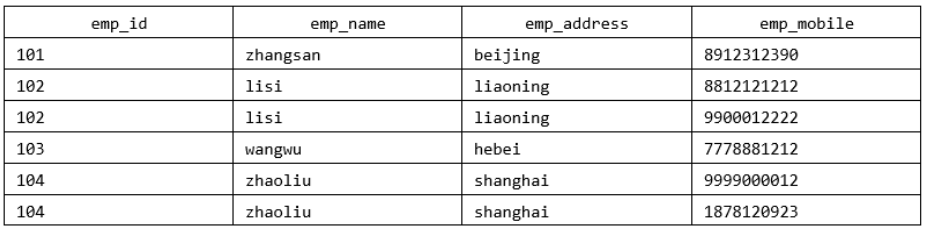

**举例2：**

user 表的设计不符合第一范式


其中，user_info字段为用户信息，可以进一步拆分成更小粒度的字段，不符合数据库设计对第一范式的 要求。将user_info拆分后如下：


**举例3：**

属性的原子性是 主观的 。例如，Employees关系中雇员姓名应当使用1个（fullname）、2个（firstname 和lastname）还是3个（firstname、middlename和lastname）属性表示呢？答案取决于应用程序。如果应 用程序需要分别处理雇员的姓名部分（如：用于搜索目的），则有必要把它们分开。否则，不需要。

表1：


表2：


### 2.5 第二范式(2nd NF)

第二范式要求，在满足第一范式的基础上，还要**满足数据库里的每一条数据记录，都是可唯一标识的。而且所有非主键字段，都必须完全依赖主键，不能只依赖主键的一部分**。如果知道主键的所有属性的值，就可以检索到任何元组（行）的任何属性的任何值。（要求中的主键，其实可以扩展替换为候选键）。

**举例1：**

`成绩表` （学号，课程号，成绩）关系中，（学号，课程号）可以决定成绩，但是学号不能决定成绩，课 程号也不能决定成绩，所以“（学号，课程号）→成绩”就是 `完全依赖关系` 。

**举例2：**

`比赛表 player_game` ，里面包含球员编号、姓名、年龄、比赛编号、比赛时间和比赛场地等属性，这 里候选键和主键都为（球员编号，比赛编号），我们可以通过候选键（或主键）来决定如下的关系：

```mysql
(球员编号, 比赛编号) → (姓名, 年龄, 比赛时间, 比赛场地，得分)
```

但是这个数据表不满足第二范式，因为数据表中的字段之间还存在着如下的对应关系：

```mysql
(球员编号) → (姓名，年龄)

(比赛编号) → (比赛时间, 比赛场地)
```

对于非主属性来说，并非完全依赖候选键。这样会产生怎样的问题呢？

1. `数据冗余` ：如果一个球员可以参加 m 场比赛，那么球员的姓名和年龄就重复了 m-1 次。一个比赛 也可能会有 n 个球员参加，比赛的时间和地点就重复了 n-1 次。 
2. `插入异常` ：如果我们想要添加一场新的比赛，但是这时还没有确定参加的球员都有谁，那么就没法插入。 
3. `删除异常` ：如果我要删除某个球员编号，如果没有单独保存比赛表的话，就会同时把比赛信息删 除掉。 
4. `更新异常` ：如果我们调整了某个比赛的时间，那么数据表中所有这个比赛的时间都需要进行调 整，否则就会出现一场比赛时间不同的情况。

为了避免出现上述的情况，我们可以把球员比赛表设计为下面的三张表。


这样的话，每张数据表都符合第二范式，也就避免了异常情况的发生。

> 1NF 告诉我们字段属性需要是原子性的，而 2NF 告诉我们一张表就是一个独立的对象，一张表只表达一个意思。

**举例3：**

定义了一个名为 Orders 的关系，表示订单和订单行的信息：

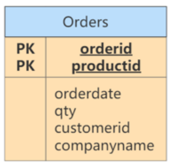

违反了第二范式，因为有非主键属性仅依赖于候选键（或主键）的一部分。例如，可以仅通过orderid找 到订单的 orderdate，以及 customerid 和 companyname，而没有必要再去使用productid。

修改：

Orders表和OrderDetails表如下，此时符合第二范式。

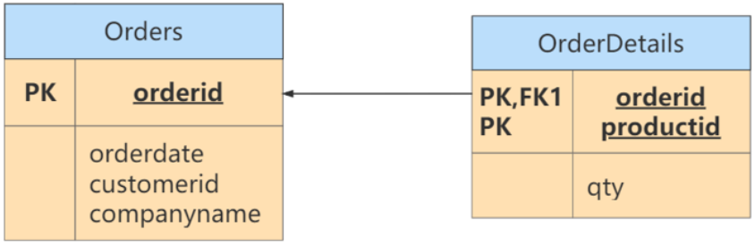

> 小结：第二范式（2NF）要求实体的属性完全依赖主关键字。如果存在不完全依赖，那么这个属性和主关键字的这一部分应该分离出来形成一个新的实体，新实体与元实体之间是一对多的关系。

### 2.6 第三范式(3rd NF)

第三范式是在第二范式的基础上，确保数据表中的每一个非主键字段都和主键字段直接相关，也就是说，**要求数据表中的所有非主键字段不能依赖于其他非主键字段**。（即，不能存在非主属性A依赖于非主属性B，非主属性B依赖于主键C的情况，即存在“A->B->C"的决定关系）通俗地讲，该规则的意思是所有`非主键属性`之间不能由依赖关系，必须`相互独立`。

这里的主键可以扩展为候选键。

**举例1：**

`部门信息表` ：每个部门有部门编号（dept_id）、部门名称、部门简介等信息。

`员工信息表 `：每个员工有员工编号、姓名、部门编号。列出部门编号后就不能再将部门名称、部门简介 等与部门有关的信息再加入员工信息表中。

如果不存在部门信息表，则根据第三范式（3NF）也应该构建它，否则就会有大量的数据冗余。

**举例2：**

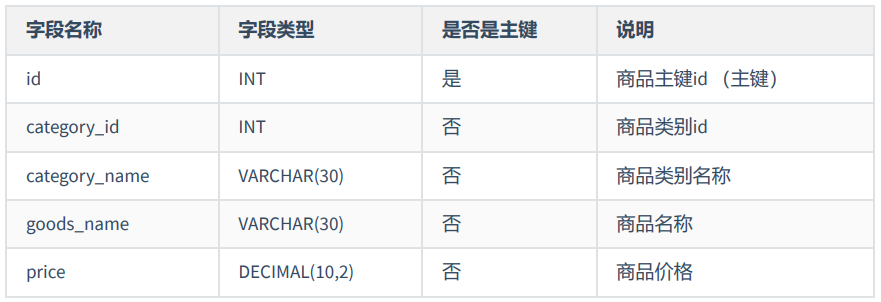

商品类别名称依赖于商品类别编号，不符合第三范式。

修改：

表1：符合第三范式的 `商品类别表` 的设计

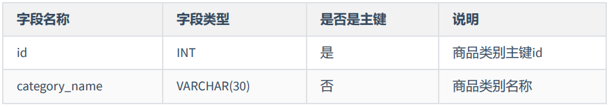

表2：符合第三范式的 `商品表` 的设计


商品表goods通过商品类别id字段（category_id）与商品类别表goods_category进行关联。

**举例3：**

`球员player表` ：球员编号、姓名、球队名称和球队主教练。现在，我们把属性之间的依赖关系画出来，如下图所示:

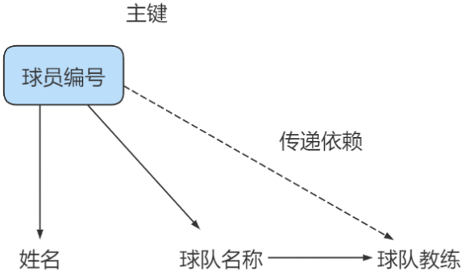

你能看到球员编号决定了球队名称，同时球队名称决定了球队主教练，非主属性球队主教练就会传递依 赖于球员编号，因此不符合 3NF 的要求。

如果要达到 3NF 的要求，需要把数据表拆成下面这样：


**举例4：**

修改第二范式中的举例3。

此时的Orders关系包含 orderid、orderdate、customerid 和 companyname 属性，主键定义为 orderid。 customerid 和companyname均依赖于主键——orderid。例如，你需要通过orderid主键来查找代表订单中 客户的customerid，同样，你需要通过 orderid 主键查找订单中客户的公司名称（companyname）。然 而， customerid和companyname也是互相依靠的。为满足第三范式，可以改写如下：

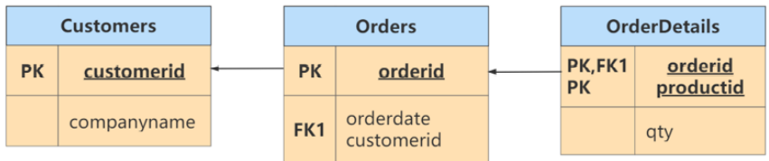

> 符合3NF后的数据模型通俗地讲，2NF和3NF通常以这句话概括：“每个非键属性依赖于键，依赖于 整个键，并且除了键别无他物”。

### 2.7 小结


## 3. 反范式化

### 3.1 概述


**规范化 vs 性能**

> 1. 为满足某种商业目标 , 数据库性能比规范化数据库更重要 
> 2. 在数据规范化的同时 , 要综合考虑数据库的性能 
> 3. 通过在给定的表中添加额外的字段，以大量减少需要从中搜索信息所需的时间 
> 4. 通过在给定的表中插入计算列，以方便查询

### 3.2 应用举例

**举例1：**

员工的信息存储在 `employees 表` 中，部门信息存储在 `departments 表` 中。通过 employees 表中的 department_id字段与 departments 表建立关联关系。如果要查询一个员工所在部门的名称：

```mysql
select employee_id,department_name
from employees e join departments d
on e.department_id = d.department_id;
```

如果经常需要进行这个操作，连接查询就会浪费很多时间。可以在 employees 表中增加一个冗余字段 department_name，这样就不用每次都进行连接操作了。

**举例2：**

反范式化的 `goods商品信息表` 设计如下：

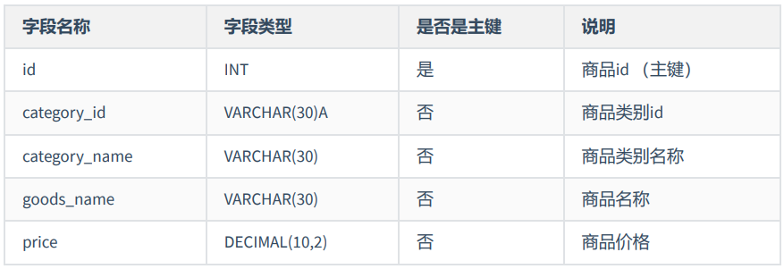

**举例3：**

我们有 2 个表，分别是 `商品流水表（atguigu.trans ）`和 `商品信息表 （atguigu.goodsinfo）` 。商品流水表里有 400 万条流水记录，商品信息表里有 2000 条商品记录。

商品流水表：

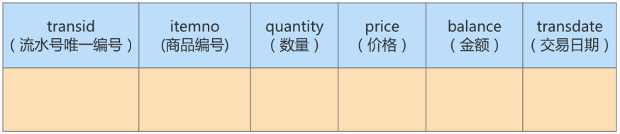

商品信息表：


新的商品流水表如下所示：

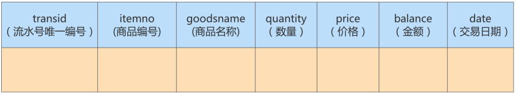

**举例4：**

`课程评论表 class_comment` ，对应的字段名称及含义如下：

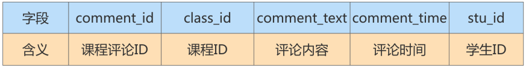

`学生表 student` ，对应的字段名称及含义如下：


在实际应用中，我们在显示课程评论的时候，通常会显示这个学生的昵称，而不是学生 ID，因此当我们 想要查询某个课程的前 1000 条评论时，需要关联 class_comment 和 student这两张表来进行查询。

**实验数据：模拟两张百万量级的数据表**

为了更好地进行 SQL 优化实验，我们需要给学生表和课程评论表随机模拟出百万量级的数据。我们可以 通过存储过程来实现模拟数据。

**反范式优化实验对比**

如果我们想要查询课程 ID 为 10001 的前 1000 条评论，需要写成下面这样：

```mysql
SELECT p.comment_text, p.comment_time, stu.stu_name
FROM class_comment AS p LEFT JOIN student AS stu
ON p.stu_id = stu.stu_id
WHERE p.class_id = 10001
ORDER BY p.comment_id DESC
LIMIT 1000;
```

运行结果（1000 条数据行）：

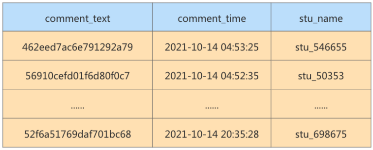

运行时长为 0.395 秒，对于网站的响应来说，这已经很慢了，用户体验会非常差。

如果我们想要提升查询的效率，可以允许适当的数据冗余，也就是在商品评论表中增加用户昵称字段， 在 class_comment 数据表的基础上增加 stu_name 字段，就得到了 class_comment2 数据表。

这样一来，只需单表查询就可以得到数据集结果：

```mysql
SELECT comment_text, comment_time, stu_name
FROM class_comment2
WHERE class_id = 10001
ORDER BY class_id DESC LIMIT 1000;
```

运行结果（1000 条数据）：

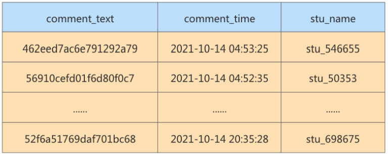

优化之后只需要扫描一次聚集索引即可，运行时间为 0.039 秒，查询时间是之前的 1/10。 你能看到， 在数据量大的情况下，查询效率会有显著的提升。

### 3.3 反范式的新问题

* 存储 空间变大了 
* 一个表中字段做了修改，另一个表中冗余的字段也需要做同步修改，否则 数据不一致 
* 若采用存储过程来支持数据的更新、删除等额外操作，如果更新频繁，会非常 消耗系统资源 
* 在 数据量小 的情况下，反范式不能体现性能的优势，可能还会让数据库的设计更加复杂

### 3.4 反范式的适用场景

当冗余信息有价值或者能 `大幅度提高查询效率` 的时候，我们才会采取反范式的优化。

#### 1. 增加冗余字段的建议

增加冗余字段一定要符合如下两个条件。只要满足这两个条件，才可以考虑增加夯余字段。

1）这个冗余字段`不需要经常进行修改`。

2）这个冗余字段`查询的时候不可或缺`。

#### 2. 历史快照、历史数据的需要

在现实生活中，我们经常需要一些冗余信息，比如订单中的收货人信息，包括姓名、电话和地址等。每 次发生的 `订单收货信息` 都属于 `历史快照` ，需要进行保存，但用户可以随时修改自己的信息，这时保存这 些冗余信息是非常有必要的。

反范式优化也常用在 `数据仓库` 的设计中，因为数据仓库通常`存储历史数据` ，对增删改的实时性要求不 强，对历史数据的分析需求强。这时适当允许数据的冗余度，更方便进行数据分析。

我简单总结下数据仓库和数据库在使用上的区别：

1. 数据库设计的目的在于`捕捉数据`，而数据仓库设计的目的在于`分析数据`。
2. 数据库对数据的`增删改实时性`要求强，需要存储在线的用户数据，而数据仓库存储的一般是`历史数据`。
3. 数据库设计需要`尽量避免冗余`，但为了提高查询效率也允许一定的`冗余度`，而数据仓库在设计上更偏向采用反范式设计，

## 4. BCNF(巴斯范式)

人们在3NF的基础上进行了改进，提出了巴斯范式（BCNF），页脚巴斯 - 科德范式（Boyce - Codd Normal Form）。BCNF被认为没有新的设计规范加入，只是对第三范式中设计规范要求更强，使得数据库冗余度更小。所以，称为是`修正的第三范式`，或`扩充的第三范式`，BCNF不被称为第四范式。

若一个关系达到了第三范式，并且它只有一个候选键，或者它的每个候选键都是单属性，则该关系自然达到BC范式。

一般来说，一个数据库设符合3NF或者BCNF就可以了。

**1. 案例**

我们分析如下表的范式情况：

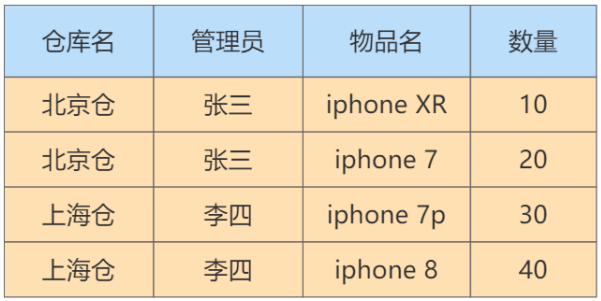

在这个表中，一个仓库只有一个管理员，同时一个管理员也只管理一个仓库。我们先来梳理下这些属性之间的依赖关系。

仓库名决定了管理员，管理员也决定了仓库名，同时（仓库名，物品名）的属性集合可以决定数量这个 属性。这样，我们就可以找到数据表的候选键。

`候选键 `：是（管理员，物品名）和（仓库名，物品名），然后我们从候选键中选择一个作为主键 ，比 如（仓库名，物品名）。

`主属性` ：包含在任一候选键中的属性，也就是仓库名，管理员和物品名。

`非主属性` ：数量这个属性。

**2. 是否符合三范式**

如何判断一张表的范式呢？我们需要根据范式的等级，从低到高来进行判断。

首先，数据表每个属性都是原子性的，符合 1NF 的要求；

其次，数据表中非主属性”数量“都与候选键全部依赖，（仓库名，物品名）决定数量，（管理员，物品 名）决定数量。因此，数据表符合 2NF 的要求；

最后，数据表中的非主属性，不传递依赖于候选键。因此符合 3NF 的要求。

**3. 存在的问题**

既然数据表已经符合了 3NF 的要求，是不是就不存在问题了呢？我们来看下面的情况：

1. 增加一个仓库，但是还没有存放任何物品。根据数据表实体完整性的要求，主键不能有空值，因 此会出现 插入异常 ；
2. 如果仓库更换了管理员，我们就可能会修改数据表中的多条记录 ；
3. 如果仓库里的商品都卖空了，那么此时仓库名称和相应的管理员名称也会随之被删除。

你能看到，即便数据表符合 3NF 的要求，同样可能存在插入，更新和删除数据的异常情况。

**4. 问题解决**

首先我们需要确认造成异常的原因：主属性仓库名对于候选键（管理员，物品名）是部分依赖的关系， 这样就有可能导致上面的异常情况。因此引入BCNF，**它在 3NF 的基础上消除了主属性对候选键的部分依赖或者传递依赖关系**。

* 如果在关系R中，U为主键，A属性是主键的一个属性，若存在A->Y，Y为主属性，则该关系不属于 BCNF。

根据 BCNF 的要求，我们需要把仓库管理关系 warehouse_keeper 表拆分成下面这样：

`仓库表` ：（仓库名，管理员）

`库存表 `：（仓库名，物品名，数量）

这样就不存在主属性对于候选键的部分依赖或传递依赖，上面数据表的设计就符合 BCNF。

再举例：

有一个 `学生导师表` ，其中包含字段：学生ID，专业，导师，专业GPA，这其中学生ID和专业是联合主键。

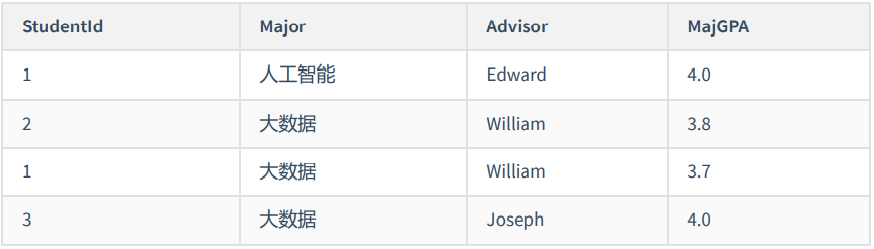

这个表的设计满足三范式，但是这里存在另一个依赖关系，“专业”依赖于“导师”，也就是说每个导师只做一个专业方面的导师，只要知道了是哪个导师，我们自然就知道是哪个专业的了。

所以这个表的部分主键Major依赖于非主键属性Advisor，那么我们可以进行以下的调整，拆分成2个表：

学生导师表：

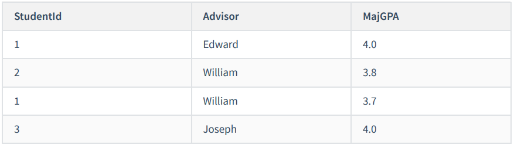

导师表：


## 5. 第四范式

多值依赖的概念：

* `多值依赖`即属性之间的一对多关系，记为K—>—>A。
* `函数依赖`事实上是单值依赖，所以不能表达属性值之间的一对多关系。
* `平凡的多值依赖`：全集U=K+A，一个K可以对应于多个A，即K—>—>A。此时整个表就是一组一对多关系。
* `非平凡的多值依赖`：全集U=K+A+B，一个K可以对应于多个A，也可以对应于多个B，A与B相互独立，即K—>—>A，K—>—>B。整个表有多组一对多关系，且有："一"部分是相同的属性集合，“多”部分是相互独立的属性集合。

第四范式即在满足巴斯 - 科德范式（BCNF）的基础上，消除非平凡且非函数依赖的多值依赖（即把同一表的多对多关系删除）。

**举例1：**职工表(职工编号，职工孩子姓名，职工选修课程)。

在这个表中，同一个职工可能会有多个职工孩子姓名。同样，同一个职工也可能会有多个职工选修课程，即这里存在着多值事实，不符合第四范式。

如果要符合第四范式，只需要将上表分为两个表，使它们只有一个多值事实，例如： `职工表一` (职工编 号，职工孩子姓名)， `职工表二`(职工编号，职工选修课程)，两个表都只有一个多值事实，所以符合第四范式。

**举例2：**

比如我们建立课程、教师、教材的模型。我们规定，每门课程有对应的一组教师，每门课程也有对应的一组教材，一门课程使用的教材和教师没有关系。我们建立的关系表如下：

课程ID，教师ID，教材ID；这三列作为联合主键。

为了表述方便，我们用Name代替ID，这样更容易看懂：


这个表除了主键，就没有其他字段了，所以肯定满足BC范式，但是却存在 `多值依赖` 导致的异常。

假如我们下学期想采用一本新的英版高数教材，但是还没确定具体哪个老师来教，那么我们就无法在这 个表中维护Course高数和Book英版高数教材的的关系。

解决办法是我们把这个多值依赖的表拆解成2个表，分别建立关系。这是我们拆分后的表：


以及


## 6. 第五范式、域键范式

除了第四范式外，我们还有更高级的第五范式（又称完美范式）和域键范式（DKNF）。

在满足第四范式（4NF）的基础上，消除不是由候选键所蕴含的连接依赖。**如果关系模式R中的每一个连 接依赖均由R的候选键所隐含**，则称此关系模式符合第五范式。

函数依赖是多值依赖的一种特殊的情况，而多值依赖实际上是连接依赖的一种特殊情况。但连接依赖不 像函数依赖和多值依赖可以由 `语义直接导出` ，而是在 `关系连接运算` 时才反映出来。存在连接依赖的关系 模式仍可能遇到数据冗余及插入、修改、删除异常等问题。

第五范式处理的是 `无损连接问题` ，这个范式基本 `没有实际意义` ，因为无损连接很少出现，而且难以察觉。而域键范式试图定义一个 `终极范式` ，该范式考虑所有的依赖和约束类型，但是实用价值也是最小的，只存在理论研究中。

## 7. 实战案例

商超进货系统中的`进货单表`进行剖析：

进货单表：

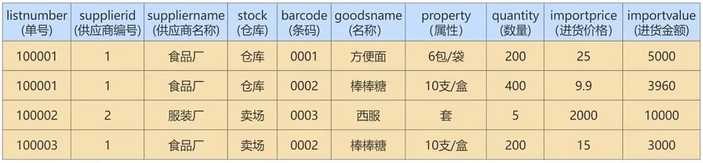

这个表中的字段很多，表里的数据量也很惊人。大量重复导致表变得庞大，效率极低。如何改造？

> 在实际工作场景中，这种由于数据表结构设计不合理，而导致的数据重复的现象并不少见。往往是系统虽然能够运行，承载能力却很差，稍微有点流量，就会出现内存不足、CPU使用率飙升的情况，甚至会导致整个项目失败。

### 7.1 迭代1次：考虑1NF

第一范式要求：**所有的字段都是基本数据类型，不可进行拆分**。这里需要确认，所有的列中，每个字段只包含一种数据。

这张表里，我们把“property"这一字段，拆分成”specification (规格)" 和 "unit (单位)"，这两个字段如下：

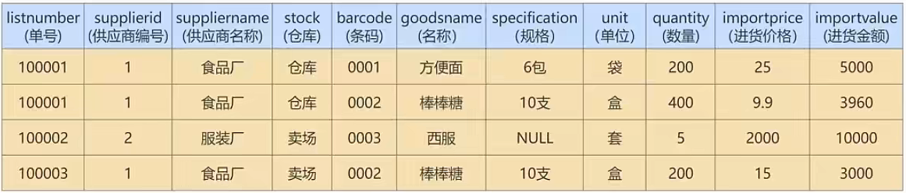

### 7.2 迭代2次：考虑2NF

第二范式要求，在满足第一范式的基础上，**还要满足数据表里的每一条数据记录，都是可唯一标识的。而且所有字段，都必须完全依赖主键，不能只依赖主键的一部分**。

第1步，就是要确定这个表的主键。通过观察发现，字段“listnumber（单号）"+"barcode（条码）"可以唯一标识每一条记录，可以作为主键。

第2步，确定好了主键以后，判断哪些字段完全依赖主键，哪些字段只依赖于主键的一部分。把只依赖于主键一部分的字段拆出去，形成新的数据表。

首先，进货单明细表里面的"goodsname(名称)""specification(规格)""unit(单位)"这些信息是商品的属性，只依赖于"batcode(条码)"，不完全依赖主键，可以拆分出去。我们把这3个字段加上它们所依赖的字段"barcode(条码)"，拆分形成新的数据表"商品信息表"。

这样一来，原来的数据表就被拆分成了两个表。

商品信息表：

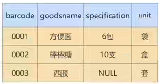

进货单表：

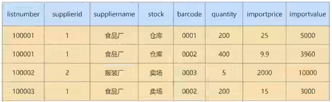

此外，字段"supplierid(供应商编号)""suppliername(供应商名称)""stock(仓库)“只依赖于"listnumber(单号)"，不完全依赖于主键，所以，我们可以把"supplierid""suppliername""stock"这3个字段拆出去，再加上它们依赖的字段"listnumber(单号)"，就形成了一个新的表"进货单头表"。剩下的字段，会组成新的表，我们叫它"进货单明细表"。

原来的数据表就拆分成了3个表。

进货单头表：

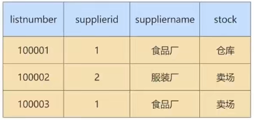

进货单明细表：

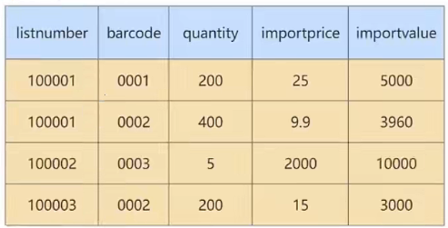

商品信息表：

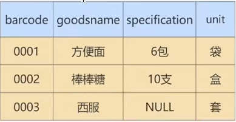

现在，我们再来分析一下拆分后的3个表，保证这3个表都满足第二范式的要求。

第3步，在“商品信息表”中，字段“barcode"是有`可能存在重复`的，比如，用户门店可能有散装称重商品和自产商品，会存在条码共用的情况。所以，所有的字段都不能唯一标识表里的记录。这个时候，我们必须给这个表加上一个主键，比如说是`自增字段"itemnumber"`。

### 7.3 迭代3次：考虑3NF

我们的进货单头表，还有数据冗余的可能。因为"suppliername"依赖"supplierid"，那么就可以按照第三范式的原则进行拆分了。我们就进一步拆分进货单头表，把它拆解陈供货商表和进货单头表。

供货商表：

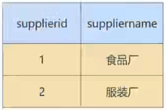

进货单头表：

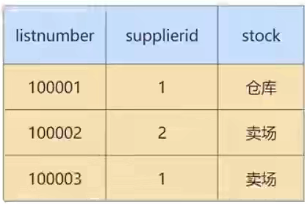

这2个表都满足第三范式的要求了。

### 7.4 反范式化：业务优先的原则


因此，最后我们可以把进货单表拆分成下面的4个表：

供货商表：


进货单头表：


进货单明细表：


商品信息表：


这样一来，我们就避免了冗余数据，而且还能够满足业务的需求，这样的数据库设计，才是合格的设计。

## 8. ER模型


### 8.1 ER模型包括哪些要素？

**ER 模型中有三个要素，分别是实体、属性和关系。**

`实体` ，可以看做是数据对象，往往对应于现实生活中的真实存在的个体。在 ER 模型中，用 矩形 来表 示。实体分为两类，分别是 强实体 和 弱实体 。强实体是指不依赖于其他实体的实体；弱实体是指对另 一个实体有很强的依赖关系的实体。

`属性` ，则是指实体的特性。比如超市的地址、联系电话、员工数等。在 ER 模型中用 椭圆形 来表示。

`关系` ，则是指实体之间的联系。比如超市把商品卖给顾客，就是一种超市与顾客之间的联系。在 ER 模 型中用 菱形 来表示。

注意：实体和属性不容易区分。这里提供一个原则：我们要从系统整体的角度出发去看，**可以独立存在的是实体，不可再分的是属性**。也就是说，属性不能包含其他属性。

### 8.2 关系的类型

在 ER 模型的 3 个要素中，关系又可以分为 3 种类型，分别是 一对一、一对多、多对多。

`一对一` ：指实体之间的关系是一一对应的，比如个人与身份证信息之间的关系就是一对一的关系。一个人只能有一个身份证信息，一个身份证信息也只属于一个人。

`一对多` ：指一边的实体通过关系，可以对应多个另外一边的实体。相反，另外一边的实体通过这个关系，则只能对应唯一的一边的实体。比如说，我们新建一个班级表，而每个班级都有多个学生，每个学 生则对应一个班级，班级对学生就是一对多的关系。

`多对多` ：指关系两边的实体都可以通过关系对应多个对方的实体。比如在进货模块中，供货商与超市之 间的关系就是多对多的关系，一个供货商可以给多个超市供货，一个超市也可以从多个供货商那里采购 商品。再比如一个选课表，有许多科目，每个科目有很多学生选，而每个学生又可以选择多个科目，这 就是多对多的关系。

### 8.3 建模分析

ER 模型看起来比较麻烦，但是对我们把控项目整体非常重要。如果你只是开发一个小应用，或许简单设 计几个表够用了，一旦要设计有一定规模的应用，在项目的初始阶段，建立完整的 ER 模型就非常关键 了。开发应用项目的实质，其实就是 建模 。

我们设计的案例是 电商业务 ，由于电商业务太过庞大且复杂，所以我们做了业务简化，比如针对 SKU（StockKeepingUnit，库存量单位）和SPU（Standard Product Unit，标准化产品单元）的含义上，我 们直接使用了SKU，并没有提及SPU的概念。本次电商业务设计总共有8个实体，如下所示。

* 地址实体 
* 用户实体 
* 购物车实体 
* 评论实体 
* 商品实体 
* 商品分类实体 
* 订单实体 
* 订单详情实体

其中， 用户 和 商品分类 是强实体，因为它们不需要依赖其他任何实体。而其他属于弱实体，因为它们 虽然都可以独立存在，但是它们都依赖用户这个实体，因此都是弱实体。知道了这些要素，我们就可以 给电商业务创建 ER 模型了，如图：

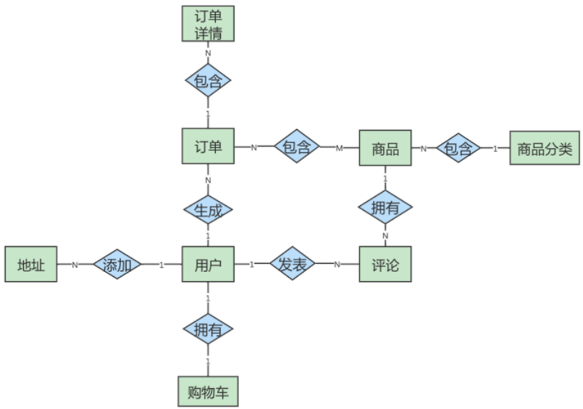

在这个图中，地址和用户之间的添加关系，是一对多的关系，而商品和商品详情示一对1的关系，商品和 订单是多对多的关系。 这个 ER 模型，包括了 8个实体之间的 8种关系。

（1）用户可以在电商平台添加多个地址； 

（2）用户只能拥有一个购物车； 

（3）用户可以生成多个订单； 

（4）用户可以发表多条评论； 

（5）一件商品可以有多条评论； 

（6）每一个商品分类包含多种商品；

（7）一个订单可以包含多个商品，一个商品可以在多个订单里。 

（8）订单中又包含多个订单详情，因为一个订单中可能包含不同种类的商品

### 8.4 ER 模型的细化

有了这个 ER 模型，我们就可以从整体上 理解 电商的业务了。刚刚的 ER 模型展示了电商业务的框架， 但是只包括了订单，地址，用户，购物车，评论，商品，商品分类和订单详情这八个实体，以及它们之 间的关系，还不能对应到具体的表，以及表与表之间的关联。我们需要把 属性加上 ，用 椭圆 来表示， 这样我们得到的 ER 模型就更加完整了。

因此，我们需要进一步去设计一下这个 ER 模型的各个局部，也就是细化下电商的具体业务流程，然后把 它们综合到一起，形成一个完整的 ER 模型。这样可以帮助我们理清数据库的设计思路。

接下来，我们再分析一下各个实体都有哪些属性，如下所示。

（1） `地址实体` 包括用户编号、省、市、地区、收件人、联系电话、是否是默认地址。 

（2） `用户实体` 包括用户编号、用户名称、昵称、用户密码、手机号、邮箱、头像、用户级别。

（3） `购物车实体` 包括购物车编号、用户编号、商品编号、商品数量、图片文件url。

（4） `订单实体` 包括订单编号、收货人、收件人电话、总金额、用户编号、付款方式、送货地址、下单 时间。 

（5） `订单详情实体` 包括订单详情编号、订单编号、商品名称、商品编号、商品数量。 

（6） `商品实体` 包括商品编号、价格、商品名称、分类编号、是否销售，规格、颜色。 

（7） `评论实体` 包括评论id、评论内容、评论时间、用户编号、商品编号 

（8） `商品分类实体` 包括类别编号、类别名称、父类别编号

这样细分之后，我们就可以重新设计电商业务了，ER 模型如图：


### 8.5 ER 模型图转换成数据表

通过绘制 ER 模型，我们已经理清了业务逻辑，现在，我们就要进行非常重要的一步了：把绘制好的 ER 模型，转换成具体的数据表，下面介绍下转换的原则：

（1）一个 实体 通常转换成一个 数据表 ； 

（2）一个 多对多的关系 ，通常也转换成一个 数据表 ； 

（3）一个 1 对 1 ，或者 1 对多 的关系，往往通过表的 外键 来表达，而不是设计一个新的数据表； 

（4） 属性 转换成表的 字段 。

下面结合前面的ER模型，具体讲解一下怎么运用这些转换的原则，把 ER 模型转换成具体的数据表，从 而把抽象出来的数据模型，落实到具体的数据库设计当中。

#### 1. 一个实体转换成一个数据库

**先来看一下强实体转换成数据表:**

`用户实体`转换成用户表(user_info)的代码如下所示。

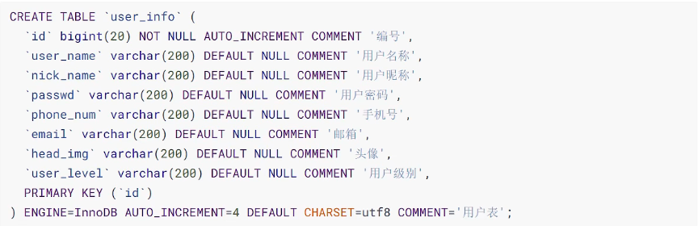

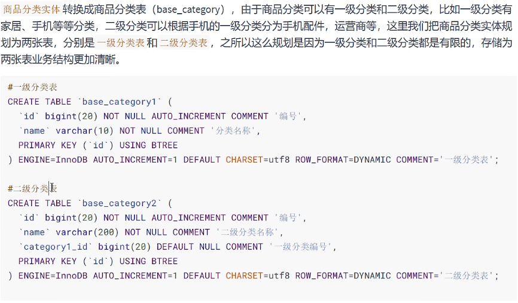


**下面我们再把弱实体转换成数据表：**

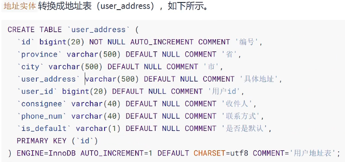

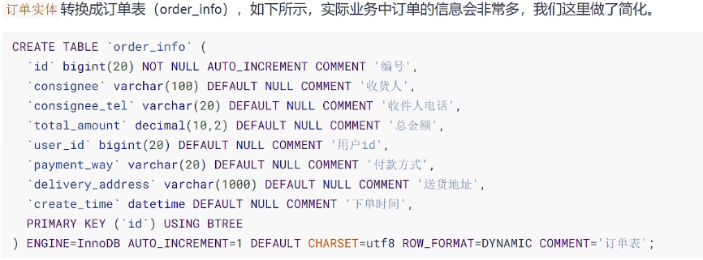

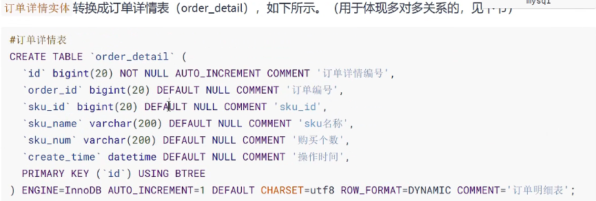

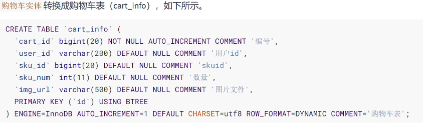


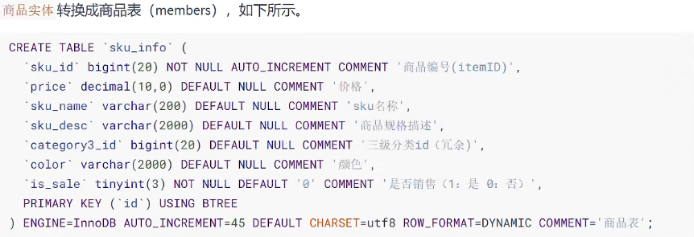

#### 2. 一个多对多的关系转换成一个数据表

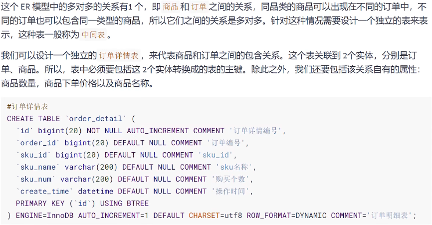

#### 3. 通过外键来表达1对多的关系

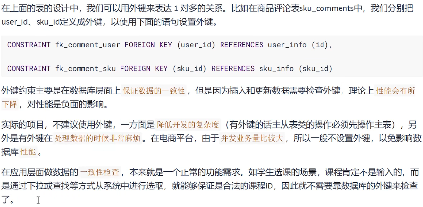

#### 4. 把属性转换成表的字段

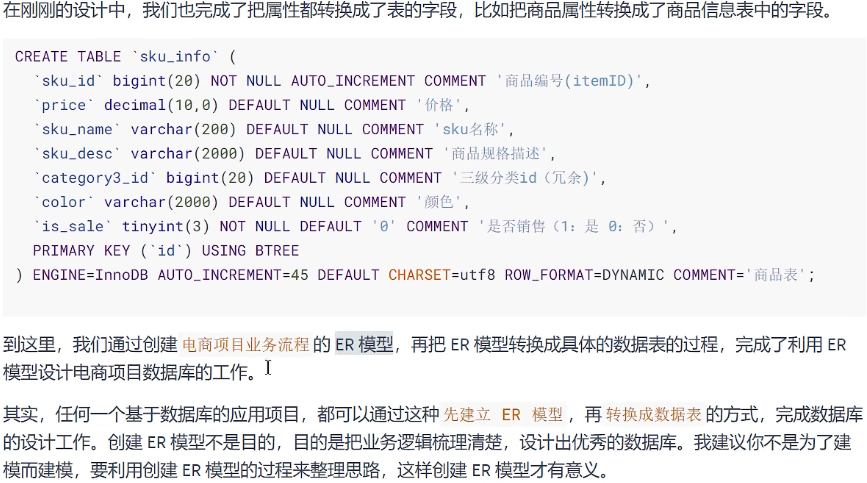

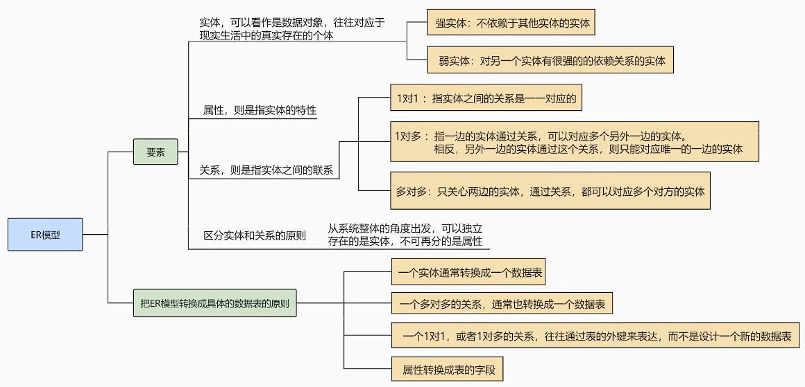

## 9. 数据表的设计原则

综合以上内容，总结出数据表设计的一般原则："三少一多"

**1. 数据表的个数越少越好**


**2. 数据表中的字段个数越少越好**


**3. 数据表中联合主键的字段个数越少越好**


**4. 使用主键和外键越多越好**


## 10. 数据库对象编写建议

### 10.1 关于库

1. 【强制】库的名称必须控制在32个字符以内，只能使用英文字母、数字和下划线，建议以英文字 母开头。 
2. 【强制】库名中英文 一律小写 ，不同单词采用 下划线 分割。须见名知意。 
3. 【强制】库的名称格式：业务系统名称_子系统名。
4. 【强制】库名禁止使用关键字（如type,order等）。
5. 【强制】创建数据库时必须 显式指定字符集 ，并且字符集只能是utf8或者utf8mb4。 创建数据库SQL举例：CREATE DATABASE crm_fund DEFAULT CHARACTER SET 'utf8' ; 
6. 【建议】对于程序连接数据库账号，遵循 权限最小原则 使用数据库账号只能在一个DB下使用，不准跨库。程序使用的账号 原则上不准有drop权限 。 
7. 【建议】临时库以 tmp_ 为前缀，并以日期为后缀； 备份库以 bak_ 为前缀，并以日期为后缀。

### 10.2 关于表、列

1. 【强制】表和列的名称必须控制在32个字符以内，表名只能使用英文字母、数字和下划线，建议 以 英文字母开头 。 

2. 【强制】 表名、列名一律小写 ，不同单词采用下划线分割。须见名知意。 

3. 【强制】表名要求有模块名强相关，同一模块的表名尽量使用 统一前缀 。比如：crm_fund_item 

4. 【强制】创建表时必须 显式指定字符集 为utf8或utf8mb4。 

5. 【强制】表名、列名禁止使用关键字（如type,order等）。 

6. 【强制】创建表时必须 显式指定表存储引擎 类型。如无特殊需求，一律为InnoDB。 

7. 【强制】建表必须有comment。 

8. 【强制】字段命名应尽可能使用表达实际含义的英文单词或 缩写 。如：公司 ID，不要使用 corporation_id, 而用corp_id 即可。 

9. 【强制】布尔值类型的字段命名为 is_描述 。如member表上表示是否为enabled的会员的字段命 名为 is_enabled。 

10. 【强制】禁止在数据库中存储图片、文件等大的二进制数据 通常文件很大，短时间内造成数据量快速增长，数据库进行数据库读取时，通常会进行大量的随 机IO操作，文件很大时，IO操作很耗时。通常存储于文件服务器，数据库只存储文件地址信息。 

11. 【建议】建表时关于主键： 表必须有主键

     (1)强制要求主键为id，类型为int或bigint，且为 auto_increment 建议使用unsigned无符号型。

     (2)标识表里每一行主体的字段不要设为主键，建议 设为其他字段如user_id，order_id等，并建立unique key索引。因为如果设为主键且主键值为随机 插入，则会导致innodb内部页分裂和大量随机I/O，性能下降。 

12. 【建议】核心表（如用户表）必须有行数据的 创建时间字段 （create_time）和 最后更新时间字段 （update_time），便于查问题。 

13. 【建议】表中所有字段尽量都是 NOT NULL 属性，业务可以根据需要定义 DEFAULT值 。 因为使用 NULL值会存在每一行都会占用额外存储空间、数据迁移容易出错、聚合函数计算结果偏差等问 题。 

14. 【建议】所有存储相同数据的 列名和列类型必须一致 （一般作为关联列，如果查询时关联列类型 不一致会自动进行数据类型隐式转换，会造成列上的索引失效，导致查询效率降低）。 

15. 【建议】中间表（或临时表）用于保留中间结果集，名称以 tmp_ 开头。 备份表用于备份或抓取源表快照，名称以 bak_ 开头。中间表和备份表定期清理。 1

16. 【示范】一个较为规范的建表语句：

```mysql
CREATE TABLE user_info (
`id` int unsigned NOT NULL AUTO_INCREMENT COMMENT '自增主键',
`user_id` bigint(11) NOT NULL COMMENT '用户id',
`username` varchar(45) NOT NULL COMMENT '真实姓名',
`email` varchar(30) NOT NULL COMMENT '用户邮箱',
`nickname` varchar(45) NOT NULL COMMENT '昵称',
`birthday` date NOT NULL COMMENT '生日',
`sex` tinyint(4) DEFAULT '0' COMMENT '性别',
`short_introduce` varchar(150) DEFAULT NULL COMMENT '一句话介绍自己，最多50个汉字',
`user_resume` varchar(300) NOT NULL COMMENT '用户提交的简历存放地址',
`user_register_ip` int NOT NULL COMMENT '用户注册时的源ip',
`create_time` timestamp NOT NULL DEFAULT CURRENT_TIMESTAMP COMMENT '创建时间',
`update_time` timestamp NOT NULL DEFAULT CURRENT_TIMESTAMP ON UPDATE
CURRENT_TIMESTAMP COMMENT '修改时间',
`user_review_status` tinyint NOT NULL COMMENT '用户资料审核状态，1为通过，2为审核中，3为未
通过，4为还未提交审核',
PRIMARY KEY (`id`),
UNIQUE KEY `uniq_user_id` (`user_id`),
KEY `idx_username`(`username`),
KEY `idx_create_time_status`(`create_time`,`user_review_status`)
) ENGINE=InnoDB DEFAULT CHARSET=utf8 COMMENT='网站用户基本信息
```

17. 【建议】创建表时，可以使用可视化工具。这样可以确保表、字段相关的约定都能设置上。

实际上，我们通常很少自己写 DDL 语句，可以使用一些可视化工具来创建和操作数据库和数据表。

可视化工具除了方便，还能直接帮我们将数据库的结构定义转化成 SQL 语言，方便数据库和数据表结构的导出和导入。

### 10.3 关于索引

1. 【强制】InnoDB表必须主键为id int/bigint auto_increment，且主键值 禁止被更新 。 
2. 【强制】InnoDB和MyISAM存储引擎表，索引类型必须为 BTREE 。 
3. 【建议】主键的名称以 pk_ 开头，唯一键以 uni_ 或 uk_ 开头，普通索引以 idx_ 开头，一律使用小写格式，以字段的名称或缩写作为后缀。 
4. 【建议】多单词组成的columnname，取前几个单词首字母，加末单词组成column_name。如: sample 表 member_id 上的索引：idx_sample_mid。 
5. 【建议】单个表上的索引个数 不能超过6个 。 
6. 【建议】在建立索引时，多考虑建立 联合索引 ，并把区分度最高的字段放在最前面。 
7. 【建议】在多表 JOIN 的SQL里，保证被驱动表的连接列上有索引，这样JOIN 执行效率最高。 
8. 【建议】建表或加索引时，保证表里互相不存在 冗余索引 。 比如：如果表里已经存在key(a,b)， 则key(a)为冗余索引，需要删除。

### 10.4 SQL编写

1. 【强制】程序端SELECT语句必须指定具体字段名称，禁止写成 *。 
2. 【建议】程序端insert语句指定具体字段名称，不要写成INSERT INTO t1 VALUES(…)。 
3. 【建议】除静态表或小表（100行以内），DML语句必须有WHERE条件，且使用索引查找。 
4. 【建议】INSERT INTO…VALUES(XX),(XX),(XX).. 这里XX的值不要超过5000个。 值过多虽然上线很 快，但会引起主从同步延迟。 
5. 【建议】SELECT语句不要使用UNION，推荐使用UNION ALL，并且UNION子句个数限制在5个以 内。 
6. 【建议】线上环境，多表 JOIN 不要超过5个表。 
7. 【建议】减少使用ORDER BY，和业务沟通能不排序就不排序，或将排序放到程序端去做。ORDER BY、GROUP BY、DISTINCT 这些语句较为耗费CPU，数据库的CPU资源是极其宝贵的。 
8. 【建议】包含了ORDER BY、GROUP BY、DISTINCT 这些查询的语句，WHERE 条件过滤出来的结果 集请保持在1000行以内，否则SQL会很慢。 
9. 【建议】对单表的多次alter操作必须合并为一次 对于超过100W行的大表进行alter table，必须经过DBA审核，并在业务低峰期执行，多个alter需整 合在一起。 因为alter table会产生 表锁 ，期间阻塞对于该表的所有写入，对于业务可能会产生极 大影响。 
10. 【建议】批量操作数据时，需要控制事务处理间隔时间，进行必要的sleep。 
11. 【建议】事务里包含SQL不超过5个。 因为过长的事务会导致锁数据较久，MySQL内部缓存、连接消耗过多等问题。 
12. 【建议】事务里更新语句尽量基于主键或UNIQUE KEY，如UPDATE… WHERE id=XX; 否则会产生间隙锁，内部扩大锁定范围，导致系统性能下降，产生死锁。

## 11. PowerDesigner的使用

PowerDesigner是一款开发人员常用的数据库建模工具，用户利用该软件可以方便地制作 `数据流程图` 、 `概念数据模型` 、 `物理数据模型` ，它几乎包括了数据库模型设计的全过程，是Sybase公司为企业建模和设 计提供的一套完整的集成化企业级建模解决方案。

### 11.1 开始界面

当前使用的PowerDesigner版本是16.5的。打开软件即是此页面，可选择Create Model,也可以选择Do Not Show page Again,自行在打开软件后创建也可以！完全看个人的喜好，在此我在后面的学习中不在显示此页面。


“Create Model”的作用类似于普通的一个文件，该文件可以单独存放也可以归类存放。

 “Create Project”的作用类似于文件夹，负责把有关联关系的文件集中归类存放。

### 11.2 概念数据模型

常用的模型有4种，分别是 `概念模型(CDM Conceptual Data Model)` ， `物理模型（PDM,Physical Data Model）` ， `面向对象的模型（OOM Objcet Oriented Model）` 和 `业务模型（BPM Business Process Model）` ，我们先创建概念数据模型。

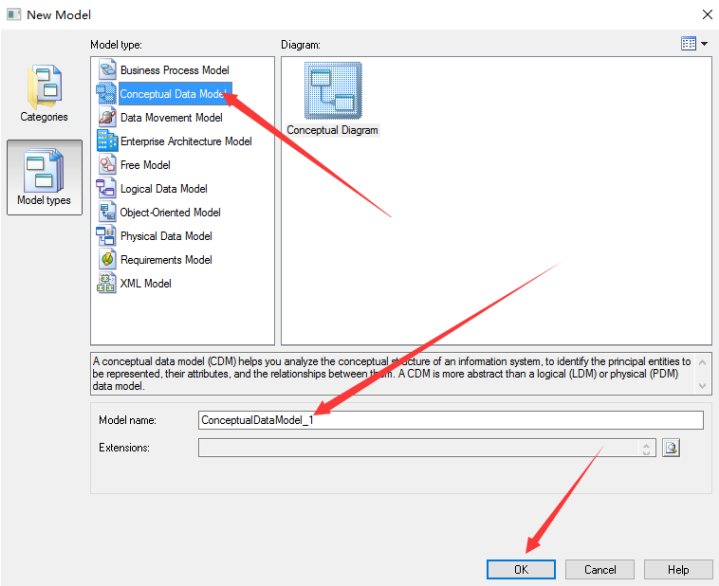

点击上面的ok，即可出现下图左边的概念模型1，可以自定义概念模型的名字，在概念模型中使用最多的 就是如图所示的Entity(实体),Relationship(关系)


**Entity实体**

选中右边框中Entity这个功能，即可出现下面这个方框，需要注意的是书写name的时候，code自行补全，name可以是英文的也可以是中文的，但是code必须是英文的。

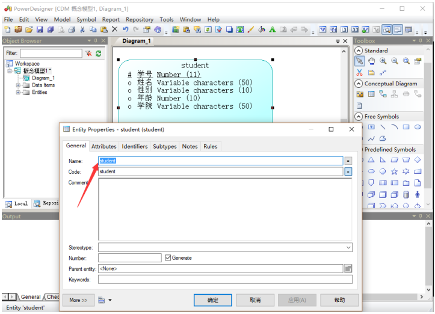

**填充实体字段**

General中的name和code填好后，就可以点击Attributes（属性）来设置name（名字），code(在数据库中 的字段名)，Data Type(数据类型) ，length(数据类型的长度)

* Name: 实体名字一般为中文，如论坛用户 
* Code: 实体代号，一般用英文，如XXXUser 
* Comment:注释，对此实体详细说明 
* Code属性：代号，一般用英文UID DataType 
* Domain域，表示属性取值范围如可以创建10个字符的地址域 
* M:Mandatory强制属性，表示该属性必填。不能为空 
* P:Primary Identifer是否是主标识符，表示实体唯一标识符 
* D:Displayed显示出来，默认全部勾选

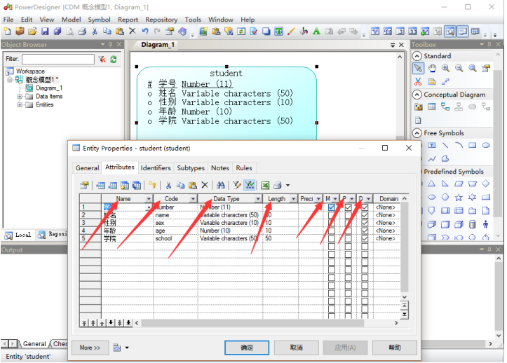

在此上图说明name和code的起名方法

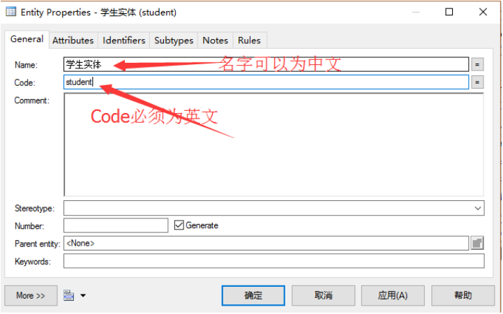

**设置主标识符**

如果不希望系统自动生成标识符而是手动设置的话，那么切换到Identifiers选项卡，添加一行Identifier， 然后单击左上角的“属性”按钮，然后弹出的标识属性设置对话框中单击“添加行”按钮，选择该标识中使用的属性。例如将学号设置为学生实体的标识。

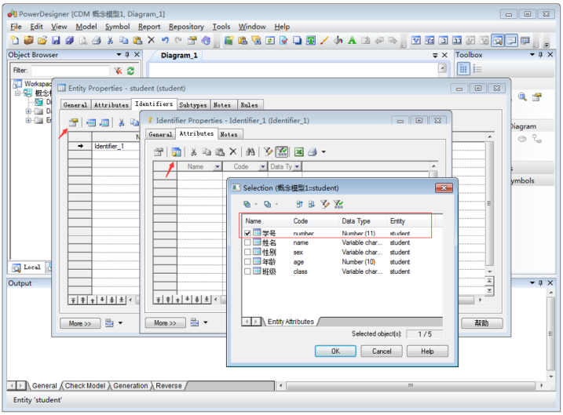

**放大模型**

创建好概念数据模型如图所示，但是创建好的字体很小，读者可以按着ctrl键同时滑动鼠标的可滑动按钮 即可放大缩写字体，同时也可以看到主标识符有一个*号的标志，同时也显示出来了，name,Data type和 length这些可见的属性

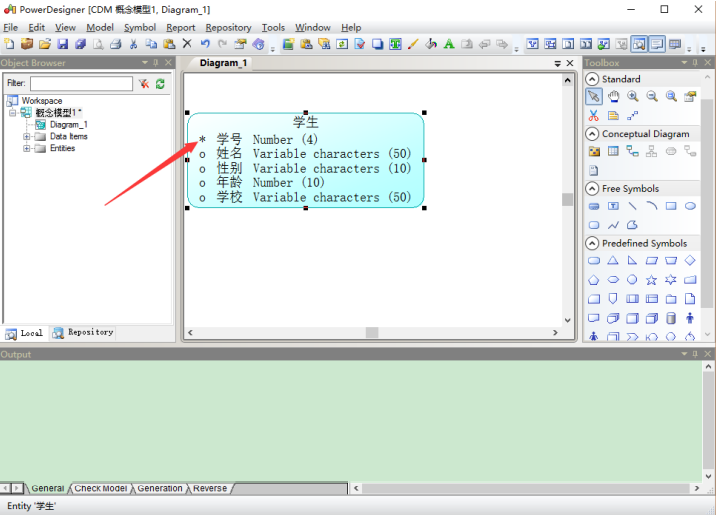

**实体关系**

同理创建一个班级的实体（需要特别注意的是，点击完右边功能的按钮后需要点击鼠标指针状态的按钮 或者右击鼠标即可，不然很容易乱操作，这点注意一下就可以了），然后使用Relationship（关系）这个 按钮可以连接学生和班级之间的关系，发生一对多（班级对学生）或者多对一（学生对班级）的关系。 

如图所示

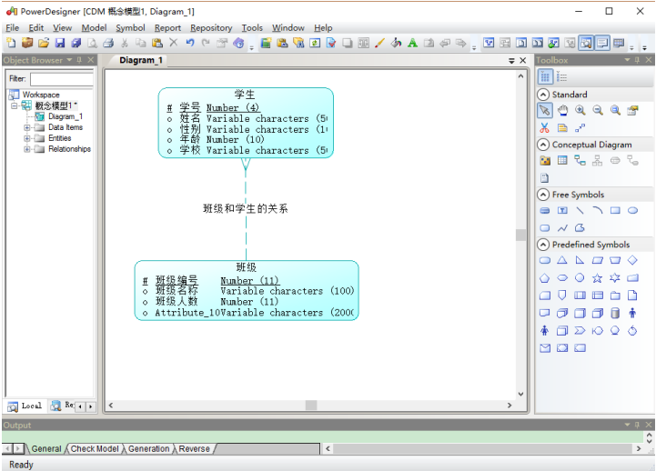

需要注意的是点击Relationship这个按钮，就把班级和学生联系起来了，就是一条线，然后双击这条线进 行编辑，在General这块起name和code

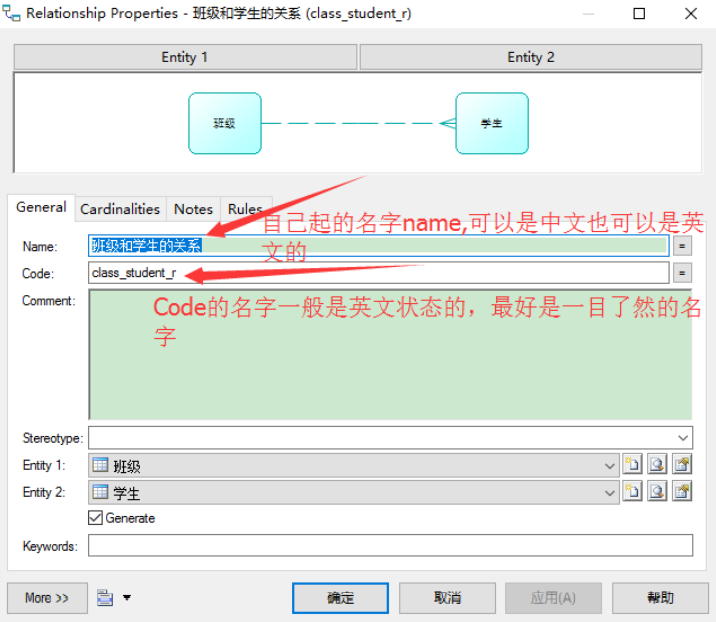

上面的name和code起好后就可以在Cardinalities这块查看班级和学生的关系，可以看到班级的一端是一 条线，学生的一端是三条，代表班级对学生是一对多的关系即one对many的关系，点击应用，然后确定 即可

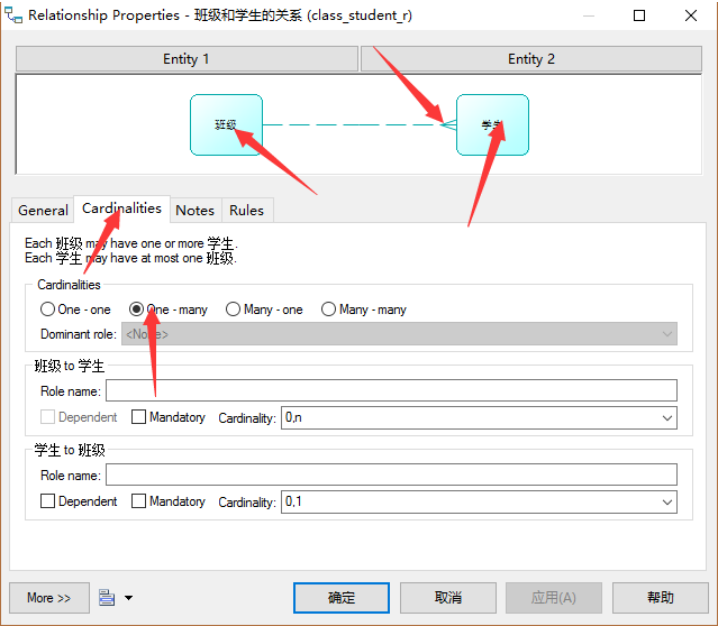

一对多和多对一练习完还有多对多的练习，如下图操作所示，老师实体和上面介绍的一样，自己将 name，data type等等修改成自己需要的即可，满足项目开发需求即可。（comment是解释说明，自己可以写相关的介绍和说明）

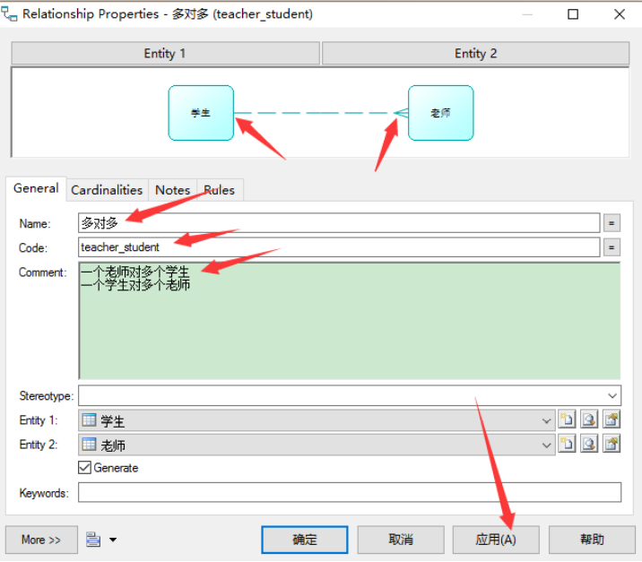

多对多需要注意的是自己可以手动点击按钮将关系调整称为多对多的关系many对many的关系，然后点击应用和确定即可

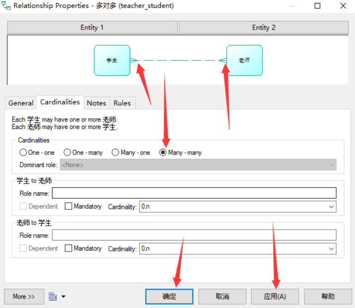

综上即可完成最简单的学生，班级，教师这种概念数据模型的设计，需要考虑数据的类型和主标识码， 是否为空。关系是一对一还是一对多还是多对多的关系，自己需要先规划好再设计，然后就ok了。

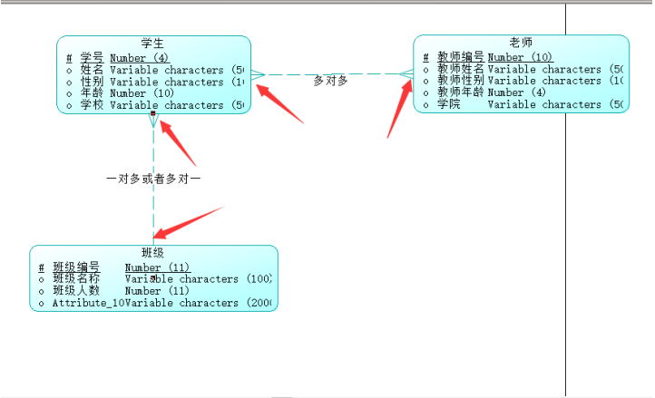

### 11.3 物理数据模型

上面是概念数据模型，下面介绍一下物理数据模型，以后 经常使用 的就是物理数据模型。打开 PowerDesigner，然后点击File-->New Model然后选择如下图所示的物理数据模型，物理数据模型的名字自己起，然后选择自己所使用的数据库即可。

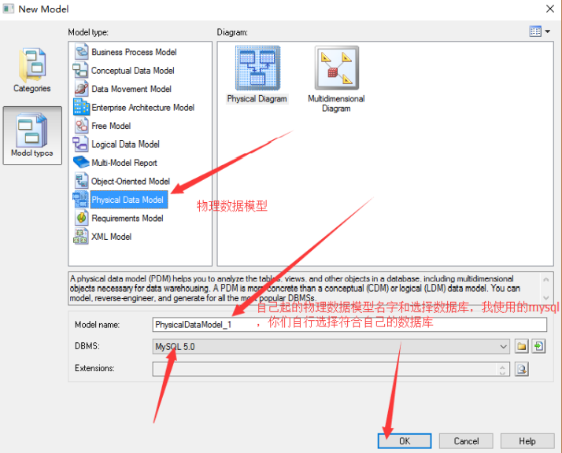

创建好主页面如图所示，但是右边的按钮和概念模型略有差别，物理模型最常用的三个是 `table(表)` ， `view(视图)`， `reference(关系) `；


鼠标先点击右边table这个按钮然后在新建的物理模型点一下，即可新建一个表，然后双击新建如下图所示，在General的name和code填上自己需要的，点击应用即可），如下图：


然后点击Columns,如下图设置，非常简单，需要注意的就是P（primary主键） , F （foreign key外键） , M（mandatory强制性的，代表不可为空） 这三个。


在此设置学号的自增（MYSQL里面的自增是这个AUTO_INCREMENT），班级编号同理，不多赘述！


在下面的这个点上对号即可，就设置好了自增

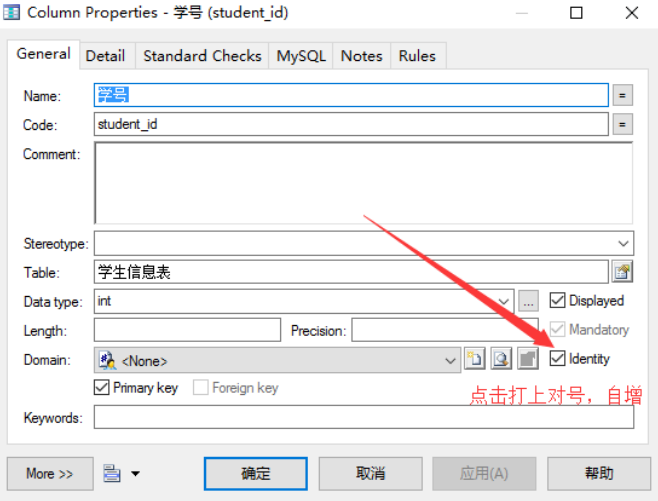

全部完成后如下图所示。

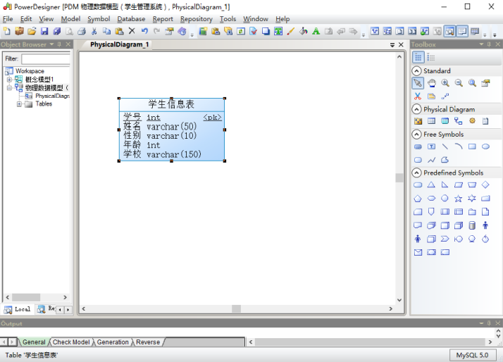

班级物理模型同理如下图所示创建即可

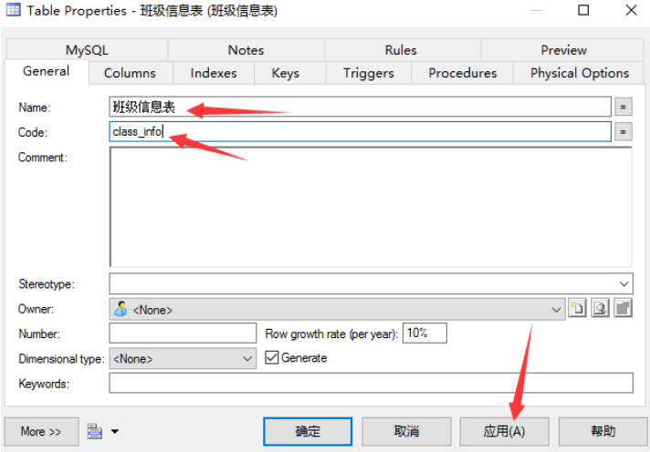


完成后如下图所示

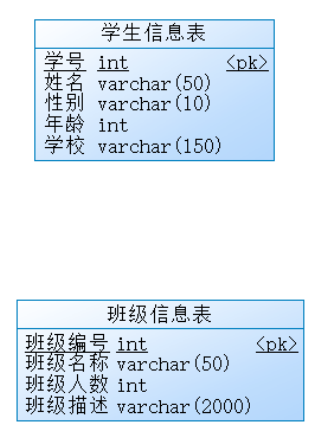

上面的设置好如上图所示，然后下面是关键的地方，点击右边按钮Reference这个按钮，因为是班级对学 生是一对多的，所以鼠标从学生拉到班级如下图所示，学生表将发生变化，学生表里面增加了一行，这 行是班级表的主键作为学生表的外键，将班级表和学生表联系起来。（仔细观察即可看到区别。）

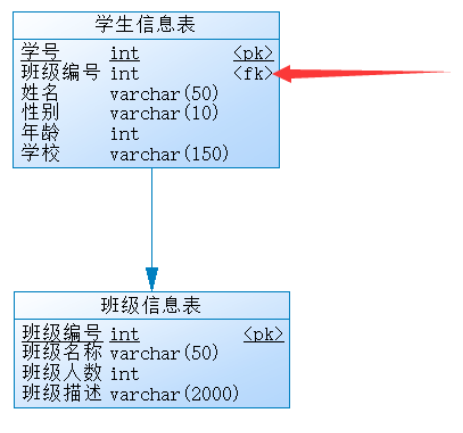

做完上面的操作，就可以双击中间的一条线，显示如下图，修改name和code即可

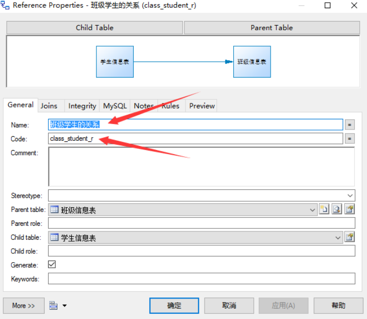

但是需要注意的是，修改完毕后显示的结果却如下图所示，并没有办法直接像概念模型那样，修改过后 显示在中间的那条线上面，自己明白即可。

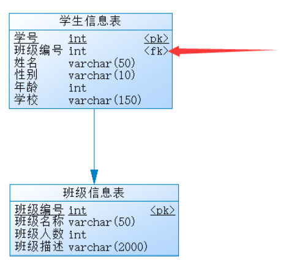

学习了多对一或者一对多的关系，接下来学习多对对的关系，同理自己建好老师表，这里不在叙述，记得老师编号自增，建好如下图所示

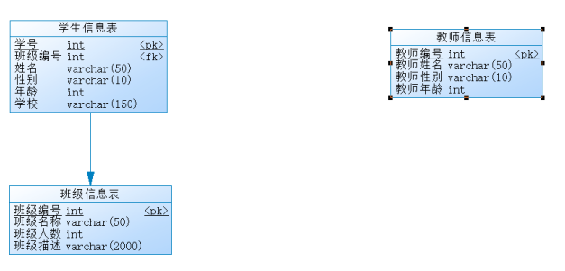

下面是多对多关系的关键，由于物理模型多对多的关系需要一个中间表来连接，如下图，只设置一个字 段，主键，自增

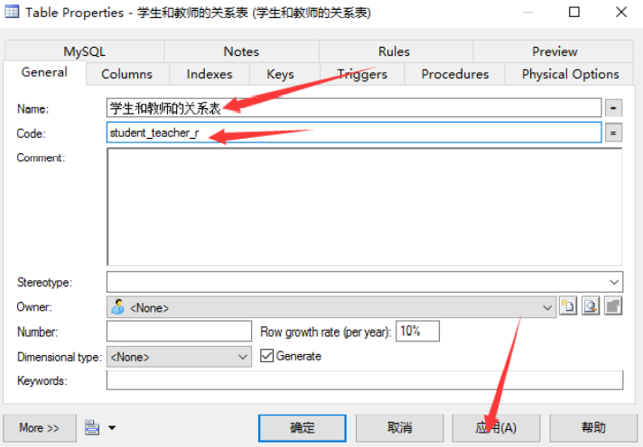

点击应用，然后设置Columns，只添加一个字段


这是设置字段递增，前面已经叙述过好几次


设置好后如下图所示，需要注意的是有箭头的一方是一，无箭头的一方是多，即一对多的多对一的关系 需要搞清楚，学生也可以有很多老师，老师也可以有很多学生，所以学生和老师都可以是主体；

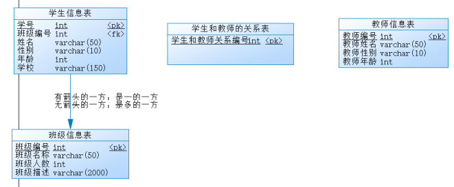

可以看到添加关系以后学生和教师的关系表前后发生的变化

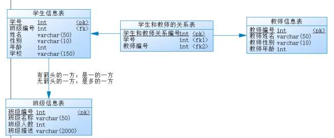

### 11.4 概念模型转为物理模型

1：如下图所示先打开概念模型图，然后点击Tool,如下图所示

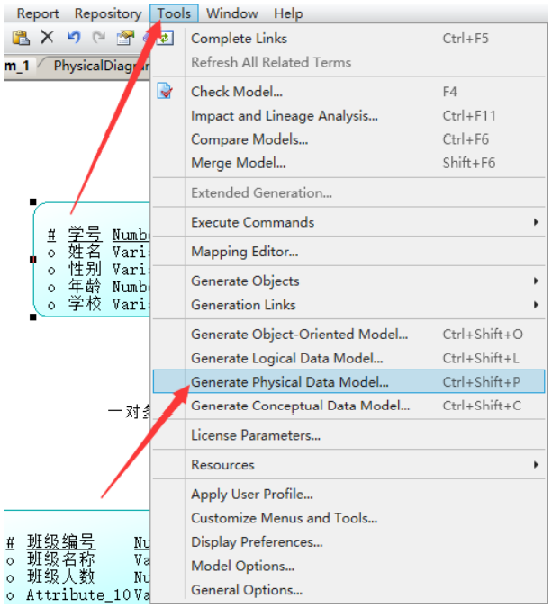

点开的页面如下所示，name和code已经从概念模型1改成物理模型1了


完成后如下图所示，将自行打开修改的物理模型，需要注意的是这些表的数据类型已经自行改变了，而 且中间表出现两个主键，即双主键

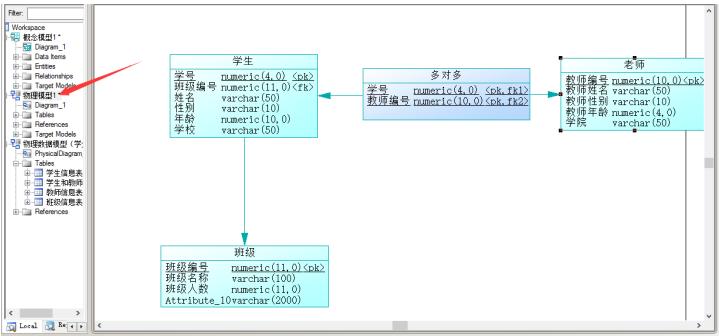

### 11.5 物理模型转为概念模型

上面介绍了概念模型转物理模型，下面介绍一下物理模型转概念模型（如下图点击操作即可）

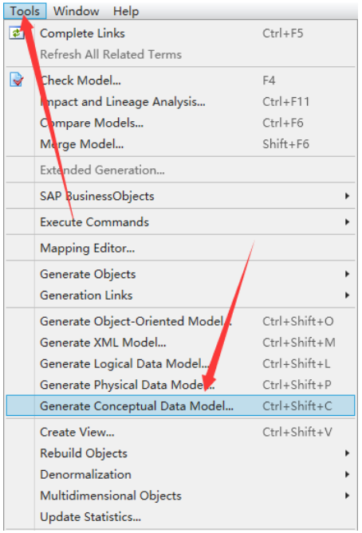

然后出现如下图所示界面，然后将物理修改为概念 ，点击应用确认即可

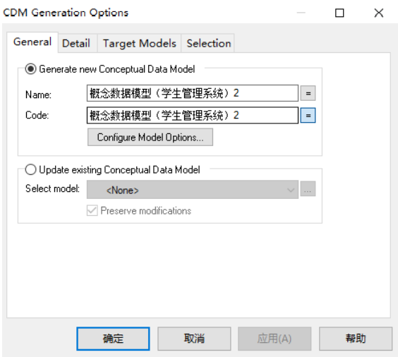

点击确认后将自行打开如下图所示的页面，自己观察有何变化，如果转换为oracle的，数据类型会发生变 化，比如Varchar2等等）；

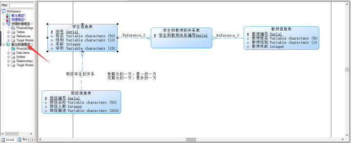

###  11.6 物理模型导出SQL语句

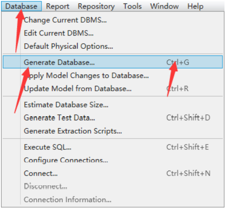

打开之后如图所示，修改好存在sql语句的位置和生成文件的名称即可

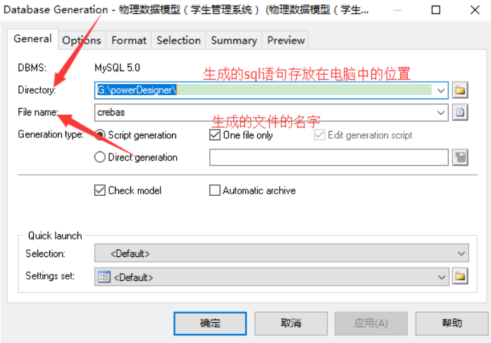

在Selection中选择需要导出的表，然后点击应用和确认即可


完成以后出现如下图所示，可以点击Edit或者close按钮

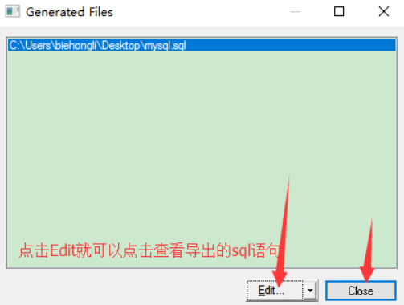

自此，就完成了导出sql语句，就可以到自己指定的位置查看导出的sql语句了；PowerDesigner在以后在 项目开发过程中用来做需求分析和数据库的设计非常的方便和快捷。

# 第12章_数据库其它调优策略

## 1. 数据库调优的措施

### 1.1 调优的目标

* 尽可能节省系统资源 ，以便系统可以提供更大负荷的服务。（吞吐量更大） 
* 合理的结构设计和参数调整，以提高用户操作响应的速度 。（响应速度更快） 
* 减少系统的瓶颈，提高MySQL数据库整体的性能。

### 1.2 如何定位调优问题


如何确定呢？一般情况下，有如下几种方式：


### 1.3 调优的维度和步骤

我们需要调优的对象是整个数据库管理系统，它不仅包括 SQL 查询，还包括数据库的部署配置、架构 等。从这个角度来说，我们思考的维度就不仅仅局限在 SQL 优化上了。通过如下的步骤我们进行梳理：

#### 第1步：选择适合的 DBMS


#### 第2步：优化表设计

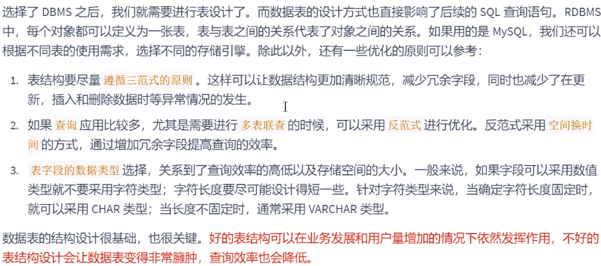

#### 第3步：优化逻辑查询

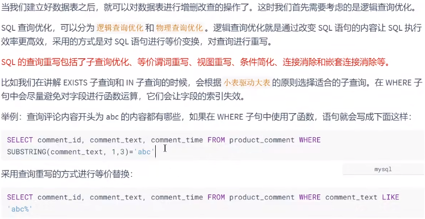

#### 第4步：优化物理查询

物理查询优化是在确定了逻辑查询优化之后，采用物理优化技术（比如索引等），通过计算代价模型对 各种可能的访问路径进行估算，从而找到执行方式中代价最小的作为执行计划。**在这个部分中，我们需要掌握的重点是对索引的创建和使用。**


#### 第5步：使用 Redis 或 Memcached 作为缓存

除了可以对 SQL 本身进行优化以外，我们还可以请外援提升查询的效率。

因为数据都是存放到数据库中，我们需要从数据库层中取出数据放到内存中进行业务逻辑的操作，当用 户量增大的时候，如果频繁地进行数据查询，会消耗数据库的很多资源。如果我们将常用的数据直接放 到内存中，就会大幅提升查询的效率。

键值存储数据库可以帮我们解决这个问题。

常用的键值存储数据库有 Redis 和 Memcached，它们都可以将数据存放到内存中。


#### 第6步：库级优化


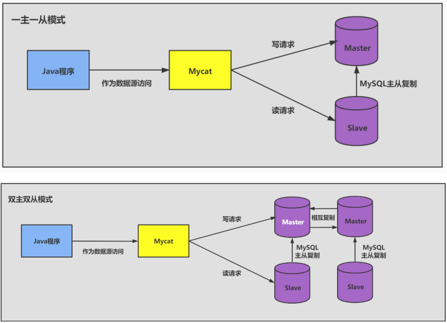


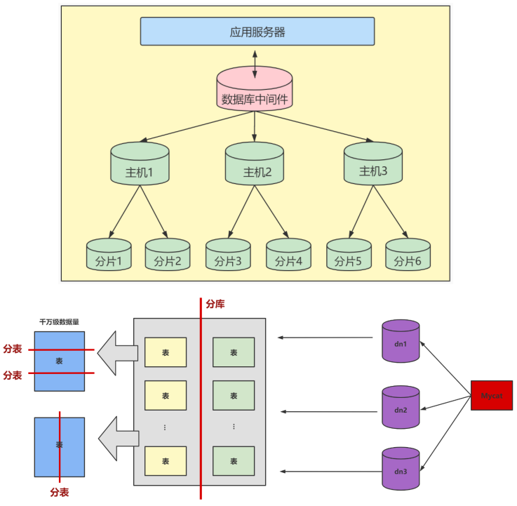

> 但需要注意的是，分拆在提升数据库性能的同时，也会增加维护和使用成本。

## 2. 优化MySQL服务器


### 2.1 优化服务器硬件

服务器的硬件性能直接决定着MySQL数据库的性能。硬件的性能瓶颈直接决定MySQL数据库的运行速度 和效率。针对性能瓶颈提高硬件配置，可以提高MySQL数据库查询、更新的速度。 

（1） `配置较大的内存` 。足够大的显存是提高MySQL数据库性能的方法之一。内存的速度比磁盘I/O快得多，可以通过增加系统的`缓冲区容量`使数据在内存中停留的时间更长，以`减少磁盘I/O`。

（2） `配置高速磁盘系统 `，以减少读盘的等待时间，提高响应速度。磁盘的I/O能力，也就是它的寻道能力，目前的SCSI高速旋转的是7200转/分钟，这样的速度，一旦访问的用户量上去，磁盘的压力就会过大，如果是每天的网站pv (page view) 在150w，这样的一般的配置就无法满足这样的需求了。现在SSD盛行，在SSD上随机访问和顺序访问性能差不多，使用SSD可以减少随机IO带来的性能损耗。

（3） `合理分布磁盘I/O`，把磁盘I/O分散在多个设备，以减少资源竞争，提高冰箱操作能力。

（4） `配置多处理器`, MySQL是多线程的数据库，多处理器可同时执行多个线程。

### 2.2 优化MySQL的参数


* innodb_buffer_pool_size ：这个参数是Mysql数据库最重要的参数之一，表示InnoDB类型的 表 和索引的最大缓存 。它不仅仅缓存 索引数据 ，还会缓存 表的数据 。这个值越大，查询的速度就会越 快。但是这个值太大会影响操作系统的性能。

* key_buffer_size ：表示 索引缓冲区的大小 。索引缓冲区是所有的 线程共享 。增加索引缓冲区可 以得到更好处理的索引（对所有读和多重写）。当然，这个值不是越大越好，它的大小取决于内存 的大小。如果这个值太大，就会导致操作系统频繁换页，也会降低系统性能。对于内存在 4GB 左右 的服务器该参数可设置为 256M 或 384M 。

* table_cache ：表示 同时打开的表的个数 。这个值越大，能够同时打开的表的个数越多。物理内 存越大，设置就越大。默认为2402，调到512-1024最佳。这个值不是越大越好，因为同时打开的表 太多会影响操作系统的性能。

* query_cache_size ：表示 查询缓冲区的大小 。可以通过在MySQL控制台观察，如果 Qcache_lowmem_prunes的值非常大，则表明经常出现缓冲不够的情况，就要增加Query_cache_size 的值；如果Qcache_hits的值非常大，则表明查询缓冲使用非常频繁，如果该值较小反而会影响效 率，那么可以考虑不用查询缓存；Qcache_free_blocks，如果该值非常大，则表明缓冲区中碎片很 多。MySQL8.0之后失效。该参数需要和query_cache_type配合使用。

* query_cache_type 的值是0时，所有的查询都不使用查询缓存区。但是query_cache_type=0并不 会导致MySQL释放query_cache_size所配置的缓存区内存。

  * 当query_cache_type=1时，所有的查询都将使用查询缓存区，除非在查询语句中指定 SQL_NO_CACHE ，如SELECT SQL_NO_CACHE * FROM tbl_name。
  * 当query_cache_type=2时，只有在查询语句中使用 SQL_CACHE 关键字，查询才会使用查询缓 存区。使用查询缓存区可以提高查询的速度，这种方式只适用于修改操作少且经常执行相同的 查询操作的情况。

* sort_buffer_size ：表示每个 需要进行排序的线程分配的缓冲区的大小 。增加这个参数的值可以 提高 ORDER BY 或 GROUP BY 操作的速度。默认数值是2 097 144字节（约2MB）。对于内存在4GB 左右的服务器推荐设置为6-8M，如果有100个连接，那么实际分配的总共排序缓冲区大小为100 × 6 ＝ 600MB。

* join_buffer_size = 8M ：表示 联合查询操作所能使用的缓冲区大小 ，和sort_buffer_size一样， 该参数对应的分配内存也是每个连接独享。

* read_buffer_size ：表示 每个线程连续扫描时为扫描的每个表分配的缓冲区的大小（字节） 。当线 程从表中连续读取记录时需要用到这个缓冲区。SET SESSION read_buffer_size=n可以临时设置该参 数的值。默认为64K，可以设置为4M。

* innodb_flush_log_at_trx_commit ：表示 何时将缓冲区的数据写入日志文件 ，并且将日志文件 写入磁盘中。该参数对于innoDB引擎非常重要。该参数有3个值，分别为0、1和2。该参数的默认值 为1。

  * 值为 0 时，表示 每秒1次 的频率将数据写入日志文件并将日志文件写入磁盘。每个事务的 commit并不会触发前面的任何操作。该模式速度最快，但不太安全，mysqld进程的崩溃会导 致上一秒钟所有事务数据的丢失。
  * 值为 1 时，表示 每次提交事务时 将数据写入日志文件并将日志文件写入磁盘进行同步。该模 式是最安全的，但也是最慢的一种方式。因为每次事务提交或事务外的指令都需要把日志写入 （flush）硬盘。
  * 值为 2 时，表示 每次提交事务时 将数据写入日志文件， 每隔1秒 将日志文件写入磁盘。该模 式速度较快，也比0安全，只有在操作系统崩溃或者系统断电的情况下，上一秒钟所有事务数 据才可能丢失。

* innodb_log_buffer_size ：这是 InnoDB 存储引擎的 事务日志所使用的缓冲区 。为了提高性能， 也是先将信息写入 Innodb Log Buffer 中，当满足 innodb_flush_log_trx_commit 参数所设置的相应条 件（或者日志缓冲区写满）之后，才会将日志写到文件（或者同步到磁盘）中。

* max_connections ：表示 允许连接到MySQL数据库的最大数量 ，默认值是 151 。如果状态变量 connection_errors_max_connections 不为零，并且一直增长，则说明不断有连接请求因数据库连接 数已达到允许最大值而失败，这是可以考虑增大max_connections 的值。在Linux 平台下，性能好的 服务器，支持 500-1000 个连接不是难事，需要根据服务器性能进行评估设定。这个连接数 不是越大 越好 ，因为这些连接会浪费内存的资源。过多的连接可能会导致MySQL服务器僵死。

* back_log ：用于 控制MySQL监听TCP端口时设置的积压请求栈大小 。如果MySql的连接数达到 max_connections时，新来的请求将会被存在堆栈中，以等待某一连接释放资源，该堆栈的数量即 back_log，如果等待连接的数量超过back_log，将不被授予连接资源，将会报错。5.6.6 版本之前默 认值为 50 ， 之后的版本默认为 50 + （max_connections / 5）， 对于Linux系统推荐设置为小于512 的整数，但最大不超过900。

  如果需要数据库在较短的时间内处理大量连接请求， 可以考虑适当增大back_log 的值。

* thread_cache_size ： 线程池缓存线程数量的大小 ，当客户端断开连接后将当前线程缓存起来， 当在接到新的连接请求时快速响应无需创建新的线程 。这尤其对那些使用短连接的应用程序来说可 以极大的提高创建连接的效率。那么为了提高性能可以增大该参数的值。默认为60，可以设置为 120。

  可以通过如下几个MySQL状态值来适当调整线程池的大小：

  ```mysql
  mysql> show global status like 'Thread%';
  +-------------------+-------+
  | Variable_name | Value |
  +-------------------+-------+
  | Threads_cached | 2 |
  | Threads_connected | 1 |
  | Threads_created | 3 |
  | Threads_running | 2 |
  +-------------------+-------+
  4 rows in set (0.01 sec)
  ```

  当 Threads_cached 越来越少，但 Threads_connected 始终不降，且 Threads_created 持续升高，可 适当增加 thread_cache_size 的大小。

* wait_timeout ：指定 一个请求的最大连接时间 ，对于4GB左右内存的服务器可以设置为5-10。

* interactive_timeout ：表示服务器在关闭连接前等待行动的秒数。

这里给出一份my.cnf的参考配置：

```mysql
mysqld]
port = 3306 
serverid = 1 
socket = /tmp/mysql.sock 
skip-locking #避免MySQL的外部锁定，减少出错几率增强稳定性。 
skip-name-resolve #禁止MySQL对外部连接进行DNS解析，使用这一选项可以消除MySQL进行DNS解析的时间。但需要注意，如果开启该选项，则所有远程主机连接授权都要使用IP地址方式，否则MySQL将无法正常处理连接请求！ 
back_log = 384
key_buffer_size = 256M 
max_allowed_packet = 4M 
thread_stack = 256K
table_cache = 128K 
sort_buffer_size = 6M 
read_buffer_size = 4M
read_rnd_buffer_size=16M 
join_buffer_size = 8M 
myisam_sort_buffer_size =64M 
table_cache = 512 
thread_cache_size = 64 
query_cache_size = 64M
tmp_table_size = 256M 
max_connections = 768 
max_connect_errors = 10000000
wait_timeout = 10 
thread_concurrency = 8 #该参数取值为服务器逻辑CPU数量*2，在本例中，服务器有2颗物理CPU，而每颗物理CPU又支持H.T超线程，所以实际取值为4*2=8
skip-networking #开启该选项可以彻底关闭MySQL的TCP/IP连接方式，如果WEB服务器是以远程连接的方式访问MySQL数据库服务器则不要开启该选项！否则将无法正常连接！ 
table_cache=1024
innodb_additional_mem_pool_size=4M #默认为2M 
innodb_flush_log_at_trx_commit=1
innodb_log_buffer_size=2M #默认为1M 
innodb_thread_concurrency=8 #你的服务器CPU有几个就设置为几。建议用默认一般为8 
tmp_table_size=64M #默认为16M，调到64-256最挂
thread_cache_size=120 
query_cache_size=32M
```

很多情况还需要具体情况具体分析！

**举例：**


**(1) 调整系统参数 InnoDB_flush_log_at_trx_commit**


**(2)  调整系统参数 InnoDB_buffer_pool_size**


**(3) 调整系统参数 InnoDB_buffer_pool_instances**

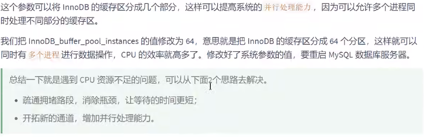

## 3. 优化数据库结构


### 3.1 拆分表：冷热数据分离


**举例1：** `会员members表` 存储会员登录认证信息，该表中有很多字段，如id、姓名、密码、地址、电 话、个人描述字段。其中地址、电话、个人描述等字段并不常用，可以将这些不常用的字段分解出另一 个表。将这个表取名叫members_detail，表中有member_id、address、telephone、description等字段。 这样就把会员表分成了两个表，分别为 `members表` 和 `members_detail表` 。

创建这两个表的SQL语句如下：

```mysql
CREATE TABLE members (
    id int(11) NOT NULL AUTO_INCREMENT,
    username varchar(50) DEFAULT NULL,
    password varchar(50) DEFAULT NULL,
    last_login_time datetime DEFAULT NULL,
    last_login_ip varchar(100) DEFAULT NULL,
    PRIMARY KEY(Id)
);
CREATE TABLE members_detail (
    Member_id int(11) NOT NULL DEFAULT 0,
    address varchar(255) DEFAULT NULL,
    telephone varchar(255) DEFAULT NULL,
    description text
);
```

如果需要查询会员的基本信息或详细信息，那么可以用会员的id来查询。如果需要将会员的基本信息和 详细信息同时显示，那么可以将members表和members_detail表进行联合查询，查询语句如下：

```mysql
SELECT * FROM members LEFT JOIN members_detail on members.id =
members_detail.member_id;
```

通过这种分解可以提高表的查询效率。对于字段很多且有些字段使用不频繁的表，可以通过这种分解的方式来优化数据库的性能。

### 3.2 增加中间表


举例1： 学生信息表 和 班级表 的SQL语句如下：

```mysql
CREATE TABLE `class` (
`id` INT(11) NOT NULL AUTO_INCREMENT,
`className` VARCHAR(30) DEFAULT NULL,
`address` VARCHAR(40) DEFAULT NULL,
`monitor` INT NULL ,
PRIMARY KEY (`id`)
) ENGINE=INNODB AUTO_INCREMENT=1 DEFAULT CHARSET=utf8;

CREATE TABLE `student` (
`id` INT(11) NOT NULL AUTO_INCREMENT,
`stuno` INT NOT NULL ,
`name` VARCHAR(20) DEFAULT NULL,
`age` INT(3) DEFAULT NULL,
`classId` INT(11) DEFAULT NULL,
PRIMARY KEY (`id`)
) ENGINE=INNODB AUTO_INCREMENT=1 DEFAULT CHARSET=utf8;
```

现在有一个模块需要经常查询带有学生名称（name）、学生所在班级名称（className）、学生班级班 长（monitor）的学生信息。根据这种情况可以创建一个 temp_student 表。temp_student表中存储学生名称（stu_name）、学生所在班级名称（className）和学生班级班长（monitor）信息。创建表的语句如下：

```mysql
CREATE TABLE `temp_student` (
`id` INT(11) NOT NULL AUTO_INCREMENT,
`stu_name` INT NOT NULL ,
`className` VARCHAR(20) DEFAULT NULL,
`monitor` INT(3) DEFAULT NULL,
PRIMARY KEY (`id`)
) ENGINE=INNODB AUTO_INCREMENT=1 DEFAULT CHARSET=utf8;
```

接下来，从学生信息表和班级表中查询相关信息存储到临时表中：

```mysql
insert into temp_student(stu_name,className,monitor)
            select s.name,c.className,c.monitor
            from student as s,class as c
            where s.classId = c.id
```

以后，可以直接从temp_student表中查询学生名称、班级名称和班级班长，而不用每次都进行联合查 询。这样可以提高数据库的查询速度。

### 3.3 增加冗余字段

设计数据库表时应尽量遵循范式理论的规约，尽可能减少冗余字段，让数据库设计看起来精致、优雅。 但是，合理地加入冗余字段可以提高查询速度。

表的规范化程度越高，表与表之间的关系就越多，需要连接查询的情况也就越多。尤其在数据量大，而 且需要频繁进行连接的时候，为了提升效率，我们也可以考虑增加冗余字段来减少连接。

这部分内容在《第11章_数据库的设计规范》章节中 反范式化小节 中具体展开讲解了。这里省略。

### 3.4 优化数据类型


**情况1：对整数类型数据进行优化。**

遇到整数类型的字段可以用 INT 型 。这样做的理由是，INT 型数据有足够大的取值范围，不用担心数 据超出取值范围的问题。刚开始做项目的时候，首先要保证系统的稳定性，这样设计字段类型是可以 的。但在数据量很大的时候，数据类型的定义，在很大程度上会影响到系统整体的执行效率。

对于 非负型 的数据（如自增ID、整型IP）来说，要优先使用无符号整型 UNSIGNED 来存储。因为无符号 相对于有符号，同样的字节数，存储的数值范围更大。如tinyint有符号为-128-127，无符号为0-255，多 出一倍的存储空间。

**情况2：既可以使用文本类型也可以使用整数类型的字段，要选择使用整数类型。**

跟文本类型数据相比，大整数往往占用更少的存储空间 ，因此，在存取和比对的时候，可以占用更少的 内存空间。所以，在二者皆可用的情况下，尽量使用整数类型，这样可以提高查询的效率。如：将IP地 址转换成整型数据。

**情况3：避免使用TEXT、BLOB数据类型**

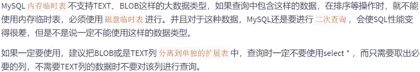

**情况4：避免使用ENUM类型**

修改ENUM值需要使用ALTER语句。

ENUM类型的ORDER BY 操作效率低，需要额外操作。使用TINYINT来代替ENUM类型。

**情况5：使用TIMESTAMP存储时间**

TIMESTAMP存储的时间范围1970-01-01 00:00:01 ~ 2038-01_19-03:14:07。TIMESTAMP使用4字节，DATETIME使用8个字节，同时TIMESTAMP具有自动赋值以及自动更新的特性。

**情况6：用DECIMAL代替FLOAT和DOUBLE存储精确浮点数**

1) 非精准浮点： float, double
2) 精准浮点：decimal

Decimal类型为精准浮点数，在计算时不会丢失精度，尤其是财务相关的金融类数据。占用空间由定义的宽度决定，每4个字节可以存储9位数字，并且小数点要占用一个字节。可用于存储比bigint更大的整型数据。

**总之，遇到数据量大的项目时，一定要在充分了解业务需求的前提下，合理优化数据类型，这样才能充 分发挥资源的效率，使系统达到最优。**

### 3.5 优化插入记录的速度

插入记录时，影响插入速度的主要是索引、唯一性校验、一次插入记录条数等。根据这些情况可以分别进行优化。这里我们分为MyISAM引擎和InnoDB引擎来讲。

**1. MyISAM引擎的表：**

**① 禁用索引**

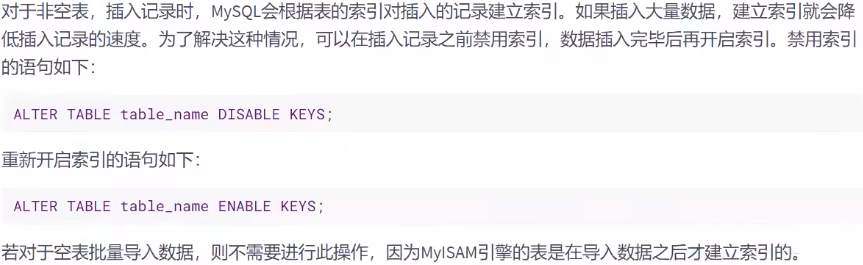

**② 禁用唯一性检查**


**③ 使用批量插入**

插入多条记录时，可以使用一条INSERT语句插入一条数据，也可以使用一条INSERT语句插入多条数据。插入一条记录的INSERT语句情形如下：

```mysql
insert into student values(1,'zhangsan',18,1);
insert into student values(2,'lisi',17,1);
insert into student values(3,'wangwu',17,1);
insert into student values(4,'zhaoliu',19,1);
```

使用一条INSERT语句插入多条记录的情形如下：

```mysql
insert into student values
(1,'zhangsan',18,1),
(2,'lisi',17,1),
(3,'wangwu',17,1),
(4,'zhaoliu',19,1);
```

第2种情形的插入速度要比第1种情形快。

**④ 使用LOAD DATA INFILE 批量导入**

当需要批量导入数据时，如果能用LOAD DATA INFILE语句，就尽量使用。因为LOAD DATA INFILE语句导入数据的速度比INSERT语句块。

**2. InnoDB引擎的表：**

**① 禁用唯一性检查**

插入数据之前执行`set unique_checks=0`来禁止对唯一索引的检查，数据导入完成之后再运行`set unique_check=1`。这个和MyISAM引擎的使用方法一样。

**② 禁用外键检查**


**③ 禁止自动提交**


### 3.6 使用非空约束


### 3.7 分析表、检查表与优化表

MySQL提供了分析表、检查表和优化表的语句。`分析表`主要是分析关键字的分布，`检查表`主要是检查表是否存在错误，`优化表`主要是消除删除或者更新造成的空间浪费。

#### 1. 分析表

MySQL中提供了ANALYZE TABLE语句分析表，ANALYZE TABLE语句的基本语法如下：

```mysql
ANALYZE [LOCAL | NO_WRITE_TO_BINLOG] TABLE tbl_name[,tbl_name]…
```

默认的，MySQL服务会将 ANALYZE TABLE语句写到binlog中，以便在主从架构中，从服务能够同步数据。 可以添加参数LOCAL 或者 NO_WRITE_TO_BINLOG取消将语句写到binlog中。

使用 `ANALYZE TABLE` 分析表的过程中，数据库系统会自动对表加一个 `只读锁` 。在分析期间，只能读取 表中的记录，不能更新和插入记录。ANALYZE TABLE语句能够分析InnoDB和MyISAM类型的表，但是不能作用于视图。

ANALYZE TABLE分析后的统计结果会反应到 `cardinality` 的值，该值统计了表中某一键所在的列不重复 的值的个数。**该值越接近表中的总行数，则在表连接查询或者索引查询时，就越优先被优化器选择使用**。也就是索引列的cardinality的值与表中数据的总条数差距越大，即使查询的时候使用了该索引作为查 询条件，存储引擎实际查询的时候使用的概率就越小。下面通过例子来验证下。cardinality可以通过 SHOW INDEX FROM 表名查看。

```mysql
mysql> ANALYZE TABLE user;
+--------------+---------+----------+---------+
| Table        | Op      | Msg_type |Msg_text |
+--------------+---------+----------+---------+
| atguigu.user | analyze | status   | Ok      |
+--------------+----------+---------+---------+
```

上面结果显示的信息说明如下：

* Table: 表示分析的表的名称。
* Op: 表示执行的操作。analyze表示进行分析操作。
* Msg_type: 表示信息类型，其值通常是状态 (status) 、信息 (info) 、注意 (note) 、警告 (warning) 和 错误 (error) 之一。
* Msg_text: 显示信息。

#### 2. 检查表

MySQL中可以使用 `CHECK TABLE` 语句来检查表。CHECK TABLE语句能够检查InnoDB和MyISAM类型的表 是否存在错误。CHECK TABLE语句在执行过程中也会给表加上 `只读锁` 。

对于MyISAM类型的表，CHECK TABLE语句还会更新关键字统计数据。而且，CHECK TABLE也可以检查视 图是否有错误，比如在视图定义中被引用的表已不存在。该语句的基本语法如下：

```mysql
CHECK TABLE tbl_name [, tbl_name] ... [option] ...
option = {QUICK | FAST | MEDIUM | EXTENDED | CHANGED}
```

其中，tbl_name是表名；option参数有5个取值，分别是QUICK、FAST、MEDIUM、EXTENDED和 CHANGED。各个选项的意义分别是：

* QUICK ：不扫描行，不检查错误的连接。 
* FAST ：只检查没有被正确关闭的表。 
* CHANGED ：只检查上次检查后被更改的表和没有被正确关闭的表。 
* MEDIUM ：扫描行，以验证被删除的连接是有效的。也可以计算各行的关键字校验和，并使用计算出的校验和验证这一点。 
* EXTENDED ：对每行的所有关键字进行一个全面的关键字查找。这可以确保表是100%一致的，但 是花的时间较长。

option只对MyISAM类型的表有效，对InnoDB类型的表无效。比如：

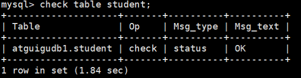

该语句对于检查的表可能会产生多行信息。最后一行有一个状态的 Msg_type 值，Msg_text 通常为 OK。 如果得到的不是 OK，通常要对其进行修复；是 OK 说明表已经是最新的了。表已经是最新的，意味着存 储引擎对这张表不必进行检查。

#### 3. 优化表

**方式1：OPTIMIZE TABLE**

MySQL中使用 `OPTIMIZE TABLE` 语句来优化表。但是，OPTILMIZE TABLE语句只能优化表中的 `VARCHAR` 、 `BLOB` 或 `TEXT` 类型的字段。一个表使用了这些字段的数据类型，若已经 `删除` 了表的一大部 分数据，或者已经对含有可变长度行的表（含有VARCHAR、BLOB或TEXT列的表）进行了很多 `更新` ，则 应使用OPTIMIZE TABLE来重新利用未使用的空间，并整理数据文件的 `碎片` 。

OPTIMIZE TABLE 语句对InnoDB和MyISAM类型的表都有效。该语句在执行过程中也会给表加上 `只读锁` 。

OPTILMIZE TABLE语句的基本语法如下：

```mysql
OPTIMIZE [LOCAL | NO_WRITE_TO_BINLOG] TABLE tbl_name [, tbl_name] ...
```

LOCAL | NO_WRITE_TO_BINLOG关键字的意义和分析表相同，都是指定不写入二进制日志。

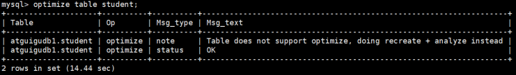

执行完毕，Msg_text显示

> ‘numysql.SYS_APP_USER’, ‘optimize’, ‘note’, ‘Table does not support optimize, doing recreate + analyze instead’

原因是我服务器上的MySQL是InnoDB存储引擎。

到底优化了没有呢？看官网！

<a>[MySQL :: MySQL 8.0 Reference Manual :: 13.7.3.4 OPTIMIZE TABLE Statement](https://dev.mysql.com/doc/refman/8.0/en/optimize-table.html)</a>

在MyISAM中，是先分析这张表，然后会整理相关的MySQL datafile，之后回收未使用的空间；在InnoDB 中，回收空间是简单通过Alter table进行整理空间。在优化期间，MySQL会创建一个临时表，优化完成之 后会删除原始表，然后会将临时表rename成为原始表。

> 说明： 在多数的设置中，根本不需要运行OPTIMIZE TABLE。即使对可变长度的行进行了大量的更 新，也不需要经常运行，` 每周一次` 或 `每月一次` 即可，并且只需要对 `特定的表` 运行。

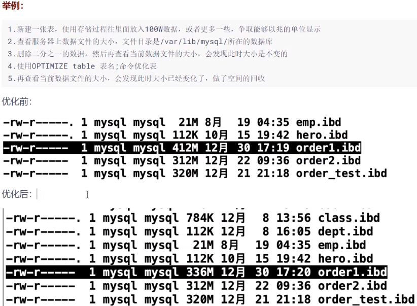

**方式二：使用mysqlcheck命令**

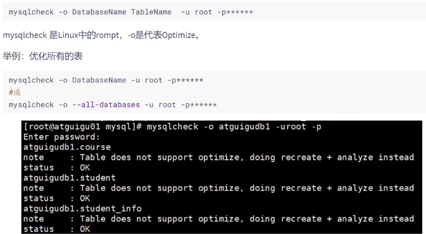

#### 3.8 小结

上述这些方法都是有利有弊的。比如：

* 修改数据类型，节省存储空间的同时，你要考虑到数据不能超过取值范围； 
* 增加冗余字段的时候，不要忘了确保数据一致性； 
* 把大表拆分，也意味着你的查询会增加新的连接，从而增加额外的开销和运维的成本。

因此，你一定要结合实际的业务需求进行权衡。

## 4. 大表优化

当MySQL单表记录数过大时，数据库的CRUD性能会明显下降，一些常见的优化措施如下：

### 4.1 限定查询的范围

禁止不带任何限制数据范围条件的查询语句。比如：我们当用户在查询订单历史的时候，我们可以控制 在一个月的范围内；

###  4.2 读/写分离

经典的数据库拆分方案，主库负责写，从库负责读。

* 一主一从模式：

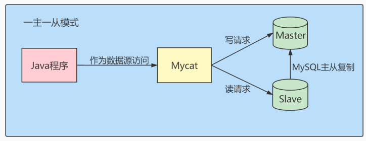

* 双主双从模式：

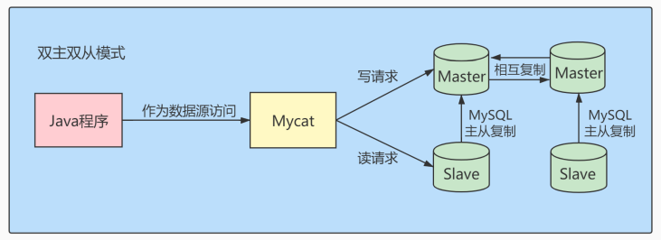

### 4.3 垂直拆分

当数据量级达到 `千万级` 以上时，有时候我们需要把一个数据库切成多份，放到不同的数据库服务器上， 减少对单一数据库服务器的访问压力。

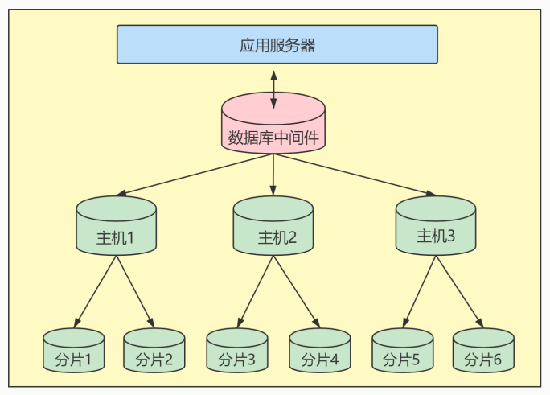

* 如果数据库的数据表过多，可以采用`垂直分库`的方式，将关联的数据库部署在同一个数据库上。
* 如果数据库中的列过多，可以采用`垂直分表`的方式，将一张数据表分拆成多张数据表，把经常一起使用的列放在同一张表里。

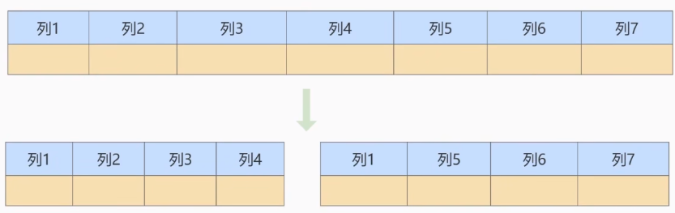

`垂直拆分的优点`： 可以使得列数据变小，在查询时减少读取的Block数，减少I/O次数。此外，垂直分区可以简化表的结构，易于维护。 

`垂直拆分的缺点`： 主键会出现冗余，需要管理冗余列，并会引起 JOIN 操作。此外，垂直拆分会让事务变得更加复杂。

### 4.4 水平拆分


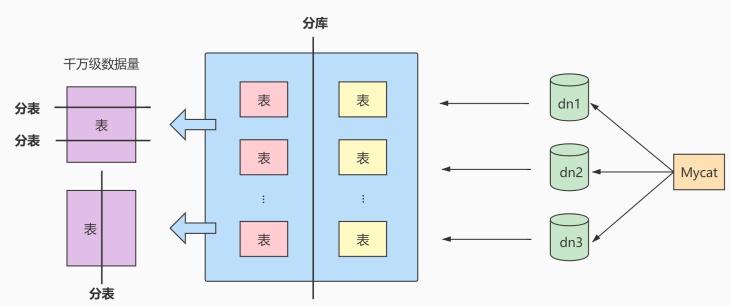


下面补充一下数据库分片的两种常见方案：

* **客户端代理： 分片逻辑在应用端，封装在jar包中，通过修改或者封装JDBC层来实现。** 当当网的 Sharding-JDBC 、阿里的TDDL是两种比较常用的实现。 
* **中间件代理： 在应用和数据中间加了一个代理层。分片逻辑统一维护在中间件服务中。**我们现在 谈的 Mycat 、360的Atlas、网易的DDB等等都是这种架构的实现。

## 5. 其它调优策略

### 5.1 服务器语句超时处理

在MySQL 8.0中可以设置 服务器语句超时的限制 ，单位可以达到 毫秒级别 。当中断的执行语句超过设置的 毫秒数后，服务器将终止查询影响不大的事务或连接，然后将错误报给客户端。

设置服务器语句超时的限制，可以通过设置系统变量 MAX_EXECUTION_TIME 来实现。默认情况下， MAX_EXECUTION_TIME的值为0，代表没有时间限制。 例如：

```mysql
SET GLOBAL MAX_EXECUTION_TIME=2000;
```

```mysql
SET SESSION MAX_EXECUTION_TIME=2000; #指定该会话中SELECT语句的超时时间
```

### 5.2 创建全局通用表空间

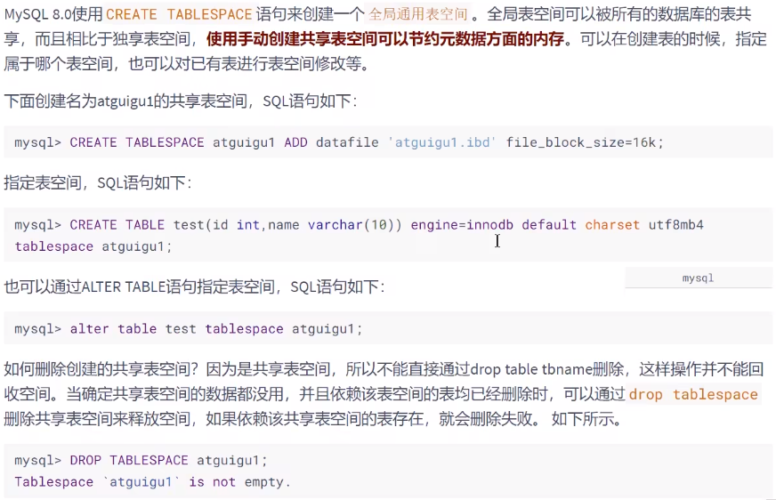

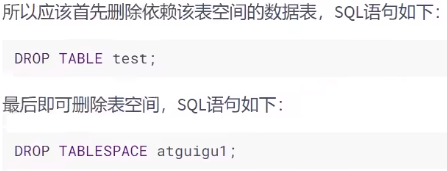

### 5.3 MySQL 8.0新特性：隐藏索引对调优的帮助


